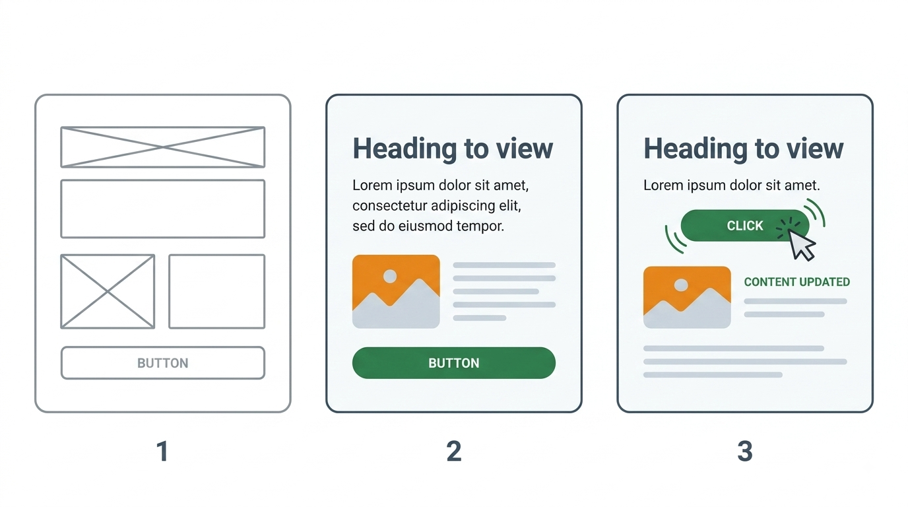
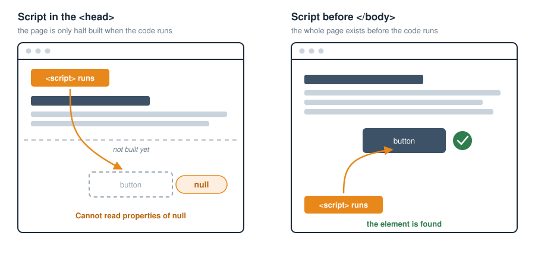
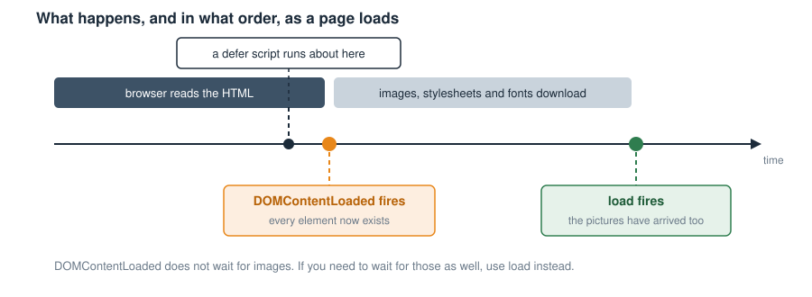
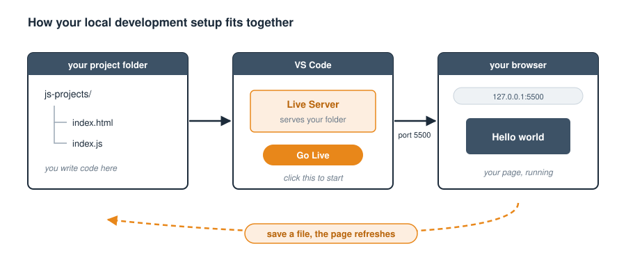

	CHAPTER 1 - INTRODUCTION

	-Welcome to the World of JavaScript
		-What Is Programming?
		-Why JavaScript
		-A Quick Look Back: The History of JavaScript
		-Why learn JavaScript today?
		-What About Frameworks?
		-What this book will teach you
	-Language syntax
	-Terminating statements
	-Where to place the script tags in a web document
	-Commenting code
	-Dealing with browsers that do not support JavaScript (rare)
	-Debugging JavaScript errors
	-Creating a local development server 

  Imagine opening a webpage and seeing more than just plain text and images. Imagine buttons that react, forms that validate instantly, animations that respond to your actions, and content that changes without reloading the page. All this magic? That’s JavaScript.
This book is your journey into that world—a world where websites come alive and programming becomes exciting, practical, and even fun.

		
	What Is Programming?
	—————————————-
  At its heart, programming is simply the act of telling a computer what to do. But it’s not just about giving orders—it’s about thinking logically, solving problems, and building things from scratch. And just like you’d use different tools for different jobs, programming gives you a variety of tools (called programming languages) to create all kinds of software.

	Why JavaScript
	——————————
  JavaScript is one of the most popular programming languages in the world today—especially when it comes to web development.

  A web page is built from three separate technologies, each with its own job. HTML (HyperText Markup Language) provides the content and the structure—the headings, paragraphs, images, buttons and form fields. CSS (Cascading Style Sheets) controls how all of that looks—the colours, fonts, spacing and layout. JavaScript is the third of the three, and it is the one that makes the page do things.
  This book assumes you have seen a little HTML before, but you do not need to be an expert at it. We will explain any HTML we use as we go.

<!-- FIGURE 1.1 PLACEHOLDER - image not yet created.
     File to add:  images/ch01-fig-01-three-technologies.png
     Shows: Three panels of the same page: bare HTML wireframe, then styled with CSS, then reacting to a click via JavaScript.
     When the image exists, delete this comment and the two lines below become live:

*Figure 1.1 — The three technologies that build a web page*
-->

  If HTML is the skeleton of a webpage and CSS is the skin and clothes, JavaScript is the muscle. It gives websites power, movement, and interactivity.
Without JavaScript, websites are static. They just sit there. You can click a link and go to another page, but that’s about it. With JavaScript, you can make pages respond to a user’s actions, show a message, fetch more data without reloading, change what’s on the page in real time, and so much more.
JavaScript runs inside your web browser, which is why it’s known as a client-side scripting language. It has direct access to every part of the webpage through something called the DOM (Document Object Model), a structured map of all the HTML elements on the page. This gives JavaScript immense power.

		

	A Quick Look Back: The History of JavaScript
	—————————————-———————————
  JavaScript was created in 1995 by Brendan Eich while he was working at Netscape. Back then, it was built 
quickly to add a bit of interactivity to web pages. But from those humble beginnings, JavaScript exploded into something massive. At first, developers faced a tough challenge—different web browsers supported JavaScript in different ways. This meant code that worked perfectly in one browser could fail in another. To solve this, libraries like jQuery were created to smooth over browser differences and make JavaScript easier to use. Basically, jQuery was a library built on top of JavaScript, to solve the discrepancies between different browsers. It was successful in achieving that, which was great. With jQuery, you were assured that the JavaScript code you wrote would work on all browsers. That was peace of mind for developers who had to previously test their code on all browsers and write extra functionality to handle browsers that may not support the code they wrote. This is why jQuery quickly became very popular.

	Then came a major evolution: ECMAScript, the standard version of JavaScript. Starting with ES5 (2009), then the 
game-changing ES6 (2015) and beyond. JavaScript has grown into a mature, modern, and powerful language—complete with new features, better syntax, and (thankfully) solid support across all major browsers.

	Why learn JavaScript today?
	————————————————
  This is the perfect time to learn JavaScript. It’s no longer the wild west. JavaScript is now stable, 
widely supported, and used everywhere—from websites and mobile apps to backend servers, desktop apps, and even smart devices. Better yet, the job market for JavaScript developers is booming. Whether you’re learning to build your own apps or preparing for a career, JavaScript is an essential language to know.

	What About Frameworks?
	———————————————
  You will hear the words ‘library’ and ‘framework’ used a great deal, and often quite loosely, so here is the difference. A library is a collection of ready-made code that you call when you need it. You stay in charge, and you reach for the library like a tool out of a toolbox. A framework works the other way round: it provides the whole structure of your application, and it calls your code at the points where you have filled in the blanks. The framework is in charge, and you build inside it. jQuery, which we met earlier, is a library. Angular is a framework. React sits somewhere between the two, which is why you will hear it described as both.

  You might have heard of React, Vue, Angular, Backbone, or TypeScript. These are JavaScript frameworks and 
tools created to make certain types of web development easier and faster. For example:

    * React (by Meta, formerly Facebook) helps build user interfaces efficiently
      using components. Strictly speaking React is a library rather than a full
      framework, but you will often hear it spoken of as one.
    * Vue (a community-driven framework) is loved for its simplicity and flexibility.
    * Angular (by Google) offers a complete toolkit for building large, complex apps.
    * Backbone is one of the earliest of these tools. It brought structure to
      JavaScript applications back when the language had none of its own.
    * TypeScript (by Microsoft) adds types to JavaScript to help catch bugs early.
      Note that TypeScript is not a framework at all. It is a superset of
      JavaScript, which means it is JavaScript with extra features built on top.

  These frameworks are powerful, but they all sit on top of vanilla JavaScript—the core language we’re about to dive into. ‘Vanilla’ simply means plain: JavaScript on its own, with nothing added—no frameworks, no libraries, no extra tools. It is the real language underneath every one of them. Learning vanilla JavaScript gives you the foundation to understand, master, and even switch between frameworks with confidence.

	What this book will teach you
	—————————————-
  This book will take you from a complete beginner to a confident JavaScript developer. You’ll learn 
everything from the basics like variables, loops, functions, to advanced concepts like objects, arrays, event handling, working with APIs and more.
We’ll focus on clarity, simplicity, and hands-on examples, so you’re not just reading, you’re doing. You’ll write real code, solve real problems, and build things that work.
So, if you're ready to learn a powerful language that runs in every web browser, builds beautiful user experiences, and opens doors to all kinds of opportunities, you're in the right place. The JavaScript Blueprint is meant to be the only book you will ever need to master the JavaScript programming language.

	
	
LANGUAGE SYNTAX
———————————
  JavaScript has to be written within script tags, or in a separate .js file that is linked from a script tag, for it to be parsed by the JavaScript interpreter in the browser.

  Two words are going to come up a lot from here on, so let’s define them now. To parse something means to read it through and work out its structure—exactly what you do when you read a sentence and work out which word is the verb and which is the subject. The JavaScript interpreter is the part of your browser that does this for your code. It reads your JavaScript from top to bottom, works out what each instruction means, and then carries it out. Every major browser has one built in, and this is why you do not need to install anything special to run JavaScript. Your browser is already the engine.

	<!DOCTYPE html>
	<html lang="en">
		<head>
			<meta charset="UTF-8">
			<title>Hello world</title>
		</head>
		<body>
			
		</body>
	</html>

  Do not worry about understanding that line of code just yet. In plain English it says: "find the body of this page, and replace everything inside it with the words Hello world". We will take it apart properly when we reach the DOM in Chapter 15.

	Terminating statements
	—————————————
	Before we talk about terminating them, let’s be clear about what they 
	actually are. A statement is a single complete instruction to the 
	computer—one thing you are telling it to do. An expression is a piece 
	of code that produces a value. The difference is easiest to see side 
	by side:

		2 + 3            <- an expression. It produces the value 5.
		let x = 2 + 3;   <- a statement. It instructs the computer to
		                    store that value in x.

	So expressions are the ingredients, and statements are the instructions 
	that use them. A statement will often have one or more expressions 
	inside it. Think of a statement as a full sentence, and an expression 
	as a phrase within that sentence. And just as a sentence ends with a 
	full stop, a JavaScript statement ends with a semicolon.

	Expressions and statements are terminated by a semicolon. 
	For example:

		let x = 5; 
		console.log(x);

	You do not have to end every statement with a semicolon because JavaScript 
	has a feature called Automatic Semicolon Insertion (ASI). 
	This allows you to omit semicolons in many cases, as the interpreter 
	automatically adds them where it thinks they are needed. So this code will 
	still work:

		let x = 5
		console.log(x)

	Generally, the JavaScript parser considers a new line as a new statement. So, theoretically you only 'have to' put a semicolon at the end of a statement if you are placing more than one statement in the same line, in which case you would mark the end of each command by ending it with a semicolon, except for the last command. However, the interpreter will not always be accurate in determining where your statements end or start, and so you might sometimes get unexpected outcomes. For example, the following code

	let x = 5 
	let y = x 
	(2 + 3).toString()

will be wrongly interpreted as follows, resulting in an error:

	let x = 5; 
	let y = x(2 + 3).toString(); // Error: TypeError: x is not a function

It is therefore recommended to be safe by ending all your statements with semicolons. This will still work well, and have the added benefit of eliminating the risk of any misunderstanding by the parser about where one statement ends and where another starts. Also, while semicolons are not always needed to mark the end of statements, there is an exception that if a statement ends with a variable or function where the first character of the next line is a left parenthesis or a square bracket, then you must finish that line with a semicolon or the code will not work. So, this reinforces the advice that whenever in doubt just use a semicolon.

	

	Where to place the script tags in a web document
	———————————————————————————
	JavaScript can be included in an HTML document in several ways: directly within the page (inline), as a reference to a separate local file, or by linking to a file hosted on an external server. The third method is commonly used to load third-party libraries or services like jQuery, Google Analytics, or frameworks such as React or Vue.
Examples:

		-i) Referencing a local script file:
		
			

		-ii) Loading an external script from the internet:

			

	(Note: You don’t include JavaScript code between the opening and closing 

		Notice the ‘defer’ attribute in the opening 
		</body>
	</html>

	-Next, create a new file that will contain your JavaScript code in the 
		same folder. It is a JavaScript file and so should have the ‘.js’ 
		extension, for example 'index.js', although it could be named 
		anything, for example 'script.js'. Just make sure it is referenced 
		correctly within the 

	-This index.js file is where your JavaScript will live, so put some code 
	   like the following, just to test that it is working:

		alert("JavaScript is working!");

		This will display a popup box saying: "JavaScript is working!"
		when your index.html page loads.

Step 6: Start the Live Server
——————————————————————
	-Finally, right-click on your index.html file's tab in the VS Code editor.
	-Choose "Open with Live Server". You will get a message saying:
	
		Server is Started at port: 5500

	Give it a few seconds and it should open a new browser tab with a URL like this:

		http://127.0.0.1:5500/yourFolder/index.html

	This is because Live Server has launched a web server, exposed the port number 5500 on your computer, to serve your project folder files beginning with index.html at the above URL. A port is simply a numbered door on your computer that a program can listen at. Your computer has thousands of them, and giving Live Server port 5500 means ‘send anything for this project to door number 5500’. That is why the port number turns up in the URL. If the browser tab fails to open, just paste http://127.0.0.1:5500/yourFolder/index.html into your browser's address bar yourself. Replace 'yourFolder' with any folder path that sits between the folder you opened in VS Code and your index.html file. If your index.html sits directly inside the folder you opened, then there is nothing to replace and the URL is simply http://127.0.0.1:5500/index.html.

	-Visit that URL: http://127.0.0.1:5500/yourFolder/index.html in your browser to see the contents of your index.html web page displayed. You should now see a browser popup displayed with this text:

		JavaScript is working!

	-Any time you update your code and save the file, the page will 
		automatically refresh.

	-You only need to do this setup once per project.

	-You can also start the Live Server by clicking "Go Live" in the 
	   bottom-right corner of VS Code.

*Figure 1.4 — How your local development setup fits together*
