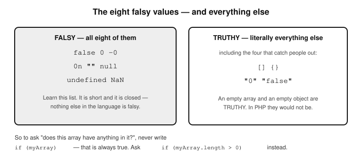

# Chapter 10 — DATA TYPES

- Intro
- Why data types differ across languages
- Similarities across languages
- Understanding primitive and reference
  types
    - Primitive types
      - Why the name “primitive”?
      - Why the Name “Reference”?
      - Why the name object literal
    - Reference types
- Understanding strong and weak typing
    1) Strongly typed languages
    2) Weakly typed languages
- Understanding static and dynamic typing
    1) Static typing
    2) Dynamic typing
- The best way to study data types

- Explicit casting
- Types of data in JavaScript
  - Primitive
  - Non-primitive
  - Symbols explained
    - Symbol Creation
    - Symbols as Object Keys
    - Symbols and Iteration
    - Built-in Symbols (aka well-known Symbols)
  - Undefined vs null values
  - Convert the datatype of a variable
  - Built-in utility functions for type checking
- Booleans
  - The different interpretations of true or
  false


  In computer programming, a data type is
  a classification identifying one of various 
  types of data, such as floating-point, 
  integer, or Boolean, that determines the 
  possible values for that type; the 
  operations that can be done on values of 
  that type; the meaning of the data; and the 
  way values of that type can be stored. 
  Programming languages allow you to also 
  convert data from one type to another. 
  If this is not initially clear to you, do not
  worry, you are not alone. I have got you 
  covered on this-it will all become 
  clear in a minute.

  The concept of data types can be confusing for new programmers. When I started out, the sources of information I consulted, which were mostly books and online materials did not seem to correlate. The data types (primitives and reference types) in Java, seemed to be different from data types in python, and those in Javascript also seemed different. The more i tried to piece the data together to make sense, the more some questions came to mind, which i found so many developers were wondering about too. The first question was whether the concept of data types is programming-language-agnostic, or if they are different for each language. Secondly, i wanted to know the best way to study data types. Do you have to study them for each programming language, or is it possible to master the topic in a way that applies correctly to all languages? I finally got the answers. Let’s talk about what i found.
  The concept of data types exists in all programming languages, but how they are implemented and categorized can differ between languages. Broadly, data types define what kind of data a variable can hold, but the specific details of types—especially primitive types—can vary across languages.


## Why data types differ across languages

- 1) Design Philosophy: Different languages
  have different goals. For example, Java is
  a statically typed language, meaning
  data types are explicitly declared and
  checked at compile-time. Python, on the
  other hand, is dynamically typed,
  meaning data types are determined at
  runtime.
- 2) Memory Management: Some languages,
  like Java, provide primitive types (e.g.,
  int, float) that are more memory-efficient
  compared to reference types. Python
  treats everything as an object, which
  changes how it handles data types.
- 3) Typing System: JavaScript has weak
  typing (types are coerced), Python is
  dynamically typed, and Java is strongly
  typed with clear distinctions between
  primitive types and reference types.


## Similarities across Languages

  Even though the specifics differ, the high-level concept of data types is similar 
  across languages:

- 1) Primitive Types: These usually include
  basic data types like integers, floats (or
  doubles), booleans, and characters.
  Some languages extend this with
  additional types (e.g., long in Java or
  bigint in JavaScript).
- 2) Reference Types: These refer to more
  complex data structures like arrays,
  objects, lists, or dictionaries. While the
  syntax and underlying implementation
  differ, the idea of reference types is
  shared across most languages.


   Understanding primitive and reference 
#### types
  Sure! Let’s break down primitive types
  and reference types in simple terms.

   a) Primitive Types
  Primitive types are the basic building
  blocks of data in a programming
  language. They are called ‘primitive’
  because they are the most simple, low-level data types, and they are not made
  up of other types.

  Key Features:
    - They directly store the value.
    - They are generally fixed-size and
      take up a predictable amount of
      memory.
    - They are faster to access and
      manipulate because they are stored
      in a simple form.
    - They are immutable, meaning once
      you assign a value to them, it can’t
      change (in languages like Java;
      though in Python, immutability
      applies to some, but not all).

##### Why the Name “Primitive”?
  They are called primitive because they
  are the basic, simple types that can't be 
  broken down further. This because they 
  are stored directly in memory, and not as 
  references in memory as is the case with 
  reference types.

  Examples of Primitive Types:
    - Integer types
    - Numbers without a decimal (e.g., `int`,
      `short`, `long`, `byte` in Java).
    - Floating-point types: Numbers with
      decimals (e.g., `float`, `double`).
    - Character type: Single characters
      (e.g., `char` in Java).
    - Boolean type: Represents true/false
      values (e.g., `boolean` in Java).
    - Byte: A data type that holds a small
      integer value (e.g., in Java, `byte`
      can store values from -128 to 127).

    In Python and JavaScript, these are
    similar, but types like `int` or `float`
    are automatically managed and are a
    bit more flexible. For example:
      - Python: `int`, `float`, `bool`
      - JavaScript: `number`, `boolean`

  Here are the primitive types in JavaScript:
  string, number, boolean, null, undefined,
  bigint, symbol

   b) Reference Types
  Reference types are more complex data
  types that store a reference (or
  address) to the actual data rather
  than the data itself. They are often made
  up of multiple primitive types or other
  reference types.

  Key Features:
    - They store the location (reference) of
      the data, not the actual data.
    - They can be larger and more
      complex because they hold more
      than one value.
    - They are often mutable, meaning the
      data they reference can be changed.
    - They are slower to access because
      you first need to look up where the
      data is stored in memory.

##### Why the Name “Reference”?
  They are called reference types because
  instead of directly storing the value, they 
  store a reference (like an address) to 
  where the actual value or object is located 
  in memory.

  Examples of Reference Types:
    - Arrays: Collections of items of the
    same type (e.g., `int[]` in Java, `list`
    in Python).
    - Objects: Complex types made of
    properties (e.g., custom objects in
    Java, dictionaries or class instances in
    Python, object literals in JavaScript,
    classes in JavaScript etc).
    - Strings: In some languages like Java,
    `String` is a reference type, because it
    is an object, not a primitive.
    - Lists: In Python, lists are reference
    types because they store a reference
    to where the list items are held in
    memory.
    - Functions: In JavaScript, functions are
    treated as reference types because
    they are objects.

  Here are the reference types in
  JavaScript: Object, Array, Function,
  Class, Date, RegExp, etc.

Object literals {} are reference types because they store values by reference, not directly in memory.
Classes (which are just special objects) are also reference types because they use constructors to create instances stored by reference.

Here are the key differences between
primitive and reference types
Primitive types:
  Directly store values, like a box that
  holds a number.
Reference types:
  Store the location of the data, like an
  index card that points to where the
  actual data is stored.

  Why does the distinction matter?
  When you work with ‘primitive types’, you
  are manipulating the actual value. With
  reference types, you are manipulating the
  reference (pointer) to the data. This
  difference affects how variables behave,
  especially when passing them to
  functions or copying them.


##### Why the name object literal
  Let’s talk about why the name ‘object literal’ is used in JavaScript and not just ‘object’.
  The term “object literal” is used because it refers to a specific way of defining an object using a literal notation—that is, directly writing out the key-value pairs within curly braces {}.
  An “object” is a general term that refers to any instance of the Object type which is the parent of all objects in JavaScript.
  An “object literal” is a specific way of creating an object using curly braces {} with properties inside. For example:

      const person = {
          name: "Alice",
          age: 25
      };

Here, person is an object, and it was created using the object literal syntax.

The term “literal” in programming means a fixed, direct value that is written in code, rather than being created dynamically or through constructors.

    const car = {
      brand: "Toyota",
      model: "Camry"
    };

The above object is created directly using {}.

    const car = new Object();
    car.brand = "Toyota";
    car.model = "Camry";

This above object is created dynamically using new Object(), then properties are added later.

  Why use object literals?
  - More concise (faster to write than new
  Object()).
  - It’s easier to read and understand
  - More commonly used in JavaScript
  than object constructors.

Here is a list of other “Literals” in JavaScript. The word “literal” is used in JavaScript for other direct-value creations too:
   -Array Literal → const arr = [1, 2, 3];
   -String Literal → const str = "hello";
   -Number Literal → const num = 42;
   -Boolean Literal → const bool = true;


## Understanding strong and weak typing
  The concepts of ‘strongly typed’ and
  ‘weakly typed’ refer to how strictly a 
  programming language enforces the rules 
  around data types.

#### 1) Strongly typed languages
  In a strongly typed language, the type of
  a variable is enforced, meaning you cannot 
  freely mix and match different data types 
  without following specific rules or explicitly 
  converting them.

  Key Points:
  - You have to be careful with how you use
  variables.
  - Data types are strictly checked, and
  there is no type coercion (the
  language doesn’t automatically convert
  one type to another if it doesn’t make
  sense).
  - If you want to use data in a way that
  changes its type, you need to explicitly
  convert it.

  Examples

  Java:

```
int num = 5;
String text = "Hello";

// Trying to combine them without
// converting would throw an error

// Error: incompatible types
String result = num + text;

// You must convert 'num' to a string
// Now it works: "5Hello"
String result =
    String.valueOf(num) + text;
```

So, in Java, you can’t mix an integer
and a string without first converting
the integer to a string. The language
forces you to respect the types
you’re working with.

    Python:
            age = 25
            name = "John"

      # This will cause an error in Python
      # because you cannot concatenate a
      # string with an integer directly
      # Error: TypeError
      result = name + age

    # You need to explicitly convert 'age'
    # to a string
    # Now it works: "John25"
    result = name + str(age)


#### -2) Weakly typed languages
  In a weakly typed language, the language
  is more flexible and will try to convert data 
  types automatically when needed, even if it 
  doesn't always make perfect sense. You 
  would sometimes hear people talk of 
  loosely-typed languages. When they do, 
  they are generally talking about weakly 
  typed languages. Both terms are often 
  used interchangeably

  Key Points:
  - Data types are not strictly enforced.
  - The language might automatically
  convert one type to another (a process
  called type coercion).
  - You can mix types more freely, but it
  might lead to unexpected behaviour or
  results.

  Examples:

  JavaScript

```
let num = 5;
let text = "Hello";

// JavaScript will automatically
// convert the number to a string
// and combine them
let result = num + text;  // "5Hello"

// Another example:
// the value of sum will be "510",
// not 15
let sum = "5" + 10;
```

So, in JavaScript, when you try to
combine a number with a string, the
number is automatically converted to
a string, and the result is `"5Hello"`.
This automatic conversion is known
as type coercion and is a hallmark of
weak typing.

  Recap:
  - Strongly Typed languages require you
    to be explicit about data types and
    perform conversions yourself. Errors
    occur if you try to mix types improperly
    (e.g., combining a string with an
    integer).
  - Weakly Typed languages are more
  relaxed and try to convert types
  automatically, which can be convenient
  but might sometimes lead to
  unexpected behaviour (e.g., `"5" + 10`
  results in `"510"` instead of `15`).


## Understanding static and dynamic typing
  The difference between static typing and
  dynamic typing is about when the type of a 
  variable is determined and whether you 
  need to declare it explicitly.

#### 1) Static Typing
  In statically typed languages, you must
  declare the type of a variable when writing 
  the code, and the type is checked at 
  compile time (before the program runs).

  Key Points:
  - The type is known and fixed when the
    code is written.
  - The compiler checks for type errors
    before the program runs, preventing
    some bugs.
  - You cannot change the type of a
    variable after it's declared.

  Example 
  Java:

           // You must declare the type as 'int'
           int age = 25; 

          // Trying to assign a different type later 
          // will cause an error
          // Error: incompatible types
          age = "twenty-five"; 

In Java, the type of ‘age’ is declared
as ‘int’, and the compiler won’t let you
assign a string to it later.

#### 2) Dynamic Typing
  In dynamically typed languages, you do
  not need to declare the typeof a variable, 
  and the type is determined at runtime
  (while the program is running).

  Key Points:
  - The type is figured out as the program
    runs.
  - You can assign a value of any type to a
    variable, and change its type later if
    needed.
  - The flexibility comes at the cost of
    potential runtime errors.

Example
  Python

            # No need to declare the type
            age = 25 

            # You can change the type of 'age' at 
            # any point
            # Works fine; now it's a string
            age = "twenty-five" 

In Python, you don’t declare the type
of ‘age’ upfront. You can assign an
integer, and later assign a string to
the same variable without any issues
—until the program runs and an error
might occur.

  Recap:
  - In Static Typing the variable type is
    declared and fixed when you write the
    code (before running the program).
    Example: Java, C.
  - In Dynamic Typing the variable type is
    determined at runtime, and it can
    change as the program runs. Example:
    Python, JavaScript.


## The best way to study data types
  You should do this in two steps; mastering
  the general core concepts that apply to all 
  languages, then learn the individual 
  language implementations. This way, you’ll 
  build a strong foundation and can easily 
  switch between languages by learning 
  their specific syntax and behaviour around 
  data types. Let us break down the two 
  steps.

- 1) Understand the language-agnostic
    core concepts. This involves properly
    understanding:
    a) Primitive vs. Reference Types: Grasp
      the idea of primitives (basic, low-level types) vs. reference types
      (complex, stored by reference).
  b) Strong vs. Weak Typing: Understand
      the difference between strongly
      typed (Java, C++) and weakly typed
      (JavaScript) languages. See the in-depth explanation on strong vs weak
      typing later below.
  c) Static vs. Dynamic Typing: Get
      comfortable with the idea of static
      typing (e.g., Java, where types are
    checked at compile time) vs. dynamic
    typing (e.g., Python, where types are
    checked at runtime). See the in-depth explanation on static and
    dynamic typing later below.

- 2) Study language-specific.
    implementations.
    Once you understand the core
    concepts, focus on how individual
    languages implement these concepts.
    This will help you adapt to the specifics
    of any language while keeping the big
    picture in mind. When learning a
    language, make sure you:
	
a) Study its primitive types and
  understand how it handles more
  complex data structures.
b) Learn about its memory management
  and how it treats data types internally
  (e.g., Java uses objects for everything
  except primitives, while Python treats
  everything as an object).

  We have pretty much covered the first
  step in the notes above, where we 
  mastered the core concepts by 
  theoretically examining all the facets of 
  data types. This involved learning about 
  primitive vs reference types, strong vs 
  weak types, and static vs dynamic types 
  which are programming-language 
  agnostic. We just have step 2 to cover. You 
  will do step 2 on your own whenever you 
  pick up a new language to learn. You just 
  have to make sure you learn of how it 
  implements primitive types as well as 
  reference types-which are more complex 
  data structures.

## Explicit casting

  JavaScript is a loosely typed language,
  meaning it does not require you to explicitly 
  declare the datatypes of all variables, 
  function/method parameters or objects 
  that you use. What it does is to 
  automatically deduce the type you intend 
  to have from the values you use. For 
  example, if you assign an int to a variable, 
  like so:

       let num = 25;

  JS then automatically treats that number 
  variable as an int, and if you later re-assign num to a string eg:

      num = 'Welcome';

  It internally converts the data type of num to
  a string. This behaviour of second-guessing (implying) the datatype you 
  desire and automatically converting 
  (casting) the datatype of the output for 
  you is known as ‘implicit casting’. Casting is 
  the process of converting a variable from 
  one data type to another. If it is done by 
  the programming language, it’s implicit, if 
  done by you the programmer, then it is 
  explicit.
  There are times when you may want to
  explicitly cast a variable output to a data 
  type because the implicit casting will not 
  be what you precisely want.
   
- In JavaScript, explicit casting (or type conversion)
   can be done in several ways, depending on the types 
  you’re converting between. Here are some common methods:

    - cast to string
    - cast to a number
    - cast to a boolean
    - cast to an object
    - cast to an array


#### -1) Casting to String
  For this we use either the String()
function or the toSting() method. For
example:

#### String() function
      let num = 123;

      // convert to "123"
      let str = String(num);


#### toString() method
      let num = 123;

      // convert to "123"
      let str = num.toString();


#### -2) Casting to a number
  There are 3 ways to do this:

      a) Using the Number() function:

            let str = "123"; 

            // convert to 123
           let num = Number(str);

  b) Using unary plus (+)
#### operator
            let str = "123";

           // converts to 123
           let num = +str;

c) Using parseInt() (for integers) or
  parseFloat() (for floating-point
#### numbers)
          let str = "123.45";

          // convert to 123.45
          let num = parseFloat(str);

     
#### -3) Casting to a boolean

      There are 2 ways to cast to a boolean; 
  using the Boolean() function or using 
  double negation. For example:

#### a) Using the Boolean() function
        let value = 1;

        // converts to true
        let bool = Boolean(value);

#### b) Using double negation (!!)
        let value = 1;

        // converts to true
       let bool = !!value;


#### -4) Casting to an object
  This is done by wrapping a primitive in its
  object equivalent.

    let num = 123;

    // converts to Number {123}
    let obj = Object(num);


#### -5) Casting to an array
  This is done in 2 ways. You can either do
  it using Array.from() (for iterable or array-like functions), or you can use split() for 
  strings.

#### a) Using Array.from()

          let str = "hello";

          // converts to ["h", "e", "l", "l", "o"]
          let arr = Array.from(str);

#### b)  Using split()
        let str = "hello";

       // converts to ["h", "e", "l", "l", "o"]
       let arr = str.split('');


## -Types of data in JavaScript
JavaScript broadly categorises data types into primitive types and non-primitive 
types.

#### -Primitive (7)
  These are immutable (meaning they what they are in value and are not 
references, so they cannot be changed), and represent single values. Their values are literally what they appear to be. In JavaScript 
there are 5 primitive data types, plus two types Symbols and BigInt added in later specifications of JavaScript. Here is an abbreviation I came up with-use it or find your own way to remember them: SNBUNSB (SN BUN SB).

  - i) String (literal value like ‘hello world’)
  - ii) Number (represents both integers and floating-point numbers, like
    42, or 3.14)
  - iii) Boolean (represents true or false values)
  - iv) Undefined (represents an uninitialised variable or missing value)
  - v) Null (represents the intentional absence of a value)
  - vi) Symbol (introduced in ES6: and represents a unique identifier)
  - vii) BigInt (introduced in ES11: Represents large integers beyond the
    range of Number)

I will like to introduce to you at this point, a special numeric value worth knowing because it is very useful in handling numbers in JavaScript. It is NaN. NaN is a special numeric value that means 'Not a Number'. It is part of the Number type in JavaScript. However, it is not a data type, but rather a special numeric value within the Number data type. It represents the result of an invalid or undefined mathematical operation. For example:

	console.log(0 / 0);         // NaN
	console.log(Math.sqrt(-1)); // NaN
	console.log(Number("abc")); // NaN

I will explain how it works when we come to validating values to see if their type is a number.  


#### -Non-primitive (1)
These are objects, which can store multiple values or complex entities.
Object: The base for many structures, including the following which we 
know are all objects in JavaScript:

  - Arrays
  - Functions
  - Classes
  - Other custom objects eg Interfaces

They all have different sizes depending on the type of data they contain.

### Symbols explained
		
  Symbols in JavaScript are unique and immutable identifiers introduced in ES6. They are often used to create unique keys for object properties, ensuring no naming conflicts, even in scenarios like extending or customising objects. Here are some examples to help you understand Symbols:

#### Symbol Creation
		// Creating symbols 
		// 'description' is optional and for debugging only
		const sym1 = Symbol('description');  
		const sym2 = Symbol('description'); 

		// Symbols are unique this will return false
		console.log(sym1 === sym2);

#### Symbols as Object Keys
		const symKey = Symbol('uniqueKey'); 

		const myObject = { 
			[symKey]: 'value', 
		}; 

		// Output: 'value'
		console.log(myObject[symKey]);   

		// The symbol key doesn't clash with string keys
		myObject['uniqueKey'] = 'another value'; 

		// Output: 'value' 
		console.log(myObject[symKey]); 

		// Output: 'another value'
		console.log(myObject['uniqueKey']); 


#### Symbols and Iteration
Symbols are not enumerable, meaning they don’t appear in for...in loops or
  Object.keys(). However, you can explicitly access them using
  Object.getOwnPropertySymbols.

		const sym1 = Symbol('key1'); 
		const sym2 = Symbol('key2'); 

		const obj = { 
			[sym1]: 'value1',
			 [sym2]: 'value2', 
		}; 

		// [] (symbols are not enumerable) 
		console.log(Object.keys(obj)); 

		// [Symbol(key1), Symbol(key2)]
		console.log(Object.getOwnPropertySymbols(obj)); 

	
#### Built-in Symbols (aka well-Known Symbols)
  JavaScript has several built-in Symbols known as "well-known symbols." 
These are used to customise or override default behaviours in objects.

#### Example 1: Symbol.iterator

Used to define custom iteration behaviour for an object.

			const iterable = {
				values: [1, 2, 3], 
				[Symbol.iterator]() { 
					let index = 0; 
					return { 
						next: () => ({ 
							value: this.values[index++], 
							done: index > this.values.length, 
						}), 
					}; 
				}, 
			}; 


		// Outputs: 1, 2, 3 }
		for (const value of iterable) { console.log(value); 


#### Example 2: Symbol.toPrimitive

Controls how an object converts to a primitive value.

			const obj = { 
				[Symbol.toPrimitive](hint) { 
					if (hint === 'string') return 'Object as string'; 
					if (hint === 'number') return 42; return null; 
				}, 
			}; 

			// Outputs ‘Object as string'
			console.log(`${obj}`);  

		// outputs 42
		console.log(+obj); 


  The Symbol type provides a way to ensure unique, non-clashing keys and customise object behaviours in JavaScript. They’re particularly 
useful in large-scale applications and libraries. 
  It is one of JavaScript’s primitive data types, just like string, number, or boolean. But unlike the others, it's a more advanced feature that most beginner (and even many experienced) developers rarely use in day-to-day code. It was introduced mainly for building safer, more robust libraries or frameworks — where developers want to create unique identifiers that won’t accidentally clash with other property names.
While it’s useful in specific cases (like creating private-like object keys or customizing how objects behave in certain operations), you can go a long way in JavaScript without ever needing to use it.
Still, it’s good to know that it exists — just in case you see it in someone else’s code or get curious later on.
  Here is a simple example of using a Symbol as a hidden property key:

	// Create a Symbol to use as a hidden key
	const secretKey = Symbol('secret');

	const user = {
  		name: 'Alice',
  		age: 30,
  		[secretKey]: 'This is a hidden value'
	};

	// Accessing normal properties
	console.log(user.name);      // Alice
	console.log(user.age);       // 30

	// Trying to list all properties
	console.log(Object.keys(user));  

Output: [ 'name', 'age' ] — no sign of the Symbol key

	// But the hidden value is still there
	console.log(user[secretKey]);  
	
Output: This is a hidden value

Let me explain the above example. Symbol('secret') in JavaScript is how you create a unique identifier. Each time you call Symbol('secret'), the value it returns will be different. So:

  - we use Symbol('secret') to create a unique value which we want to use as
  the value of a property which we want to create on our object
  called secretKey.
  - The great thing is; when you run Object.keys(user), the symbol-keyed property is not included — it's like a hidden property.
  - But if you know the Symbol, you can still access the value using
  user[secretKey].

    ```
    A Symbol is useful for the following reasons; 
    ```

  - It helps avoid property name collisions (two pieces of code
  accidentally using the same key).
  - It’s great for adding "internal" values to objects that other code
  shouldn’t mess with.
  - Used often in libraries or framework internals — for example,
  JavaScript itself uses well-known symbols like Symbol.iterator.


### -Undefined vs null values

  Both null and undefined mean "there is nothing here", which is why they
are so often confused. The difference is in who put the nothing there.
  undefined is JavaScript's way of saying "nobody has given this a value
yet". You get it when you declare a variable without assigning to it,
when you read a property that does not exist, or when a function
returns nothing at all.
  null is a value you set deliberately. It is a programmer saying "this
is empty, and I meant it to be". JavaScript will never hand you null on
its own.

	let notSetYet;              // undefined - nobody assigned anything
	let deliberatelyEmpty = null;   // null - we chose this

	console.log(notSetYet);         // undefined
	console.log(deliberatelyEmpty); // null

  A useful way to hold on to it: undefined is the absence of a value,
null is the presence of an empty one.
  Now to how they compare, which is where the three results below often
surprise people:

	// false - loose in value, but not the same type
	console.log(null === undefined);

	// true - loosely equal, because == treats them as
	// two ways of saying "nothing"
	console.log(null == undefined);

	// "object" - see the note below
	console.log(typeof null);

  That last one is not a mistake in the book. typeof null really does
return "object", even though null is not an object at all. It is a bug
that has been in JavaScript since the very first version, and it can
never be fixed now because too much existing code depends on it. Just
remember it, and test for null with === null rather than with typeof.


### -Convert the datatype of a variable
  One way to convert a value from one type to another is JavaScript's
parseInt() function, which turns a string into a whole number. Here is
how you would use it:

	let num = "5";
	alert('The type of '+num+' is '+typeof num);
			
	num = parseInt(num);
	alert('Now the type of '+num+' is '+typeof num);

  The first alert popup will display: "The type of 5 is string"
  The second alert popup will display: "Now the type of 5 is number".

  Two things to know about parseInt() before you reach for it. It gives
you whole numbers only, so parseInt("3.9") is 3, not 3.9 - use Number()
if you want the decimals. And if the text is not a number at all,
parseInt("abc") gives you NaN rather than an error.
  parseInt() is only one of several ways to convert between types. The
full set, covering strings, numbers, booleans, objects and arrays, is in
the Explicit casting section earlier in this chapter.

  You can also display the contents of a variable containing 
an object or array in JavaScript. You just have to convert that data 
Into a string so you can display it on screen or write it to the console.
Here is how you do it:

	let testData = [5, 10, 20, 25];

	let customer = {
    		name: 'Tom Sawyer', 
    		age: 10, 
   		brother: 'Sid', 
    		aunt: 'Polly'
    	};


	// convert the testData array into a string using JSON.stringify()
	console.log("The testData array contains: " + JSON.stringify(testData));
	// this will output:

  The testData array contains: [5,10,20,25]

	// convert the customer object into a string using JSON.stringify()
	console.log("The customer object: " + JSON.stringify(customer));
	// It will output:

	The customer object: {"name":"Tom Sawyer","age":10,"brother":"Sid","aunt":"Polly"}


### Built-in utility functions for type checking
  JavaScript offers you some very useful built-in helper functions and operators that you can use to check the data type of any value. For example, you will be able to tell in code if a value you are dealing with is a number or not. If you are already thinking that this will be very handy when validating form input values to make sure they conform specific types, you are absolutely spot on. Values validation is one of the most popular uses of these type utility functions and operators. Understanding these will help to make you an efficient JavaScript programmer.
  Here's a clean, alphabetical list of JavaScript’s built-in utility functions for type checking, along with short explanations and simple code examples for each.  

- 1) Array.isArray()
  Checks if a value is an array. For example:

  ```
  console.log(Array.isArray([1, 2, 3])); 
  console.log(Array.isArray("hello"));  

  // let’s pass it a variable
  let someText = "This is some text";
  console.log(Array.isArray(someText));
  ```

Output:
  true // [1, 2, 3] is an array
  false // text is not array
  false // text is not array


- 2) instanceof
  Checks if an object is an instance of a particular class or
  constructor. For example

  ```
  class Animal {}
  const dog = new Animal();

  console.log(dog instanceof Animal);
  console.log(dog instanceof Object); 
  ```

Output:
  true
  true // Object is the parent of all JavaScript objects


- 3) isNaN()
  Checks if a value is Not-a-Number. It coerces the value to a number 	first. For example

  ```
  console.log(isNaN("hello"));
  console.log(isNaN(42));
  ```


Output:
  true  // → "hello" becomes NaN
  false // 42 is a number

  I need to add some clarification with this one. When I say that
  isNaN() first of all coerces its value to a number, I mean, in the
  example:

		isNaN("hello");

  JavaScript tries to convert the string "hello" into a number before
  checking if it is NaN. NaN is a special numeric value that means 'Not
  a Number'. It is part of the Number type in JavaScript. However, do
  not mistake it for a data type, for it is not a data type. Rather, it is a
  special numeric value within the Number data type. It represents the
  result of an invalid or undefined mathematical operation. For
  example:

		console.log(0 / 0);         // NaN
		console.log(Math.sqrt(-1)); // NaN
		console.log(Number("abc")); // NaN

  Here’s what happens behind the scenes:

		Number("hello"); // becomes NaN

  Since "hello" is not a valid number, JavaScript converts it to NaN.
  Then checks if its a NaN:

isNaN("hello") → isNaN(NaN) → true

	That’s why 
		console.log(isNaN("hello")); // returns true

  It is important to understand this distinction because this behavior
  can be confusing. Let’s take this other example

		isNaN("123");

Will return false-because "123" becomes the number 123 which is a
number, so it is not considered to be a NaN. So, it is the conversion it
does that can really cause the confusion. You and I know that "123"
is not a number (NaN), and so it should return true, but it gets
converted and therefore returns false-meaning it is a number. Let’s
look at one more example:

		let nan = NaN;
		let number = 123;
		let numberString = "123";
		let helloString = "hello";

		console.log(isNaN(nan));      
		console.log(isNaN(number));   
		console.log(isNaN(numberString));   
		console.log(isNaN(helloString));

Returns:
  true
  false
  false
  true // coercion to NaN first

  The trick lies in remember ting hat it always converts its value to a
  NaN first, before checking its value.

  Use isNaN() when you're okay with JavaScript trying to convert the
  value to a number first.
		
  There is a better to check if a value is literally a NaN or not, and it
  does that without this conversion. This is by using Number.isNaN(),
  which I talk about next.


- 4) Number.isNaN()
  A stricter version of isNaN(). Only returns true for the actual NaN
  value. If the value was not already a NaN-literally, it will return false.
  For example

	let nan = NaN;
	let number = 123;
	let numberString = "123";
	let helloString = "hello";

  ```
  console.log(Number.isNaN(nan));      
  console.log(Number.isNaN(number));   
  console.log(Number.isNaN(numberString));   
  console.log(Number.isNaN(helloString));
  ```

Output:
  true
  false
  false
  false // no coercion
	
  Use Number.isNaN() when you want a strict, reliable check — only
  returns true for the actual NaN value.


- 5) typeof
	
  This is used to check the data type of a value. It works well with
  primitives and objects. It returns a string showing the type of the
  value. For example:

		typeof "";        // returns "string"
		typeof "John";    // returns "string"
		typeof 3;         // returns "number"
		typeof true;      // returns "boolean"
		typeof false;     // returns "boolean"

Take care with typeof and arithmetic. It binds more
tightly than +, so this does not do what it looks like:

		typeof 2 + 2;     // "number2", not "number"

That is (typeof 2) + 2, which is the string "number"
joined to the number 2. Put brackets round the sum if
that is what you meant:

		typeof (2 + 2);   // "number"
		console.log(typeof "hello");   // "string"
		console.log(typeof 42);        // "number"
		console.log(typeof true);      // "boolean"
		console.log(typeof {});        // "object"
		console.log(typeof null);      // "object" ← (weird quirk!)
		console.log(typeof undefined); // "undefined"

You might ask the question: Why does this return a object:
	
		console.log(typeof null);

  It is one of JavaScript’s most infamous quirks! This happens because
  of a bug in JavaScript’s original implementation that has been
  around since the very beginning (1995), and it has never been fixed
  for backward compatibility reasons. But don’t worry-even though it
  says 'object', null just means 'nothing here' and it’s actually not an
  object at all

  Here’s what happened:
  - In the early version of JavaScript, all values were represented as types using a tag system under the hood.
  - The type tag for objects was 0.
  - The value null also got the type tag 0 by mistake.
  - So when typeof checks the internal type tag of null, it wrongly reports it as "object".

  So what data type is null really meant to be:

  - null is a primitive type.
  - It means "no value", or "empty value".
  - It is not an object.

  So, how can you accurately check for a null type? If you want to
  accurately check for null, use strict comparison instead. For example:

	if (value === null) {
  		console.log("It is really null!");
	}


-6) value === null
	This uses the JavaScript identical operator (===) which compares 
	the values as well as the data types of two values. Here it shows how 
	you can use it to check if a value is exactly null. For example:

		let x = null;
		console.log(x === null); // true


-7) value === undefined
  This uses the JavaScript identical operator (===) which compares
  the values as well as the data types of two values. Here it shows how
  you can use it to check if a value is exactly undefined.
  This is the way to check if a variable is undefined (or is defined but
  has no value yet). For example:

	let y;
	
	console.log(y === undefined); // true


## BOOLEANS
A boolean is a data type with exactly two possible values: true and false. They are written in
lowercase, and only in lowercase.

  Be careful here if you have come to JavaScript from another language. Some languages, PHP
among them, also accept TRUE and FALSE in capitals as the same thing. JavaScript does not.
Written in capitals they are not booleans at all, just names JavaScript has never heard of,
and using one gives you a ReferenceError:

        let isValid = true;

        if (isValid) {
            console.log("Valid!");
        }

        // Error: ReferenceError: TRUE is not defined
        let alsoValid = TRUE;

  So there is only one form to remember, which is one less thing to think about.


#### The different interpretations of true or false
  JavaScript will happily accept things other than true and false wherever it expects a
  yes-or-no answer, such as inside an if statement. When it meets a value that is not a boolean
  in one of those places, it works out whether to treat it as true or false. Values that come
  out as false are called falsy, and everything else is truthy.
  There are exactly eight falsy values in JavaScript, and it is worth learning the list,



- Figure 10.1 — The eight falsy values, and everything else*

  because everything not on it is truthy:

    - i)    false          the boolean itself
    - ii)   0   and  -0    zero, either sign
    - iii)  0n             zero as a BigInt
    - iv)   ""             an empty string
    - v)    null           a deliberate "no value"
    - vi)   undefined      a value never set
    - vii)  NaN            "Not a Number"

  Everything else is truthy. That includes some things people often expect to be falsy:

-an empty array, []
-an empty object, {}
-the string "0", and even the string "false"

  That first one catches people out constantly, and it is worth pausing on, because in
  several other languages an empty array IS falsy. Not here:

        if ([]) {
            console.log("This really does run.");
        }

        // Output: This really does run.

  So if you want to know whether an array is empty, testing it directly will not tell you.
  You have to ask about its length.

  There are times when you want to be sure not just that something is falsy, but exactly
  what it is. Knowing a value is falsy does not tell you whether it is null, an empty string
  or zero, and those often need handling differently. For that, use the strict equality
  operator (===) from Chapter 5, which compares the type as well as the value.
  Here is how to tell each case apart.

- 1) null
   null represents a deliberate absence of a value.

  ```
  let value = null;

  if (value === null) {
      console.log("The variable is null.");
  }
  ```

   -Distinguishing: use strict equality (===). Do not use == here, because null == undefined
     is true, and you would not be able to tell the two apart.

- 2) undefined
   undefined means no value was ever put there, as opposed to null, which means someone
   deliberately put "nothing" there. There is more on the difference earlier in this chapter.

        let value;

  ```
  if (value === undefined) {
      console.log("The variable is undefined.");
  }
  ```

- 3) An empty string ("")
   A string with no characters in it.

  ```
  let value = "";

  if (value === "") {
      console.log("The variable is an empty string.");
  }
  ```

- Distinguishing: strict equality works perfectly well for strings, because a string is a
  primitive and is compared by its value.

- 4) An empty array ([])
   This one needs a different approach, and here is why. An array is a reference type, as we
   saw in Chapter 3. Two arrays are never strictly equal to each other, even when both are
   empty, because they are two different arrays sitting in two different places in memory:

        console.log([] === []);   // false, always

   So a test like if (value === []) can never be true, no matter what value holds. Ask about
   the length instead, having first checked that it really is an array:

        let value = [];

        if (Array.isArray(value) && value.length === 0) {
            console.log("The variable is an empty array.");
        }

- 5) Zero (0)
   The number zero.

  ```
  let value = 0;

  if (value === 0) {
      console.log("The variable is zero.");
  }
  ```

-Distinguishing: strict equality again, and here it matters more than usual. With loose
  equality, 0 == "" and 0 == false are both true, so == would tell you a value is zero when
  it is actually an empty string.


  The relationship between data types
#### and the Built-in Object of JavaScript
  JavaScript has a built-in object named Object
which is the parent of all JavaScript objects. This means 
That all objects automatically inherit from it, and this is 
Is very useful because these objects can then make use 
of the powerful utility methods and properties of Object.
So the best way to describe the relationship between Object 
and other non-primitive objects in JavaScript is as follows:
  - The object data type represents all non-primitive values,
  while Object is a constructor and utility provider for
  working with objects.
  - All objects (including arrays, functions, etc.) ultimately
  inherit from Object via the prototype chain.
We will learn more about Object and how to use it in the Object Oriented section.