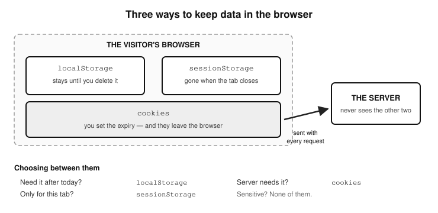

# Chapter 13 — DATABASES AND STORAGE
- Storage for data persistence e.g localStorage. Also, everything about database access in terms of SQL queries, database configuration, and database design and management.

- Learn the SQL (Structured Query Language) which is a global standard for communication with most database systems.
- Learn about the different types of database systems out there. For example, RDBS (Relational database systems) like MySQL, PostgreSQL, MariaDB, then learn about noSQL databases like Mongo DB
- Find out about what APIs your chosen
  programming language provides to use in 
  connecting with your chosen database 
  solution.

#### Data Persistence

    - Introduction
    - Persisting data with LocalStorage
      - How to read data from LocalStorage
      - How to save data to LocalStorage
      - How to update data in LocalStorage
      - How to delete data from LocalStorage
    - Persisting with Session Storage
    - Persisting with Cookies
    - Databases
      - What is a database
      - JavaScript and databases
      - Relational vs NoSQL Databases
      - Common database stacks you may encounter
      - Why JavaScript doesn’t talk directly to databases
      - Popular databases for JavaScript developers

  Introduction
  Here we will be looking at the ways in which data can be persisted so that it does not just go away once we close our application. In JavaScript, there are many technologies and tools to achieve this: for example, localStorage, sessionStorage, Cookies, and database systems (relational/non-relational). Though, databases are quite easy to understand in terms of saving data and reading from them, you will need something like a server for example Node.js to handle those operations. That is beyond the scope of this book, hence we will not go into that. In this section, we will be focusing on three storage mechanisms; localStorage, sessionStorage and Cookies. Once you understand how to write to, and read from a storage system like localStorage, then working with a NoSQL database like MongoDB will be very easy to pick up as they both use json objects to store data.
  It is worth noting that among the three storage types we will look at, cookies work differently from localStorage and sessionStorage. While localStorage and sessionStorage are client-side storage mechanisms used to store data locally, cookies are different because they are mainly used for exchanging small pieces of data between the client and server (like authentication tokens or user preferences). However, since cookies also persist data, they are worth mentioning here.	
  Here's a clear and structured comparison of cookies, localStorage, and sessionStorage in bullet points:

Cookies:

- Purpose: Primarily used for server-client communication (e.g., authentication, session tracking, user preferences).
- Storage Limit: About 4KB per cookie.
- Persistence: Can have an expiration date, or be deleted when the browser closes (session cookies).
- Access: Available to both JavaScript and the server (automatically sent with every HTTP request).
- Security: Can be vulnerable to cross-site scripting (XSS) attacks if not handled properly. Can be marked as HttpOnly (inaccessible to JavaScript) or Secure (sent only over HTTPS).
- Use Case: Storing user session tokens, authentication details, and preferences that need to be shared with the server.

localStorage:

- Purpose: Stores data in the browser for long-term use.
- Storage Limit: Around 5-10MB per domain.
- Persistence: Does not expire (remains even after the browser is closed and reopened).
- Access: Only available to JavaScript (not sent to the server).
- Security: More secure than cookies in terms of preventing session hijacking (but still vulnerable to XSS if misused).
- Use Case: Storing user preferences, theme settings, or cached data that should persist across sessions.

sessionStorage:

- Purpose: Similar to localStorage, but only for a single session.
- Storage Limit: Around 5-10MB per domain.
- Persistence: Only lasts until the browser or tab is closed.
- Access: Only available to JavaScript (not sent to the server).
- Security: Like localStorage, it is vulnerable to XSS attacks.
- Use Case: Storing temporary data like form inputs, or session-based preferences that don’t need to persist after the user leaves the page.

So, the take-away from this is this: if you need to store data permanently, use localStorage, if you only need it for a single session, use sessionStorage, and if you need the server to access the data, use cookies.

- Figure 13.1 — Three ways to keep data in the browser*

  Persisting data with localStorage
  
  For purposes of demonstration, we will assume that we are storing the data from a TodoList application in the LocalStorage. The specific reference of the data in LocalStorage is nlm.todoList. The data is in the following format:
		[
			{id: 1, name: "todo list value 1", date: "20-8-2020"},
			{id: 2, name: "todo list value 2", date: "20-8-2020"},
			{id: 3, name: "todo list value 3", date: "20-8-2020"}
		]

  We will proceed to learn how we can go about reading from this data and how to write to it. 	We will also look at how to update specific records in that data, and how to delete specific 	records in that data. 

	const LOCAL_STORAGE_TODO_KEY = 'nlm.todoList';
		
	//an array to hold all current todoList items
	let stuffTodo = [];

	

How to read data from LocalStorage

In this reading demonstration, we will loop through all the todoList items grabbing their id, and their name (value), then format that into a string that can be displayed on 	screen.

	/*-----------DISPLAY OF TODOLIST ITEMS-------------*/
	// manage displaying of existing todoList items to the user. 
	// You get the data from localStorage if there are previously 
	// saved todoList items, grab them
	if (JSON.parse(localStorage.getItem(
		LOCAL_STORAGE_TODO_KEY)) !== null) {
		   JSON.parse(localStorage.getItem(
			LOCAL_STORAGE_TODO_KEY
		   )).map(todoFromStorage => {
      			const li = document.createElement('li');
     		 	let todoString = "";
      			todoString = `
      	

      	${todoFromStorage.name}
	
      <button name='deleteButton'
		id="deleteButton${todoFromStorage.id}"
		class='deleteButton'>Delete
	</button>

      <button name='editButton' id='${todoFromStorage.id}' 
		class='editButton'>Edit
	</button>

      <input type='checkbox' name='checkButton' 
		class='checkButton' />
      
	

         <form class='editForm' onSubmit="saveEdit(event)">
	 <input type='text' 
		class='form-control' 	
		name='editField' />
         	
	 <a onClick='cancelEdit(event)' 
		class='btn btn-danger-sm cancelEdit'>x</a>

         <input type='submit'
		class='form-control btn btn-primary-sm editValue editInput'
		value='Save'>
         </form>
      	

      	
`;
     
      	li.innerHTML = todoString;
      	Object.assign(li, {
         		'draggable': 'true',
         		className: ['list-item draggable']
      	});
      
	ul.appendChild(li);
      
	   });
	}

How to save data to LocalStorage

	function addTodo(e) 
	{
   		//get the todoList item submitted by user
   		const somethingTodo = input.value;
   		if (somethingTodo == '')
   		{
      		    alertError.children[0].innerHTML =
			"Please type in something!";
      		    alertError.style.display = 'block';
      		    setTimeout(() => {
         		alertError.children[0].innerHTML = "";
         		alertError.style.display = 'none';
      		    }, 3000)
   		}
   		else
   		{
      		     //get the ID to be used for the ingoing todoList Item
      		     let id = getId();
      		    
		     //create an object to hold the todoList item
      		     let somethingTodoObj = {
         			id: id,
         			name: somethingTodo,
         			date: day+'-'+month+'-'+year
      		     };
      
		     // clear the item just submitted from the input field
      		     // input.value = "";
      		     // Check in the local storage for todoList items 
		     // already saved there. if there's nothing in storage, 
		     // use what user has submitted
      		     if (JSON.parse(localStorage.getItem(
			LOCAL_STORAGE_TODO_KEY)) === null)
     		     {
         		stuffTodo.push(somethingTodoObj);
         
			//then save it in storage
        	 	localStorage.setItem(
				LOCAL_STORAGE_TODO_KEY, 
				JSON.stringify(stuffTodo)
			);
         
		     // refresh page so the landing page part of the code 
		     // gets the updated list
         	     window.location.reload();
      		}
      		else
      		{
         		// there are items already saved in storage, so 
			// grab them n add to the array to be saved (this is 			// coz when saving anything to localStorage, prev 
			// data is overridden)
         		JSON.parse(localStorage.getItem(
				LOCAL_STORAGE_TODO_KEY)).map(
					todoFromStorage => {
               			    	      // push in all items from local storage 
					      // into our array as well as the new 
					      // todoList item the user just 
					      // submitted
               				      stuffTodo.push(todoFromStorage);
         				}
				);
         
			// push in the newly submitted todoList item as well
         		// stuffTodo.push(somethingTodoObj);
         		// save them all to the local storage again
         		localStorage.setItem(
				LOCAL_STORAGE_TODO_KEY, 	
				JSON.stringify(stuffTodo)
			);
         
				// refresh page so the landing page part of the 
				// code gets the updated list
	         		window.location.reload();
	      		}
	   	}
	   	e.preventDefault();
	}

function getId()
{
   	if ((JSON.parse(localStorage.getItem(
		LOCAL_STORAGE_TODO_KEY)) === null) || 		
		(JSON.parse(localStorage.getItem(
			LOCAL_STORAGE_TODO_KEY)).length == 0))
   	{
      		return 1;
   	}
   	else
   	{
      		// JSON.parse() returns an array, so get the ID of the 
		// last element and increment it by 1
       		let IdNum = 	
			parseInt(JSON.parse(localStorage.getItem(
				LOCAL_STORAGE_TODO_KEY))	
				[JSON.parse(localStorage.getItem(
					LOCAL_STORAGE_TODO_KEY
				)).length - 1].id);
      
			let idFigure = IdNum + 1;
	      		return idFigure;
	   	}
	}

How to update data in LocalStorage

function saveEdit(e)
{
   	//grab the edit form's parent div
   	let editFormDiv = e.target.parentNode;
   	let todoId = parseInt((editFormDiv.id).split('editFormDiv')
		[1]);
   
	let savedValue = e.target.children[0].value;
   
	if (savedValue != '')
   	{
      		let itemsLocal = [];
      
		// grab all existing todoList items from storage except 
		// the one being edited
      		JSON.parse(localStorage.getItem(
		LOCAL_STORAGE_TODO_KEY)).map(
			todoFromStorage => {
         
				// get the matching todoList item by ID and 
				// update its text
         			if (todoFromStorage.id == todoId) {
            				todoFromStorage.name = savedValue;
            				itemsLocal.push(todoFromStorage);
         		}
         		else
         		{
            			itemsLocal.push(todoFromStorage);
         		}
      		});

      		// reset localStorage todoList data
      		localStorage.setItem(LOCAL_STORAGE_TODO_KEY, 	
			JSON.stringify(itemsLocal));

      		let todoParent = e.target.parentNode.parentNode;
      
		// get the the first element inside the parent li item, 
		// which is the span containing the todoList item value 
		// and replace its value with the new one
      		let todoItem = todoParent.children[0];
      		todoItem.innerHTML = savedValue;
      
		// hide the form div again
      		editFormDiv.style.display = 'none';
   	}
   	else
   	{
      		alert('You did not enter anything!');
   	}
   	e.preventDefault();
}

How to delete data from LocalStorage

  This deletion of data from localStorage is done by the method removeItem(). You pass it the key of the storage item/data you wish to delete. Here is the syntax:

	localStorage.removeItem("keyName");

This will delete only the item associated with "keyName", leaving other stored data intact. But if you want to clear everything from the localStorage, then use the clear() function instead. Here is its usage syntax:

	localStorage.clear();

This completely wipes everything stored in localStorage.

Here is an example of removing an item from our example todo list.

	function deleteTodo(e)
	{
   		// get the todoList item ID from the delete button that 
		// was clicked
   		let delId = (e.target.id).split('deleteButton')[1];
   		if (JSON.parse(localStorage.getItem(
			LOCAL_STORAGE_TODO_KEY)) !== null)
   		{
      			let itemsLocal = [];
      			JSON.parse(localStorage.getItem(
			LOCAL_STORAGE_TODO_KEY)).map(
				todoFromStorage => {
         				if (todoFromStorage.id != delId) {
            					itemsLocal.push(todoFromStorage);
         				}
     	 	});
     
	 	//reset localStorage todoList data or delete it if it's 
		// empty
      		if (itemsLocal.length != 0) {
         		localStorage.setItem(
				LOCAL_STORAGE_TODO_KEY, 
				JSON.stringify(itemsLocal));
      		}
      		else
      		{
         		localStorage.removeItem(
				LOCAL_STORAGE_TODO_KEY);
      		}
   	}

   	// get rid of the <li> elem in the browser
   	let item = e.target.parentNode.parentNode;
   
   	item.addEventListener('transitionend', () => {
      		item.remove();

   		// check if the todoitems are less than two and hide the 
		// clear all button
   		if (ul.children.length < 2)
   		{
         		hideClearBtn();
      		}
   	});
   
	   	item.classList.add('todo-list-item-fall');
	}

#### Persisting with Session Storage
  sessionStorage is stored and retrieved in exactly the same way as local storage, as in, they both have write and read methods of the same names. The only diff is that session storage variables stored on the client computer get wiped out when the  user closes their browser. Here is an example:

	const myData = 'has_visited_my_business';

	// retrieve data 
    	const has_visited = () => !
		sessionStorage.getItem(myData);
    
	// store data
	const saveToStorage = () => 
		sessionStorage.setItem(myData, true);

To remove an item from sessionStorage, do it like so:

	sessionStorage.removeItem("keyName");

This will delete only the item associated with "keyName", leaving other stored data intact. Alternatively, to clear everything from the sessionStorage, do it like so:

	sessionStorage.clear();

Notice how sessionStorage has the same getItem(), setItem(), removeItem() and clear() methods as localStorage has, for retrieving, storing, and deleting data, respectively.
  Use that to check for data you have stored on the user’s computer while they are browsing your web page. This data is a string and a value. Websites use that data creatively; for example you can use it to detect  certain user behaviour on your web page and tailor the data displayed to the user’s behaviour or perceived needs. 

#### Persisting with Cookies
  Cookies are the third way of keeping data on the visitor's machine, and the
oldest of the three. Unlike localStorage and sessionStorage, a cookie is sent
back to the server automatically with every request, which is what makes it
useful for things like keeping somebody logged in. You will find the three
compared side by side at the start of this chapter.
  Cookies are written and read quite differently from localStorage and
sessionStorage, and they have enough to them - expiry dates, paths, the
Secure and HttpOnly flags - to deserve a chapter of their own. That is
Chapter 8 (Cookies), which covers setting a cookie, reading one back, finding
a single cookie by name, deleting one, and a worked cookie consent popup that
can be switched between all three storage types with a single line.
  So rather than repeat it here, treat Chapter 8 as the full reference for
cookies, and this chapter as the place that shows you where they sit among
the other ways of persisting data.

#### DATABASES
  So far in this chapter, you've learned how to store data on the frontend — using tools like Local Storage, Session Storage, and Cookies. These are great for small-scale persistence, like keeping a user logged in, saving theme preferences, or temporarily storing form data.
But what if your app grows?What if you want to store and manage data that multiple users can access, even after the browser closes or the device restarts?
That’s where databases come in.

#### What is a database
  A database (or DB) is a system for storing, organising, and retrieving data—usually on a server, not just inside a browser.
Think of it like a filing cabinet for your web app, where you can keep things like:

  - User accounts
  - Product listings
  - Orders and invoices
  - Messages and comments

#### JavaScript and databases
  JavaScript applications can use databases, but not directly, because as I said, databases run on servers, not in a browser. To work with a real database, there has to be server-side code (written with something like Node.js, PHP or Go). JavaScript can send requests to this backend using APIs, and that backend will handle communication with the database and return results to the frontend. For example:

	db.query("SELECT * FROM products WHERE category = 'books'");

In the example above, the string inside the query() method is called an SQL query string. It’s a command sent to the database that tells it what data to fetch.

	"SELECT * FROM products WHERE category = 'books'"

SQL (Structured Query Language) is very readable and beginner-friendly — especially for common operations like selecting, inserting, updating, or deleting data. As you can see, the query reads like a regular English phrase. Here’s what that query means:

  - SELECT means "get data."
  - * means "get all columns (fields)."
  - FROM products means we’re pulling from the products table.
  - WHERE category = 'books' filters the results to only items in the "books" category.

So we are telling the database that we want it to search (query) the products table (which is like a storage shelf or cabinet), and get for us all books that are in the ‘books’ category. 
  The SELECT part of the query translates to ‘get for me’. The asterisk (*) character is a wildcard which translates to ALL—meaning we are telling the database to search through the entire collection of products. The WHERE clause is the part that specifies the condition of the query—in this case the condition is to limit the products returned to those from the ‘books’ category.

#### Relational vs NoSQL Databases
  Relational databases store data in tables (like spreadsheets). Each row is a record, and each column represents a field. Common relational databases include:

  - MySQL
  - PostgreSQL

For example, in a products table, each row might be a product, and each column could store things like name, price, and category.
In contrast, NoSQL databases like MongoDB and Firebase store data as documents — often in JSON-like format. These documents are grouped in collections rather than tables. This is often faster, more flexible, and works well with JavaScript because:

  - JS uses objects,
  - NoSQL uses JSON—which looks like JS objects!

This similarity makes MongoDB especially popular in JavaScript ecosystems.

#### Common database stacks you may encounter
  In web development, you’ll often hear about stacks, which are acronyms formed from the combinations of technologies used to build full apps. Here are examples of development stacks:

  - LAMP: Linux + Apache + MySQL + PHP. MAMP is the same set on
  macOS, and WAMP on Windows.
  - MERN: MongoDB + Express.js + React + Node.js.
  - MEAN: MongoDB + Express.js + Angular + Node.js.

Each stack uses a specific type of database. For example, MERN and MEAN use MongoDB, a NoSQL database.

#### Why JavaScript doesn’t talk directly to databases
  For security reasons, frontend JavaScript doesn’t connect directly to databases. Instead, it sends HTTP requests to a backend API, and the backend:

  - Receives the request,
  - Talks to the database,
  - Returns the results to the frontend.

Frameworks like React, Vue, and Angular do this behind the scenes using APIs.

#### Popular databases for JavaScript developers
  There are many database systems out there. Here are a few that are popular in the JavaScript world:

  Type	           Name	     Description
NoSQL	MongoDB	Stores data as flexible JSON-like documents. Great for JavaScript because the data format matches JS objects.
SQL	MySQL	Traditional relational database. Great for apps with structured, interrelated data.
SQL	PostgreSQL	Another powerful relational DB. Supports complex queries and data relationships.
NoSQL	Firebase	A cloud-hosted NoSQL database from Google. Great for real-time apps and mobile/web projects.
Hybrid	SQLite	A lightweight, file-based DB often used in mobile and desktop apps.
Key-Value	Redis	Often used for caching or temporary storage, not as a primary DB. Fast and lightweight.

  Don’t worry if databases seem advanced right now — this is just your first step into the world of data. This book focuses on frontend storage like Local Storage and Cookies, while databases are a larger, separate topic.
However, as you grow in your development journey, you’ll almost certainly encounter databases — whether you're building apps, APIs, or full-stack platforms.
If you explore backend development (like Node.js), you’ll eventually learn how to:

  - Connect to databases,
  - Save and retrieve data,
  - Build scalable, data-driven applications.

This section gives you a taste of what’s ahead — so when you come across databases later, they won’t feel like complete strangers!