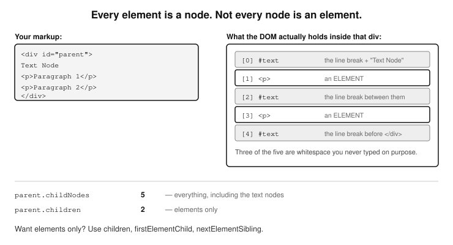
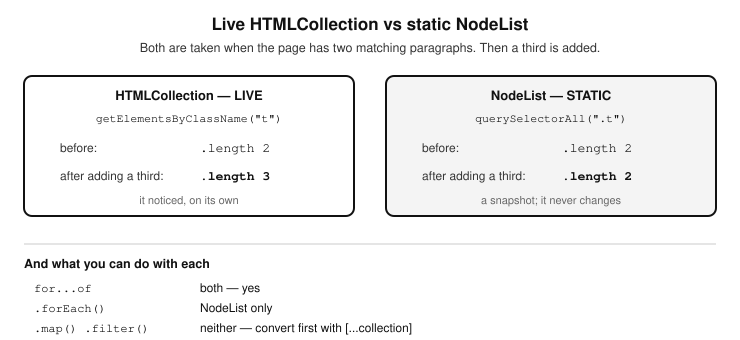

# Chapter 15 — DOM AND URL MANIPULATION

  - Introduction to the DOM
  - Understanding the DOM Tree (Parent-child relationships)
  - The difference between Nodes and
    Elements
  - Selecting DOM Elements (Getting
    elements to work with)
    - The getElementsByTagName() method
    - The getElementById() method
    - The getElementsByClassName() method
    - The querySelector() method
    - The querySelectorAll() method
    - Difference between HTMLCollection, NodeList, and
      HTMLElement
      - Document methods that return HTMLCollection
      - Document methods that return NodeList
      - Are HTMLCollections and NodeLists arrays?
      - Looping through HTMLCollections & NodeLists
      - for...of loop
      - the classic for loop
      - Using all array methods on HTMLCollections & NodeLists
      - The Array.from() method
      - The spread operator [...]
    - Selecting nested elements
    - Get the value or contents of an HTML element

  - Traversing the DOM
    - Parent node
    - Child nodes
    - Sibling nodes
    - Example of DOM traversing
    - Scrolling & Focus
  - Manipulating elements
    - Changing elements
    - Adding/removing elements
  - Creating New Elements
  - Working with Attributes & Classes
  - Handling styling
    - Common styling properties
  - Working with positioning
    - Common positioning properties
  - Working with events
  - XPath and selecting DOM Elements
    - Basic usage of document.evaluate()
    - Use document.evaluate() to read an XML document
    - The XPathResult types
    - Retrieving the data based on XPathResult type
    - When to use XPath instead of CSS selectors
  - The DOMParser
  - Examples of DOM manipulation
    - Examples of selecting DOM elements
      - Select an element by its ID value
      - Select an element by its class
      - Create a todo list
      - Adding attributes to an element
      - Assign multiple attributes to an element in one go
      - Concatenate a variable with a string and
      display the result
      - How to dynamically insert content into an
      element
      - Implementing drag and drop
      - Dynamically create a table with data from an array
  - The Window object
    - Relationship between window and document
    - Properties and methods
      - 1) Window Size & Position
      - 2) Alerts & User Interaction
      - Example alert()
      - Example confirm()
      - Example prompt()
      - 3) Reloading a window, and navigating to other
      windows
      - 4) Manipulating the URL with the URL API
      - Key components of a URL
      - Parsing a URL
  - Modifying URL components
      - Modifying query parameters
      - Understanding Blobs
  - Generating links to assets created in memory
      - 5) Navigating Through Browser
      History
      - Go back or forward in browser history
      - Go multiple steps in history
      - 6) Opening a New Child Window
      - Opening a New Window
      - Security issues with multiple tab navigation
		

## Introduction to the DOM

- The JavaScript programming language really shines in this domain.

The DOM is an abbreviation for Document Object Model. It refers to the concept that JavaScript sees everything on an HTML document as an object. These objects are known as elements and like any object in programming, they have properties. A property is basically a part of what makes an object, for example, a door is a property of a car, just like its engine, or a tyre. A person or user object will have the following properties: username, name, age, address, etc 
  So JavaScript regards a web page as an object (the document object), and all the elements on this document object are also objects themselves having their own properties. For example; a web document has a form element, an unordered list or ordered list, a div element etc. The div element (object) has properties like style, class, id etc. 
 
  We will go in depth into, and learn all about objects and how they work, in Chapter 17 (Object Oriented Programming). Here we will look at how to use JavaScript to dynamically manipulate the DOM, which means we will learn how to create HTML elements, display/hide them on a web page (document), modify them, delete them, traverse (move) through them etc. If this sounds like fun, it’s because it really is. 
  The properties of HTML elements are all, but not limited to their attributes. For example, the following is an image HTML tag and it has three properties: src (which points to the path of the image to be displayed), and then the width and height of the image.

	

As you can probably already imagine, since attributes are the properties of HTML elements, as we learn about manipulating DOM elements, we will therefore be working a lot with attributes.

 When you first get introduced to JavaScript, the thing that excites most programmers—which is usually the biggest selling point of JavaScript, is DOM manipulation. That was for me as well. We immediately want to get right into selecting DOM elements, traversing the DOM, etc but most of the time, it seems like the tools that JavaScript has to achieve these things are just so many and haphazard. Different learning sources talk of nodes, child nodes, parent nodes, sibling nodes, then there is the ubiquitous HTMLElement object, however, no one seems to be talking about how they are all related to each other or when to use which, and which are the most efficient in any given scenario. If that is you, then you are not alone. I struggled with that too. Personally, I always like to have the full list presented to me in a structured way. The fact is; the DOM can feel like a chaotic mix of tools, but there's actually a structure to it. If it seems complicated to most, it’s only because it’s not being presented in a structured way. Once that structure becomes clear, it will then become easy for you to master it all. Here’s a structured breakdown of the key DOM manipulation tools and how they relate to one another.


#### Understanding the DOM Tree (Parent-child relationships)
  The DOM is a hierarchical tree where every element is a node. Nodes can be elements, text, or comments.

Key node relationships:
  - Parent-child relationships: An element
    inside another is its child.
  - Sibling relationships: Elements with the
    same parent are siblings.
  - Ancestor-descendant relationships:
    Any element higher in the tree is an
    ancestor.


#### The difference between Nodes and Elements
A node is any item in the DOM (elements, text, comments).

An element (HTMLElement) is a specific type of node that represents an actual HTML tag. 

It is important to be able to tell when you're dealing with a Node and when you are dealing with an Element. When we say some properties or methods of the HTMLElement object (like children) ignore non-element nodes, we mean they only return actual elements and ignore text nodes and comment nodes. What actually are text nodes and comment nodes? Text in your HTML can exist inside elements (like inside a `<p>` tag) or directly in the DOM as a separate text node. The same applies to comments. It is the ones that are not within HTML elements (tags) that are not considered as element nodes. Here is a demonstration:

```
<div id="parent">
  Some text  <!-- This is a text node -->
  <p>Paragraph text</p>  <!-- The <p> is
  an element, but its text inside is a
  text node -->

        <!-- This is a comment node -->
    </div>
```

- "Some text" → A text node (not inside a `<p>`, so
  it's separate in the DOM).
- <!-- This is a comment node --> → A comment
  node (ignored by properties like children).
- `<p>` → A real element, but its inner text is still
  inside a text node.

Here is the kicker; a `<p>` tag is an element, so it will always be included in .children. However, the text inside a `<p>` is a text node, not an element, so children will count (select) the `<p>` tag, but not the text within it. The childNodes property, on the other hand, does accept text and comments, and so it will return the text within the `<p>` tag. Here is a demonstration:

	<p id="para">Hello World!</p>

	let p = document.getElementById("para");

	// Logs an empty HTMLCollection (no element 
	// children!)
	console.log(p.children); 

	// Logs NodeList(1): ["Hello World!"] 
	// (a text node)
	console.log(p.childNodes); 

Why does p.children return empty? Because the p tag has no element children, just a text node.



*Figure 15.1 — Every element is a node; not every node is an element*


  Here are some properties of nodes and elements that you MUST know:

  - nodeType – Used to differentiate
    between node types. This can be
    very handy in determining what type
    of element you are dealing with. For
    example, nodeType 1 (element node),
    nodeType 3 (text node), etc.

  - nodeName – Returns the tag name (DIV,
    SPAN, etc.).

  - innerText vs. textContent – Both get
    and set the text inside an element,
    but they are not the same thing, and
    the difference matters. See below.


  That last pair deserves a few more words, because the two look
interchangeable and are not. Say you have this on your page:

	<div id="myDiv">
		Visible <span style="display:none">hidden</span> text
	</div>

  textContent gives you every piece of text that is in there, whether the
visitor can see it or not:

	let div = document.getElementById("myDiv");

	// "Visible hidden text"
	console.log(div.textContent);

  innerText gives you only what is actually rendered on screen. The span is
styled display:none, so it is not shown, so innerText leaves it out:

	// "Visible text"
	console.log(div.innerText);

  So the short version is this: textContent is what is in the HTML, and
innerText is what the visitor can see. There are two more differences worth
knowing. innerText collapses runs of spaces and line breaks the way the
browser does when it draws the page, while textContent hands back the
whitespace exactly as it sits in your markup. And because innerText has to
know what is visible, the browser may have to work out the page layout
before it can answer, which makes it slower than textContent.
  For most jobs textContent is the one you want. It is faster, and it does
not surprise you by changing its answer when somebody edits the CSS. Reach
for innerText only when you genuinely mean "the text as the visitor sees
it".


#### Selecting DOM Elements (Getting elements to work with)
  I will start by introducing to you the methods of the document object. These methods target and return references to elements on the web document (page) so you can manipulate them. They belong to the document object, so you obviously have to call them on the document object. For example:

	document.methodName(idOrClassOfElementYouWant);

Selecting elements on a web page is probably the most frequent task you will have to be carrying out as a JavaScript programmer. If you have to do anything with elements on a web page—which is what JavaScript does, then you have to learn how to select these elements before you can do anything with them. This skill alone will reveal the power of JavaScript to you and give you the confidence to harness the power of this versatile scripting language. 
  There are five methods to learn here. Three of them are the older ones,
each built to answer one particular question, and two are newer and more
flexible. Here they are with the job each one does:

The three older methods
-document.getElementById("id")
  Gets ONE element, by its id attribute.

	-document.getElementsByClassName("class")
	   Gets ALL elements carrying that class.

-document.getElementsByTagName("tag")
  Gets ALL elements of that tag, such as every <p>.

	The two newer methods
	-document.querySelector("selector")
	   Gets the FIRST element matching a CSS selector.

	-document.querySelectorAll("selector")
	   Gets ALL elements matching a CSS selector.

  Read down that list and you will notice something about the naming that
is worth holding on to: where the method name says Element, singular, you
get back one element. Where it says Elements, plural, you get back a
collection. querySelector and querySelectorAll follow the same rule in
different words — All in the name means more than one.
  The two newer methods can do everything the three older ones can, because
a CSS selector can describe an id ("#myId"), a class (".myClass") or a tag
("p"). That does not make the older three obsolete, and you will meet all
five in real code, which is why we cover them all.

These methods will select and return a single or multiple HTMLElement object(s). Actually, to be specific, what it returns when you select a paragraph (p tag), is an HTMLParagraphElement, but this HTMLParagraphElement inherits from the HTMLElement object. The fact is, in the Document Object Model (DOM) every HTML element is represented by a specific JavaScript object type, usually named something like: HTML`<TagName>`Element, and they all inherit from the HTMLElement object. Before we proceed to learn how to 
select elements; here’s a list of the most commonly used HTML 
elements and their corresponding DOM interface names (JavaScript object types): This is not the exhaustive list, but rather a few, just so you get the idea.

| HTML tag | DOM Object Type |
|---|---|
| `<div>` | HTMLDivElement |
| `<p>` | HTMLParagraphElement |
| `<h1>`, `<h3>` etc | HTMLHeadingElement |
| `<a>` (link) | HTMLAnchorElement |
| `` | HTMLImageElement |
| `<input>` | HTMLInputElement |
| `<textarea>` | HTMLTextAreaElement |
| `<form>` | HTMLFormElement |
| `<table>` | HTMLTableElement |
| `<ul>`, `<ol>` | HTMLUListElement, HTMLOListElement |
| `<body>` | HTMLBodyElement |

All I need you to know right now is that all HTML elements have their specific object types, like the `<p>` tag has HTMLParagraphElement. But these object types all inherit from another JavaScript object, HTMLElement, so they get everything it has. (Careful with the word “child” here—in this chapter it means a child node on the page, which is a different idea altogether.) Therefore all the properties and methods of the HTMLElement object are available to them. That is why after selecting an element, we can reference properties on it like .innerHTML, .style, .classList, to manipulate it. Let’s now look at how to select elements on a web page.


### The getElementsByTagName() method
It is used like this: document.getElementsByTagName("tagName");
It returns a live collection of elements
selected by their HTML tag name. For example, you can decide
to select all the <p> tag elements on a web page.


### The getElementById() method
It is used like this: document.getElementById("id");
This method of the document object grabs an element by the
value of its id attribute. It selects that single element and returns
it as an HTMLElement object.
Pass it the value of the id attribute of the element you want to
select, as a string. For example:

		<p id='myText'>Some text</p>

		let myText = 
			document.getElementById("myText");


### The getElementsByClassName() method
It is used like this:
document.getElementsByClassName("className");
Just like the document.getElementById() grabs an element by its
ID, getElementsByClassName() method as its name suggests,
selects elements by the class name that you give to it. Note that
the Elements in the method name getElementsByClassName() is
spelled with an ’s’. This makes sense because a class attribute
is usually assigned to multiple elements anyway.

Call this method on the document object passing to it the
class you want to target on the web page. Note that this
obviously means you will end up with multiple elements, since unlike
the id attributes which have to be unique, the same class
attribute value can, and is usually assigned to multiple HTML
elements. These (multiple) items of the matching class are
returned as a live collection ([object HTMLCollection]). Live
collection means it automatically updates when the DOM
changes. For example:

		<p class='myText'>Some text 1</p>
       		<p class='myText'>Some text 2</p>
        	<p class='myText'>Some text 3</p>

		let myText = document
			.getElementsByClassName("myText");

This returns a collection of (multiple) elements that have
the specified class. This collection returned is an
HTMLCollection. You can then access the elements using
the bracket notation and the specific index of the
element you want in the same way you would do
with any array using the indexes like ([0], [1], etc.) or you may
even convert it to an array in order to be able to use array
methods on it. Example:

		let myText = document
			.getElementsByClassName("myText");

		// Logs the first element in the collection
		console.log(myText[0]);

		// Logs the text inside that first element
		console.log(myText[0].textContent);

The output of this will be:

Some text 1

The getElementByClassName() is not the only method of the
document object that you can use to select an element by its
class. There are also the document.querySelector() and the
document.querySelectorAll() which are relatively newer to
JavaScript and more elegant, especially because you can pass
to them the exact same selector syntax as you use in CSS to
select elements. We will talk about them next.


### The querySelector() method
It is used like this: document.querySelector("cssSelector");
  It returns the first matching element.
  Pass it the id, class, or tag name of
  the target element in a string. Tip: it accepts a CSS selector as a
  string, and this means that it takes the exact same selector used
  in CSS to target an HTML element. So, for ids, you have to prefix
  the id name in the string with a hash character for example:

"#id"

and for a class, you prefix it with a dot (.). For example:

".className"

Here is how you would use it to select an element by its id:

			<h1 id="myHeading">The heading</h1>

			let elemById = 	
				document.querySelector("#myHeading");

Here is how you would use it to select an element using its class:

			<p class='myText'>Some text 1</p>

			let item = 	
		       		document.querySelector(".myText");

  Note very carefully—and this is the
difference between the .querySelector() and
the .getElementsByClassName() methods of the
HTMLElement object, that unlike
getElementsByClassName() which
returns an HTMLCollection of multiple
elements that have that class,
querySelector() returns ONLY a Single HTMLElement.
This single element is the first matching
element in the entire document or null if no match is found.
For example:

			<p class='myText'>Some text 1</p>
        		<p class='myText'>Some text 2</p>
        		<p class='myText'>Some text 3</p>
			<ul id='myUl'>
            			<li>
                    			<p class='myText'>Text within a list</p>
            			</li>
        		</ul>


			let myText = 
  				document.querySelector(".myText");

			// This logs the first matching element 
			// with the ‘myText’ class, which is the 
			// first p tag with the content “Some text 1”
			console.log(myText); 

If you want to select all the elements matching that class, in the
same way that .getElementsByClassName() does, you have to
use the querySelectorAll(). Let’s talk about that next.


### The querySelectorAll() method
It is used like this: document.querySelectorAll(cssSelector);
  It returns a static NodeList of all matching elements. This means
  multiple elements are returned. What it returns is a NodeList
  unlike the getElementsByClassName() method that returns an
  HTMLCollection. Here is an example:

		let items = document.querySelectorAll(".myText");
		console.log(items);

This code logs a NodeList to the console.


#### Difference between HTMLCollection, NodeList, and HTMLElement
The first two of these return multiple elements, as opposed to
a single element. The HTMLCollection is sometimes referred to as a live
HTMLCollection. It’s said to be live because it is tracked by
JavaScript and is updated whenever any of the corresponding
elements on the web page changes.
A static NodeList unlike an HTMLCollection does not update
automatically. Also, unlike an HTMLCollection, a NodeList has
the advantage that you can directly call an array method
like .forEach() on it to loop through its data.
Let’s talk about the HTMLCollection and NodeList return types.
Let’s learn about which methods of the document object return
which, and look at how they (a HTMLCollection and a NodeList)
are different from an HTMLElement object (single element).
	

#### Document methods that return HTMLCollection
The following are the DOM methods that return an
HTMLCollection. There are only two methods.

      - getElementsByClassName()
      - getElementsByTagName()

        * document.getElementsByClassName("className"). It will work just the same if you call it within a specific element—basically using that element as the root or base within which to search for a match, as opposed to using the document object. For example; the first example code will return an HTMLCollection of all elements having a class value of "item". The second example will return an HTMLCollection of all elements with the class "divItems" that are found within the div that has the id of "myDiv", only: 

			let items = document.getElementsByClassName("item");

			let div = document.getElementById("myDiv");
			let spans = div.getElementsByClassName("divItems");

        * document.getElementsByTagName("tagName"). Returns all elements with the given tag name. It will work just the same if you call it within a specific element—basically using that element as the root to search from, as opposed to using the document object. For example; the first line of code below will return an HTMLCollection of all <p> tags in the current web document. The next example code will return an HTMLCollection of all span tags within the div having the id of "myDiv", only:

			let paragraphs = document.getElementsByTagName("p");		
			let div = document.getElementById("myDiv");
			let spans = div.getElementsByTagName("span");


#### Document methods that return NodeList
  A NodeList is simply a list of Node objects, which may include
  elements, text nodes, or comments—though usually it's just elements
  in most common use cases. So, a NodeList contains not just legal
  HTML elements (HTMLElement objects), but also childNodes that
  can be text that are within HTML tags (elements) but are not the
  elements themselves, as well as comments in your code like this:

		<!-- comment in HTML code here -->

  While a NodeList looks similar to HTMLCollection, it is not live and
  has slightly different behaviour. The one you will reach for most
  often by far—and you guessed it correctly—is the

    - querySelectorAll() method

  For example 1:

		let nodes = document.querySelectorAll(".item");

Will select and return a NodeList of all elements on the current web
page that have (match) the class of ".item".


  For example 2:

		let items = document.querySelectorAll(".myText");

		// Logs a NodeList of all p tags with the class ".myText"
		console.log(items);

		// Works directly!
		items.forEach(item => 
    			console.log(item.textContent));

This will output:
  Some text 1
  Some text 2
  Some text 3
  Text within a list


  We have seen now that three great methods are key in the world of HTMLCollection and NodeList:

  - getElementsByClassName() (HTMLCollection)
  - getElementsByTagName() (HTMLCollection)
  - querySelectorAll() (NodeList)

I had to show you which DOM methods return an HTMLCollection, and which returns a NodeList. Now that you know, let’s get down to the main question we are trying to answer; what is the relationship between an HTMLCollection, a NodeList, and an HTMLElement? In other words, how are they all related. Let me break it down.
  When you query the DOM using methods like getElementsByTagName, getElementsByClassName, or querySelectorAll, they all return a collection. Collection here is synonymous with multiple items being returned. However, the type of collection depends on the method you use.
  Each element in these collections is typically an HTMLElement object (or, to be specific; a subtype like HTMLDivElement, HTMLParagraphElement, etc).  Here is how they therefore all relate to each other:

  - HTMLCollection is a live collection of only HTMLElement objects.
  - NodeList is a list of Node objects, which may include HTML elements, but also other things like text nodes, or comments etc.



- Figure 15.2 — Live HTMLCollection vs static NodeList*


#### Are HTMLCollections and NodeLists arrays?
  The answer to this is no. This is a very important question, and my answer here should set you apart because it typically takes a lot of developers a while to figure it out. Both entities just so happen to have been endowed with some array-like properties/functions, but that does not make them Arrays. Here are the properties they share with arrays:

	
| Array property/method | HTMLCollection | NodeList |
|---|---|---|
| .length | Yes | Yes |
| index access | Yes | Yes |
| .forEach() | No | Yes |
| .map(), .filter() | No | No |


HTMLCollections and NodeLists are not real arrays. HTMLCollections only have a .length property and index access but have no array methods at all. NodeLists have a .length property too, have index access, and the .forEach() method—but no other array methods like .map() or .filter().
If you want to be able to perform array-like operations on them, like loops, and much more, there are ways to do so. Let’s talk about that next.  


#### Looping through HTMLCollections & NodeLists
  Because when we talk of HTMLCollections and NodeLists, we are speaking of multiple items—with 'multiple' being the operative word, it follows that we need a way to be able to traverse through these items in order to make any use of them. Without being true arrays, they have their own ways to be looped over.
  Both HTMLCollection and NodeList work with the for...of loop that applies to Arrays, and both work with the traditional for loop used in Arrays as well. So for looping alone, the two behave the same. What separates them is .forEach(), which a NodeList has and an HTMLCollection does not—which is exactly what the table above tells you. Let’s see how to use these two array-like loops.
  The for...of loop works directly on either of them, and is therefore the easiest choice. Here is an example:

#### HTML code
        <p class='myText'>Some text 1</p>
        <p class='myText'>Some text 2</p>
        <p class='myText'>Some text 3</p>
        <ul id='myUl'>
            <li>
                    <p class='myText'>Text within a list</p>
            </li>
        </ul>


#### JavaScript code
	const items = document.getElementsByTagName("p");

	for (let item of items) {
  		console.log(item.textContent);
	}

The output is:

  Some text 1
  Some text 2
  Some text 3
  Text within a list

Notice that even the `<p>` tag nested within the `<li>` tag of a `<ul>` element was fetched.

  You can use the classic for loop familiar from arrays to loop through both HTMLCollections and NodeLists. It works because the for loop works with anything that has the .length property, and HTMLCollections and NodeLists have it. Here is an example using the same HTML markup as above:

#### JavaScript code
	const items = document.getElementsByClassName("myText");

	for (let i = 0; i < items.length; i++) {
  		console.log(items[i].textContent);
	}

The output is same as above:

  Some text 1
  Some text 2
  Some text 3
  Text within a list


It is great to be able to loop through your collection of data. Now you have the power to really make use of the data you select from the DOM. What if we could go one step further, and have the full power that we have with arrays on HTMLCollections and NodeLists? There is a way.
    

#### Using all array methods on HTMLCollections & NodeLists
  You can have the full power that we have on arrays on HTMLCollections and NodeLists. The way to achieve that is easier than you think. It is: …drumroll… you guessed it right, to convert the collection into an array. Yes, it’s as easy as that. There are two ways to convert an HTMLCollection or NodeList into a true array, and it works the same for both of them. These two ways are:

  - Use the Array.from() method
  - Use the spread operator ...

Let’s see how that works.

#### The Array.from() method
  This uses the .from() method of the JavaScript Array object. The following example will grab and return an HTMLCollection of all `<p>` tags on the current web page, then use the Array.from() to convert it into a true array.
You can then call or apply any array method or property of your choice to manipulate the array. 

	const items = Array.from(document.getElementsByTagName("p"));

	//this logs an array of all the p tags
	console.log(items);

	items.forEach(item => {
    		// this logs the contents of all the <p> tags
  		console.log(item.textContent);
	});


In this example, we use the array .forEach() to loop through the data after converting the HTMLCollection to an array. But it is up to you. Having the data as an array allows you to harness the full power of the built-in JavaScript Array object on your data.


		The spread operator ...

  Let’s look at the other way of converting a collection into an array using the spread operator. To get a good understanding of what the Spread operator is, refer back to Chapter 3 (Arrays), in the section where I talked about Rest parameters and the Spread operator. This time let’s convert a NodeList just for balance, but remember that both the Array.from() approach and the spread operator will work regardless of if we are dealing with an HTMLCollection or a NodeList.

	const nodeList = [...document.querySelectorAll("p")];

	// this line logs an array 
	console.log(nodeList);

	nodeList.forEach(item => {
  		console.log(item.textContent);
	});

Here we use the querySelectorAll() method of the document object to select all `<p>` tags on the current web page. We already know the querySelectorAll() method returns a NodeList—which is why I am using it. When we call this method, we use the Spread operator to capture what it returns into an array like so:

  [ ...methodCall ]

The square brackets are what create the array, as we already know. That is it. Now that we have an array, the rest of the code is us using the forEach() method of all arrays to loop through the data.

The output of the console.log(item.textContent); line logs this to the console:
  Some text 1
  Some text 2
  Some text 3
  Text within a list


### Selecting nested elements
To select the p tag containing the text:
  “Text within a list” which is within a ul list, you need to
  query the DOM beginning from within the parent of the
  <p> element, which in this case is a li element,
  instead of using document as the
  parent—which will search the whole
  document.
  So, to do so, start by selecting the list element which is the
  parent, and use that as the base of your selection instead of
  document. For example, let us retrieve the text within the
  <p> tag that is nested within the unordered list (<ul>) tag.

			let myUl = document.querySelector("#myUl");
			let textInList = myUl.querySelector(".myText");
			console.log(textInList.textContent);

This will output the text within that <p> tag

Text within a list


### Get the value or contents of an HTML element
When we select HTML elements, it could be for a variety of reasons, to change their styling, for example their colour, background position, position on the page, move them—as in the case of drag-and-drop, etc. But very often, we want to retrieve their value or content. Generally, if we are dealing with a form element, like a form input, or textarea field, we would mostly refer to its content as value, but if we are dealing with something like a <p> tag, or a div, we would refer to its content as, just content. Let me show you some examples on how to retrieve values/contents of elements. Imagine we have the following markup in our HTML page:

		<h1 id='myHeading'>Heading text</h1>

        	<p class='myText'>Some text 1</p>
        	<p class='myText'>Some text 2</p>
        	<p class='myText'>Some text 3</p>
        	
		<ul id='myUl'>
            		<li>
                    		<p class='myText'>Text within a list</p>
            		</li>
        	</ul>

	Let’s extract the content of the <h1> tag
		let myHeading = document.querySelector("#myHeading");
		console.log(myHeading.textContent);

The output will be:
  Heading text


	Let’s extract the content of the second <p> tag on the page
		let myText = document.querySelectorAll(".myText");
		console.log(myText[1].textContent);

The output will be:
  Some text 2

Let’s get the content of the <p> tag that is inside the <li> tag that is
  inside the <ul> tag. As you can see, there are many nested
  (sub) elements, but I wanted to show you different ways to
  handle that from the way I showed you above under selecting
  nested elements. Here you will see the power of the new
  querySelector() and how you can pass it a series of elements to
  search through in hierarchy, just like in CSS.

		let myUl = document.querySelector("#myUl li p");
		console.log(myUl.textContent);

The output as always is:
  Text within a list

  Let’s try that same example again, but this time using the querySelectorAll() which returns a NodeList that you can directly run array methods on or extract values by index from it, just like you would do with a real array. Notice that the selector is exactly the same as before—all that changes is the method, and that we now have to reach for the first match with [0]:

		let myUl = document.querySelectorAll("#myUl li p");
		console.log(myUl[0].textContent);

The output again, is:
  Text within a list


  Let me wrap this DOM selection section with another example on how to extract the value from a form input field this time. Let’s say you have the following input field on your HTML page:

	<input type="text" id="nameInput" value="Gustav" />

I have given the field an id of "nameInput" and a value of "Gustav”.
Normally, form elements should be within a form element (`<form>` tag) so it would also have other properties like a button which all browsers know how to respond to by submitting the form when it is clicked. Another thing a real form element has is an optional HTTP method in the opening form tag which is meant for the headers of the request being sent to a server by the browser. The header values will help the browser determine how the data from that form is to be transmitted over to a server. So I have not placed this input field inside a form tag because we are just testing here.
  The value which I gave is also for testing. In a real scenario, that value will only be there once the user has typed something into that input element, and submitted. The general practice is to place what we call an event listener on the form’s submit button, and define that the event we want to listen for is a click event. Our code due to the event listener placed on that button will then be listening for that event to occur (fire). Once the event fires (occurs), we will then grab the value entered into that field because it is always sent through the event object by the browser. We will learn all about event handling and form handling in later chapters. For now, just understand that our "nameInput" field above is just for testing, so there is no form element, and no submit button with an event-listener on it, waiting for the user to submit it after completing the form. This is why I manually give the field a value so we can test extracting it after selecting the field. 
  The following is the code to select the input field and get its value. It works by first of all selecting the target field using the .querySelector() method that you are already familiar with, then we get the value from the .value property of the DOM object. Here it is:

	let nameInput = document.querySelector("#nameInput");
	console.log(nameInput.value);

The output is: Gustav

  In this section, we have learned about how to select the content of an h1, a p tag, a ul/li and one form input element. I will save extracting values from form fields for Chapter 19 where I go in depth into form manipulation. 
This is because there are better ways to extract values from form fields than the approach in this example. You will learn all about that in Chapter 19. You will come out of that chapter as a pro form handler. 


## Traversing the DOM
  These are properties and methods provided for traversing DOM elements. You would call or refer to them on the HTML element object, for example after selecting it. For example, the following code will display the value of the id property (attribute) of the parent element of the text box stored in textElement:

	let textElement =   
	     document.getElementById("idOfTextField"); 
	console.log(textElement.parentNode.id);

Notice how to use these properties or methods, you have to reference it on the HTML element itself using the dot operator (.) like so HTMLElement.propertyName.

### Parent node
  - parentNode
    It gets the parent of an element.
    This parent node (can be an element,
    document, or even null).

  - parentElement
    This is the same as .parentNode, but
    guarantees an HTMLElement or null. The downside
    of using parentElement is that it depends on the
    exact structure. If you ever add another wrapper/
    parent element, it will break (fail to be accurate).

  - closest()
    closest() only looks for element nodes
    (HTMLElement), so it ignores text nodes and
    comment nodes automatically. It starts with the
    element you called it on—if that one matches, it is
    what you get back—and then keeps moving up the
    DOM until it finds a match or reaches <html>. You
    have to pass it a CSS selector as a string, written
    exactly as you would write it in a stylesheet: "#id"
    for an id, ".className" for a class, or just the tag
    name. For example,

.closest(".editFormDiv") will search up the DOM
to find the nearest ancestor with the class name
of class .editFormDiv. It is more precise than
parentElement simply because you can be
specific by passing it the exact id, class name or
tag name to fetch from the base element (the
element you call it on).


### Child nodes
  - children
    It gets all child HTML elements. It
    fetches only actual HTML elements,
    and excludes text and comment
    nodes. It will then contain a collection of
    HTMLElement objects represented like so
    if you do console.log() of it to view its
    contents: [object
    HTMLCollection]. This is like an array of
    child elements (but not exactly an array).
    To then get (select) a specific child inside
    that collection, you can reference it on the
    result using the bracket notation and the
    index—just as you would do with arrays,
    like so:

		let parentElement = 
		document.getElementById("elemId");
		let children = parentElement.children;
 
		// Get the first child element
		console.log(children[0]);

  - childNodes
    Returns all child nodes (elements,
    text, comments).

  - firstChild
    Returns the first child node
    (can be text, comment, or element).

  - lastChild
    Returns the last child node
    (can be text, comment, or element).

  - firstElementChild / lastElementChild
    Gets the first/last child element. It
    only gets actual HTML elements and
    ignores text and comment nodes.

### Sibling nodes
  - nextSibling
    Returns the next node (could be text,
    comment, or element).

  - previousSibling
    Returns the previous node (could be
    text, comment, or element).

  - nextElementSibling /
  previousElementSibling
    It gets the next/previous sibling. It
    only gets actual HTML elements.

Note: childNodes, firstChild, lastChild, nextSibling, and previousSibling include text nodes and comment nodes, which often leads to unexpected results. Prefer children, firstElementChild, lastElementChild, nextElementSibling and
previousElementSibling, unless you need non-element nodes.

So, if you want only elements, use:
  - parentElement
  - closest()
  - children
  - firstElementChild
  - lastElementChild
  - nextElementSibling
  - previousElementSibling


And if you need all nodes (elements, text, comments), use:
  - childNodes
  - firstChild
  - lastChild
  - nextSibling
  - previousSibling


### Example of DOM traversing
Here is a simple example to demonstrate DOM traversal using the above HTMLElement properties:

	<div id="parent">
    		Text Node
    		<p>Paragraph 1</p>
    		<p>Paragraph 2</p>
	</div>

	let parent = 
		document.getElementById("parent");

	console.log(parent.childNodes); 

This outputs a NodeList of FIVE nodes, not three:
	[
		#text,                    (the line break and "Text Node")

```
    <p>Paragraph 1</p>, 
    #text,                    (the line break between them)
    <p>Paragraph 2</p>,
    #text                     (the line break before </div>)
]
```

That is worth staring at for a moment, because it is exactly the trap
this section is warning you about. Every line break and run of spaces
between your tags becomes a text node of its own. Three of the five
things here are whitespace you never typed on purpose.

	console.log(parent.children); 

This outputs: 
```
[
    <p>Paragraph 1</p>, 
    <p>Paragraph 2</p>
]
```


	console.log(parent.firstChild); 

This outputs: 
  #text
  (because of the space and line breaks)

	console.log(parent.firstElementChild); 

This outputs: `<p>`Paragraph 1`</p>`


### Scrolling & Focus

  - scrollIntoView(alignWithTop)
    It scrolls to the element.

  - focus()
    Moves focus to the element.

  - blur()
    Removes focus from the element.


## Manipulating elements
  We are now getting into the fun part. These are methods and properties to manipulate DOM elements. These are HTMLElement object properties and methods, so remember that you will reference or call them on those elements using the dot operator (.) after selecting them from the DOM like so: textElement.property

		
### Changing elements

```
 In JavaScript, there are special properties you can use to change the content (what people see) inside elements on a web page. These properties belong to what’s called an HTMLElement, which is just a fancy name for any element you see on a web page—like a `<div>`, `<p>`, `<h1>`, and so on.
The way this is done in JavaScript is to select the HTML element, and then reference the document object property on it as you have seen before. You can also select the element first, store it in a variable for example a variable called elem, then you would reference the property you want to change on that variable-which now represents the HTML element, using this syntax: elem.propertyName = "new value";
```

Let’s explore the four main properties you’ll use most often.
  - textContent
  - innerHTML
  - outerHTML
  - innerText


  - textContent
    It changes or gets the plain text inside an element. It does not
    treat any content as HTML, so if you write HTML tags, they will
    show up as text. Use it like this:

			let elem = document.getElementById("myHeading");
			elem.textContent = "<h1>Hello world</h1>";

This will select an element on the web page with the id of
"myHeading", then set or place the text "<h1>Hello world</h1>"
in that element, which can be for example a div. I should point
out here that you should not be confused by the <h1> tags in the
value. The text of the targeted element will not now contain
an h1 element, but rather just the literal text
"<h1>Hello world</h1>". Again, this is because textContent treats
everything as plain text.
Use textContent when you only want to work with text and don't
need to insert any HTML. It's also safer (see XSS section below).

  - innerHTML
    It places or gets the HTML content inside an element that
    contains HTML code. If you write tags, unlike content assigned
    to textContent which the browser only reads as text, the browser
    will treat them as real HTML. Use it like this:

			let elem = document.getElementById("pTag");
			elem.innerHTML = "Hello <b>World</b>";

This will select an element on the web page with an id of "pTag"
and set the following text in it that contains HTML code:
	
			"Hello <b>World</b>"

That element will now display in the browser:
  Hello World
with the word “World” in bold.
Use innerHTML when you want to add content that includes
HTML, like links, bold text, or line breaks.

  - outerHTML
    It gets or sets the entire element itself, including its tags and
    everything inside it. Basically, it overrides the element you use it on, as opposed to only touching its content. The result is a
    complete replacement of the old element with the value you pass
    in. As for the syntax, it’s the same as the examples above.
    Similarly to innerHTML, it handles HTML and not just text—as you
    could probably guess from the HTML in its name.
		
Use outerHTML if you want to replace the entire element, not just
its content.

  - innerText
    It is similar to textContent, but it respects what is visible on the
    screen. If something is hidden using CSS (like display: none),
    innerText won't return it, but textContent will. The syntax, is
    exactly the same as with textContent.

Use innerText if you care about what the user actually sees, not
just what's in the HTML.

Both the textContent and innerHTML properties insert content into an element on a web page, but it is preferable to use textContent over innerHTML because innerHTML opens a security risk known as XSS (Cross-Site Scripting). This is when someone inserts malicious HTML or JavaScript into your page. For example:

	elem.innerHTML = "";

This could cause popups, data leaks, or worse. If you're inserting user input (like from a form or a database), always use textContent to avoid these dangers. It will treat everything as plain text—so there will be no surprises.
  Let me talk about why `` is dangerous. This kind of code is a classic example of XSS (Cross-Site Scripting), and here's how it works:

-The src='x' is invalid—it points to an image that doesn't exist.
-Because the image fails to load, the browser triggers the onerror
  event.
-The onerror="alert('Hacked!')" attribute tells the browser:
  “When this error happens, run this JavaScript code.”
  The result: a pop-up appears with the message "Hacked!".

That’s just an example. Now imagine you have a form on your website where visitors from the public can type in their comments, and your website collects and displays them on a web page. This is typical for a blog or social media web page. Imagine a hacker inputs the following into the website comment form:

	

If the code of your website blindly uses .innerHTML to display those user comments on your webpage like this:

	commentBox.innerHTML = userComment;

the code that hacker entered will be executed since .innerHTML knows how to read HTML. This is bad. That script will run in your browser, and possibly steal session cookies, login tokens, private data etc. That will be a security nightmare, especially for websites with accounts, admin panels, or user-sensitive data. Here is how to prevent it and be safe:

  - Always use .textContent when inserting user data.
  - Sanitise inputs submitted by users before you use them in your application (especially if you must use .innerHTML). Sanitising means validating or checking the content to ensure it meets a certain standard, or contains no suspicious or unwanted characters.
  - Use security libraries or frameworks that auto-sanitise content (like React, which escapes HTML by default).


### Adding/removing elements
  - remove()
    Call it on an HTMLElement, and you do not have to
    pass it any argument. It removes the element it is
    called on.

  - appendChild(newElement) – Adds a child
    to an element. The new element will
    then become the last child (at the
    end) of that element.

  - insertBefore(newElement,
    referenceElement) – Inserts the
    newElement as a child in the element
    in front of the referenceElement
    which is another sibling in that
    same element.

  - removeChild(childElement) – Removes a
    child element childElement from the
    element.

  - replaceChild(newElement, oldElement) –
    Replaces an element oldElement with
    a newElement in an element.

  - insertAdjacentHTML(position, html)
    Inserts HTML at a position
    ("beforebegin", "afterbegin",
    "beforeend", "afterend").

  - cloneNode(deep)
    Clones an element (true for deep
    clone).


## Creating New Elements
  JavaScript provides you an awesome method on the document object that you can use to dynamically create any HTML element of your choice. This method is createElement(). Pass as an argument to it a string of the HTML tag name you wish to create. You can then add attributes to the newly created element and place it anywhere on the HTML document. Note that you have to call this method on the document object (using the dot operator as usual), since the method belongs to the document object.
  In this simple example, we will see how you can create a new div element, add some text content into it, and insert it into the body of an HTML web page.

	let newDiv = 	
		document.createElement("div");

	newDiv.textContent = "New DIV Element is here";
	document.body.appendChild(newDiv);

Let’s modify this example slightly by adding a border to the created div, and adding some border color, and background color, to blue. Let us also make the text within the div be in a `<p>` tag, and make it bold and white. 
  This should demonstrate to you how you can add attributes and even styling to the elements you create dynamically. Here is the code for that:

	let newDiv = document.createElement("div");

	// Add HTML content
	newDiv.innerHTML = "<p>New DIV Element is here</p>";

	// Add styling directly via the style property
	newDiv.style.border = "2px solid blue";
	newDiv.style.borderRadius = "5px";
	newDiv.style.backgroundColor = "dodgerblue";
	newDiv.style.color = "white";
	newDiv.style.fontWeight = "bold";
	newDiv.style.padding = "10px";
	newDiv.style.marginTop = "10px";

	// Append to the body
	document.body.appendChild(newDiv);

Notice that we changed how we assign the text value to the div (in newDiv). We first of all wrap the text in a pair of `<p>` tags. Then instead of using the .textContent we used earlier-which would display only text, we use .innerHTML so that the string which now contains HTML (in the `<p>` tag) will be parsed as HTML and displayed on the web document as such.
  To add styling, you have to reference the style properties on the style property of the HTML element, which in this case is newDiv. I should point out that when using JavaScript like this to add styling to elements, the style properties are not written in the same way as in CSS. In JavaScript most of the names are the same, however, camel-casing is used. Here is a small example of CSS properties and the equivalent names of the JavaScript HTML element’s style properties—just to give you a hint:

| CSS property | JavaScript style property |
|---|---|
| background-color | backgroundColor |
| border-radius | borderRadius |
| font-weight | fontWeight |
| margin-top | marginTop |

We finally make use of the .appendChild() on the body of the web document, which is a method of the HTMLElement object (for all elements) to add (append) the new div as the last element inside the body. 

	document.body.appendChild(newDiv);

Let us look at one more example of dynamically creating HTML using JavaScript. Let us create a table this time, and append it as the last element inside the same div we created above. It should be a very simple table of maybe two columns and two rows, it should have white borders for visibility on the blue background of the div. Let's make the table contain users, and let's give the table headings the values of first name and surname. Here is the code:

	// 1. Create the parent div
	let newDiv = document.createElement("div");

	// Add HTML content
	newDiv.innerHTML = "<p>New DIV Element is here</p>";

	// Add styling directly via the style property
	newDiv.style.border = "2px solid blue";
	newDiv.style.borderRadius = "5px";
	newDiv.style.backgroundColor = "dodgerblue";
	newDiv.style.color = "white";
	newDiv.style.fontWeight = "bold";
	newDiv.style.padding = "10px";
	newDiv.style.marginTop = "10px";

	// Append to the body
	document.body.appendChild(newDiv);

	// 2. Create the table
	let table = document.createElement("table");
	table.style.border = "1px solid white";
	table.style.borderCollapse = "collapse";
	table.style.marginTop = "10px";

	// 3. Create the table header row
	let headerRow = document.createElement("tr");

	let th1 = document.createElement("th");
	th1.textContent = "First Name";
	th1.style.border = "1px solid white";
	th1.style.padding = "5px";

	let th2 = document.createElement("th");
	th2.textContent = "Surname";
	th2.style.border = "1px solid white";
	th2.style.padding = "5px";

	headerRow.appendChild(th1);
	headerRow.appendChild(th2);
	table.appendChild(headerRow);

	// 4. Add a couple of data rows
	let row1 = document.createElement("tr");
	let row1Col1 = document.createElement("td");
	row1Col1.textContent = "Alice";
	row1Col1.style.border = "1px solid white";
	row1Col1.style.padding = "5px";

	let row1Col2 = document.createElement("td");
	row1Col2.textContent = "Johnson";
	row1Col2.style.border = "1px solid white";
	row1Col2.style.padding = "5px";

	row1.appendChild(row1Col1);
	row1.appendChild(row1Col2);
	table.appendChild(row1);

	let row2 = document.createElement("tr");
	let row2Col1 = document.createElement("td");
	row2Col1.textContent = "Bob";
	row2Col1.style.border = "1px solid white";
	row2Col1.style.padding = "5px";

	let row2Col2 = document.createElement("td");
	row2Col2.textContent = "Smith";
	row2Col2.style.border = "1px solid white";
	row2Col2.style.padding = "5px";

	row2.appendChild(row2Col1);
	row2.appendChild(row2Col2);
	table.appendChild(row2);

	// 5. Append the table to the existing newDiv
	newDiv.appendChild(table);

This code may seem long, but it is really easy to understand once you take a close look at it. It’s only long because some steps are repetitive, for example:
  - We start by creating the exact same div we created previously so we
  can also inject the new table we are creating into it.
  - Then we create the "tr" element for the table’s headings
  - Then we create a pair of "th" elements for both the First Name and
  the Surname headings.
  - Then we create a pair of "tr" elements to contain the table’s data
  rows (records). Each "tr" is followed by a creation of the "table data (td)" cell, and then the use of .textContent to add the content for
  that table cell.

Let us count the times we use document.createElement() in the example:
	
    1. document.createElement("div")
    2. document.createElement("table")
    // row for table headings
    3. document.createElement("tr")
    4. document.createElement("th") // First Name heading
    5. document.createElement("th") // Surname heading
    6. document.createElement("tr") // row 1 
    7. document.createElement("td") // row 1 First name
    8. document.createElement("td") // row 1 Surname
    9. document.createElement("tr") // row 2 
    10. document.createElement("td") // row 2 First name
    11. document.createElement("td") // row 2 Surname

As you can see, creation of elements should be done chronologically, in the order in which they come in the DOM, and appended to the parent element. 
  You do not have to create a closing tag for the element. Once you create an element with the .createElement() method, it knows to close the element’s tag when it is done creating and adding any attributes and data to it.
  Hopefully, this exercise has taught you how to create a table element and structure it row-by-row and cell-by-cell, how to apply styles to each part of the table dynamically, and how to nest elements by inserting a table inside a div. This example visually reinforces how DOM manipulation allows you to build complex HTML structures with JavaScript. Further on in this chapter, under the section "Examples of DOM manipulation"
we will expand on this table creation exercise. We will use an array of data, create a table in a similar fashion, then loop through the array, injecting the data as cell values in the new table. At the end, we place the table inside the div on the web page.


## Working with Attributes & Classes
  As you can imagine, because attributes are properties of HTML elements, the properties and methods provided by JavaScript for working with them are part of the HTMLElement object. You should therefore reference or call them on an HTML element after selecting it.  

#### Attribute properties
  - id
    It gets/sets the id attribute

  - className
    It gets/sets the class as a string

  - classList
    Provides methods to manipulate
    classes

  - title
    Gets/sets the tooltip text

  - hidden
    Hides/shows the element

  - style
    Used to access inline CSS styles.


#### Attribute methods

  - setAttribute("attributeName", "value")
    This sets an attribute with the name
    attributeName, and assigns it the
    value “value”. It updates the element’s
    attributeName attribute with the value “value”
    if it already exists, or creates a new one.
    Both arguments are required. For HTML5 attributes
    that do not need a value (such as ‘disabled’ or
    ‘required’) you still have to pass a second
    argument—give it an empty string, "". Leaving it
    out altogether throws a TypeError. For example:

		document.getElementsByTagName("div")
       		[0].setAttribute("class", "active");

This will grab all div elements on a page, and
set the class value of the first div ([0]) to “active”.
		
While we are on creating attributes for an element, another
way is to use Object.assign(). Here is how
to do it:

			let li = document.querySelector("#li");
			
			Object.assign(li, {
            			'active': 'true',
            			className: 'list-item draggable'
        		});

This code selects a list element that has an id of “li”,
and then assigns it a few attributes. It assigns an
attribute named ‘active’ and gives it a value of ‘true’,
and two classes; ‘list-item’ and ‘draggable’.


  - getAttribute("attributeName")
    This retrieves (gets) the value of the attribute that goes
    by the name of attributeName. Here’s an example:

			document.getElementsByTagName("h1")
       				[0].getAttribute("class");

This will grab all h1 elements on a page, and
retrieve the value of the class attribute of the first
one ([0]).

  - hasAttribute("attr")
    It checks if an attribute exists. Here it
    checks if the attribute by the name of
    ‘attr’ exists on the element.

  - removeAttribute("attr") – Removes an
    attribute. Here it removes the
    attribute ‘attr’ from the element.

  - classList.add("className")
    Adds a class. This adds a new class
    by the name of className to
    the element.

  - classList.remove("className")
    This removes a class. It removes the
    class by the name of className
    from the element.

  - classList.contains("class")
    Used to check if a class exists.

  - classList.toggle("class")
    Toggles a class. This toggles
    between opposite states going by the
    class name.


## Handling styling
  JavaScript provides direct access to the styles of HTML elements, which allows you to dynamically update the look and feel of a page. While most of the visual appearance is handled through CSS, JavaScript can manipulate these styles in real time — like changing colours when a user clicks a button, hiding/showing sections, or adjusting sizes for animation effects.

Common styling properties:


  - style
    Accesses and sets inline CSS styles directly on an element. For
    example:

			element.style.color = "red";
			element.style.backgroundColor = "yellow";

  - offsetWidth / .offsetHeight
    Returns the visible width/height of an element including padding
    and borders, but excluding margins. It is useful for layout
    calculations.
		
  - clientWidth / .clientHeight
    Returns the width/height of the element including padding but excluding borders, scrollbars, and margins.

  - scrollWidth / .scrollHeight
    Returns the full width/height of the element’s content, including
    the parts that are hidden and require scrolling. They are good for
    detecting overflow content.

  - getComputedStyle(element)
    Note that this one belongs to window, not to the element—you
    pass the element to it rather than calling it on the element. It
    allows you to get the final computed CSS styles for an element
    (including those from external stylesheets). For example:

			const styles = getComputedStyle(element);
			console.log(styles.marginTop);

  - .classList
    Lets you add, remove, toggle, or check CSS classes dynamically.
    Here are some examples:

			element.classList.add("active");
			element.classList.remove("hidden");
			element.classList.toggle("open");


## Working with positioning
  Positioning is essential when you need to move elements around, detect their location on the page, or create drag-and-drop interfaces. JavaScript offers several properties that help you calculate positions and adjust layouts dynamically.

Common positioning properties:


  - offsetParent
    Returns the nearest ancestor element that has a positioning
    context (i.e., has a position value other than static). This is very
    useful in determining relative position.

  - offsetTop / offsetLeft
    This works out the distance from the offsetParent. Basically, it
    gives you the distance in pixels from the top/left of the element
    to the top/left of its offsetParent.

  - scrollTop / scrollLeft
    Returns the number of pixels that the content of an element has
    been scrolled vertically/horizontally. It can also be used to set
    a scroll position. For example:

			element.scrollTop = 100;

  - .getBoundingClientRect()
    Returns an object containing the position and size of the element
    relative to the viewport. This is great for detecting collisions or
    element visibility. For example:

			const rect = element.getBoundingClientRect();
			console.log(rect.top, rect.left);

  - window.pageXOffset / window.pageYOffset
    These two belong to window rather than to an element. They
    return how far the document is scrolled horizontally or
    vertically from the top-left corner. These are useful for
    calculating absolute positions on the page.

	
## Working with events
  When users interact with a web page — by clicking a button, moving their mouse, typing into a form, or scrolling down — JavaScript needs a way to notice these actions and respond. This is where events come in.
Events are signals that tell JavaScript, "Hey, something just happened on the page!”. Since the DOM is the structure of everything the user sees and interacts with, events are a natural part of DOM management. By listening for events and reacting to them, your JavaScript code can make web pages interactive and dynamic.
  For now, it's enough to know that JavaScript provides simple tools to:

  - Listen for specific types of events (like clicks or keypresses),
  - Run code when an event happens,
  - And manipulate the DOM in response.

We will explore events in much greater detail. Here, we just want to get comfortable with the idea that handling events is a key part of working with the DOM.

The following is a small example of how you can use JavaScript to listen for a user’s click on a button and respond with an action.

	<button id="myButton">Click me!</button>

	<script>
  	document.getElementById("myButton").addEventListener("click", 
		function() {
    			alert("Button was clicked!");
  		});
	</script>

In this example, we tell JavaScript:
"When the user clicks on the button, run this function that shows a message."
This shows the basic idea of event handling — listening for an action, and responding to it by changing something on the page (or doing anything else you want).
We'll dive much deeper into how events work, the different types of events, and powerful ways to control them in the dedicated Events chapter, Chapter 24.


## XPath and selecting DOM Elements

  XPath stands for XML Path Language. It’s a powerful query language designed to navigate and select nodes in an XML or HTML document. While JavaScript developers often use CSS selectors to get elements (like getElementById(), querySelector() or querySelectorAll()), XPath gives you more precision and flexibility, especially when you need to traverse deeply nested or irregular structures.
  If you want one sentence to hold on to, it is this: consider XPath to be to
XML data what SQL (Structured Query Language) is to relational databases. It
lets you find specific elements, attributes, or text inside a structured
document using path-like expressions. It supports filtering, in the same way
a WHERE clause does in SQL, and it comes with string, number and boolean
functions such as contains() and count() that are not far off the JavaScript
methods you already know.
  It has been around since 1999, and people who assume it is obsolete are
mistaken. It is true that plenty of developers go a whole career without
touching it. But it is still supported in every modern browser, and it is
still what you reach for in some very specific corners, which we will come to.


#### Syntax examples of XPath (//tag, /html/body, etc.)
  XPath expressions use a path-like syntax to describe elements in a document. Here are a few examples:

    // p Selects all <p> elements in the document, no matter
    *
                     where they are.

    * /html/body/div Selects a specific <div> that is a direct child of the
                     <body> and <html> elements.

    // div[@class='box'] Selects all
    // <div> elements with the class box.
    *

    // ul/li[2] Selects the second
    // <li> element inside every <ul>.
    *

    // *[@id='main'] You probably guessed
    // this one; yes, it selects every
    *
                     element on this web document that has the id of "main"
                     (id="main").

  Here is a fuller list to give you an idea of the range. Play and experiment
with these, and check the online documentation for more complex queries and
explanations:

| Select all `<book>` nodes | //book |
|---|---|
| Attribute access (select id attributes) | //@id |
| All `<book>` tags whose id attribute is "b1" | //book[@id="b1"] |
| Filter books by price greater than 10 | //book[price > 10] |
| Wildcards (select all nodes) | //* |
| Axes (advanced) - navigate relationships | //book/child::title |
| Find all `<h1>` tags | //h1 |
| Find links whose href value is "#foo" | //a[@href="#foo"] |
| All `<span>` tags containing the text "Hello" | //span[text()="Hello"]/.. |
| A `<p>` tag containing the text "warning" | //p[contains(text(), "warning")] |
| All `<title>` tags that are children of `<book>` | //book/title |
| Books by Orwell costing less than 10 | //book[author="Orwell" and price < 10] |

These examples show that XPath is more expressive than CSS in certain cases—like selecting based on text content or element position. Mastering this skill will set you apart as a JavaScript developer, and you will be able to work in any niche environment where expertise in handling complex XML documents is required. As you can see, it goes beyond the basics of the other CSS query selectors. Knowing XPath will make you able to take any complex HTML or XML document and make sense of its data.


#### Introducing document.evaluate()
  The document.evaluate() method is how JavaScript interacts with XPath. It allows you to run an XPath expression against the DOM and get matching results back.
This method was created specifically to work with XPath in HTML and XML documents, and it’s part of the DOM Level 3 XPath specification. XPath works on both HTML and XML because their structures are very similar—both are markup languages with nested elements.
  You might not see the .evaluate() method mentioned in many beginner books or online tutorials. That’s because XPath is a bit of a niche topic. Most JavaScript developers go their entire careers without ever needing it—especially if they only work with websites and don’t deal with XML.
However, XPath becomes useful in environments where advanced XML processing is done, such as in data-heavy applications or when working with APIs that return XML.
I’m including it in this book so you’re not caught off guard if you ever encounter it. My goal is to make you a well-rounded and prepared JavaScript programmer—even in the rare cases.

DID YOU KNOW? XPath was actually designed before CSS selectors became popular! While we now use things like document.querySelector() to grab elements easily, XPath was the go-to method for finding elements in XML documents—especially in older systems.
Even today, tools like browser dev tools and web scraping software still support XPath because of how powerful it is for navigating complex document structures.


### Basic Usage of document.evaluate()
Here’s how the document.evaluate() method works:

	const xpath = "//p";

```
const result = document.evaluate(
  xpath,                  // The XPath expression
  // Context node (usually `document`)
  document,
  // Namespace resolver (null for HTML)
  null,
  XPathResult.ORDERED_NODE_SNAPSHOT_TYPE, // Result type
  null                    // Initial result (null for new)
);
```

	// Loop through and log matched nodes
	for (let i = 0; i < result.snapshotLength; i++) {
  		console.log(result.snapshotItem(i).textContent);
	}

The 'document' argument—which is the second argument passed to .evaluate(), should always have the value of document if you are trying to read an HTML document, but if you are reading an XML document, its value should be the formatted XML document. 
  The XPathResult (fourth) argument is the format you wish the results from XPath to be in. You would pass in the relevant property of the XPathResult object that represents the type of result you need. In this case we use the .ORDERED_NODE_SNAPSHOT_TYPE which is a very common choice as it returns a list of the matched (selected) nodes nicely in an array, which is then easy for you to loop through and use. The type or format of the result returned will determine how you retrieve and work with the data. The names of these properties are written as constants, and are referenced on the XPathResult object when used like so:

  XPathResult.propertyName

Let’s see it in action reading data from documents.


#### Use document.evaluate() read HTML document
  Here’s a simple and clear example of using XPath to extract data from a regular HTML document (not XML), using document.evaluate(). Imagine you have the following HTML structure containing data about a collection of books that you wish to extract and use:

	<body>
	  	<h1>Book List</h1>
	  	<ul>
	    		<li><span class="title">JavaScript: The Good Parts</span></li>
	    		<li><span class="title">Eloquent JavaScript</span></li>
	    		<li><span class="title">You Don’t Know JS</span></li>
	  	</ul>

	  	<script>
	    		// JavaScript code will go here
	  	</script>
	</body>

Let’s see how you would use the document.evaluate() method to run an XPath query on the HTML document to extract all the book titles that are within `<span>` tags on the web page. Here is the JavaScript code to do that:

	// XPath expression to find all
	// span elements with class "title"
	const xpath = "//span[@class='title']";

	// Run XPath query on the current HTML document
	const result = document.evaluate(
  		xpath,              // the XPath expression
  		// context node — default for HTML document
  		document,
  		// namespace resolver (not needed for HTML)
  		null,
  		XPathResult.ORDERED_NODE_SNAPSHOT_TYPE,
  		null
	);

	// Loop through the results and print the book titles
	for (let i = 0; i < result.snapshotLength; i++) {
  		const node = result.snapshotItem(i);
  		console.log(node.textContent);
	}

The output will be:

  JavaScript: The Good Parts
  Eloquent JavaScript
  You Don’t Know JS

Here is how it works:
  -This example selects every <span> element with the class title using 	   an XPath expression.
  -The expression //span[@class='title'] means: “Find all <span> tags
  anywhere in the document that have a class of title.”
  -We pass this XPath string into document.evaluate(), which gives us
  back a list of matching elements.
  -We then loop through that list and use .textContent to get the
  readable text.


### Use document.evaluate() to read an XML document
  When using document.evaluate(), we often work directly on an HTML document. But if you want to use document.evaluate() on an XML string, you need to first parse the string into a usable XML format (document) using a tool like DOMParser, and then run XPath on that parsed document.
Here's a simple, working example:

  Imagine you have some XML data on books in your library to read and manipulate. The first thing you want to do is to store it in a variable as a string:

	// Step 1 - Store XML string in a variable
	const xmlString = `
		<library>
    			<book>
        				<title>JavaScript: The Good Parts</title>
        				<author>Douglas Crockford</author>
    			</book>
    			<book>
        				<title>Eloquent JavaScript</title>
        				<author>Marijn Haverbeke</author>
    			</book>
		</library>`;

	// Step 2: Parse string into an XMLDocument with DOMParser
	const parser = new DOMParser();
	const xmlDoc = parser.parseFromString(xmlString, "text/xml");

	// Step 3: Use document.evaluate() to extract titles
	const xpath = "//book/title";

  const result = xmlDoc.evaluate(
    xpath,          // XPath expression
    xmlDoc,         // context node (root of the XML)
    null,           // namespace resolver (not needed here)
    XPathResult.ORDERED_NODE_SNAPSHOT_TYPE, // result type
    null            // result (optional, reuse old result)
  );

	// Step 4: Loop through results
	for (let i = 0; i < result.snapshotLength; i++) {
    		console.log(result.snapshotItem(i).textContent);
	}

The output of this code will be all the book titles in the document:

  JavaScript: The Good Parts
  Eloquent JavaScript

Here is what happens:
  - DOMParser turns a string into a real XML Document.
  - evaluate() runs the XPath on that document.
  - XPathResult.ORDERED_NODE_SNAPSHOT_TYPE lets you get
  multiple nodes in order.
  - You use a for loop through the result and extract the data you need
  using snapshotItem(i).

Remember that in this example we have used an XML string stored in a variable xmlString, but I practical examples, that data could be coming from the result of reading the data from a local file, or an AJAX  made fetch() or XMLHttpResult request etc. The returned data will be received in by your code and stored in a variable, and further processed with the DOMParser() and .evaluate() in exactly the same way as in this example.


### The XPathResult types

The possible XPathResult (properties) types are 10 in number, and here is a list of them:


| Property name | Code | Description |
|---|---|---|
| `ANY_TYPE` | 0 |  |
| `NUMBER_TYPE` | 1 | Returns a number result, e.g., from count() |
| `STRING_TYPE` | 2 | Returns a string result |
| `BOOLEAN_TYPE` | 3 | Returns a boolean (true/false) |
| `UNORDERED_NODE_ITERATOR_TYPE` | 4 | Iterator: returns nodes one by one (unordered) |
| `ORDERED_NODE_ITERATOR_TYPE` | 5 | Iterator: returns nodes one by one (in document order) |
| `UNORDERED_NODE_SNAPSHOT_TYPE` | 6 | Returns a static list of nodes in no guaranteed order |
| `ORDERED_NODE_SNAPSHOT_TYPE` | 7 | Returns a static list of nodes in order |
| `ANY_UNORDERED_NODE_TYPE` | 8 | Returns any one matching node (not guaranteed to be first) |
| `FIRST_ORDERED_NODE_TYPE` | 9 | Returns the first node (in the order in which it occurs on the document) |

Each result type constant (like XPathResult.STRING_TYPE) is actually a number behind the scenes, and that is what is represented by the code numbers 0-9 which are returned with the result. When handling the returned result in code you can use either the name or the raw number, but the name is much clearer and the number is not recommended for beginners. I just listed the codes here for you to understand it, but you should not have to worry about them.
  If you really ever need to check what type was returned, you can do so by using the XPathResult.ANY_TYPE property. It is the one that does not commit you to a type up front: you ask for ANY_TYPE, and then read back which type you actually got. Here is how to check for it:

```
const result = document.evaluate(
  xpath,
  document,
  null,
  XPathResult.ANY_TYPE,
  null
);
```

Then retrieve the result with the resultType property like so:

	console.log(result.resultType); 

The output will log a number like:

  1, 2, 9, etc.

This is useful only if you request ANY_TYPE, and then inspect the actual result type dynamically.


### Retrieving the data based on XPathResult type
  The response data format will depend on the XPathResult type you specified in .evaluate(). This will also determine how you handle the result to retrieve the data it contains. The result object happens to have properties to help you access the data based on the different types that may be returned. For example, retrieve the data like so:

	const result = document.evaluate(...);
	const data = result.propertyName;
	
Here is a list of these access properties of the result object. 

| Property name | Result access property |
|---|---|
| `ANY_TYPE` | You must detect type yourself |
| `NUMBER_TYPE` | .numberValue |
| `STRING_TYPE` | .stringValue |
| `BOOLEAN_TYPE` | .booleanValue |
| `UNORDERED_NODE_ITERATOR_TYPE` | .iterateNext() |
| `ORDERED_NODE_ITERATOR_TYPE` | .iterateNext() |
| `UNORDERED_NODE_SNAPSHOT_TYPE` | .snapshotItem(index) |
| `ORDERED_NODE_SNAPSHOT_TYPE` | .snapshotItem(index) |
| `ANY_UNORDERED_NODE_TYPE` | .singleNodeValue |
| `FIRST_ORDERED_NODE_TYPE` | .singleNodeValue |

Let’s see some examples of retrieving the returned data in different ways based on the XPathResult type. I intend to leave you with these many examples so you have a deep understanding of these concepts. The key is knowing the nature (type) of the results you want, and passing the XPathResult argument the right property, as well as knowing which property of the result object to use to retrieve the data based on that kind of data which you are expecting. 
  We will look at how to get the following kinds of results from an XPath query return value.

  1. Getting a Number (e.g., Count)
  2. Getting Text (String)
  3. Boolean Check
  4. Iterating Nodes (Ordered)
  5. Snapshot List of Nodes (Like an Array)
  6. Just the First Node

For all the examples, we will be querying this HTML structure, which is the same one we used in the examples above:

	<body>
  	<h1>Book List</h1>
  	<ul>
    		<li><span class="title">JavaScript: The Good Parts</span></li>
    		<li><span class="title">Eloquent JavaScript</span></li>
    		<li><span class="title">You Don’t Know JS</span></li>
  	</ul>

  	<script>
    		// JavaScript code will go here
  	</script>
	</body>


For each example, I will start by stating the following two things:
  - What type I expect
  - How I will retrieve the data returned


#### 1. Getting a Number (e.g., Count)
    - Type we want: 		XPathResult.NUMBER_TYPE
    - Result retrieval:		.numberValue


		const xpath = "count(//li)"; // get number of list items

		// Run XPath query on the current HTML document
		const result = document.evaluate(
      			xpath,      
      			document,          
     			 null,            
     		 	XPathResult.NUMBER_TYPE, 
      			null
		);

		// retrieve the data
		console.log("Number of results is: "+result.numberValue);

  This example uses an XPath expression to search for and count the
  number of <li> elements on the current web page. We use
  XPathResult.NUMBER_TYPE to specify that we expect a number—
  which makes sense because we are running a count() query. Once we
  get back the result, we retrieve it using the .numberValue property of
  the result object. This is because we are expecting a number, of
  course.

Because there are three <li> items in our HTML example above, the
output is the following logged to the console:

Number of results is: 3


#### 2. Getting Text (String)
    - Type we want: 		XPathResult.STRING_TYPE
    - Result retrieval:		.stringValue


		const xpath = '(//span[@class="title"])[1]/text()';

		// Run XPath query on the current HTML document
		const result = document.evaluate(
      			xpath,      
      			document,          
     			 null,            
     		 	XPathResult.STRING_TYPE, 
      			null
		);

		// retrieve the data
		console.log("The first title is: "+result.stringValue);

  This example uses an XPath expression to search through all the
  <span> elements on the current web page that have a class of ‘title’.
  It then gets only the first one of what is matched ([1]), and returns its
  content (using text()). We use XPathResult.STRING_TYPE to specify
  that we expect a string—which makes sense because we are running a
  text() query. Once we get back the result, we retrieve it using
  the .stringValue property of the result object. This is because we are
  expecting a string, of course.

  The aim here is to select only the first title, the
  output is the following logged to the console:

JavaScript: The Good Parts


#### 3. Boolean Check
    - Type we want: 		XPathResult.BOOLEAN_TYPE
    - Result retrieval:		.booleanValue


		const xpath =
			"boolean((//span[@class='title'])[2]/text()='Eloquent JavaScript')";


		// Run XPath query on the current HTML document
		const result = document.evaluate(
      			xpath,      
      			document,          
     			 null,            
     		 	XPathResult.BOOLEAN_TYPE, 
      			null
		);

		// retrieve the data
		console.log(result.booleanValue);

  This example uses an XPath expression to search for the <span>
  elements with a class of title, and see whether the second one of
  them ([2]) has text() equal to the string 'Eloquent JavaScript'.
  We use XPathResult.BOOLEAN_TYPE to specify that we expect a
  boolean response—which makes sense because we are running a
  boolean() query.
  Once we get back the result, we retrieve it using the .booleanValue
  property of the result object. This is because we are expecting a
  boolean, of course.

Because the second <span> in our HTML does have the text 'Eloquent
JavaScript' in it, the output is the following logged to the console:
  true
Otherwise it would have returned:
  false


#### 4. Iterating Nodes (Ordered)
    - Type we want: 		ORDERED_NODE_ITERATOR_TYPE
    - Result retrieval:		.iterateNext()

		const xpath = "//li";

    const result = document.evaluate(
      xpath,
      document,
      null,
      XPathResult.ORDERED_NODE_ITERATOR_TYPE,
      null
    );

		// loop through data
		let node = result.iterateNext();
		while (node) {
  			console.log("Node name: "+node.nodeName); // e.g. LI
  			node = result.iterateNext();
		}

  This example uses an XPath expression to search for all nodes that
  match the name li on the current web page.
  We use XPathResult.ORDERED_NODE_ITERATOR_TYPE to specify
  that we expect an iterable value—since we expect more than one node
  returned.
  Once we get back the result, we loop through it using
  the .iterateNext() method of the result object. This is because having
  indicated that we want the type ORDERED_NODE_ITERATOR_TYPE,
  we know it returns nodes one by one, so we have to call
  the .iterateNext() method in a loop to keep getting the next value till
  all the matched elements are cycled over.

Because there are three <li> items in our HTML example above, the
output is the following logged to the console:

Node name: LI
Node name: LI
Node name: LI


#### 5. Snapshot List of Nodes (Like an Array)
    - Type we want:
      XPathResult.ORDERED_NODE_SNAPSHOT_TYPE
    - Result retrieval:		.snapshotItem(i)


		const xpath = "//li"; 

		// Run XPath query on the current HTML document
		const result = document.evaluate(
      			xpath,      
      			document,          
     			 null,            
     		 	XPathResult.ORDERED_NODE_SNAPSHOT_TYPE, 
      			null
		);

		// Loop through the result
		for (let i = 0; i < result.snapshotLength; i++) {
  			console.log(result.snapshotItem(i).textContent);
		}

  This example uses an XPath expression to search for and match all li
  elements on the current web page.
  We use XPathResult.ORDERED_NODE_SNAPSHOT_TYPE to specify
  that we want an array-like list.
  Once we get back the result, we loop through it and access the li
  items using the .snapshotItem(i) with the index.

Because there are three <li> items in our HTML example above, the
output is the following logged to the console:

JavaScript: The Good Parts
Eloquent JavaScript
You Don’t Know JS


#### 6. Just the First Node
    - Type we want:
      XPathResult.FIRST_ORDERED_NODE_TYPE
    - Result retrieval:		.singleNodeValue


		const xpath = "//li"; 

		// Run XPath query on the current HTML document
		const result = document.evaluate(
      			xpath,      
      			document,          
     			 null,            
     		 	XPathResult.FIRST_ORDERED_NODE_TYPE, 
      			null
		);

		// Get only the first node returned (<li>)
		console.log(result.singleNodeValue.textContent);

  This example uses an XPath expression to search for and match all li
  elements on the current web page, just like the one above that
  returns an array-like list.
  We use XPathResult.FIRST_ORDERED_NODE_TYPE to specify
  that we want only the first match.
  Once we get back the result, we retrieve it from the result using
  the .singleNodeValue property of the result object. This is the
  property meant for single node values, and because this node is
  simply an HTML element as we know it, we are free to go ahead and
  use any JavaScript document object method/property on it, and we
  do so here. We get its text using the document object’s .textContent
  property.

The output therefore, is the text of the first <li> node being logged to
the console:

JavaScript: The Good Parts

The six examples above demonstrate to you, not only the different ways to do XPath queries on an HTML, but also show you how passing a different XPathResult type to document.evaluate() means that a different format of data will be returned, and a different approach is needed to retrieve the values. We now know how powerful XPath can be. But when do we use XPath, and when are CSS selectors sufficient? Let’s talk about that next.
	

### When to use XPath instead of CSS selectors

Use XPath when:
- You need advanced selection logic that would be hard to do with CSS selectors. For example, if you need to select elements by their position (like the 2nd or last child). But for everyday tasks, modern JavaScript developers more commonly use querySelectorAll().
- You want to filter based on attributes, text content, or hierarchical relationships.
- You are working with XML documents, where CSS selectors don't apply.


Use CSS selectors when:
* You need simple, fast, and readable queries (e.g. .class, #id, div > p).
* Your goal is quick DOM access for styling or manipulation.


  There is one more way to tell them apart that is worth knowing, because it
explains why XPath can express things CSS cannot. XPath is declarative: you
describe what you want and it works out how to get it. The DOM methods are
imperative: you have to code how to get there, step by step.
  These are the situations where XPath genuinely earns its place:

  - Web scraping, where it is often faster than traversing by hand.
  - RSS and Atom feeds, which are still XML-based.
  - Legacy enterprise systems, in banking and healthcare especially.
  - Browser dev tools - Chrome and Firefox both support $x() in the
  console.
  - XML-heavy systems such as SOAP APIs, RSS and SVG manipulation.
  - Complex document queries that CSS selectors simply cannot express.

  My advice is to master CSS selectors first, because they cover about 95% of
what you will ever need. Then learn XPath for when you are dealing with XML,
or with HTML complicated enough that querySelectorAll() runs out of road.
  XPath and document.evaluate() are advanced but powerful tools in your DOM toolkit. For most everyday tasks, CSS selectors are fine—but XPath shines when your selection needs are more complex or precise. It is a powerful but niche skill: add it to your toolkit after the core DOM methods, not before them.
  You will get the chance to see some more practical examples of how to use XPath to process XML data in Chapter 18 (File Management), where we read XML out of real files.


## The DOMParser
  In this section above on the document.evaluate() method, you would remember I mentioned that in order to read (parse) data in XML, we must make sure the data is converted from a string into an actual XML document before we can use it in document.evaluate(). The data is usually a string in XML format which you could have obtained through any of the following ways:

  - You might have created this XML string yourself in code
  - Your code may read this data from an XML file and store it in a string. See how to read files in JavaScript in File Management (Chapter 18).
  - Your code might have received this data as a response after making an AJAX or API request to read a file or get data that can be from a remote server.

Whatever the case may be, you would typically end up having this data as a string stored in a variable. I need you to understand one thing here. Just because a string is formatted like HTML or formatted like XML does not make it a real HTML or XML document. The .evaluate() method of the document object only works with real documents not strings. Therefore, in order to manipulate this data with JavaScript in the same way you would manipulate a real HTML or XML document, you have to first of all convert that string into an HTML document or an XML document before you hand it over to be used in document.evaluate(). That’s when the DOMParser comes in.
  DOMParser is a built-in JavaScript object that allows you to convert strings of XML or HTML into actual document objects that your code can interact with using the DOM (Document Object Model). Think of it this way: if you have a block of XML or HTML stored as a string, DOMParser helps you turn that string into something JavaScript can "walk through", read from, or manipulate — just like the document object.
  DOMParser is part of the DOM Living Standard, maintained by the WHATWG (Web Hypertext Application Technology Working Group) — the same group that maintains standards for HTML and the DOM. It is widely supported across all modern browsers (Chrome, Firefox, Safari and Edge among them). It's safe to use in nearly any project. DOMParser has two jobs:

  - Converts XML strings to XML documents
  - Converts HTML strings to HTML documents

Again, this is essential when working with data from APIs, file uploads, or manually loaded XML, because XPath and DOM methods (like document.evaluate()) only work on real DOM objects, not raw strings.
  Another JavaScript tool which is not directly related, but works well together with the DOMParser is the FileReader. FileReader reads files (like XML or HTML) from the user's device and gives you the data as a string. We will learn all about FileReader under File Management in Chapter 18.
DOMParser takes that string and turns it into a DOM document you can work with. Let’s look at an example of the DOMParser in action, which should be a familiar one to you by now. Here, I will create an XML string and store it in a variable (xmlString):

	const xmlString = `
  		<books>
    			<book>
      			<title>JavaScript: The Good Parts</title>
    			</book>
  		</books>
	`;

	const parser = new DOMParser();
	const xmlDoc = parser.parseFromString(xmlString, "text/xml");

```
const result = xmlDoc.evaluate(
  "//book/title/text()",
  xmlDoc,
  null,
  XPathResult.STRING_TYPE,
  null
);
```

	console.log(result.stringValue); 

The output will be:
  JavaScript: The Good Parts


## Examples of DOM manipulation

#### Select an element by its ID value
  This is achieved using the JavaScript document 
object's getElementById() method 	of which all HTML 
elements are children. You therefore need to call 
getElementById() on 	the document object, and then 
pass as its argument the value of the ID attribute of the 
target child element. For example, the following ul 
element in HTML which has an id attribute with the 
value of ul:

	<ul id="ul">
	</ul>

Select this element in JavaScript like so:

	let ul = document.getElementById('ul');
			

#### Select an element by its class
To select an element by its class attribute value you should use the getElementsByClassName() method of the document object, and provide it with the name of the class you want to target on the web page. Note that this obviously means you will end up with multiple elements, returned as an HTMLCollection—not an array, as we established earlier in this chapter—since unlike id attributes, the same class is usually used on multiple HTML elements. 

	const items = 
		document.getElementsByClassName("list-item");
	OR
		const items = document.querySelector(".list-item"); 
	OR
		const list = document.querySelectorAll(
				".list-item"
		);

  Just like the document.getElementById() method of
  the document object grabs an element 	by its ID, the
  getElementsByClassName() method belongs to the
  document object and as its name says, it selects
  elements by their class names. Mind the 's' in
  getElementsByClassName(). This makes sense
  because a class is usually assigned to multiple
  elements anyway.
  The above alternative ways can all be used to
  accomplish the same thing, but the last 	two are more
  elegant and relatively newer to JavaScript. However, if
  you are trying to grab 	all the elements of a certain
  class in order to manipulate them as an array and do
  some cool stuff with them, then querySelector() is not
  quite suitable, because it returns only the first
  matching element and nothing else. Therefore it is often
  better to use querySelectorAll() instead, when you need
  to select more than one item (with these elements
  having the same class).


#### Create a todo list
  This will be a very practical demonstration of how you can use the properties and methods that the HTMLElement object offers to manipulate HTML elements. A todo list is simply list (li) elements that you manage by dynamically creating and injecting them into the DOM, and also manage the values they contain. It will involve three files, the style sheet (in index.css), the HTML code (in index.html), and the JavaScript code (in index.js).
  Here is how it works:

  - you will start with a blank page (no list item) and a button
  to add a new item
  - you can click on the button to add a new todo (list) item
  and a text field will appear for you to enter some text for
  the content of the list item
  - if you try to save the entry with no text entered, you will get
  a validation error, a popup text that disappears after 2
  seconds.
  - you can add multiple list items
  - you can edit the text on an item
  - when editing, an edit box (div) will appear with the current
  text pre-populated in an edit text field.
  - while editing, if you submit the edit form with no text
  entered, you will get a validation error, a popup text that
  disappears after 2 seconds.
  - while editing, if you change your mind, you can cancel the
  edit, and this will clear any edit text you had started
  typing in, and hide the edit box.
  - delete any list item by clicking on its ‘delete’ button


#### index.css
```
body {

    font-family: Arial, Helvetica, sans-serif;
    background: #27292c;
    color: white;
    text-align: center;
}

h1 {
    margin-top: 40px;
    display: inline;
}

#addItemButton {
    position: relative;
    top: -0.2em;
    width: 5em;
    height: 2.3em;
    background-color: dodgerblue;
    color: white;
    border-radius: 5px;
    margin-left: 1rem;
}

#addItemDiv {
    display: none;
}

.itemDiv {
    height: auto;
    border: solid 1px dodgerblue;
    border-radius: 5px;
    background-color: cornsilk;
    color: green;
    font-size: 1rem;
    font-weight: bold;
    padding: 1rem 0rem 0.8rem 0rem;
}

#notify {

    display: none;
    color: red;
    font-size: 2em;
}

.cancelAddItem, .cancelEdit, .deleteButton {
    background-color: red;
    color: white;
}

.cancelEdit {
    width: 2em;
    height: 1.5em;
}

.editButton {
    background-color: orange;
    color: white;
    border-radius: 5px;
}

.editButton, .deleteButton {
    float: right;
    margin-right: 1rem;
    margin-top: -0.5em;
}

.editFormDiv {
    display: none;
}

#gusUl li {

    list-style: none;
}

.btn-primary-sm {
    background-color: dodgerblue;
    color: white;
    border-radius: 5px;
}

.headingUnderline {
    background-color: white;
}
```


#### index.html

	<!doctype html>
	<html>
	    <head>
	        <title>Todo list</title>
	        <link rel="stylesheet" href="/index.css">
	    </head>
	    <body>
	        <h1>Amazing todo list</h1> <button id='addItemButton'>Add</button>
	        <hr class='headingUnderline' />
	        <ul id="gusOneUl">
                    
	        </ul>
        
	            <div id="gusDiv">
	                <span id='notify'></span>
	                <div id='addItemDiv'>
	                    <form id='addItemForm'>
	                        <input type='text' class='form-control' id='addItemField' />
	                        <button class='cancelAddItem'>X</button>
	                        <input type='submit' class='form-control btn btn-primary-sm' value='Add'>
	                    </form>
	                </div>
                
	                <ul id="gusUl">
                    
	                </ul>
	            </div>
            
	        <script type="module" src="/index.js"></script>
	    </body>
	</html>


#### index.js

```
let todoString = "";
    todoString = `
    <div class='itemDiv'>
    <span class='todo-item'></span>
    <button class='deleteButton'>Delete</button>
    <button class='editButton'>Edit</button>
    <div class='editFormDiv'>
    <form class='editForm'>
     <input type='text' class='form-control editField' />
     <button class='cancelEdit'>X</button>
     <input type='submit' class='form-control btn btn-primary-sm' value='Save'>
    </form>
    </div>
    </div>`;
```


	// ------------------------------------------------------------
	// ADD EVENT LISTENERS
	// ------------------------------------------------------------
	let addItemButton = document.querySelector("#addItemButton"); 
	addItemButton.addEventListener("click", openAddItemDiv); 

	let addItemForm = document.querySelector("#addItemForm");
	addItemForm.addEventListener("submit", addTodoItem);

	let cancelAddItemButton = document.querySelector(".cancelAddItem");
	cancelAddItemButton.addEventListener("click", cancelNewItem);

	// ------------------------------------------------------------
    

	// ------------------------------------------------------------
	    // THE FUNCTIONS
	// ------------------------------------------------------------
	function addTodoItem(e) {
	    e.preventDefault();
    
    // get the value of the new todo item
    let newTodoItem = document.querySelector("#addItemField").value;
    if (newTodoItem != "") {
        
        const li = document.createElement('li');
        li.innerHTML = todoString;
    
        // get the ul tag to place our new li in
        let myUl = document.getElementById("gusUl");
        myUl.appendChild(li);
        
        let targetTodoTextSpan = li.firstElementChild.firstElementChild;
        targetTodoTextSpan.textContent = newTodoItem;
        
        // hide the new item form again
        let addItemField = document.querySelector("#addItemField");
        addItemField.value = ""; 
        
        let addItemDiv = document.querySelector("#addItemDiv");
        addItemDiv.style.display = "none";
        //---------------------------------------------
        // ADD EVENT LISTENERS TO BUTTONS
        // (editButton, cancelEdit, saveEdit)
        //---------------------------------------------

        // Find the .editButton inside
        // that specific parent <li>
        let editButton = li.firstElementChild.querySelector(".editButton");
        // Add click event listener to the found editButton
        editButton.addEventListener("click", openEdit);
    
        let cancelEditButton = li.firstElementChild.lastElementChild.querySelector(".cancelEdit");
        cancelEditButton.addEventListener("click", cancelEdit);
    
        let editForm = li.firstElementChild.lastElementChild.querySelector(".editForm");
        editForm.addEventListener("submit", saveEdit);
        
        // add event to deleteButton 
        let deleteButton = li.firstElementChild.querySelector(".deleteButton");
        deleteButton.addEventListener("click", deleteTodo);
    
    } else {
        notify();
    }
}

	function openAddItemDiv(e) {
	    e.preventDefault();
	    let addItemDiv = document.querySelector("#addItemDiv");
	    addItemDiv.style.display = "block";
	}

	function cancelNewItem(e) {
	    e.preventDefault();
	    // clear any text from the field
	    e.target.previousElementSibling.value = ""; 
    
	    // hide the add item form
	    let addItemDiv = document.querySelector("#addItemDiv");
	    addItemDiv.style.display = "none";
	}


	function openEdit(e) { 
	    e.preventDefault();

    let editFormDiv = e.target.nextElementSibling;
    editFormDiv.style.display = "block";
    
	    // it will be nice to pre-fill
	    // the edit form with old value
	    let todoTargetTextSpan = e.target.parentElement.firstElementChild;
	    let oldText = todoTargetTextSpan.textContent;
	    editFormDiv.firstElementChild.firstElementChild.value = oldText;
	}

	function cancelEdit(e) {
	    e.preventDefault();
	    // clear any input text from edit field
	    e.target.previousElementSibling.value = ""; 
    
    // Find the closest ancestor with
    // class .editFormDiv and hide it
    let editFormDiv = e.target.closest(".editFormDiv");
    if (editFormDiv) {
        editFormDiv.style.display = "none";
    }
}


	function saveEdit(e) {
	    e.preventDefault();
	    // get the todo text target span
	    let todoTargetTextSpan = e.target.parentElement.parentElement.firstElementChild;
      
    // Get new text from input field
    let newText = e.target.querySelector(".editField").value;
    
    if (newText != "") {
        todoTargetTextSpan.textContent = newText;
        
        // clear edit field & hide it
        e.target.querySelector(".editField").value = "";

        let editFormDiv = e.target.parentElement;
        editFormDiv.style.display = "none";
        
    } else {
        notify();
    }
}
    

	function notify() {
	    let warning = document.querySelector("#notify");
	    warning.textContent = "Please enter a value";
	    warning.style.display = "block";

	    // Hide the warning after 2 seconds
	    setTimeout(() => {
	        warning.textContent = "";
	        // Hide the message
	        warning.style.display = "none"; 
	    }, 2000);
	}

	function deleteTodo(e) {
	    e.preventDefault();
	    //remove the current li element
	    e.target.closest("li").remove();
	}


Adding attributes to an element
There are a few ways to assign attributes to HTML elements dynamically. The 	following are three ways to add a class or any attribute to an element:

	const li = document.createElement('li');

	li.className = 'list-item';
	or 
	li.setAttribute('class', 'list-item');
	or
	li.classList.add('list-item');
	or 
	Object.assign(
            li,
            {
                'id': 'truest',
                className: 'listGus-item something'
            }
        );


  In the first example, we use the className property of the JavaScript Element object which this list (li) element is an instance of to give it a class attribute. You just have to 	assign it the name of the class you want the element to have, and that is what we have done here.
  In the second example, we use the setAttribute() method of the JavaScript Element object which this list element (li) is an instance of, to give it a class attribute. It takes two 	arguments; the name of the attribute-in this case 'class', and the value you want it to have-in 	this case 'list-item'.
  Alternatively, we can use the classList member of the JavaScript Element object, again, of which this list (li) element is an instance. This classList member happens to be an object itself, and you have to call its add() method to actually assign the class. You pass in the name of the class you want the element to have.
  The last alternative is also a powerful way to dynamically assign attributes to an element in JavaScript. We use the assign() method of the Object object, which we know is the parent of all objects in your JavaScript code. The assign() method takes two arguments in our example above. The first argument is the target element (it has to know which element to assign the attributes to), and the second is an object literal in which you can assign as many attributes as you want to the element. In this example, we assign an ‘id’ attribute and give it a value of ‘truest’, though of course the value can be anything you want. We also assign some classes to the element.
  Pay close attention to how multiple classes are passed. They go in as one single string with a space between them, exactly as you would write them in your HTML. Do not be tempted to put them in an array and separate them with commas: className is a string, so an array of ["list-item", "draggable"] is quietly turned into the text "list-item,draggable", which the browser reads as one strangely-named class rather than two. One string, spaces between the names.


Assign multiple attributes to an element in one go
  Any of the above ways to assign attributes to an element is fine, but there are times when you would have multiple attributes to an element, and there is a beautiful way to do it in one 	block. This is done by the assign() method of the base JavaScript Object Object. You simply pass the target element as the first argument to assign() and an object as its second 	argument containing all the attributes you want the element to have and their values.  Here is 	an example:
  Object.assign(li, {
  'draggable': 'true',
  className: 'list-item draggable'
  });

  There are three things you should note here. The first is that Object.assign() needs the element itself as its first argument—leave it out and you have assigned the attributes to nothing at all. The second is how className must be used instead of class to assign a class to an element when using this approach. The third is the way you pass multiple classes to the same element: as one string, with the class names separated by spaces.


Concatenate a variable with a string and display the result
    It can be challenging to display a string that contains a variable and have the variable parsed and its value displayed. The trick is to do two things;
    - first, create the string using back ticks which will make your spacing and indentation respected by the browser.
    - Secondly, start with a dollar sign, followed by a pair of curly braces around the variable. The following example is how you should do it:

		let todoString = "";
	todoString = `
	<div>
	<span class='todo-item'>${todoFromStorage.name}</span>
	<button name='deleteButton' id="deleteButton${todoFromStorage.id}" 						class='deleteButton'>Delete</button>
	<button name='editButton' id='${todoFromStorage.id}' class='editButton'>Edit</button>
	<input type='checkbox' name='checkButton' class='checkButton' />
	<div class='editDiv' id='editFormDiv${todoFromStorage.id}'>
   	<form class='editForm' onSubmit="saveEdit(event)"><input type='text' class='form-control' name='editField' />
  	 <a onClick='cancelEdit(event)' class='btn btn-danger-sm cancelEdit'>x</a>
   	<input type='submit' class='form-control btn btn-primary-sm editValue editInput' value='Save'>
   	</form>
	</div>
	</div>`;


How to dynamically insert content into an element
  There are two ways to do this; using either the textContent or the innerHTML properties of the JavaScript HTMLElement object of which your web page elements are instances. This means that you can just refer to any of these properties of your element, and assign whatever content you want to them as a string. Here is an example:

#### index.html
	<!doctype html>
	<html>
    		<head>
        		<title>Injecting elements into the DOM</title>
    		</head>
    		<body>
        		<ul id="gusUl">
                    
        		</ul>
            
        	<script type="module" src="/index.js"></script>
    		</body>
	</html>


#### index.js

	let todoString = "";
    	todoString = `
    <div>
    <h1>The new li element is here</h1>
    <span class='todo-item'>Test item</span>
    <button name='deleteButton' id="deleteButton"                       class='deleteButton'>Delete</button>
    <button name='editButton' class='editButton'>Edit</button>
    </div>`;
    
    const li = document.createElement('li');
    li.innerHTML = todoString;
    /* OR
    li.textContent = todoString;
    */
    
    // get the ul tag to place our new li in
    let myUl = document.getElementById("gusUl");
    myUl.appendChild(li);


  Understand the difference between using textContent and innerHTML to insert content into an element. The difference lies in their names. Use innerHTML when you want to render some HTML tags, as in this case a list item. If you use textContent, the li item will not be parsed as the browser would read your HTML code, and rather it will insert and display the following raw text as it is:

	<div> <h1>The new li element is here</h1> <span 
		class='todo-item'>Test item</span> 
		<button name='deleteButton' id="deleteButton" 
			class='deleteButton'>Delete</button> 
		<button name='editButton' class='editButton'>
			Edit</button> 
	</div>


#### Implementing drag and drop
  We are going to see how to drag and drop an element. We will see how to drag an element from one container to another. Let’s dive straight into the code, and I will explain how it works at the end.


  The HTML code
	
	<!DOCTYPE html>
	<html>
    	<head>
        <title>The JavaScript Blueprint</title>
        <link rel="stylesheet" href="index.css">
    	</head>
    	<body>
        	<h1>Drag and drop</h1>

        	<div class="empty">
            		<div class='fill' draggable="true">
				
			</div>
         	</div>
         	<div class='empty'></div>
         	<div class='empty'></div>
            
        	<script type="module" src="index.js" defer></script>
    	</body>
	</html>


  The CSS code

	.hovered {
   	 	background: #f4f4f4;
    		outline: 3px dashed limegreen;
 	}

 	/* When the drag starts */
 	.hold {
    		border: 4px solid #ccc;
    		outline: 3px dashed limegreen;
    		cursor: grabbing;
 	}

 	/* While dragging, hide image at the original position */
 	.invisible {
    		display: none;
 	}
 
	.fill {
    		position: absolute;
    		cursor: grab;
    		padding:5px;
 	}

 	.fill img {
    		pointer-events: none;
 	}

 	/* Drop targets */
 	.empty {
    		display: inline-block;
    		width: 220px;
    		height: 320px;
    		margin: 10px;
    		border: 3px solid salmon;
    		border-radius: 5px;
    		background-color: dodgerblue;
    		position: relative;
    		transition: all 0.3s ease;
 	}


  The JS code

	const fill = document.querySelector('.fill');
	const empties = document.querySelectorAll('.empty');

	// Add drag event listeners to the draggable item
	fill.addEventListener('dragstart', dragStart);
	fill.addEventListener('dragend', dragEnd);


	//drag functions
	function dragStart()
	{
   		console.log('We started dragging');
   		this.classList.add('hold');
   		setTimeout(() => this.classList.add('invisible'), 0);
	}


	function dragEnd()
	{
    		// reset to original class
    		this.className = 'fill'; 
	}

	//loop through & add drag events to each empty box
	empties.forEach(empty => {
   		empty.addEventListener('dragover', dragOver);
   		empty.addEventListener('dragenter', dragEnter);
   		empty.addEventListener('dragleave', dragLeave);
   		empty.addEventListener('drop', dragDrop);
	});


	function dragOver(e)
	{
   	 	//prevent default so that the drop event doesn't fire 
    		//when we drop the element
    		e.preventDefault();
	}


	function dragEnter(e)
	{
   		e.preventDefault();

   		// show dashed green border
   		this.classList.add('hovered');
	}


	function dragLeave()
	{
   		// remove green border
   		this.classList.remove('hovered');
	}


	function dragDrop()
	{
   		// remove green border
   		this.classList.remove('hovered');

   		// move the image
   		this.append(fill);
	}


Here is an explanation of the code, and how drag and drop generally works. Imagine you're picking up a sticker and moving it to another page in a sticker book. That's exactly what you're doing with drag and drop on a web page. Here is what happens behind the scenes, step-by-step as you drag and drop your item:

- First, we have three divs on our web page, to which we all assign the class attribute of ‘empty’. In the first div, we place another inner div to hold an image, and this is the div we will allow the user to drag from this parent ‘empty’ div to any of the other divs. Notice that the image we are using in this inner div is pulled from this path: /images/urban.jpg’, so in your local project files ensure you have a directory named ‘images’ in which you have an image named ‘urban.jpg’, or change this file name if your image is named something else.
- Next, we give that inner (image-holding) div its own unique class attribute so that we can target it individually from JavaScript or CSS. For this, we give it the class value ‘fill’.
- Draggable Item: You choose one thing to be draggable by setting draggable="true" on it (in this case, the image inside the div given the class of .fill).
- Then, in order to make this inner div draggable, we need to give it an attribute called ‘draggable’, and its value needs to be true. This is a standard, HTML 5 requirement, and it makes this (inner) div draggable without us having to write any code for that. However, having done all this, we have the basis setup, and the dragging will not actually move that element to anywhere. Even if you tried, it will appear to move but then withdraw right back to where it was once you let go of it. To make the dragging actually happen, as in allow the user to drag the item-which in this case is an image, and drop it elsewhere on the DOM, we have to write the JavaScript code to make that happen. Let us proceed and see how that is done.
- Starting the Drag: When the drag starts, we highlight it (using the .hold class) and hide it (using .invisible) so it looks like it's moving.
- Target Zones: The .empty boxes are drop zones. They are set up to react when something is dragged over them.
- The drag events: There are four drag events you need to manage. These are dragover, dragenter, dragleave and drop. Let’s talk about how they work.
		
    * dragenter and dragover are triggered when you drag the image over a box.
    * dragleave is triggered when you leave the box without dropping.
    * drop is triggered when you let go of the item inside a box.

- Visual Feedback: As you drag, we add a dashed green border to show where the image is hovering over. Once you drop the image, we move image into that new (drop) box.

This makes your web page interactive-no page reloads, just drag, drop, and go.


#### Dynamically create a table with data from an array

#### HTML code
	<!DOCTYPE html>
	<html>
   	 <body>

        <script type="module" src="index.js" defer></script>
    	</body>
	</html>


#### JavaScript code
	// the data array
	let clients = [
    		{
        		name: "John", 
        		country: "England",
    		},
    		{
        		name: "David", 
        		country: "USA"
    		},
    		{
        		name: "Gus",
        		country: "Canada"
   		 }
	];

	// 1. Create the div
	let newDiv = document.createElement("div");
	newDiv.textContent = "New DIV Element is here";
	newDiv.style.border = "2px solid blue";
	newDiv.style.backgroundColor = "blue";
	newDiv.style.color = "white";
	newDiv.style.fontWeight = "bold";
	newDiv.style.padding = "10px";
	newDiv.style.marginTop = "10px";
	document.body.appendChild(newDiv);

	// 2. Create the table
	let table = document.createElement("table");
	table.style.border = "1px solid white";
	table.style.borderCollapse = "collapse";
	table.style.marginTop = "10px";

	// 3. Create the table header row
	let headerRow = document.createElement("tr");

	let th1 = document.createElement("th");
	th1.textContent = "Name";
	th1.style.border = "1px solid white";
	th1.style.padding = "5px";

	let th2 = document.createElement("th");
	th2.textContent = "Country";
	th2.style.border = "1px solid white";
	th2.style.padding = "5px";

	headerRow.appendChild(th1);
	headerRow.appendChild(th2);
	table.appendChild(headerRow);


	// Do the loop to get the data
	clients.forEach((person) => {
   		 // 4. Add a couple of data rows
    		let row = document.createElement("tr");

   		 let rowCol1 = document.createElement("td");
   	 	rowCol1.textContent = person.name;
    		rowCol1.style.border = "1px solid white";
   	 	rowCol1.style.padding = "5px";

    		let rowCol2 = document.createElement("td");
    		rowCol2.textContent = person.country;
   	 	rowCol2.style.border = "1px solid white";
    		rowCol2.style.padding = "5px";

    		row.appendChild(rowCol1);
    		row.appendChild(rowCol2);
    		table.appendChild(row);
	});


	// 5. Append the table to the existing newDiv
	newDiv.appendChild(table);

	
  Explanation of the Code
- Create the Data: A clients array is defined, where each object contains a person's name and country.
- Step 1: Create the div container
  - A div element is created using document.createElement("div").
  - Text is added using .textContent.
  - Styling is applied directly using JavaScript to add a blue background, white bold text, padding, margin, and a visible border.
  - The div is added to the page with document.body.appendChild(newDiv).
- Step 2: Create the table element
  - A table is created and styled to have white borders and collapsed borders for a cleaner look.
  - A top margin is added so it doesn't stick to the text above.
- Step 3: Add the table headers
  - A header row (<tr>) is created.
  - Two header cells (<th>) for "Name" and "Country" are added with white borders and padding.
  - The header row is appended to the table.
- Step 4: Loop through the clients array
  - Using .forEach(), each client object is processed.
  - For each person, a new row (<tr>) is created.
  - Two data cells (<td>) are filled with that person’s name and country.
  - Each cell is styled with white borders and padding.
  - The row is then appended to the table.
- Step 5: Add the table to the div
  - Finally, the completed table is appended inside the previously created div using newDiv.appendChild(table).

This example demonstrates the following:
  - How to create and style elements with JavaScript
  - How to dynamically loop through data to populate a table


## THE WINDOW OBJECT

  The window object is the global object in JavaScript that represents the browser window or tab in which your script is running. It provides access to, and control over the browser environment, including the document, history, storage, and various methods for controlling the window itself. It helps manage pop-ups, navigation, and storage. Every global variable or function declared in JavaScript automatically becomes a property or method of the window object. Read this last sentence again, it’s so important to keep that in mind. 
  Most window properties and methods are standardised and work across modern browsers. However, always check for browser compatibility when using lesser-known methods.


### Relationship between window and document
  Here are some differences between the window object and the document object.

  - The document object is a property of window:
  So, the document object, which represents the current
    webpage (DOM) can also be accessed in code like so:

window.document…

  - While document deals with HTML content, window is
  responsible for broader browser-level functionalities like
  alerts, navigation, and storage.

  - Methods like querySelector() and getElementById() belong
  to document, not window.


### Properties and methods
Here are some common and useful properties and methods of window:


#### 1) Window Size & Position
window.innerWidth / window.innerHeight 
  They get the viewport size

window.scrollX / window.scrollY
  They get the scroll position

window.scrollTo(x, y) 
  Helps you scroll to a specific position

Here is an example:

	console.log(window.innerWidth, window.innerHeight);
	window.scrollTo(0, 500);


#### 2) Alerts & User Interaction

window.alert("message")
  This displays an alert box

window.confirm("message")
  Returns true or false

window.prompt(message, default) 
  The prompt() method displays a dialog box that asks for
  user input and returns the entered value. So, we can say it
  is used to capture user input.


  Example alert():

	let message = "This is an alert?";

	// displays an alert popup
	window.alert(message);


Example confirm():

	let message = "Are you sure?";
	let response = window.confirm(message);

	if (response == true)
	{
    		console.log('You said yes');
	} else {
    		console.log('You said no');
	}

  This will display a popup with the message "Are you sure?",
  and two buttons, one a ‘Cancel’, and another ‘Ok’.
  The variable response that confirm() is assigned to
  will have a value of false if you clicked on Cancel, or a value
  of true if you clicked on Ok. You can then use a conditional
  expression to check for this value as in the example above,
  and take whatever action you wish your code to take.


Example prompt():

	let message = "What is your name?";
	let name = window.prompt(message, 'John Doe');

	if (name == "John Doe")
	{
    		let confirm = window.confirm(
			"Is your surname really Doe?"
		);
    
   		 if (confirm == true) {
        		console.log("Thanks for confirming");
    		} else {
        		console.log("That was a mistake then");
    		}
	}
	else if (name != null && name !== "")
	{
    		console.log("Your name is: "+name); 
	}
	else 
	{
    		console.log("You did not enter a name!");
	}


  This demonstrates a prompt() statement amongst other
  things like multiple nested if statements and a confirm
  statement. Here is how it works:
  - window.prompt() accepts two arguments:
    a) The heading text or label of the popup’s input field
    b) the default value that will be pre-entered into the
    field, to be submitted as the value if the user types
    nothing in.
  - Hopefully, you can understand what the rest of the code
  does. Basically, by assigning the value of the prompt() to
  a variable ‘name’, it then displays a confirm popup asking
  the user to confirm if their surname is really ‘Doe’. If the
  user confirms, then the script terminates with a console
  message of “Thanks for confirming”. On the other hand, if
  for some reason the user had cleared the first prompt()
  default message and ended up submitting the prompt
  with no input, the script will terminate with a console
  message of “You did not enter a name”.
  If the user actually submitted a value via the prompt, the
  script will exit with a console message of “Your name is
  theNameTheyEntered”.


#### 3) Reloading a window, and navigating to other windows
  In other words, you could also say refreshing a web page, and redirecting to another browser URL (Uniform Resource Locator). For these, the window object has a property called ‘location’ which has two useful members of its own; a property named ‘href’ and a method named ‘reload()’. The href property refers to the path of the current web page, also known as the browser URL. This is what you will find in the browser’s search bar. It looks something like this: "http://my-website.com/index.html". To get or know the path of a web page, so you can create a link to it, for example, here is how to get it dynamically:

	let url = window.location.href;
	console.log("The URL of your web page is: "+url);

This will write the following to your console:

The URL of your web page is: http://my-website.com/
  index.html


To reload or refresh a web page, use the reload() method. Here is how to do it:

	window.location.reload(); 

When it comes to navigating/redirecting to other browser windows (same as browser tabs), JavaScript cannot directly switch between existing browser tabs due to security and privacy concerns. However, you can do the following:	
  - open a new tab using window.open().
  - communicate between windows using
  window.postMessage().
  - redirect a tab using window.location.href.

You can navigate to another page in multiple ways. Let’s see some ways:


#### Using the location.href property
  You can redirect the browser from the current browser path
   to another web page by assigning a new web page path as a 
   string to the href property of window.location like so:

	window.location.href = "http://example.com/about.html";

   This will change your web page to ‘http://example.com/
   about.html’.


#### Using the location.assign() method
  You can also redirect your browser using the assign() method
   of the location property. It does the same job as assigning to 
   href, and the two are interchangeable—some developers simply 
   prefer a method call to a property assignment, and a method is 
   easier to stub out in tests. Just pass it the string of the new URL 
   as its argument. Here is an example:

	window.location.assign("https://example.com");


#### Using the location.replace() method
  This replaces the current page in such a way that there is no history of the previous page—hence you will see no back button in the browser (to go to previous pages). This can have its own uses, in situations where you intentionally do not want the visitor or user accessing any previous view of your application. Just pass it the new URL string as an argument. Here is how to do it:

	window.location.replace("https://example.com");


#### 4) Manipulating the URL with the URL API
  We will start here by defining what a URL is, and what an API is. In JavaScript and general web development, URL stands for Uniform Resource Locator. It is a string that specifies the address of a resource on the internet. This resource can be a web page, an image, or an API. That is why you can copy a link of an image on the internet and share it on your web page or social media platform, and visitors who click it can be taken to wherever that link is on the internet to view it. That long text that represents the image link is essentially the path to the website where the image is stored, and it usually points to the website name (domain), and it can even contain the folder name where that file is stored on the server that hosts that domain (website). 
  An API (Application Programming Interface) is like a waiter in a restaurant. Imagine you are at a table looking at a menu. You choose what you want to eat, but you don’t go to the kitchen and cook it yourself. Instead, you tell the waiter, and they bring your order from the kitchen to you. An API works the same way in coding. The application (A in API) is the kitchen and the food. As the user (visitor), you do not need to know or see the code used to make the food ready. Rather, it is made easy so that you indirectly run the program through an interface (PI in API) made up of a menu and waiter. An API helps different programs or websites talk to each other. You (the user) make a request, the API takes that request to the system (like a website or a database), and then it brings back what you asked for-like delivering your food. In practice, an API is usually a software application to provide some service that someone has written, which comes with some sort of documentation on how to use it. See this documentation as that restaurant menu, where the developers of the API have made it easy for you by telling you the various methods on the API to call to achieve any of the services it provides, and the type and format of the result you will get back. The various methods to call will be executed on variations of the URL string that lead to the domain on which the API is hosted. Depending on the modification of the URL, each request will trigger a different action on the server, and thus, a different kind of response. A request endpoint could look something like this:

  http://my-api.com/shoes
  http://my-api.com/clothes

The above example URLs all lead to the same domain but all have a different endpoint, one to shoes, and the other to clothes. In API speak, a URL is referred to as an endpoint. There is a lot more to making API requests besides using an endpoint URL, for example, you have to specify the request method by passing in the right method in the request header. This will tell the receiving (endpoint) server the action you want taken on the endpoint. The request methods in a request header are universal and consist of the following: GET, POST, PUT, PATCH and DELETE for fetching, submitting, replacing, updating and deleting resources, respectively, on the endpoint.  Understanding APIs is a whole other topic of its own, and beyond the scope of this book. However, I just needed you now, to understand how important a URL is to web development. 

  Working with URLs is part of working with web applications. Visiting a web page involves typing a URL string into the search bar of a browser. APIs need URLs as target paths, also known as endpoints, to send requests to. These requests can either be to fetch data from, or send data to these endpoints. That is why URLs are not only used to visit web pages (through the browser), but are used in JavaScript’s AJAX calls using fetch() or axios. They are also used in routing by frontend frameworks like React.js, Vue.js, and Angular.js etc to manage navigation.  URLs are also very widely used in handling validation to prevent attacks like phishing to various applications. This makes sense because, a browser URL path is ultimately the access point (door) to your application. With all this being said, there is therefore the clear need for developers to be able to manipulate browser URL strings, whatever their purpose may be. Let us talk about the tools JavaScript has in its tool kit for you to achieve this.
  The URL API is part of the modern JavaScript improvements. It was introduced in HTML5 and became widely supported in modern browsers around 2014. It provides the URL constructor (new URL()) to parse, manipulate, and construct URLs easily. This API is now a standard part of JavaScript and works across major browsers.
  The API was developed as part of the WHATWG (Web Hypertext Application Technology Working Group) standards, which also maintains the HTML Living Standard. WHATWG is a collaboration between major browser vendors like Google, Mozilla, Apple, and Microsoft, aiming to improve web technologies. Its main purpose was to replace older, less efficient ways of handling URLs, such as window.location string parsing.
  A URL string consists of several parts that a developer might need to work with individually. These include the following list:

  - Protocol (Scheme) – Specifies the protocol used (e.g.,
    http, https, ftp).

  - Host (Domain) – The domain name or IP address (e.g.,
    example.com).

  - Port – The port number (e.g., :8080 in https://
    example.com:8080).

  - Pathname – The specific path to a resource (e.g., /about/
    us).

	-Query String – Contains key-value pairs for parameters 
		(e.g., ?search=books&page=2).

  - Fragment (Hash) – A section identifier for navigation
    within a page (e.g., #contact).

Each of these parts can be useful in various scenarios, such as routing, fetching data, and manipulating URLs dynamically.
  As a web developer, you will often run into circumstances when you wish to dynamically extract values from the browser’s URL path, or modify it in order to redirect the user to another part of your application, or show them a specific type of content. We have already seen that you can easily get the URL path using the window.location.href property. However, to manipulate it and extract values from it or modify parts of it is not as easy. In the old way, once that value has been retrieved using window.location…, a developer would have to manually go about splitting the string in various ways to try and work from the URL string the part that represents the domain, or the protocol, or the query string etc. This can be very tricky and prone to mistakes. For this reason, doing it this old way is not recommended, and the URL API is the way to go about it.
  Let’s talk about how the URL API makes working with URLs a breeze.
  

##### Key components of a URL
  A URL can be broken down into parts, which JavaScript can parse and manipulate using the built-in URL API. Let us see this API in action by demonstrating using an example URL string, to see how it can detect the various components accurately. 

	const url = new URL(
		"https://www.example.com:8080/path/to/page?query=123#section"
	);

	console.log("The URL is: "+url);
	console.log("Protocol: "+url.protocol);
	console.log("Hostname: "+url.hostname);
	console.log("Port: "+url.port);
	console.log("Path: "+url.pathname);
	console.log("Query string: "+url.search);
	console.log("Hash/fragment: "+url.hash);

When you place this code in your JavaScript and run it in the browser, you will get the following result written to your console:

	The URL is: https://www.example.com:8080/path/to/page?
		query=123#section

  Protocol: https:
  Hostname: www.example.com
  Port: 8080
  Path: /path/to/page
  Query string: ?query=123
  Hash/fragment: #section

You find that the URL object successfully extracts the value of all the various components of the long and complex URL string. This is better than you could ever manage by extracting it yourself, manually. Let’s pick out a few lessons about how to identify URL string components from here. We can see the path refers to the section after the hostname and the port number.  It is always separated from them by a forward slash (‘/path/to/page’). Note that a query string is the part that comes in your URL after a ‘?’ character, and its syntax is always ‘key=value’. In this example URL, the query string is ‘query’, and its value is ‘123’. A fragment is always the value that follows a hash (#) character, which is ‘section’ in this case. 


##### Parsing a URL
  Let us see another example of the URL API in action. Let us use it to quickly extract the value of a specific query string.

	const url = new URL(
		"https://www.example.com/search?q=JavaScript"
	);

	console.log(url.searchParams.get('q'));

The result of this code is the following being written to the console:

  JavaScript

We learn here that once you instantiate a URL object, you get a property for handling query strings, and that property is searchParams. To then read the value of any query string in that URL, we simply pass that query string’s name to the get() method of searchParams like so: 
	
	url.searchParams.get("queryStringName");


## Modifying URL components
  We can also modify URL strings on the fly, for example, let us look at how we can add a path to a URL which did not have a path before, and lets assign a query string to the URL, then view the result of the modified string.

	 const newUrl = new URL("https://api.example.com");
	newUrl.pathname = '/users';
	newUrl.searchParams.set('id', '123');

	console.log(newUrl.href);

The result of this code is the following being written to the console:

	https://api.example.com/users?id=123

We learn from this that to set the value of any query string, we need to pass the desired query string name as a string to the first argument of the set() method of searchParams, and its value as the second argument to set(), like so: 
	
	newUrl.searchParams.set('id', '123');


##### Modifying query parameters
  Here is how you can dynamically modify the URL of the current web page, and refresh the page so it has the new query string parameters. As you can probably already guess, this will involve using the searchParams.set() method and the window.location properties to modify the query string, and reload the web page, respectively. Here is how: 

	const url = new URL(window.location.href);
	url.searchParams.set('sort', 'asc');

	window.location.href = url.href;

This will reload the current web page, and it will now have a query string of ‘?sort=asc’ added to it.


##### Understanding Blobs
  Let’s talk about what Blobs mean in JavaScript. It is a concept which is worth understanding, as we will come across it when we come to deal with the management of files, and the handling of various resources in memory. If it does not make sense now, do not worry, it will do when we come to look at it in action. 
  Imagine you’re working with a container full of stuff—this could be text, images, or even video data. In JavaScript, this kind of container is called a Blob, which stands for "Binary Large Object". Let’s forget its fancy name for a second and focus on what it really does. Think of a blob as a lunchbox. Let’s say you just modified a version of a text file in your browser. Now you want to let the user download it. You can’t just hand them the text—you need to package it up neatly.
That's where a Blob comes in. 

  A Blob is like a lunchbox where you put your file contents (a sandwich, a juice carton and an apple).
Once it’s packed, the browser knows how to hand it over to the user as a downloadable file. In more technical terms, but still simple; a Blob lets you store and treat raw data (text, images, anything!) like a file. You can create it in JavaScript like so:

	const blob = new Blob([data], { type: "text/plain" });

Then, you can generate a download link using:
	
	  URL.createObjectURL(blob)


## Generating links to assets created in memory
  Sometimes you will have assets like files or images that were dynamically created in memory—meaning they are not physically stored in your file system. JavaScript, as we will come to learn in Chapter 18 (File Management), is restricted from accessing your computer’s file system for security reasons. When you create files therefore—which you definitely can in JavaScript—they will be stored as objects in memory. Being in memory, they are temporary, so JavaScript has provided a way for you to make such objects downloadable if the user wants to keep them. 
  The URL API has a method named createObjectURL() which is used to create a URL that represents a Blob or File object, allowing you to generate a temporary URL that can be used, for example via a button or link, to reference the object from the browser. Here is how createObjectURL() works:
- Takes a Blob/File as input: You pass a ‘Blob’,
    ‘File’, or ‘MediaSource’ object to
    ‘URL.createObjectURL()’
- URL.createObjectURL() generates a unique
    URL: and returns a DOMString (a URL)
    that points to the object in memory.
- Temporary lifetime: The URL is valid only while
    the document (window/browser tab) that
    created it is open. It should be revoked when
    no longer needed to free memory. The URL
    API has a method for this purpose known
    as revokeObjectURL(). You pass it the URL
    link to the object you created. Do this in
    code when you expect the user to have
    completed the downloading of the object (eg
    file/blob/media etc). So, always remember
    to use URL.revokeObjectURL() after using
    URL.createObjectURL() in order to prevent
    memory leaks.

Let us look at a very common use case for the createObjectURL() method, which is to generate a downloadable file from text content. We will see more examples like this in Chapter 18 (File Management), but I need you to see the createObjectURL() method in action here so you can understand its practical use.

	// Create a Blob from text content
	const text = "Hello, world! This is a downloadable file.";
	const blob = new Blob([text], { type: 'text/plain' });

	// Generate a URL for the Blob
	const url = URL.createObjectURL(blob);

	// Create a download link
	const a = document.createElement('a');
	a.href = url;

	// Set the filename of your choice
	a.download = 'example.txt';
	a.textContent = 'Download File';

	// Append the link to the DOM (optional)
	document.body.appendChild(a);

Elsewhere in your code, make sure to clean up the URL link created in memory when it is no longer needed by revoking the URL when done. This will prevent memory leaks. A memory leak in programming occurs when a computer program fails to release memory it no longer needs, causing unnecessary memory consumption over time. This can slow down or crash the system as available memory gets exhausted.
  If you created a link or button in the browser to reference the URL (link) to the object as we did in the example above, then the best way to clear that from memory by implementing the revoke action (after the file is downloaded) is to add an event listener to that same button or link. Let’s add one for our example:

      a.addEventListener('click', () => {
         setTimeout(() => 
                 URL.revokeObjectURL(url), 300);
      });

Here, we are saying; once the button is clicked, we use the setTimeout() function to wait 300 milliseconds—that is, three tenths of a second—before getting rid of the object’s URL from memory. The idea is that this is enough of a gap for the browser to have started the download. You get to see the setTimeout() function again, which we talked about in Chapter 14 (Dates and Time). As a reminder, it accepts two arguments, a function which contains the action it needs to take, and the second argument is time in milliseconds. This time is the amount of time it needs to wait before executing the function/action.
  Hopefully you can see how useful the createObjectURL() method of the URL API can be. Again, some of its use cases are:
  -Generating downloadable files dynamically.
  -Displaying images/videos from user-
  uploaded files ().
  -Streaming media.


#### 5) Navigating Through Browser History
  JavaScript gives access to the browser's session history. For this it uses the window.history property. Let’s just dive straight into code examples as it should all be self-explanatory to you by now.


##### Go back or forward in browser history
  Go back to a previous page with history.back(), or forwards with the history.forward() method. 

	// Go back one page
	window.history.back();  

	// Go forward one page
	window.history.forward(); 


##### Go multiple steps in history
  There is a way for you to dynamically allow the user or visitor to jump (even multiple pages) to a specific page, going back a step number in history. This can have its own uses, for example, in a scenario where a user is completing a multi-page form, and you want the user to be able to click on a button to return to a specific earlier step in the form. Anyway, for that, you can use the go() method of the history property, which accepts a number as its argument. 
  That number is the number of steps in history to go, where a positive number means forward in history, while a negative number will take the user that many pages back in their browsing history. Here is how to do it:

	// Go two pages back
	window.history.go(-2);  

	 // Go two pages forward
	window.history.go(2);  


#### 6) Opening a New Child Window
  You can open a new browser window (or tab) from a parent window.


##### Opening a New Window
  The following code will open up a new browser window (tab) in the specified dimensions (width and height).

	let childWindow = window.open("https://example.com", "_blank", "width=600,height=400");

When testing this, your web page might be set to block popups, but it will usually tell you if it has blocked it. All you then have to do is click on the warning in browser (usually near the search bar), and choose not to block popups from your web page.


##### Security issues with multiple tab navigation
  I must say that relying on window.open() for inserting content dynamically is not a good idea. There are quite a few reasons for this. Pop-up blocking: modern browsers often block window.open() calls unless triggered by direct user interaction (like a button click) on the page. Another issue comes from browser Security Restrictions. Some browsers prevent writing to a newly opened window immediately. There is also an issue with third-party browser extensions. Some of them may block pop-ups. 
  Some browsers restrict document.write() on new windows, especially if noopener or noreferrer attributes are used.
If the new window has a different domain, it may also be blocked by some browsers due to cross-origin restrictions.
Most modern browsers block pop-ups unless triggered directly by a user interaction (e.g., clicking a button).
Even if the window opens, some browsers prevent JavaScript from modifying its content. If window.open() loads a new page from a different domain, modifying document will fail due to cross-origin security policies. There is also some browser-specific behaviour. For example, some browsers (especially Chrome) treat new tabs/windows differently and restrict what can be done with them. This enforcement of security limitations by browsers with different levels of strictness, makes the feature really inconsistent and thus unreliable for real-world applications. 
