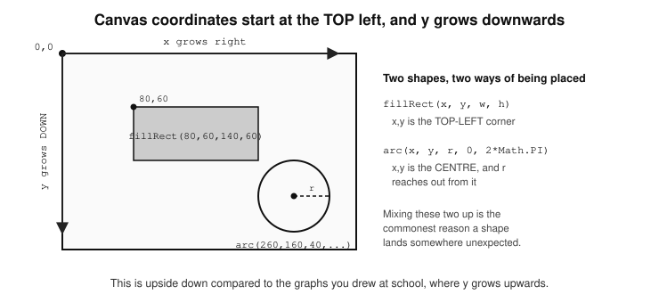
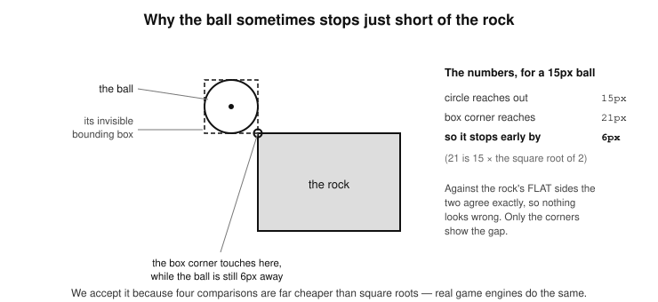

//————————————————————//
CHAPTER 16 - THE CANVAS ELEMENT
//————————————————————//

	-The Canvas element—for drawing on the web
		-Draw a rectangle
		-Draw a circle
		-Printing text on the canvas
		-Create a drawing app
			-The paintbox setup
			-Detecting colour selection
			-Eraser functionality
		-Positioning, animation and collision detection
			-Positioning
			-Animation
			-Collision detection
				-Detecting the collision of two shapes
				-A word about the shape we are really testing
				-The precise version, if you need it

The Canvas element—for drawing on the web
—————————————————————————

  The `<canvas>` element is a special part of HTML5 that lets you draw graphics using JavaScript — right in your browser! Think of it like a blank sheet of paper (or canvas!) where you can use code to draw lines, shapes, images, animations, and even build simple games.
  The `<canvas>` element was introduced with HTML5, around 2009–2010, as a way to allow developers to draw and animate things directly in the browser without using Flash or plugins. It became a big part of making the web more interactive and powerful. Before canvas, making interactive graphics (like games, charts, or animations) was tricky and usually needed extra software. Now, with canvas and JavaScript, you can draw anything directly on the page, using only your browser.
  The canvas element is supported by all modern web browsers and is used in the following ways:

    * Games
    * Charting tools (like graphs)
    * Animations
    * Image editors
    * Drawing apps
    * Data visualisations	

In this section, we will build a drawing application, with which you can draw things on the canvas, and use different colours for the strokes, just like the coloured pencils of a sketchbook—only you will be doing this on the web, by holding and dragging your mouse. In Chapter 20 where we look at working with Images, I will also show you how to use the HTML5 Canvas API to create an image editing application. This is what a canvas element looks like on an HTML page:

	<canvas id="myCanvas" width="300" height="150" 
		style="border:1px solid black;">
	</canvas>

  How does it relate to other DOM elements? Just like other elements (like `
`, `
`, or ``), canvas is part of the DOM. You can do the following:

	-create it with document.createElement("canvas")
	-add it to the page with appendChild()
	-get it with getElementById()
	-style it with CSS	
	-control it with JavaScript

But unlike an ``, canvas doesn't have content on its own—you draw everything using a special drawing tool called the canvas context, which comes as part of the Canvas itself. This is why in all Canvas operations in code, you will notice they all begin with a setup of the context, followed by the process of building stuff upon that context.
Let’s see some examples of the Canvas in action. I think the best way for you to get introduced to the canvas is if I show you practical examples in code, and then explain what the various properties and methods do.

	
Draw a rectangle
———————————

	HTML code
	——————
	<canvas 
            id="myCanvas" 
            width="300" 
            height="150" 
            style="border:1px solid black;">
        </canvas>

	JavaScript code
	—————————

	let canvas = document.getElementById("myCanvas");

	// Create the context - this gives us the drawing tool
  	let ctx = canvas.getContext("2d"); 

	// Set fill color to blue
  	ctx.fillStyle = "blue"; 

	// Draw a rectangle (x, y, width, height)
  	ctx.fillRect(50, 40, 200, 60); 

Explanation:
	-The line getContext("2d") is how you access the 2D drawing tools of 
		canvas.
	-The .fillStyle property of the context sets the colour that any 
		subsequent filling will use—rather like choosing which pot of 
		paint your brush is about to go into.
	-The .fillRect() method of the context, actually draws the filled 
		rectangle. The 4 arguments it takes are very clear from the 
		names; the x and y coordinates where you want the element to 
		be placed in the canvas. The next 2 are for the width and height you 
		want for the rectangle. The rectangle created in this example will 
		be one 200 pixels wide and 60 pixels high.

Draw a circle
———————————

	HTML code
	——————
	<canvas 
            id="myCanvas" 
            width="300" 
            height="150" 
            style="border:1px solid black;">
        </canvas>

	JavaScript code
	—————————

	let canvas = document.getElementById("myCanvas");
	let ctx = canvas.getContext("2d"); 
	ctx.beginPath();

	// x, y, radius, start angle, end angle
	ctx.arc(150, 75, 40, 0, 2 * Math.PI); 
	ctx.fillStyle = "red";
	ctx.fill();

This creates a nice red circle against a white background, and it looks like the national flag of Japan. There is a lot more involved here, like the .beginPath(), .arc() and .fill() methods of the canvas context, so let me break it down for you. Understanding how ctx.beginPath(), ctx.arc(), and ctx.fill() work together is key to mastering the canvas API.

Explanation:
	-ctx.beginPath()
		It starts a new path. This tells the canvas that you're about to 
		start drawing a new shape. It matters because, without 
		beginPath(), your new shape might accidentally get connected 
		to the previous one (if you drew something earlier). It ensures 
		shapes are independent. This is why we call it before the other 
		methods.
	-ctx.arc(150, 75, 40, 0, 2 * Math.PI)
		It defines a circle by drawing an arc:
            * 150 and 75 represent the x and y coordinates, respectively, of the center of the circle.
            * The third argument (40) is its radius, which is how far the circle reaches out from its centre.
            * The last two arguments (start angle and end angle), where 0 is the standard starting angle (in radians) while 2 * Math.PI is the standard ending angle (where a full circle = 360° or 2π radians).
		It is important to note that ctx.arc() only defines the path of the 
		circle. It doesn't actually draw or color it yet. It just traces the 
		shape’s outline (like drawing with a pencil).
	-The .fillStyle property is what declares that the circle will be red in 
		color when it is filled. Note that it does not do the filling 
		(colouring) itself.
	-The .fill() method of the context, actually draws the circle. In doing 
		so, it works with .arc() and .fillStyle to draw the shape following 
		the path you just defined with arc, while filling (colouring) it with 
		the colour defined by the .fillStyle property. It actually paints the 
		inside of the shape (like coloring it with a brush).

  In this example we draw a circle with a filled in color. If you wanted a stroked circle, which means a drawn circle outline with no colour filling, you can achieve that by using the combination of the following two properties: 
	-ctx.strokeStyle e.g. ctx.strokeStyle = "red";
	-ctx.stroke()
instead of:
	-ctx.fillStyle
	-ctx.fill()

Test it out with the following code, and you will get a circle outline:

	let canvas = document.getElementById("myCanvas");
	let ctx = canvas.getContext("2d"); 
	ctx.beginPath();
	ctx.arc(150, 75, 40, 0, 2 * Math.PI); 
	ctx.strokeStyle = "red";
	ctx.stroke();

Printing text on the canvas
———————————————
	HTML code
	——————
	<canvas 
            id="myCanvas" 
            width="300" 
            height="150" 
            style="border:1px solid black;">
        </canvas>

	JavaScript code
	—————————

	let canvas = document.getElementById("myCanvas");
	let ctx = canvas.getContext("2d"); 
	ctx.font = "20px Comic Sans MS";
	ctx.fillStyle = "blue"; 
	ctx.fillText("Hello Canvas!", 70, 50);
 
Explanation:
	-The ctx.font line will set the font type for the text you will write
	-The .fillStyle property will be the color of the text.
	-The .fillText() is the equivalent of fill() or stroke(). So, instead of 
		using a combination of .fillStyle and then fill to draw the element, 
		when writing text, we use a combination of:

			-.fillStyle - for the text color, and
			-.fillText() to write the text.

	Note that you pass in the text to be written to .fillText() as a string, 
	and then tell it the x and y coordinates for where you wish to position 
	the text on the canvas.

			ctx.fillText("Hello Canvas!", 70, 50);

	The x coordinate is 70, and the y coordinate is 50.
 

Create a drawing app
—————————————
This one is going to be more complex than the three examples above, but it really is not hard to understand. I will try to explain what every line of code does, and it should all become clear to you. 

	HTML code
	——————
	<canvas 
            id="paintCanvas" 
            width="500" 
            height="400" 
            style="border:1px solid black;">
        </canvas>
         
        

        

        
Pen

        

            Eraser
        

         
        <canvas 
            id="paintBox" 
            width="500" 
            height="100" 
            style="border:1px solid black;">
        </canvas>

	JavaScript code
	—————————

	let colorIndicator = document.getElementById("colorIndicator");
	let indicatorName = document.getElementById("indicatorName");
	const canvas = document.getElementById("paintCanvas");
	const ctx = canvas.getContext("2d");
	let paintColor = "black";
	let penSize = 4; 
	let canvasBackground = "white";

	// Painting state
	let painting = false;

	// Start drawing
	canvas.addEventListener("mousedown", (e) => {
  		painting = true;

		// Where exactly did the user press?
		const x = e.offsetX;
		const y = e.offsetY;

		// Set the pen up before we put it down on the paper
		ctx.lineWidth = penSize;
		ctx.lineCap = "round";
		ctx.strokeStyle = paintColor;

		// Start a fresh path, and place the pen on that exact spot
		ctx.beginPath();
		ctx.moveTo(x, y);

		// Now draw a line from that spot to itself. That sounds like a
		// pointless thing to do, but because lineCap is "round" it paints
		// one round dot. This is what makes a plain click leave a mark.
		ctx.lineTo(x, y);
		ctx.stroke();
	});

	// Stop drawing
	canvas.addEventListener("mouseup", () => {
  		painting = false;

		// reset path to avoid drawing a line when mouse is moved 	
		// without holding click
  		ctx.beginPath(); 
	});

	// Draw on canvas
	canvas.addEventListener("mousemove", (e) => {
  		if (!painting) return; 

  		// Get mouse coordinates relative to canvas
  		const x = e.offsetX;
  		const y = e.offsetY;

		// make it thicker when it's an eraser
  		ctx.lineWidth = penSize;
  		ctx.lineCap = "round";
  		ctx.strokeStyle = paintColor; 

		 // Draw line to current position
  		ctx.lineTo(x, y);
  		ctx.stroke();     // Render it
 		 ctx.beginPath();  // Begin a new path so lines don’t all connect
  		ctx.moveTo(x, y); // Move the pen to the current mouse position
	});

	// Paint box
	let paintBox = document.getElementById("paintBox");
	let paintBox_ctx = paintBox.getContext("2d"); 

	// Track the colors and their positions
	const paint_colors = [
    		{ x: 130, y: 55, radius: 20, color: "black" },
    		{ x: 180, y: 55, radius: 20, color: "red" },
    		{ x: 230, y: 55, radius: 20, color: "blue" },
    		{ x: 280, y: 55, radius: 20, color: "dodgerblue" },
    		{ x: 330, y: 55, radius: 20, color: "green" },
    		{ x: 380, y: 55, radius: 20, color: "yellow" },
   	 	{ x: 430, y: 55, radius: 20, color: "grey" },
  	];

	// Loop through paint colors & draw circles for them
	paint_colors.forEach((paint) => {
    		paintBox_ctx.beginPath();

    		// x, y, radius, start angle, end angle
    		paintBox_ctx.arc(paint.x, paint.y, paint.radius, 0, 2 * Math.PI);
    		paintBox_ctx.fillStyle = paint.color;
    		paintBox_ctx.fill();
	});

	// Listen for clicks on paintBox canvas
	paintBox.addEventListener("click", (e) => {
  		// We know user would not click in paintBox if erasing
  		indicatorName.textContent = "Pen";
  		penSize = 4;
    		const rect = paintBox.getBoundingClientRect();
    		const x = e.clientX - rect.left;
    		const y = e.clientY - rect.top;
  
    		// Loop through paint colors, check which one the user clicked
    		paint_colors.forEach((paint) => {
      			const dx = x - paint.x;
      			const dy = y - paint.y;
      			const distance = Math.sqrt(dx * dx + dy * dy);
  
      			if (distance <= paint.radius) {
        			paintColor = paint.color;

        			// indicate the active pen color
        			colorIndicator.style.backgroundColor = paint.color;
      			}
    		});
	});

	// show user the active color
	let eraser = document.getElementById("eraser");
	eraser.addEventListener("click", (e) => {
  		// make the pen size thicker
  		penSize = 20;
  		paintColor = canvasBackground;

  		// change indicated pen color to the eraser 
		// color-which is canvas background-color
  		colorIndicator.style.backgroundColor = canvasBackground;
  		indicatorName.textContent = "Eraser";
	});

 
Explanation:
  This is an application where you can draw with your mouse, and see the coloured strokes on your screen as the mouse moves. You can change the color of the pen by clicking on your desired colour circle in the palette (smaller canvas) next to the main drawing canvas. In the color canvas which we named paintBox, you can choose from the colours: black, red, blue, dodgerblue, green, yellow, and grey. You can easily add a new colour to the application by adding another color object to the paint_colors array, and it will just work:

	const paint_colors = [
		// ...the existing colours...
    		{ x: 480, y: 55, radius: 20, color: "purple" },
	];

Add the new entry inside the array where it is declared. Do not try to
reassign paint_colors afterwards—it is a const, so that would throw
"Assignment to constant variable".

Keep in mind that the value of the x property of each colour is incremented by 50 pixels with each new color. This is to make sure that along the x-axis—which is to say horizontally—the color circles are lined up nicely next to each other without any overlapping.
The following is a step-by-step explanation of how it all works:
	-We start by setting up the variables 

		let colorIndicator = document.getElementById("colorIndicator");
		let indicatorName = 			
			document.getElementById("indicatorName");

	  These lines grab the HTML elements that show which color is 
	selected and display whether the user is using the "Pen" or "Eraser".

	-Next, this grabs the <canvas> element and prepares its 2D drawing 
	surface (ctx) so we can draw on it.

		const canvas = document.getElementById("paintCanvas");
		const ctx = canvas.getContext("2d");

	-Then we set some default variables that we will reuse like pen color 
	   (black), size (4 pixels), and the canvas background (white).

	-Next we deal with the starting and stopping of drawing. 
		A flag to track whether the user is currently drawing:

			let painting = false;

		When the mouse is pressed down on the canvas, start drawing:

			canvas.addEventListener("mousedown", (e) => {
  				painting = true;

  				const x = e.offsetX;
  				const y = e.offsetY;

  				ctx.lineWidth = penSize;
  				ctx.lineCap = "round";
  				ctx.strokeStyle = paintColor;

  				ctx.beginPath();
  				ctx.moveTo(x, y);
  				ctx.lineTo(x, y);
  				ctx.stroke();
			});

		There is more going on here than you might expect from "start
		drawing", so let us take it slowly.
		  The beginPath() and moveTo() put the pen down at the exact spot
		the mouse was pressed. Leave them out and the line only starts
		from the SECOND mouse move, which quietly loses the first few
		pixels of every stroke.
		  The lineTo(x, y) and stroke() then draw a line from that spot to
		itself. A line from a point to the same point has no length at all,
		so you would think it draws nothing. But we set lineCap to "round",
		and a round cap on a zero-length line is simply a circle. So we get
		one round dot, the width of the pen, exactly where the user
		pressed. Without it, clicking once without moving the mouse leaves
		no mark at all, which is not what anyone expects from a drawing
		app - try dotting the letter i and you will see the problem.

		  If drawing a line from a point to itself feels like too much of a
		trick, you can paint that dot directly instead. This is the more
		advanced way of writing the same four lines, using the arc() method
		you met when we drew a circle earlier:

			ctx.fillStyle = paintColor;
			ctx.beginPath();
			ctx.arc(x, y, penSize / 2, 0, 2 * Math.PI);
			ctx.fill();

		Both produce the same dot. Use whichever reads more clearly to you
		- though remember that the arc() version fills, so it needs
		fillStyle rather than strokeStyle.

		When the mouse is released, stop drawing. ctx.beginPath() 
		clears the current drawing path to avoid unwanted lines:

			canvas.addEventListener("mouseup", () => {
  				painting = false;
  				ctx.beginPath(); 
			});

		If the mouse moves but the button isn’t pressed, skip the rest of 
		the function:

			canvas.addEventListener("mousemove", (e) => {
  				if (!painting) return;
			// // ...

		Get the mouse position inside the canvas:

			const x = e.offsetX;
  			const y = e.offsetY;

		Set the stroke size, round the line ends, and choose the stroke 
		color:

			ctx.lineWidth = penSize;
  			ctx.lineCap = "round";
  			ctx.strokeStyle = paintColor;

		This is how to draw a line to the new point and start a new path 
		from there. This avoids connecting all paths:

			ctx.lineTo(x, y);
  			ctx.stroke();
  			ctx.beginPath();
  			ctx.moveTo(x, y);

 	The paintbox setup
	———————————
		let paintBox = document.getElementById("paintBox");
		let paintBox_ctx = paintBox.getContext("2d");

	Access the smaller canvas for color selection and its 2D drawing 
	surface.

	Define an array of colors with positions and sizes for each color 
	circle.

		const paint_colors = [
  			{ x: 130, y: 55, radius: 20, color: "black" },
  			...
		];

	Loop through the colors and draw colored circles on the paintBox 	
	canvas:

		paint_colors.forEach((paint) => {
  			paintBox_ctx.beginPath();
  			paintBox_ctx.arc(paint.x, paint.y, paint.radius, 0, 2 * 		
				Math.PI);
  			paintBox_ctx.fillStyle = paint.color;
  			paintBox_ctx.fill();
		});

	Detecting colour selection
	———————————————
	When user clicks the color canvas, set the pen mode and reset the 
	pen size to normal:

		paintBox.addEventListener("click", (e) => {
  			indicatorName.textContent = "Pen";
  			penSize = 4;

	Next, we have this line:

		const rect = paintBox.getBoundingClientRect();
  		const x = e.clientX - rect.left;
  		const y = e.clientY - rect.top;

	Let’s talk about the getBoundingClientRect() method. It gives
	the exact position of the canvas on the page. We subtract it from the 
	click coordinates to get the mouse position inside the paint box 
	canvas.

	Next, we calculate how far the mouse click was from each color 
	circle's center using the Pythagorean theorem:

		 paint_colors.forEach((paint) => {
    			const dx = x - paint.x;
    			const dy = y - paint.y;
    			const distance = Math.sqrt(dx * dx + dy * dy);

	If the click was within the confines (radius) of the color circle, update 
	the drawing color and color indicator:

		if (distance <= paint.radius) {
      			paintColor = paint.color;
      			colorIndicator.style.backgroundColor = paint.color;
    		}
 		

	Eraser functionality
	———————————
  There are two common ways to add an eraser to your canvas drawing app, and both are effective. One way is to draw with a white background, or whatever the background color of your canvas is. This is the simplest way to mimic an eraser: Just change the ctx.strokeStyle to "white" (or the canvas background color), and keep drawing. It looks like you're erasing, but you're actually painting over the drawing. Here is an example code:

	eraser.addEventListener("click", () => {
		 // Use background color
  		ctx.strokeStyle = "white";
	});

If you're using a brush with a line width, make the eraser slightly thicker.
This is the approach we took for the eraser in our example above. Here is how we did it: 
	-we set an event listener for a click on the eraser div element, then increased the brush size (penSize = 20), set the painting color to the same color as the background of our canvas (canvasBackground), and finally we changed the text beside the eraser div from “Pen” to “Eraser” like this: 

	indicatorName.textContent = "Eraser";

just so the user is made aware that they are now in erasing mode. The example eraser code is as follows:

	let eraser = document.getElementById("eraser");
	eraser.addEventListener("click", (e) => {
 		penSize = 20;
  		paintColor = canvasBackground;
  		colorIndicator.style.backgroundColor = canvasBackground;
  		indicatorName.textContent = "Eraser";
	});

	Here is how it works:
		-It’s not a separate tool—it’s just a pen with a thicker size that 
		   draws using the background color (white), so it appears to 
		   "erase".
		-This method is simple and fast, especially for programmers. 
		   There's no need to manually clear pixels.

  There is another way to implement an eraser in such a drawing app as ours, and I will like to show you here just so you know the two ways. This second way is to use the clearRect() method to clear part of the canvas. Using ctx.clearRect(x, y, width, height), you can implement a pixel-level eraser (like Photoshop) that is more precise. To do so, you would have to track the mouse like you would do when drawing, except that instead of drawing lines, you would be clearing small squares. This is what the code may look like:

	if (isErasing)
       {
          const rect = canvas.getBoundingClientRect();
          const x = e.clientX - rect.left;
          const y = e.clientY - rect.top;
      
          // Erase a small square under the cursor
          ctx.clearRect(x - 5, y - 5, 10, 10);
      }

If we are to modify the above drawing app to use this, the best way is to make it possible to detect when the user is drawing and when they are erasing. You could set a variable like isErasing = true when you activate the eraser tool. 

Here is the modified code to implement pixel erasing using clearRect():

	let colorIndicator = document.getElementById("colorIndicator");
  	let indicatorName = document.getElementById("indicatorName");
  	const canvas = document.getElementById("paintCanvas");
  	const ctx = canvas.getContext("2d");
  	let paintColor = "black";
  	let penSize = 4; 
  	let canvasBackground = "white";

  	// Two separate pieces of state. This is the important bit: whether
  	// the button is held down is a different question from which tool
  	// is selected, so we keep them in two different variables.
  	let mouseDown = false;   // is the mouse button being held?
  	let isErasing = false;   // which tool are we using?

  	// Start drawing or erasing
  	canvas.addEventListener("mousedown", (e) => {
      		mouseDown = true;

      		const x = e.offsetX;
      		const y = e.offsetY;

      		if (isErasing) {
          		// A click on its own should rub out that spot
          		ctx.clearRect(x - penSize / 2, y - penSize / 2, penSize, penSize);
      		}
      		else {
          		// Set the pen up, put it down, and mark the spot so that a
          		// click on its own still leaves a dot
          		ctx.lineWidth = penSize;
          		ctx.lineCap = "round";
          		ctx.strokeStyle = paintColor;

          		ctx.beginPath();
          		ctx.moveTo(x, y);
          		ctx.lineTo(x, y);
          		ctx.stroke();
      		}
  	});

  	// Stop drawing or erasing
  	canvas.addEventListener("mouseup", () => {
      		mouseDown = false;

    		// reset path to avoid drawing a line when mouse is moved
    		// without holding click
      		ctx.beginPath(); 
  	});

  	// If the pointer leaves the canvas we stop too, otherwise letting go
  	// outside the canvas would leave mouseDown stuck on true
  	canvas.addEventListener("mouseleave", () => {
      		mouseDown = false;
      		ctx.beginPath();
  	});

  	// Draw or erase on canvas
  	canvas.addEventListener("mousemove", (e) => {
      		// nothing to do unless the button is being held
      		if (!mouseDown) return;

      		// Get mouse coordinates relative to canvas
      		const x = e.offsetX;
      		const y = e.offsetY;

      		if (isErasing) {
          		// Erase a square under the cursor, the size of the pen
          		ctx.clearRect(
              			x - penSize / 2, y - penSize / 2, penSize, penSize
          		);
      		}
      		else {
        		ctx.lineWidth = penSize;
        		ctx.lineCap = "round";
        		ctx.strokeStyle = paintColor; 

        		// Draw line to current position
        		ctx.lineTo(x, y);
        		ctx.stroke();     // Render it

			// Begin a new path so lines don’t all connect
        		ctx.beginPath();  

			// Move the pen to the current mouse position
        		ctx.moveTo(x, y); 
      		}
  	});

  	// Paint box
  	let paintBox = document.getElementById("paintBox");
  	let paintBox_ctx = paintBox.getContext("2d"); 

  	// Track the colors and their positions
  	const paint_colors = [
        	{ x: 130, y: 55, radius: 20, color: "black" },
        	{ x: 180, y: 55, radius: 20, color: "red" },
        	{ x: 230, y: 55, radius: 20, color: "blue" },
        	{ x: 280, y: 55, radius: 20, color: "dodgerblue" },
        	{ x: 330, y: 55, radius: 20, color: "green" },
        	{ x: 380, y: 55, radius: 20, color: "yellow" },
      		{ x: 430, y: 55, radius: 20, color: "grey" },
    	];

  	// Loop through paint colors & draw circles for them
  	paint_colors.forEach((paint) => {
        	paintBox_ctx.beginPath();

        	// x, y, radius, start angle, end angle
        	paintBox_ctx.arc(paint.x, paint.y, paint.radius, 0, 2 * Math.PI);
        	paintBox_ctx.fillStyle = paint.color;
        	paintBox_ctx.fill();
  	});

  	// Listen for clicks on paintBox canvas
  	paintBox.addEventListener("click", (e) => {
      		// We know user would not click in paintBox if erasing
      		isErasing = false; 
      		indicatorName.textContent = "Pen";
      		penSize = 4;
        	const rect = paintBox.getBoundingClientRect();
        	const x = e.clientX - rect.left;
        	const y = e.clientY - rect.top;
  
        	// Loop through paint colors, check which one the user clicked
        	paint_colors.forEach((paint) => {
            		const dx = x - paint.x;
            		const dy = y - paint.y;
            		const distance = Math.sqrt(dx * dx + dy * dy);
  
            		if (distance <= paint.radius) {
              			paintColor = paint.color;

              			// indicate the active pen color
              			colorIndicator.style.backgroundColor = paint.color;
            		}
        	});
  	});

	// show user the active color
	let eraser = document.getElementById("eraser");
	eraser.addEventListener("click", (e) => {
    		// switch tool only - whether the button is down is not our business
    		isErasing = true; 

		// make the eraser square bigger than the pen
    		penSize = 20;

    		// change indicated pen color to the eraser 
    		// color-which is canvas background-color
      		colorIndicator.style.backgroundColor = canvasBackground;
      		indicatorName.textContent = "Eraser";

  	});

  Hopefully you have learned a lot about the HTML5 canvas from this chapter. Visit the documentation online, experiment and play with it to see its full power.

Positioning, animation and collision detection
—————————————————————————

  Finally, to round up our learning of the canvas, I will now show you how to create an animation using the simple example of a moving ball, that will demonstrate collision detection. The animation moves a ball on screen from left to right and top to bottom on a keydown event of your keyboard’s arrow keys. When the ball reaches the edge of the canvas, it can go no further, and can only move in another direction. That is thanks to collision detection. The code is able to detect (determine) that it has run into an obstacle. Also we will place an item (a 'rock') in the middle of the canvas that the ball can only go round but cannot run through. That’s another example of collision detection. 
  Neither of these two things—animation and collision detection—is possible if we are not able to determine the position of elements on the web page. We will start by learning all about detecting the position of an object using what are known as x and y axes or coordinates. Once we are able to do that, we can make the object move, and are then able to tell if they run into (collide with) any other object on the screen. We know there has been a collision if the position of our object overlaps with that of another. 
  I hope hereby to teach you how to detect boundaries, collisions, keyboard key presses, and how to make objects move. These are great skills to have as a JavaScript programmer. You would get the fundamental skills needed to start building your own animations, games—whether it is to write racing games where you detect which car came first based on their positions against the finish line, or a keyboard-driven object that skips over moving obstacles (the flappy bird game comes to mind), or a pacman game, or a shooting game where you detect bullets hitting the enemy to deduct points or lives from them, you will be limited only by your own imagination. The possibilities are endless.
  Let’s look at the example of the moving ball on a canvas. Note that the ball is drawn using the arc() method of the canvas, while the rock is a rectangle drawn on the canvas using the fillRect() method. Let’s dive into the code:  

	HTML code
	———————

	<canvas 
            id="gameCanvas" 
            width="500" 
            height="400" 
            style="border:1px solid black;">
        </canvas>

	JavaScript code
	—————————

const canvas = document.getElementById("gameCanvas");
const ctx = canvas.getContext("2d");

// Ball object
const ball = {
  x: 50,
  y: 50,
  radius: 15,
  color: "dodgerblue",

  // Moves 10 pixels per key press
  speed: 10 
};

// Rock object
const rock = {
  x: 220,
  y: 170,
  width: 60,
  height: 60,
  color: "gray"
};

// Draw the ball
function drawBall() {
  ctx.beginPath();
  ctx.arc(ball.x, ball.y, ball.radius, 0, Math.PI * 2);
  ctx.fillStyle = ball.color;
  ctx.fill();
  ctx.closePath();
}

// Draw the rock
function drawRock() {
  ctx.fillStyle = rock.color;
  ctx.fillRect(rock.x, rock.y, rock.width, rock.height);
}

// Check if ball will hit the wall or rock
function canMove(dx, dy) {
  const nextX = ball.x + dx;
  const nextY = ball.y + dy;

  // Check canvas boundaries
  if (nextX - ball.radius < 0 || nextX + ball.radius > canvas.width) return false;
  if (nextY - ball.radius < 0 || nextY + ball.radius > canvas.height) return false;

  // Check rock collision
  const ballLeft = nextX - ball.radius;
  const ballRight = nextX + ball.radius;
  const ballTop = nextY - ball.radius;
  const ballBottom = nextY + ball.radius;

  const rockLeft = rock.x;
  const rockRight = rock.x + rock.width;
  const rockTop = rock.y;
  const rockBottom = rock.y + rock.height;

  const hitRock =
    ballRight > rockLeft &&
    ballLeft < rockRight &&
    ballBottom > rockTop &&
    ballTop < rockBottom;

  return !hitRock; // Only move if no collision
}

// Handle arrow key movement
document.addEventListener("keydown", (e) => {
  let dx = 0;
  let dy = 0;

  if (e.key === "ArrowUp") dy = -ball.speed;
  if (e.key === "ArrowDown") dy = ball.speed;
  if (e.key === "ArrowLeft") dx = -ball.speed;
  if (e.key === "ArrowRight") dx = ball.speed;

  // Redraw canvas with updated position
  if (canMove(dx, dy)) {
    ball.x += dx;
    ball.y += dy;
    draw(); 
  }
});

// Redraw everything
function draw() {
  // Clear the canvas
  ctx.clearRect(0, 0, canvas.width, canvas.height); 
  // Draw the obstacle
  drawRock(); 
  
  // Draw the ball
  drawBall();  
}

// Initial draw
draw(); 

Explanation:
	  Since the ball only moves per keypress, we just call draw() once 
 	after movement. canMove(dx, dy): This helper checks both walls 
	and rock to make sure the ball won’t go out of bounds or crash into 
	the rock. ball.speed: Set to 10 so every arrow key press nudges the 
	ball 10 pixels. Collision Detection: happens once on each key press.

	Positioning
	———————
In computer graphics, every object (like our ball or rock) has a position on a 2D grid. This grid is made up of two invisible lines:

* The x-axis goes left to right (horizontal),
* The y-axis goes top to bottom (vertical).

The top-left corner of the canvas is (0, 0). As:

	-You increase the x-value, you move right.
	-You decrease the x-value, you move left.
	-You increase the y-value, you move down.
	-You decrease the y-value, you move up.

In the above example, we have the following code initialising the value to be used as the value of the x and y coordinates. 

	x: 50,
	y: 50,

These values are set as properties of the ball object:

	const ball = {
  		x: 50,
  		y: 50,
  		radius: 15,
  		color: "dodgerblue",

  		// Moves 10 pixels per key press
  		speed: 10 
	};

These are later used when creating the ball on the canvas using the ctx.arc() method in drawBall() function. Having x, y coordinates of 50, 50 each means the ball starts 50 pixels from the left and 50 pixels from the top of the canvas. 
  In order to detect the position of an object, we use the x and y coordinates, like we do for the ball in this example using ball.x and ball.y. 

Let’s say for example, you wish to detect the exact spot where the user clicks on a canvas, you can do so by using mouse events (like click) and then get the offsetX and offsetY of the event. Here is an example:

	canvas.addEventListener("click", (e) => {
  		console.log("Click coordinates are: ", e.offsetX, e.offsetY);
	});

Save that and if you click in the canvas, you will see the message written to the console:

	Click coordinates are:  51 49

There you have it; the x and y coordinates of the exact spot in the canvas element on which you clicked.

*Figure 16.1 — Canvas coordinates start at the top left*

	Animation
	——————
  Animation in JavaScript means updating the position or style of something over time, so it looks like it’s moving. In our example code above, we place an event listener on the press of a key on your keyboard, then we proceed to specify an action to be taken depending on which arrow key was clicked. We only check for the case of arrow keys because those are the keys we are interested in. 

	document.addEventListener("keydown", (e) => { 
		// // ...
		if (e.key === "ArrowUp")  dy = -ball.speed;
 		 if (e.key === "ArrowDown")  dy = ball.speed;
  		if (e.key === "ArrowLeft")  dx = -ball.speed;
  		if (e.key === "ArrowRight") dx = ball.speed;
		// // ...
	 });

We move the ball a little each time the user presses an arrow key. This is how the ball movement happens:

	-The initial position of the ball as mentioned above, is set to x 
	   coordinate 50, and y coordinate 50

		const ball = {
  			x: 50,
  			y: 50,
  			// // ...
			speed: 10
		};

	-The speed property of the ball object is set to 10 (for 10 
	   pixels) which is the steps we have decided that the ball will move by 
	   at each key press. 
	-Whenever the ArrowUp key is pressed, we decrement the value of 
	   the y coordinate by the value of speed. We already know that along 
	   a y axis (top to bottom), decreasing the value will move the object 
	   upwards and vice versa. Equally, if the ArrowDown key is pressed, 
	   we increase the value of the y coordinate by the value of the speed 
	   property. This should make the ball move downwards as we 
	   know. That updated value—whether less or more—is stored in a 
	   variable dy.

		if (e.key === "ArrowUp")  dy = -ball.speed;
 		 if (e.key === "ArrowDown")  dy = ball.speed;

	-The exact opposite is true of the ArrowLeft and ArrowRight keys.
	   Whenever the ArrowLeft key is pressed, we decrement the value of 
	   the x coordinate by the value of speed. We already know that along 
	   a x axis (left to right), decreasing the value will move the object 
	   to the left and vice versa. Equally, if the ArrowRight key is pressed, 
	   we increase the value of the x coordinate by the value of the 
	   speed property. This should make the ball move to the right, as we 
	   know. That updated value—whether less or more—is stored in a 
	   variable dx.

		if (e.key === "ArrowLeft")  dx = -ball.speed;
  		if (e.key === "ArrowRight") dx = ball.speed;

	-Finally, we update the position of the ball object by setting its x and 
	   y, property values with the new values stored in the dx and dy 
	   variables:

		// Redraw canvas with updated position
		if (canMove(dx, dy)) {
    			ball.x += dx;
    			ball.y += dy;
    			draw(); 
  		}

	   The position itself is updated right there in the key handler. The 
	   draw() function is then called to clear the canvas and redraw 
	   everything in its new place.

Another common way to animate is using the built-in function requestAnimationFrame(). That method is used when we want to make something move continuously or very smoothly—like a character that keeps walking or a bouncing ball. Here is the syntax of using requestAnimationFrame() function:

	function animate() {
  		// Move something
  		draw(); // Draw new position
  		requestAnimationFrame(animate); // Loop forever
	}

	animate();

This method is a bit more advanced, but you’ll definitely use it later as your skills grow. 

	Collision detection
	——————————
  Collision detection means checking if two objects bump into each other.
In our example code above, the ball has two objects we want to detect collision against. They are as follows:

	-We must detect when the ball reaches the edge of the canvas and 
	   prevent it from going off that limit.
	-We must detect when the ball runs against the rock in the centre 
	   of the canvas and stop, so that the user can move around it.

We create a custom function to handle the collision detection for us. This is the canMove() function, and it looks like this:

	function canMove(dx, dy) {
  		const nextX = ball.x + dx;
  		const nextY = ball.y + dy;
		// // ...
	}

We will be passing to canMove() the updated x and y position every time the user presses a key to move the ball. We call canMove() first before drawing (re-creating) the new canvas with the new ball position. In doing so, we are checking if there is no obstacle in that new position before we let the ball move to it. That is why we call canMove() within the event listener of every key press:

	document.addEventListener("keydown", (e) => {
  		// // ...
  		if (canMove(dx, dy)) {
    			ball.x += dx;
    			ball.y += dy;
    			draw(); 
  		}
	});

The following are the steps to do the collision detection which we do in canMove():
	
	-First, we work out what the ball’s x and y coordinates are about to 
	   be, and store them in the variables nextX and nextY which 
	   represent the x and y coordinates, respectively.

		function canMove(dx, dy) {
  			const nextX = ball.x + dx;
  			const nextY = ball.y + dy;
			// // ...
		}

	-Next we do some canvas edge detection to make sure the ball 
	   doesn't move beyond the edges. To achieve this, we do some 
	   simple math. Let’s establish some parameters so that you would 
	   understand perfectly.

		-On the x (horizontal) axis
			-the position of the left wall of the canvas is 0 (x = 0)
			-the position of the right wall of the canvas is the width of 				   the canvas (canvas.width)

		-On the y (vertical) axis
			-the position of the top wall of the canvas is 0 (y = 0)
			-the position of the bottom wall of the canvas is the height 
			   of the canvas (canvas.height)

		-The radius of the circular ball is the distance between the 
		   centre of the ball and the edge of the ball. We already know 
		   the radius of our ball because we have it as the radius property 
		   of the ball object. 

			const ball = { 
				// // ...
				radius: 15, 
				// // ...
			};

		   In fact, we even used that radius value when 
		   creating the ball in the first place.

			function drawBall() { 
				// // ...
				ctx.arc(ball.x, ball.y, ball.radius, 0, Math.PI * 2); 
				// // ...
			}

		   The x and y coordinates define one spot in the middle of the 
		   circle, while the radius creates a circle around that spot where 
		   the distance between that spot and the outer edges of the 
		   circle represent the radius.

		-To work out if the ball has touched any of the inner walls of the 
		   canvas, you must find out the position of the outer edges of the 
		   ball, because it takes into consideration the radius.

		-To calculate the position of the outer edge of the circle, it 
		   depends on if we are talking about the left edge, or the top 
		   edge, or the right edge, or the bottom edge. This is easy to 
		   work out, just stay with me. For left and right edges, we are 
		   looking at the horizontal line, or x axis, while for the top and 
		   bottom edges, we are talking about the vertical or y axis. We 
		   already know that on the x axis, to move left, you reduce the x 
		   value, and to move right, you increase the x value, just as on 
		   the y axis you have to reduce the y value to move upwards, 
		   and increase it to move downwards. To work out the position of 
		   the outer edges of the ball, do this:

			-left edge: 		x - radius
			-right edge: 		x + radius
			-top edge: 		y - radius 
			-bottom edge:	y + radius
		
		-With all that in mind, to know if the left edge of the circle has 
		   touched the left wall of the canvas, just work out if the position 
		   of the left edge is equal to 0. 

			x - radius == 0

		   If it is, then the ball is exactly at the edge, touching the left 
		   canvas (x axis) wall. If it is less than 0, then the ball has gone 
		   beyond the left edge.
			To know if the right edge has touched the right inner wall of 
		   the canvas, the calculation is exactly the opposite. We simply 
		   check if the value of the ball’s right edge is equal to the 
		   canvas.width. 

			x + radius == canvas.width

		   If it is greater, then we know the ball has gone beyond the right 
		   edge of the canvas. 
			The logic we apply in our example code is to check if both 
		   left and right edges of the ball have not gone beyond the 
		   canvas edges. That’s why instead of using x - radius == 0 and 
		   x + radius == canvas.width, we use x - radius < 0 (less than) 
		   and x + radius > canvas.width for the left canvas edge and right 
		   canvas edge, respectively. Either of those being true means the 
		   ball has gone too far. 
			That check happens in the function canMove(), and read its 
		   return value carefully, because it is the opposite way round 
		   from what you might expect. canMove() returns FALSE when the 
		   ball has hit something, and TRUE when the way is clear. Its 
		   name is the clue: we are asking "can the ball move?", not "has 
		   it crashed?". That is why we only allow the ball to move when 
		   canMove() returns true. 

			if (nextX - ball.radius < 0 || nextX + ball.radius > 
				canvas.width) return false;

		   Here nextX is the new value of the x position after the user hits 
		   to move the ball on the x axis. This is getting the position of the 
		   left edge of the ball since we are subtracting the radius 
		   (ball.radius) from that x value. We then check if it is less than 
		   0. We run the same check for the right canvas wall. The pipe 
		   characters (||) separating the two if conditions makes sure we 
		   run both checks in one if statement. 
			Similarly, we also check the top and bottom edges in 
		   canMove(). Again, touching either edge makes the function 
		   return false, and we only allow the ball to move when it 
		   returns true. 

			if (nextY - ball.radius < 0 || nextY + ball.radius > 
				canvas.height) return false;

		   Here nextY is the new value of the y position after the user hits 
		   to move the ball on the y axis. This is getting the position of the 
		   top edge of the ball since we are subtracting the radius 
		   (ball.radius) from that y value. We then check if it is less than 
		   0. We run the same check for the bottom canvas wall. The pipe 
		   characters (||) separating the two if conditions makes sure we 
		   run both checks in one if statement. 

	Detecting the collision of two shapes
	————————————————————
  When it comes to detecting collision of our ball against the rock on the canvas, the approach is exactly the same. To detect the collision between any two objects, you must start by knowing the position of their outer edges—bear in mind that the math for achieving this will depend on the shape of each object. So, in this example, we have a rectangle (the rock), and a circle (the ball). 
  
	-We start by calculating the edges of the ball: 

		const ballLeft = nextX - ball.radius;
		const ballRight = nextX + ball.radius;
		const ballTop = nextY - ball.radius;
		const ballBottom = nextY + ball.radius;

	-Next, we work out the edges of the rock. Take note of how this is 
	   calculated differently from how it’s done with a circle. For example, 
	   the left edge is simply its x position, while its top edge is its y 
	   position. 

		const rockLeft = rock.x;
		const rockRight = rock.x + rock.width;
		const rockTop = rock.y;
		const rockBottom = rock.y + rock.height;

  Finally, we check if the edges of these objects ever overlap. The following piece of code in our example takes care of that:

	const hitRock = ballRight > rockLeft &&
  		ballLeft < rockRight &&
  		ballBottom > rockTop &&
  		ballTop < rockBottom;

If ever all four conditions are true, it means the ball is inside or touching the rock! So, we return false, else we return true:

	return !hitRock;

Because this check is inside the canMove() function, it means: only allow the move if the ball doesn’t hit the rock.

	A word about the shape we are really testing
	————————————————————————
  There is an honest admission to make about those four comparisons, and
it is worth making because you will meet this trade-off in every game you
ever write.
  Look again at what we compared. We took the ball’s left, right, top and
bottom edges and treated them as the four sides of a box. But the ball is
not a box. It is a circle. What we have actually been testing all along is
whether an invisible square drawn around the ball overlaps the rock.
  This technique has a name. It is called AABB collision detection, which
stands for Axis-Aligned Bounding Box — "bounding box" because we draw the
smallest box that contains the shape, and "axis-aligned" because that box
is always square to the screen and never tilted.
  Most of the time you cannot tell the difference. Push the ball straight
at the flat side of the rock and the box edge and the circle edge are in
exactly the same place, so it stops precisely where you would expect. The
difference only shows itself at the rock’s corners. Approach one
diagonally and the corner of the invisible box reaches the rock before the
ball itself does, so the ball stops with a small gap, as though it had
bumped into thin air.
  How big is that gap? The corner of the box sits further from the centre
than the edge of the circle does — the radius multiplied by the square
root of 2, which for our 15 pixel ball is about 21 pixels rather than 15.
So in the very worst case, coming in at exactly 45 degrees, the ball stops
around 6 pixels early. On a 500 pixel canvas that is small enough that
most people never notice.
  So why use it? Because it is four simple comparisons. No square roots,

no multiplication, nothing expensive. When you have a hundred objects on
screen and you are checking every one of them against every other, sixty
times a second, that cheapness is the whole game. Real game engines use
AABB as a first, fast pass, and only do the precise, expensive maths on
the few pairs that the boxes say might be touching.

*Figure 16.2 — Why the ball sometimes stops just short of the rock*

	The precise version, if you need it
	———————————————————
  If you did want the true circle-against-rectangle test, here is how it
works. Find the point on the rectangle that is closest to the centre of
the circle, then measure the distance from the circle’s centre to that
point. If that distance is smaller than the radius, they really are
touching:

	function circleHitsRock(cx, cy) {
	    // Find the closest point on the rock to the ball's centre.
	    // Math.max and Math.min together "clamp" the ball's centre so
	    // that it never falls outside the rock's edges.
	    const closestX = Math.max(
	        rock.x, Math.min(cx, rock.x + rock.width)
	    );
	    const closestY = Math.max(
	        rock.y, Math.min(cy, rock.y + rock.height)
	    );

	    // How far is the ball's centre from that closest point?
	    const distanceX = cx - closestX;
	    const distanceY = cy - closestY;
	    const distance = Math.sqrt(
	        distanceX * distanceX + distanceY * distanceY
	    );

	    // Touching only if that distance is less than the radius
	    return distance < ball.radius;
	}

  You could drop that straight into canMove() in place of the hitRock
calculation. For our one rock it makes no practical difference, and the
box version is easier to read, which is why the chapter uses it. But now
you know both, and you know why you would reach for each.

  You’ve just taken your first steps into the world of graphics and animation using the HTML5 `<canvas>`! From moving a ball around the screen to detecting collisions with obstacles, you now understand how powerful simple shapes, positioning, and logic can be. But this is just the beginning. The canvas API can do so much more — from drawing images and text to creating full-blown games. Explore the official Canvas documentation on MDN (https://developer.mozilla.org/en-US/docs/Web/API/Canvas_API) to see what’s possible. And if you’re feeling adventurous, try building a maze, a simple pong game, or a mini obstacle course — anything that challenges you to move objects, detect hits, and control motion. 
