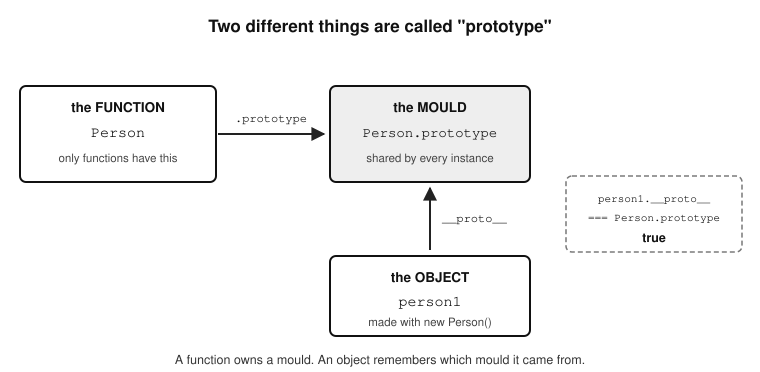
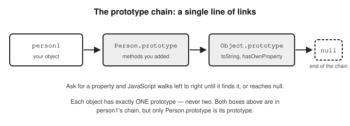
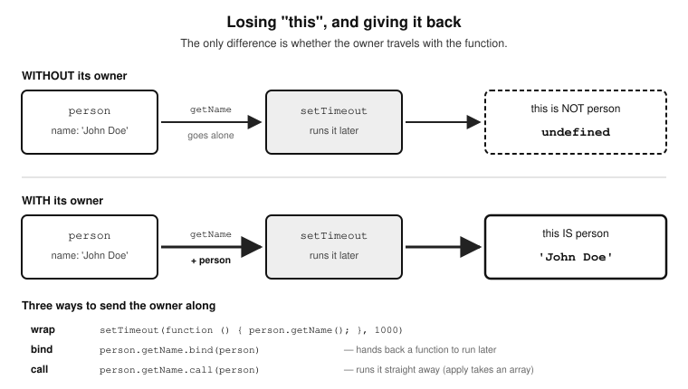
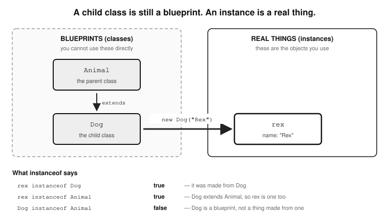

//————————————————————//
	CHAPTER 17 - OOP
//————————————————————//
	-Introduction
	-Relationship between the object data 
	   type and Object
		-How to create an object
		-The Object Constructor
		-Object.prototype
		-Static Methods of Object
        -Understanding how to use the prototype 
	   property
		-The traditional two ways of creating 
		  an object and their prototypes
			-object initialisers (aka object 
			   literals)
			-constructor functions
		-The new way to create objects and 
		   the prototype
			-The Object.create() method
		-Objects and their prototypes
		-The constructor property
		-Handy properties and methods of Objects
			-The prototype property
			-The constructor property
			-isPrototypeOf() and the instanceof operator
			-getPrototypeOf()
			-The __proto__ property
			-The getOwnPropertyNames()
			-The hasOwnProperty() method (non-inherited)
			-Check all properties of an object (including inherited)
		-Creating a custom method on an object
		-The call(), apply() and bind() 
		   methods of Function
	-OBJECTS IN DEPTH
		-Object literals
    		-JavaScript objects vs object literals
   		-Object literals vs constructor 
		   function
    		-Changing object literal values 
		   on the fly 
    		-Restricting modification on objects
		-The difference between a JavaScript object and JSON
		-Converting a JavaScript object to 
		  JSON
		-Converting JSON to a JavaScript 
		   object 
		-Destructuring of objects
		-Simplified object literal creation 
		   from function arguments
		-Viewing the contents of an object
		-Classes
			-Class inheritance
  				-difference between a child class and an instance
  				-Call parent constructor from child class
  				-Check if an object is an instance of a class
				-Function Constructors, object literals and inheritance
					-Function Constructors (Old Way of Creating 
						Classes)
					-Object literals
			-Class setters and getters
			-The difference between import and require
			-Exporting multiple functions or variables
			-Using a wildcard to import all from a file
			-Export fallback with export default
		-Other advanced OOP concepts
			-Static methods
			-Abstract classes
			-Interfaces
			-Dependency Injection (DI)
			-Private methods and properties 
				(Encapsulation)

Introduction
——————-
  Object Oriented Programming (OOP) refers to the ability of a programming language to handle the building blocks of an application as objects and properties. This offers a much more organised, readable, testable, and scalable approach to building software 
applications. These benefits it offers and 
more, will be evident as the OOP topic is 
broken down in detail.

	Relationship between the object data type and Object
	————————————————————————
	I mentioned before under the topic of data types that JavaScript has a built-in object named Object that is the parent of all objects in your code. Well, the built-in Object in JavaScript is a constructor function, and its
prototype—Object.prototype—is what every object in JavaScript ultimately
derives from. 
It provides the foundation for the object data type by offering essential 
methods and properties that every object can inherit. Here’s how the built-in Object relates to the object data type:
	First of all as a reminder; any value in JavaScript that is not a primitive (like string, number, boolean, undefined, null, bigInt, or symbol) is an object. The relationship between an object data type and Object can best be described in the following ways:
	-The object data type represents all non-
	   primitive values, while Object is a 
	   constructor and utility provider for 
	   working with objects.
	-All objects (including arrays, functions, 
	   etc.) ultimately inherit from Object via 
	   the prototype chain.

Here is an example of the prototype chain:

	// outputs true 
	const obj = {}; 
	console.log(obj.__proto__ === 
		Object.prototype); 

	// outputs null (end of chain)
	console.log(Object.prototype.__proto__); 

The built-in Object is both a constructor and a toolkit for working with the object 
data type. It provides shared functionality, enabling the creation, manipulation, 
and behaviour customisation of all JavaScript objects.

	How to create an object
	—————————————
Objects can be created in various ways
	-Object literals: { key: 'value' }
	-Using constructors like new Object(), 
	   new Array(), or new Map().
	-Through classes, functions, or prototype 
	   inheritance.

	The Object Constructor
	—————————————
	The built-in Object is a constructor that allows creating objects explicitly. 
It also provides static methods for working with objects. To prove to you that 
all objects inherit from the built-in JavaScript Object, here is 
an example:

		const obj1 = {}; // Object literal 

		// Using Object constructor 
		const obj2 = new Object(); 

		// outputs true
		console.log(obj1 instanceof Object);  

		// outputs true
		console.log(obj2 instanceof Object); 

You can clearly see that in spite of both obj1 and obj2 being created in different ways—one as an object literal and the other via the Object() constructor—both still inherit from the JavaScript Object.

	Object.prototype
	—————————-
All objects inherit from Object.prototype unless explicitly created otherwise.
Object.prototype contains methods like:
	-toString()
	-hasOwnProperty()
	-isPrototypeOf()
	-valueOf()

Here are some examples of how you can use these functions with your custom 
Objects:

	const myObject = { name: 'John' }; 

	 // will output true 
	console.log(myObject.hasOwnProperty('name'));

	// will output "[object Object]"
	console.log(myObject.toString()); 

	Static Methods of Object
	——————————————
	The Object constructor includes static methods for object manipulation.

Common Static Methods:
	-Object.keys(): Returns an array of keys in the object.
	-Object.values(): Returns an array of values in the object.
	-Object.entries(): Returns an array of key-value pairs
	-Object.assign(): Copies properties from one or more source objects to a target object, or to clone an object.
	-Object.create(): Creates a new object with a specified prototype.

Here are examples of how these static methods can be used:

	const obj = { a: 1, b: 2 }; 

	console.log(Object.keys(obj)); // ['a', 'b'] 
	console.log(Object.values(obj)); // [1, 2] 
	console.log(Object.entries(obj)); // [['a', 1], ['b', 2]]

	———————————————————————————————
	Object.assign() can be used in a couple of different ways
	———————————————————————————————
	// use Object.assign() for copying properties between objects
	
	const target = { a: 1 }; 
	const source1 = { b: 2 }; 
	const source2 = { c: 3 }; 

	Object.assign(target, source1, source2); 
	console.log(target); // { a: 1, b: 2, c: 3 }
	—————————————

	—————————————
	// use Object.assign() to clone an object
	const original = { name: 'John', age: 30 }; 

	const clone = Object.assign({}, original); 
	console.log(clone); // { name: 'John', age: 30 }
	console.log(clone === original); // false (new reference)
	————————————-

	—————————————
	// use Object.assign() to add default properties
	const defaults = { name: 'Anonymous', age: 18 }; 
	const user = { name: 'Alice' }; 

	const completeUser = Object.assign({}, defaults, user); 
	console.log(completeUser); // { name: 'Alice', age: 18 }
	————————————-

	———————————————————————————————
	Object.create() is also a powerful method and can be used in 
	different ways for creating a new object with a specified prototype.
	———————————————————————————————
	// Example 1: Creating an Object with a Prototype

	const prototypeObject = { 
		greet() { 
			console.log('Hello, ' + this.name); 
		}, 
	}; 

	const newObject = Object.create(prototypeObject); 
	newObject.name = 'John'; 
	newObject.greet(); // "Hello, John"
	————————————-

	————————————-
	// Example 2: Creating a Null-Prototyped Object

	const nullPrototypeObject = Object.create(null); 
	nullPrototypeObject.name = 'John'; 

	// outputs "John" 
	console.log(nullPrototypeObject.name); 

	// outputs undefined (no inherited properties)
	console.log(nullPrototypeObject.toString); 

	  The reason console.log(nullPrototypeObject.toString); 
	returns undefined is that nullPrototypeObject is created 
	with Object.create(null). If you had created the object 
	using Object.create(), it would have created an object 
	with a prototype—meaning the object would inherit  
	properties and methods from Object.prototype like 
	toString(), hasOwnProperty(), etc. In this case it didn’t, 
	which is fine if you wanted a prototype-less object.
	Accessing toString returns undefined because the object 
	has no prototype—meaning it does not inherit toString from 
	Object.prototype. Accessing name works because it's a 
	direct property added to the object.

	When can you create a prototype-less object?
		-when you want a truly plain object without extra 
			methods (e.g., for a dictionary or a map-like 
			structure).
		-When you need to avoid accidental property conflicts 
			with built-in methods.
	————————————-

	————————————-
	// Example 3: Initialising Properties

	const personPrototype = { 
		describe() { 
			return `${this.name} is ${this.age} years old.`; 
		}, 
	}; 

	const person = Object.create(personPrototype, { 
		name: { value: 'Alice', writable: true }, 
		age: { value: 25, writable: true }, 
	}); 

	console.log(person.describe()); // "Alice is 25 years old."
	————————————-

    Understanding how to use the prototype property
	Javascript objects work differently from the typical objects in languages like Java of the C family of languages. They use a unique mechanism known as prototypes. Every object in JavaScript carries an internal link to the object it is inheriting from. This is what JavaScript uses to keep track of what object is inheriting from what. This is also referred to as the prototype chain. The prototype property of an object contains its immediate parent (object it is inheriting from). The prototype property of that parent object in turn contains a reference to its own parent object and so forth until it gets to the top most object of the prototype chain, whose own link contains null to indicate that it does not inherit from any object. In JavaScript this top dog of objects is Object.prototype. Again, this prototype-based inheritance mechanism is unique to the JavaScript programming language. The term prototype refers to the object an object is 	created from. It is the mold, the boilerplate, the blueprint if you like. Hopefully you get the idea.
		To see the prototype of an object, check the value of the __proto__ property like so: 
		personObject2.__proto__ 
	assuming that there is a personObject2 you had created. Alternatively, and more safely, you can check it using the getPrototypeOf() method of Object, which has been available since ES5 in 2009, like so
		Object.getPrototypeOf(new Person()); 
	So we have established that every object carries a link to its parent, and that at the top of the prototype chain sits Object.prototype. But there is a second thing in JavaScript also called "prototype", and it must not be confused with the first. It is specifically available ONLY to functions, so that they can be used to create objects in their capacity as constructor functions.
		This is the single biggest source of confusion in JavaScript objects, so let us settle it now, before we go any further. There are two different things wearing the same name:

		-.prototype  — a real, visible property that ONLY functions have.
		   It holds the object that instances made from that function
		   will inherit from.

		-__proto__   — the internal link that EVERY object has, pointing
		   at the object it actually inherits from. (Its proper name in
		   the specification is [[Prototype]]. You read it with
		   Object.getPrototypeOf(), and modern browser consoles now show
		   it as [[Prototype]] rather than __proto__.)

		They are not two kinds of the same thing. They are the two ends of one
	relationship, and this single line of code shows how they meet:

		function Person(firstName) {
		    this.firstName = firstName;
		}

		let person1 = new Person('Tom');

		// The link on the INSTANCE points at the property on the FUNCTION
		console.log(person1.__proto__ === Person.prototype);  // true

		// And the instance itself has no .prototype property at all
		console.log(person1.prototype);                       // undefined

		Read those last two lines together and the whole thing falls into
	place. Person.prototype is the mould. person1.__proto__ is the arrow
	pointing back at the mould it was pressed from. A function owns a
	mould; an object remembers which mould it came from. Objects do not
	have a .prototype property, and functions do not need a __proto__ link
	to do their job as constructors.
		For the rest of this chapter, whenever you see the word prototype, ask
	yourself which of the two is meant. It will nearly always be obvious
	from whether it is written after a function name (Person.prototype) or
	fetched from an object (person1.__proto__).

*Figure 17.1 — Two different things are called "prototype"*

		Such functions are special objects that you create as a developer so that other objects can inherit from. They are known as constructor functions. This distinction is very 	important to be understood as many developers get it confused. Very uniquely to JavaScript, the syntax of a regular function is very similar to a constructor function which is basically a class. The best way to get a grasp of this is to recognise that JavaScript is a unique language of its own, in terms of classes and objects, and agree with yourself not to try to compare it with any other language. Once you do that, you will find it becomes easier to put things into context and understand. Don't worry, by the end of this chapter you will have mastered the creation of objects in JavaScript. Even in JavaScript, regular functions and objects, as identical as they look, have their distinctions if only you are observant. I will proceed to show you now. To make it easier for you to see the visual differences, I will demonstrate with an object and a function below.

	function person(firstName, lastName)
	{
		return firstName+' '+lastName;
	}

	function Person(firstName, lastName)
	{
		this.firstname = firstName;
		this.lastname = lastName;
	}

	As you can see, regular functions and objects are created in exactly the same way, or so it seems. However, you can still make clear distinctions between the two. First of all, both of these are functions — that is worth saying plainly, because in JavaScript a constructor is a function, not a separate kind of thing. What differs is how you intend to CALL them. The second one is meant to be called with new, which makes it a constructor function; the first is meant to be called normally. You can see that Person sets properties on itself in which it stores the arguments passed to it, so that they can then be used later, while person() just returns a value and keeps nothing. Person uses the this keyword to refer to those properties.
		Be careful with that last clue, though. It is a hint, not a rule. Ordinary functions can use this too — its value simply depends on how the function was called rather than on what the function is. So seeing this suggests you are probably looking at a constructor or a method, but it does not prove it.  
		Secondly; the . (dot) operator is how you reach members (properties or methods) of an object, so seeing it is another hint. Again it is not proof: JavaScript lets you use the dot on primitives too, wrapping them in a temporary object for you. That is why "hello".length and (5).toFixed(2) both work, even though neither a string nor a number is an object. 
		Lastly, to make a distinction between functions and objects, developers have a convention of always starting the name of the object with an uppercase letter. This is just a convention and you will certainly still see a lot of constructor function objects spelled beginning in lowercase, but it is a useful practice to follow that convention to make code readable, both for yourself, and your fellow developers.
		So, going back to the two prototypes we separated earlier: the .prototype property belongs only to functions, while the __proto__ link belongs to every object. Once you create a constructor function, a .prototype property becomes available on it. It holds an object that is very nearly empty — it starts with just one property, constructor, pointing back at the function itself, which is where the constructor property we look at later comes from. Everything else is yours to add on the fly, and whatever you add becomes available to every inheriting instance. 
		The powerful thing about prototypes and constructor functions is that you can create an object (a constructor function) and have other objects extend from it, then you can use the prototype property to add members to your constructor on the fly which will automatically be accessible to all the other inheriting objects. Here is an example:

	function Person(firstName, lastName)
	{
		this.firstname = firstName;
		this.lastname = lastName;

		this.showFirstName = function()
		{
			alert('First name is ' +this.firstname);
		}

		this.showLastName = function()
		{
			alert('Last name is ' +this.lastname);
		}
	}

	let person1 = new Person('Tom', 'Bands');
	let person2 = new Person('John', 'Jones');

	person1.showLastName(); 
	person2.showLastName(); 

	// let’s add a new method showFullName()
	Person.prototype.showFullName = function()
	{
		alert('Full name is ' +this.firstname+' '+this.lastname);
	}
	
	person1.showFullName(); 
	person2.showFullName(); 

	The above code works, and displays the following:
		Last name is Bands
		Last name is Jones
		
		Full name is Tom Bands
		Full name is John Jones

	You see how by having one object you can have multiple instances inherit from it, as well as add functionality to the blueprint (the boilerplate, the template, the prototype), which will make all other inheriting instances automatically get access to the newly added feature. 
	Think of a huge tech giant like BMW producing a version of the car say i3. There are going to be millions of customers worldwide purchasing units of this vehicle, and so they cannot afford to be recreating the exact same car type from scratch a copy every time someone orders for a piece. That 	will be counter-productive and very expensive. Their work will also be prone to errors, as an artist or engineer being human, cannot guarantee that some product or part they made following 	certain steps can be accurately identically replicated. Rather, what they do is automate the 	production of the first prototype (aka blueprint, boilerplate, template) from which thousands can be remade effortlessly. They have to be able to vary some properties of the specimen, like the colour, size etc to fulfil the custom demand of specific clients. To achieve this; they will have a way to change certain parameters being passed to whatever automation system is being used to churn out those vehicles. The parameters (arguments) passed will make sure the variable aspects not related to the core functionality of the cars are taken care of; like, the colour, the type of rims for the wheels, etc etc
	In the same way, when we generate new instances of objects from our blueprint Person constructor function, we just make sure it is a different person every time by passing in 	arguments of firstName and lastName to the constructor e.g. 

		let person1 = new Person('Tom', 'Bands');

	Note that when creating a new instance from your object, you have to use the keyword new 

	The traditional two ways of creating an object and their prototypes
	There are three main ways of creating an object in modern JavaScript, but before we go into the new way of creating objects, we will first of all, talk about the two traditional ways to do so. As we demonstrate the creation of objects, we will explain how the concept of prototypes underpins it all. This is because in JavaScript, you can not fully understand object creation and instantiation if you do not understand the concept of prototypes and how it relates to object creation. Here are two traditional ways to create objects, and make no mistake about the term traditional or old; for they are still meant for everyday use and work perfectly fine. 

		-i) Initialiser objects also known as object literals.
		-ii) Constructor objects sometimes referred to as object templates or blueprints. 

		

		i) Initialiser objects
	Initialiser objects are the simplest form of object creation. The syntax is simple and you basically create a block and assign it to a variable. 

		let obj = {}

	In this object you can assign members. Initialiser objects are useful when you are manipulating data somewhere in code and you need to have some quick data access object. It is almost a temporary way of storing data that you need to use there and then, and which 	you are sure you would not need anywhere else in your code. This means in such a case, there is no need to create a constructor object. It is a very handy way to create an object on the fly for direct use. This is also often referred to as an object literal. The syntax goes like this:

		let person = {
			name: 'Steve',
			age: 10
		}

If you think it looks exactly like an associative array, then you are absolutely right. That is what it is. You can add more values to it as you go along like so:

		person.surname = 'Johnson';

You can access the values like so:

		document.body.innerHTML = 'His surname is: ' + person.surname;

This prints out 'His surname is Johnson'
The built-in Object sits at the top of JavaScript's object world, and its prototype, Object.prototype, is what all inbuilt JavaScript objects as well as the ones you create ultimately inherit from — unless
you choose to create an object that does not inherit from it—which is possible, as we saw above. The prototype of an object literal is Object.prototype. Let 
us prove this. Consider the following code:

		let piero = {};
		console.log(piero);

	If you check your console, you will see {} and if you click on the arrow next to it, you will see the property of the object called __proto__ that denotes the 
prototype (parent) of all objects, and its value in this case will be Object:

		 __proto__: Object

	You can have an object literal that contains properties and methods, and any of its properties may in turn contain an object (sub object). You would set or access these sub objects using a loop.  You can create an array of objects on the fly, and in a loop, access the properties of each one of them. For example, consider the following code:

		let collection = [];
		let colours = ['red', 'orange', 'blue'];
		for(let i = 0; i < colours.length; i++)
		{
   			let temporal = {}
   			temporal.name = colours[i];
   			collection.push(temporal);
		}

		// note the += on each line. A plain = would REPLACE what is
		// already there, so only the last line would ever be seen
		document.body.innerHTML += 'HERE IS THE collection: '+collection+' ';
		document.body.innerHTML += 'FIRST OBJECT IN collection: '+collection[0].name+' ';
		document.body.innerHTML += 'SECOND OBJECT IN collection: '+collection[1].name+' ';
		document.body.innerHTML += 'THIRD OBJECT IN collection: '+collection[2].name;

	The output will be:
		HERE IS THE collection: [object Object],[object Object],[object Object]
		FIRST OBJECT IN collection: red
		SECOND OBJECT IN collection: orange
		THIRD OBJECT IN collection: blue

	So we have three objects in the collection array, and each of these objects has a name property whose value is the colour that this object represents.
	Creating object literals like this is the equivalent of creating an empty object using the new Object() method in JavaScript. The prototype of this new object created using new Object() is Object.prototype, exactly the same as for object literals.

		ii) Constructor functions
	Constructor objects as we have seen above are like a boilerplate from which you expect to generate other unique but related objects. You do it when you expect to need multiple objects; possibly in several different places in your application. You create an instance of a constructor function using the keyword new and the class name like so:

		let student = new Student();

	The new keyword makes sense because you are creating a new instance (copy) of the boilerplate object. So, without any further explanations (we already explained them well above), let me demonstrate with an example of how you would use a constructor object to manage the customised display of the portrait of four different members of the same family; a girl, her brother, a mum and a dad.

		<html>
		<body>
		

		

		

		

		
		</body>
		</html>

	In this example, we instantiate objects from the constructor object PersonDiv() and depending on if it is a girl, we grab the div from the DOM having the ID of 'girl' and we give the div a background colour of pink, and we place the image of the girl in it.
	If it is a boy, we grab the div from the DOM with the ID of 'boy' and give it a blue 	background color and so on for the 'mum' and 'dad' divs as well.
		Once more, we use the new keyword to create objects from constructor functions, but 	it would also work on JavaScript's built-in constructor objects like Object, Array, String, 	Date, RegExp etc. You would instantiate objects from these like so:

		new Object(), new Array(), new Date(), new RegExp() etc

	When it comes to prototypes and objects created from a constructor function, it is important to get the relationship exactly right, because it is easy to state it one step out. The object you get back from new Person() does NOT have the Person function as its prototype. It has Person.prototype — the object hanging off the function, which is the mould we talked about earlier.
	So for let person1 = new Person('Tom'), the chain runs like this:

		person1  →  Person.prototype  →  Object.prototype  →  null

	You can walk it yourself and watch it end:

		console.log(Object.getPrototypeOf(person1) === Person.prototype);
		// true

		console.log(Object.getPrototypeOf(Person.prototype) === Object.prototype);
		// true

		console.log(Object.getPrototypeOf(Object.prototype));
		// null - the end of the chain

	Notice that an object has exactly ONE prototype, never two. When you hear that a Date "inherits from both Date.prototype and Object.prototype", what is really meant is that both of them are in its chain — Date.prototype directly, and Object.prototype one step further up. That distinction matters, because inheritance in JavaScript is a single line of links, not a bundle of parents.
	This linking or association of objects, as we already know, is what we call the prototype chain, and it is how JavaScript answers every property lookup: it checks the object itself, then its prototype, then its prototype's prototype, until it either finds what you asked for or reaches null.

*Figure 17.2 — The prototype chain: a single line of links*

		iii) The new way to create objects and the prototype
	There is a more modern way to create an object in JavaScript. Since ES5, released in 2009, you can create an object using the create() method of the JavaScript Object passing it the name of the object's prototype (the object you want to create an instance of). Here is how you would do it:

		let girl = Object.create(Person);

	Here we are creating an object girl from another object called Person. The Person object will be the prototype of the girl object. If you need to pass arguments into the constructor of the prototype object you want to create an instance of, you have to pass an object as a second argument to the create() method. Each key in this object is the variable name, and the value of the key should be an object whose key is the keyword 'value' and its value the value of that variable. This probably sounds more complicated than it actually is so let me demonstrate with a simple example. Imagine we have the following constructor 	object called Person and it looks like this:

		function Person(fname, lname) {
   			this.firstName = fname;
   			this.lastName = lname;
		}

	This class or object declares a constructor that needs you to pass in fname and lname arguments when you instantiate it, which will be used for the firstName and lastName properties of the new person to be created. Do not forget to use the new keyword as you instantiate the Person class (create an object from it), as we have seen already. Here’s how to do it:  

		let girl = new Person('Joan', 'Langley');

	Then 

		document.body.innerHTML = 
				girl.firstName+' '+girl.lastName;

	will display Joan Langley

 	Let's see how you would use the create() method to create objects from the Person constructor object. In doing that, we will pass in the arguments that the constructor object needs to set itself up.

	let girl = Object.create(Object.create(Person, { firstName: {value: 'Josephine'}, lastName: { value: 'Kindjo'} }));
	let boy = Object.create(Object.create(Person, { firstName: {value: 'Jim'}, lastName: { value: 'Kindjo'} }));
	let mum = Object.create(Object.create(Person, { firstName: {value: 'Natasha'}, lastName: { value: 'Kindjo'} }));
	let dad = Object.create(Object.create(Person, { firstName: {value: 'William'}, lastName: { value: 'Kindjo'} }));

	let family = [];
	family.push(girl);
	family.push(boy);
	family.push(mum);
	family.push(dad);

	for (i = 0; i < family.length; i++)
	{
   		document.body.innerHTML = family[i].firstName +' '+ family[i].lastName + ' ';
	}

This will print out on screen the following:
		
	Josephine Kindjo	Jim Kindjo	Natasha Kindjo	William Kindjo

	Let me explain the above code; we start by instantiating the Person constructor object four different times, passing into its constructor each time a different person-a family member. Each person has a different firstname and last name. Then to prove that it worked and has created four separate objects; we place them all into all an array and then loop though this array printing out their first and last names on screen. 

	Obects and their prototypes
	We have already discussed how the concept of prototypes is unique to JavaScript. Once more, a prototype is the object from which another is created. 

		let gusto = Object.create(Person);
		let juanita = Object.create(gusto);

		console.log(juanita); 

	The prototype of juanita is a blank constructor function which contains another constructor 	function by the name of Person. The first blank constructor function represents gusto, and 	the second one is the Person constructor function that is the parent of them all. So juanita is two levels down the prototype chain. The following command reveals the topmost constructor function: 

		console.log(juanita.prototype.constructor);

	It prints out the whole Person object like so:

		function Person(fname, lname) {
   			this.firstName = fname;
   			this.lastName = lname;
		}

	The Object.create() method therefore has to be passed an argument which is the object to be used as the prototype of the new object to be created. But you can also create a blank or empty object whose prototype is the JavaScript Object, just as is the case when creating an object using {}, or new Object() which do not need to be passed any previously created object. To do so, just pass to Object.create() the Object.prototype. For example:
      
		let chi = Object.create(Object.prototype);
      		console.log(chi); 

	The prototype of chi is Object(), JavaScript's topmost parent object. 
Therefore, as a reminder again; creating an object in any of the following ways will result in a new object with JavaScript’s Object as their prototype: 

	let obj = {};
	let obj = new Object();
	let obj = Object.create(Object.prototype);

On the other hand, it is also possible to create an object without a prototype. Here is how:

	let obj = Object.create();
	let obj = Object.create(null);

So, if you just do Object.create() without passing it the argument of JavaScript's parent object, you will end up with a really empty object that is void of all the basic built-in properties and methods that come with JavaScript's constructor objects out of the box. Such an object can also be referred to as a prototype-less object, and It will probably not be of much use to you. 

	Handy properties and methods of Objects
  This in other words refers to the properties and methods of the JavaScript parent of all objects, Object. All the methods and properties below can be tested by referencing or calling them on Object, like so: 

	Object.propertyName
	OR
	Object.methodName

Take for instance, our good old Person class again.

		function Person(fname, lname) {
   			this.firstName = fname;
   			this.lastName = lname;
		}

		let gusto = Object.create(Person);
		let juanita = Object.create(gusto);

	-1) The prototype property
		Here is how you can use the prototype property on the fly to add members to an object and have all instances automatically have access to them. Because 	
		properties most likely will be different for each instance-which is really the point and power of classes; it is recommended to use the prototype property only 
		to add methods, not properties. Depending on how the object instances are created from the constructor 	function-either using the new keyword, or using 
		Object.create(), you would add methods to the prototype in slightly different ways. Pay attention to this. Here is an example:

		If you created instances from the prototype using the new keyword, for example:

			let aunt = new Person('Audrey', 'Kindjo');

		Then you would just add your new method on to the prototype property of the Person object (constructor function) as follows:

			Person.prototype.showFullName = function()
			{
   				return this.firstName+' '+this.lastName;
			}

		Then you can have any of your Person instances use the new methods like this:

			alert('The full name of the aunt is '+aunt.showFullName());

		But if you created instances from the prototype using the Object.create() method, for example:

			let sister = Object.create(Object.create(Person, 
				{ 
		firstName: {value: 'Janet'}, 			
					lastName: { value: 'Kindjo'} 
				}));
	
		Then you would need to add your new method onto the prototype property of the constructor property of the Person object (constructor function) as 
		follows:

			Person.constructor.prototype.showFullName = function()
			{
   				return this.firstName+' '+this.lastName;
			}

			alert('The full name of the sister is '+sister.showFullName());

		This is because, unlike when using the new keyword in creating an instance of a constructor object where the new object's prototype is the prototype of the 			constructor function, when creating an instance using the Object.create(), a constructor property is assigned to the blueprint constructor function, and it is 
		this constructor property that will be used as the prototype of objects created from it. This brings us to the next property, the constructor property.

	-2) The constructor property
		To rephrase the last statement above; objects created from a constructor function using the Object.create() method have the constructor property of their 
		parent constructor function as their prototype. Let us demonstrate this.

		let gusto = Object.create(Person);

	Here is one way we can get information on the full structure of the prototype of an object created from a constructor function:

		console.log(gusto); 

	This displays in the log the Person object. This reveals that the prototype of gusto is a constructor function by the name of Person. You can tell because the value 
of the __proto__ 	property is a Person function. You can further verify this by doing this: 	

		console.log(gusto.prototype);	

	The result in the console will be a constructor object. You can rig down further to find out what this constructor object is by running the following:	
		console.log(gusto.prototype.constructor);
	The result in console will be 

		function Person(fname, lname) {
   			this.firstName = fname;
   			this.lastName = lname;
		}
		console.log(gusto.prototype.constructor.name);

	This will write the object name Person to the console.

	By observing that, I am sure you would agree with me that the prototype property of a constructor function is therefore not always a reliable way of determining an objects’ prototype. This is obviously because, as we have seen above, the prototype of an object is different depending on the 	blueprint (parent object) it is created from. By the way, just like objects created with the Object.create() inherit a constructor property which will contain the prototype of the new object being created, object literals also have a constructor property.  
	However, while the constructor.prototype of an object literal will always point to the correct prototype of the object literal, it may not always do so for objects created using the Object.create() method. This is because each time Object.create() is used, it may be used to create an object from a constructor function, or from one of JavaScript's parent objects, which means that in some instances, to verify the prototype of an object, you have to check on the prototype property, while in others, you have to check on the constructor.prototype property. The most efficient way to determine the true prototype of an object, or determine the prototype chain it belongs to is to use the isPrototypeOf() method. 

	-3) isPrototypeOf() and the instanceof operator
		It is used to verify if an object is the prototype of another object. Here is the syntax: objectParent.isPrototypeOf(objectName)

		let obj1 = {x:1}

		//check if the prototype of obj1 is Object()
		Object.prototype.isPrototypeOf(obj1); //the result is true

		//further create an object from obj1
		let obj2 = Object.create(obj1);

		// check if the prototype of obj2 is obj1
		obj1.isPrototypeOf(obj2); //the result is true

		Note that isPrototypeOf() works in exactly the same way as the 
		instanceof operator, but is even more effective. It is more 
		effective in that it recognises grand children of objects whereas 
		instanceof will fail if an object is not a direct child of another. For 
		example:

		var superProto = {
    			// some super properties
		}

		var subProto = Object.create(superProto);
		subProto.someProp = 5;

		var sub = Object.create(subProto);

		console.log(superProto.isPrototypeOf(sub));  // true
		console.log(sub instanceof superProto);      // TypeError

		The phrase constructor function is used to refer to the name of 
		the class that many objects are to be created (constructed) 
		from. Once more, take for example our Person class inheritance 
		example above:

		function Person(fname, lname) {
   			this.firstName = fname;
   			this.lastName = lname;
		}
		let gusto = Object.create(Person);
		let juanita = Object.create(gusto);

		console.log('THIS HAS TO BE TRUE -Person is the prototype of 
		gusto: '+Person.isPrototypeOf(gusto)); //this returns true

		console.log('THIS HAS TO BE TRUE -Person is the prototype of 
		juanita: '+Person.isPrototypeOf(juanita)); //this returns true

		//this returns true
		console.log('THIS HAS TO BE TRUE -Object.prototype is the 
		prototype of juanita: '+Object.prototype.isPrototypeOf(juanita)); 

		//this returns false
		console.log('THIS HAS TO BE FALSE -juanita is the prototype of 
		gusto: '+juanita.isPrototypeOf(gusto)); 

	-4) getPrototypeOf() 

	It is used to get the prototype of an object. Since ES5 you can check an object's prototype using the getOpjectPrototype() on Object. Prior to ES5, there was no equivalent way to do that, though you could determine the prototype of an object by checking the prototype property of its constructor property as we have seen already:

		objectName.constructor.prototype
	
	Just to recap again; that was possible because all objects created with the new keyword, or from constructor functions inherit a constructor property which points to the constructor function that is their prototype. Object literals also have a constructor property whose prototype property points to the JavaScript Object. Here is the syntax e.g. 	

	Object.getPrototypeOf(objectName)

		//get the prototype - it reveals the Person object
		console.log(Object.getPrototypeOf(gusto)); 

	-5) The __proto__ property

	You can also access the prototype property of an object via the old __proto__ property that is still supported by most browsers like so:

		let chi = Object.create(Object.prototype);
		console.log(chi.__proto__);

	This code displays all the properties and methods that the object chi has inherited from the 	JavaScript's Object. By the way, again, this is how you should instantiate an object whose prototype you want to be Object object. You pass to Object.create() the keyword Object.prototype,
	hence  

		let chi = Object.create(Object.prototype);

	-6) The getOwnPropertyNames() method

	This is a method that displays the properties of an 
	object. Use it like so:

		let employee = new Person('Jude', "Chairman");
		console.log('The props of employee are: '+Object.getOwnPropertyNames(employee));

	This writes to the console ‘The props of employee are: 
		firstName,lastName’

	-7) The hasOwnProperty() method (non-inherited)

	This is a built-in method that comes from Object.prototype, and it’s 
	used to check whether an object has a specific own (non-inherited) 
	property. It’s used like this:

		object.hasOwnProperty("propertyName")

	Here is an example:

		const person = {
  			name: "Alice",
  			age: 25
		};

	// will return true
	console.log(person.hasOwnProperty("name")); 

	// returns false (because toString is inherited from prototype)
	console.log(person.hasOwnProperty("toString")); 

	
	-8) Check all properties of an object (including inherited)
	
	If you want to check if a property exists anywhere in the object 
	(including its prototype chain), use the in operator:

		// returns true — inherited
		console.log("toString" in person); 

	

	Creating a custom method on an object
	—————————————————————-
  A method is a function that is a member of an object, as opposed to a stand-alone function in a program. There are two ways to create a method. One way is an older way using the function keyword, while another, simpler new way allows you to do so without using the function keyword.
  Here is the older way:

	const myObject = {      
    		property1 : 1,

    		objFunc : function(arg) {
        		this.property1   = arg; 
    		}   
	}
    
	myObject.objFunc('TestValue');
	console.log(myObject.property1);

The result of this is that the text 'TestValue' will be written to the console. 

The following is the new way introduced with JavaScript ES6 (ECMAscript 2015). Notice it eliminates the use of the colon to mark the member as a property of the class, and also the function keyword:

	const myObject = {      
    		property1 : 1,

    		objFunc (arg) {
      			this.property1 = arg;   
   		 }   
	}
    
	myObject.objFunc('TestValue');
	console.log(myObject.property1);

The result of this is exactly the same as in the previous example above- 'TestValue' will be written to the console. 

	
	The call(), apply() and bind() methods of Function
	———————————————————————————-
		
	In JavaScript, functions are objects, as we have learned so far. This means every function inherits from Function.prototype, and the methods living there are therefore available on every function you write. With that said, there are three very important functions you should know; and these are the call(), apply(), and bind() functions. They are special because they serve a specific purpose. Understanding how they work will take your JavaScript mastery to a deeper level. 
	So, the three methods call(), apply() and bind() are methods of the function object. In other words, these are methods that JavaScript has provided you with to use on functions. You can therefore call them on any function (both built-in ones and your own) and it will work. These functions solve a very pertinent problem when it comes to functions, and that is the problem of resolving the context in which a function is called. When it comes to objects, context refers to the current object on which a function is being run at any point in time. This current object is represented by the this keyword. In the flow of your program, your objects will often interact with one another and you will invariably find yourself needing to call functions or methods of other objects outside of the object in which you are operating for various reasons. One reason could be to extend the functionality of the object you are in by making it do something it cannot do, or utilise (re-use) a feature already offered by another function rather than rewriting it all over again. It is generally known in the programming world that code should be re-used wherever possible in order to avoid code duplication. 
	With that said; when calling one object from within another object, or in other words; when a method of an object is being passed to another function as a callback (which essentially means calling another/external function inside a function), the this keyword is lost. This is because the function has been separated from the object it belongs to, so JavaScript no longer has anything to point this at. What happens then depends on the mode you are running in: in strict mode this becomes undefined, and in non-strict mode it falls back to the global object. Either way it is not the object you wanted, and the usual symptom is a value coming back as undefined, or a "Cannot read properties of undefined" error a moment later. The three methods call(), 	apply() and bind() make it possible for you to tell JavaScript which object has the context, or better put; which of the objects should be referenced by this. 
	We will start by looking at call() and apply() as they are used in exactly the same way apart from a slight difference in their syntax. To call a function of another object B from inside another object A as if the method of B is a method of object A, you can use the call() method. To do so, while operating from within object A, you call the function of the external class B, followed by the keyword .call(), and pass as the first parameter to the call() function the object to be referenced by this. Here is an example of two objects Car and MotorBike:

		function Car(name, fuel)
		{
   			this.name = name;
			this.fuel = fuel;

   			this.getName = function()
   			{
      				return this.name;
   			}

			this.getType = function()
			{
   				return this.name+'-'+this.fuel;
			}

			this.multiply = function(first, second)
			{
   				return (first * second);
			}
		}

		function Motorbike(name, fuel)
		{
   			this.name = name;
			this.fuel = fuel;

   			this.getName = function()
   			{
      				return this.name;
   			}
		}

	Both objects have the same properties name and fuel, though their values will be different. They both also have in common a method called getName() which returns the value of the name property. 
	However, the Car object has two methods that the Motorbike object does not have, and these are the getType() method and the multiply() method. The getType() method returns the name and fuel type of a car in a nice format of the name followed by a hyphen 	and then the fuel type. The other method multiply() does not make sense in the context of this example of automobiles, but I included it as an example of how you would call a 	method of an object that takes arguments from another object. Now let’s see how you can use call() and apply() to pass arguments to a method of another class when you call it.

		let car = new Car('Mercedes', 'petrol');
		let bike = new Motorbike('Harley Davidson', 
			'petrol');
		alert(car.getName());
		//I expect the popup to say 'Mercedes'
		
		alert(bike.getName());
		//I expect the popup to say 'Harley Davidson'

		alert(bike.getName.call(car));
		//I expect the popup to say 'Mercedes'
		alert(car.getName.apply(bike));
		//I expect the popup to say 'Harley Davidson'

		alert(car.getType());
		//I expect the popup to say 'Mercedes-petrol'
		alert(car.getType.call(bike));
		//I expect the popup to say 'Harley Davidson-
		// petrol'
		//-Notice how we call getType() on Motorbike 
		// (bike) as if it was a method of the Motorbike 
		// object.

		//-Next, let's see how you would pass arguments to 
		// the method you are calling on the other object.
		// alert(bike.multiply(2,2));
		//I expect this to throw an error in the console saying 'bike.multiply is not a function'.
  		 //Comment this line out to proceed with running the rest of the code on this page.
		alert(car.multiply.call(bike, 2, 2));
		//I expect the popup to say 4
		//-Notice we just called multiply() on Motorbike (bike) as if it was a method of the Motorbike object
		//-Notice that after the first argument, call() takes comma-separated values to pass as arguments
   			//to the method it is calling-if that method needs arguments

		alert(car.multiply.apply(bike, [2, 2]));
		//I expect the popup to say 4
		//-Notice that apply() takes an array of values to pass as arguments to the method it is calling-if
   			//that method needs arguments

	
	Now that we have mastered the use of call() and apply(), let us look at the bind() function which, though also used to set the context (this value) of a function call, is used in a slightly different way from the other two. The main difference is that unlike call() and apply(), which run the function immediately and give you the result, bind() prepares and returns a new function with the context (this value) already set, so you can call it whenever you need it. Take the following example:
	
		let person = {
		    name: 'John Doe',
    			getName: function() {
        			console.log(this.name);
    			}
		};

		setTimeout(person.getName, 1000);
		Output:
			undefined
	As you can see clearly from the output, person.getName() returns ‘undefined’ instead of ‘John Doe’.

	That’s because setTimeout() received the function person.getName outside of (separately from) the person object. The getName() method has been passed as a callback function to the setTimeout() function, so the this reference while inside setTimeout() then becomes the global Object-if you are running JavaScript in non-strict mode, or it becomes undefined in strict mode. Either way, the value of this as you expected it (to reference the person object) is lost. Hence when 	setTimeout() runs, and person.getName() gets invoked, the name is not found on the global object, and so it comes back as undefined. There are two ways to fix this issue;
either by wrapping the call to person.getName() inside another anonymous function, or use the bind() method.
	
	-i) Using an anonymous function
		setTimeout(function () { 
			person.getName(); 
		}, 1000);

	This will work because the anonymous function will get the person object from the outer scope and then call the method getName() on it.

	-ii) Using the bind() method
		
	You first of all prepare or bind the method getName() outside of the person object before you proceed to use it outside of the person object. Once you bind it (with the bind() function), bind() will automatically set the context for you, and you can then safely use it. For example:

		let f = person.getName.bind(person);
		setTimeout(f, 1000);
	
	-What if just like we did with call() and apply(), you want to use bind() to make an object have some extra functionality by calling a method from another object which it does not have. This is also easy to do, though it's done slightly differently from the way call() and apply() do it. The following example is how you can make the Motorbike object borrow and make use of the getType() and the multiply() methods of the Car object.

		let car = new Car('Mercedes', 'petrol');
		let bike = new Motorbike('Harley Davidson', 'petrol');
		let getType = car.getType.bind(bike);
		alert(getType());
		//I expect the popup to say 'Harley Davidson-petrol'

		//-Notice that unlike with the call() and apply() methods, when binding, we are kind 			
		//of like creating a stand-alone function separate from the object it belongs to, 			
		//which we can just call alone and it will automatically already know what 			
		//context to use, and what arguments to use. For example when we just call:
   		// getType();

		let multiply = car.multiply.bind(bike, 2, 2);
		alert(multiply());
		//I expect the popup to say 4
		//-Notice that just like call(), if the method being called with bind needs arguments, these are passed to bind() after the first argument as comma-separated values.

		The bind() method allows an object to borrow a method from another object without making a copy of that method. This is known as function borrowing in JavaScript, and it's very powerful because it broadens the capabilities of your classes and objects while promoting code reuse.

*Figure 17.3 — Losing "this", and giving it back*

OBJECTS IN DEPTH
———————————
Object literals
———————-
    This is a simple version of an object in 
  JavaScript, which actually has the same 
  syntax as an associative array. It is written 
  as a pair of opening and closing curly 
  braces with its properties written as key-
  value pairs. Here is an example:

      let obj = {
          msg: "Hello",
          title: "Welcome",
          footer: "Good bye"
     };

    The above object is called obj, and it has 
  three properties; msg, title, and footer.

  The keys are on the left while their values 
  are on the right. Both keys and values are 
  separated by a colon. The values can vary 
  in data type. Each key-value entry pair is 
  separated by a comma though the last 
  item does not have to have a trailing 
  comma. 

JavaScript objects vs object literals
—————————————————-
    In JavaScript, objects created using a
  specific syntax are often referred to as 
  object literals because they are defined 
  using literal notation directly within the 
  code. This contrasts with creating objects 
  using constructors or class-based 
  approaches.

  Why the term “object literal”?

    The term “literal” in programming refers 
  to representing a value directly in code, 
  rather than creating it dynamically or 
  through a function or constructor. When 
  you define an object directly by specifying 
  its key-value pairs in braces {}, you are 
  using object literal syntax. Here is an 
  example of an object literal:

       let person = {
           name: 'John',
           age: 30
      };

  In the example above, the object is created 
  directly using the {} syntax, making it a 
  literal expression. There is no need to 
  invoke a constructor or function to build or 
  replicate an instance of this object. Here are 
  the key characteristics of object literals:

       i) Direct declaration. The object is 
          declared in-line, which is efficient and 
          simple.
      ii) Object literals are highly readable and 
          concise, allowing for quick creation of 
          key-value pairs.
     iii) No Constructor Needed: You don’t 
          have to use a new Object() syntax 
          (which was more common in older 
          JavaScript).

Object literals vs constructor function
—————————————————-
    In contrast, here’s how an object could be
  created using a constructor function:

        function Person(name, age) {
                this.name = name;
                this.age = age;
        }

        let person = new Person('John', 30);

    In this example, you use a constructor 
  function to create an object. The object is 
  created dynamically using the ‘new’ 
  keyword, unlike the object literal where the 
  object is created directly.
    Here are some reasons why you would 
  use object literals:

      -i) Convenience. They provide a way to 
           quickly create objects when you know 
           the properties in advance.
     -ii) Efficiency. They reduce the need for 
           additional code to create and initialise 
           objects.
    -iii) Clarity. Object literals are easy to 
           read and understand, especially for 
           simple objects.

    In a nutshell, JavaScript objects are 
  referred to as object literals when they are 
  defined directly in code using the {} syntax. 
  This is because the object is created 
  “literally” in the code, as opposed to being 
  instantiated through a function or class.

Changing object literal values on the fly
———————————————————-
    Note that just like with constructor 
  functions, you can alter the values of 
  properties in object literals dynamically 
  (on the fly) in JavaScript. Once an object is 
  created, you can change the values of 
  existing properties, add new properties, or 
  delete properties at any time. You can 
  change the value of a property by 
  referencing it using either dot notation or 
  bracket notation. For example:

       let person = {
              name: 'John',
              age: 30
       };

  Change the value of the 'name' property 
  like this:
        // Dot notation
        person.name = 'Jane'; 

  Change the value of the 'age' property:

       // Bracket notation
       person['age'] = 35; 

  You can also add new properties to an 
  object at any time, even after the object 
  has been defined. For example, add a 
  ‘country’ property to contain the home 
  country of the person:

     person.country = "Canada";

  You can also delete properties from an 
  object using the delete operator. Here’s 
  how:

      delete person.age;

Restricting modification on objects
—————————————————
    You are able to make changes to, add 
  and remove properties and their values 
  from objects as you please in JavaScript.
  This is because in JavaScript objects are 
  mutable, meaning you can modify their 
  structure and content after creation. This 
  is a fundamental characteristic of 
  JavaScript objects, making them flexible 
  and allowing dynamic changes during 
  runtime. However, there are cases where 
  you may want to restrict this mutability. For 
  that, JavaScript provides two methods on 
  its built-in Object; freeze() and seal(). 
  Object.freeze() prevents any modifications 
  to the object (no adding, deleting, or 
  changing properties). Here is how to use it:

      let car = { brand: 'Toyota', model: 
                          'Corolla' };
      Object.freeze(car);

      // This will not work, as the object is 
      // frozen
      car.model = 'Camry'; 

  Be careful with the words "will not work" 
  there, because what happens next 
  surprises people. In ordinary, non-strict 
  code the assignment fails SILENTLY. There 
  is no error and nothing in the console — 
  the line simply has no effect, and car.model 
  is still 'Corolla' afterwards. In strict mode 
  the very same line throws a TypeError 
  instead. So if you are ever puzzled that an 
  assignment seems to be ignored, a frozen 
  object is one thing worth checking.
    Freezing also blocks adding and deleting, 
  not just changing, which is what makes it a 
  freeze rather than a lock on existing values.

  Object.seal() is the gentler of the two. It 
  allows you to change existing properties 
  but prevents adding or deleting them:

      let user = { name: 'Ada' };
      Object.seal(user);

      user.name = 'Grace';  // allowed
      user.age = 36;        // blocked, stays undefined
      delete user.name;     // blocked, name survives

The difference between a JavaScript object and JSON
————————————————
    It is simple, JSON which stands for 
  JavaScript Object Notation is just the 
  syntax for a file format called json. It is 
  similar to how you have xml and yml files in 
  programming, which both have their 
  content written in xml and yaml syntax 
  respectively.
    JSON is a lightweight data format used 
  for transmitting data between systems 
  (typically between a server and a web 
  client eg in APIs). JSON is often used to 
  store and exchange data, and it follows a 
  strict syntax that is a subset of JavaScript 
  object syntax, but it is purely textual. It has 
  no way to represent a function, and any 
  property whose value is a function or 
  undefined is simply dropped when you 
  convert. A Date is a special case worth 
  knowing: it does survive the conversion, but 
  only as text, so it comes back from 
  JSON.parse() as a string rather than as a 
  Date object. 
  JSON is embraced so widely by JavaScript 
  that it is common to write content in JSON 
  and pass it around your application, or 
  share it between different applications. 
  Note though that JSON is a data FORMAT, 
  not a data type — we will come back to 
  that distinction at the end of this section, 
  because it is the root of most of the 
  confusion around the word.
    Where there can be a confusion is that 
  people fail to understand the distinction 
  between a json object and an object 
  (a regular JavaScript object). This is 
  because a lot of people refer to them 
  interchangeably when speaking. However, 
  they are not the same, even though their 
  syntaxes are kind of similar. JavaScript 
  objects are used to store and manipulate 
  data within JavaScript programs. Let’s 
  look at how you can distinguish between 
  the two types from their syntaxes. 
    In the json object syntax, all its property 
  names (keys) must always be in double 
  quotes. The values of the properties must 
  only be made of primitive data types 
  (numbers, strings, booleans, null) 
  or arrays, or other JSON objects. No 
  other data types are allowed. For example:

       {
            "animal": "Dog",
            "color": "brown",
            "num_legs": 4
       }

  Multiple JSON objects are enclosed within 
square brackets like any other array. For example:

	[
		{
            		"animal": "Dog",
            		"color": "brown",
            		"num_legs": 4
      	 	},
		{
            		"animal": "Cat",
            		"color": "black",
            		"num_legs": 4
       		}
	]

  The items are terminated with commas, 
  but the last item does not need to be 
  followed by a comma. Also, multiple objects are 
separated by commas within the square brackets.
    The syntax of an object has its keys 
  treated just like variables (with no quotes 
  around them), while its values can vary in 
  data types eg strings, arrays, other 
  objects, functions etc. For example:

        let employee = {
            id: 157,
            name: 'Gus',
            email: 'gus@gmail.com'
       }
           
  Similarly to a json object, the items in a 
  JavaScript object are terminated with 
  commas, but the last item does not need 
  to be followed by a comma.

  To conclude, JSON (JavaScript Object Notation) is not a data type in JavaScript. Instead, it's a data format used to structure and exchange data.
However, JSON is based on two fundamental data structures in JavaScript:

* Objects (key-value pairs)
* Arrays (ordered lists)

Since JSON data is stored as text (a string) and can be converted to and from JavaScript objects using JSON.parse() and JSON.stringify(), it is best categorised as a data format rather than a built-in data type or structure.
So, while people sometimes loosely say "JSON object," the correct term is just JSON (for the string format) or JavaScript object (after parsing). Again, this is because JSON (JavaScript Object Notation) is a data format, not an actual JavaScript object. It looks like a JavaScript object, but it's just a string representation of data that follows a specific structure.
However, when you parse JSON using JSON.parse(), it becomes a JavaScript object. Similarly, when you stringify a JavaScript object using JSON.stringify(), it turns into a JSON-formatted string.

Converting a JavaScript object to JSON
———————————————————-
    Use JSON.stringify(). Here is how you do 
  it:

      let person = { name: 'John', age: 30 };

      let jsonPerson = JSON.stringify(person);

      console.log(jsonPerson); 

  This will print out the following JSON object 
  to the console:

      {"name":"John","age":30}

Converting JSON to a JavaScript object 
———————————————————-
    Use the JSON.parse(). Here is how to do 
  it:

        let jsonPerson = 
                   '{"name":"John","age":30}';

        let person = JSON.parse(jsonPerson);

        console.log(person.name); 

  This will print out to the console: John
  which is the value of the name property of 
  the person JavaScript object.

Destructuring of objects
———————————————————-
    In simple terms, destructuring in 
  JavaScript is a way to quickly take values 
  out of an object or array and assign them 
  to variables. Imagine you have a box (an 
  object) with different items (properties) 
  inside, like a name, a message and a 
  footer. Normally, you would get each item 
  out of the box one by one, assigning them 
  individually to variables like so:

    let obj = { msg: "Hello", title: "Welcome", 
                     footer: "Goodbye" };

   let message = obj.msg;
   let title = obj.title;
   let footer = obj.footer;

  Instead of assigning all three values to   
  the three variables in three separate lines 
  of code as above, destructuring makes it 
  easier. It makes it possible to automatically 
  create all three variables with their 
  corresponding values from the object in 
  one line of code. Simply do it like so:

  let { msg, title, footer } = obj;

  Now msg, title and footer will be separate 
  variables containing values from obj. It’s 
  like unpacking the box in one step.
    When doing destructuring, it is advisable 
  to give the variables default values. This is 
  because sometimes the object you are 
  destructuring (your box) might be missing 
  some items. For example, what if the box 
  does not have a “title”. Destructuring with 
  defaults lets you say, “if this item is 
  missing, use this value instead”. So let’s 
  give our example above some default 
  values:

       let {
            msg = "No message",
            title = "No title",
            footer = "No footer"
       } = obj;

  This way, if the box does not have a title, 
  the variable title will automatically be set 
  to "No title" instead of undefined.
    Take careful note of the equals sign there. 
  It is easy to reach for a colon instead, 
  because a colon is what separates keys 
  from values everywhere else in an object. 
  But inside destructuring a colon means 
  something quite different — it RENAMES 
  the variable:

       // put the value of obj.msg into a
       // variable called greeting
       let { msg: greeting } = obj;

  So a colon renames, and an equals sign 
  supplies a fallback. You can use both 
  together when you need to, and they read 
  in that order — rename first, then default:

       let { msg: greeting = "No message" } = obj;

Simplified object literal creation from function arguments
—————————————————————————
  I talked about this under the topic of functions, under the heading “Quick object literals from function arguments”, but since this is a topic on objects, I thought I should quickly mention it again. Since you are learning how to create objects, you should remember how that links up with functions and how they work together. The idea is that you sometimes have a function whose only job is to return an object literal from the arguments passed to the function. For example:

// arrow function version
const createObject = (make, model, year) => {
        return {
            make: make,
            model: model,
            year: year
        };
  };
    
console.log(
	createObject('Toyota', 'Rav4', '2025')
);

This function return value will be the object:

   {make: 'Toyota', model: 'Rav4', year: '2025'}

  Notice that the keys of the object literal returned by the function exactly match the arguments of the function. This is a repetition of the same names, first in the function argument, and then again in the keys of the object literal being returned. JavaScript provides a shorthand for exactly this situation: when a key and the variable supplying its value have the same name, you may write the name once. So { make: make } can simply be written { make }. This is called object shorthand, and although you will most often meet it alongside arrow functions, it is not an arrow-function feature — it works just as well inside an ordinary function. Combined with an arrow function’s one-line body, it lets you write the whole thing like this:

	const createObject = 
		(make, model, year) => 
			({make, model, year});

	console.log(
		createObject('Toyota', 'Rav4', '2025')
	);

 The return value of this simplified code is still the same:

	  
     {make: 'Toyota', model: 'Rav4', year: '2025'}

  

Viewing the contents of an object
————————————-
  When you want to read an object in the console and its contents are
nested, printing it directly can be awkward. JSON.stringify() takes two
optional extra arguments that turn it into a neat, indented listing:

   console.log(JSON.stringify(YOUROBJECT, 
    null, 4));

  The second argument (null here) is a filter you will rarely need, and
the third is how many spaces to indent each level by. Using 4 gives you
a readable, tree-shaped view of the whole object.
  One thing to remember from the section above: anything JSON cannot
represent will be missing from that listing. If your object holds
methods, they will not appear, because functions are dropped on the way
in.

Classes 
—————
  Now that we have learned all about objects, it's time to understand what classes are in programming. You might be surprised by how simple the concept is once you understand objects! That’s why I introduced objects first.
In JavaScript, a class is essentially a blueprint for creating objects. It defines a group of objects that share the same properties and methods. Each object created from a class is called an instance of that class.
Before ES6, JavaScript did not have a built-in class system. Instead, objects were created using constructor functions, and inheritance was handled through prototypes.
If an object inherits from a prototype object, that object is considered an instance of the prototype. If multiple objects inherit from the same prototype, they are considered instances of the same class. In simple terms, a class is a group.

  The Old Way: Constructor Functions (Pre-ES6)
Before ES6, classes were simulated using constructor functions, and it still works. Here’s an example:

	function Obj(arg) {
    		this.arg = arg;
	}

	let myObj = new Obj('car');

	// Output: car
	console.log(myObj.arg); 

This code instantiates the Obj class (using the new keyword) and writes to the console the value of the property ‘arg’ which in this case is “car”. Here is how the above code works:
	-The function Obj acts as a constructor.
	-The new keyword creates an instance of Obj, 
		assigning "car" to arg.
	-This is how JavaScript developers created reusable 
		object structures before ES6 introduced the class 	
		syntax.

The New Way: ES6 Classes
With ES6, JavaScript introduced the class keyword, which provides a more structured and readable way to define classes:

	class Obj {
    		constructor(arg) {
        		this.arg = arg;
    		}
	}

	let myObj = new Obj('car');

	// Output: car
	console.log(myObj.arg); 

This code logs the value of the arg property of the class, which in this case will be ‘car’. Here are the key differences between the class approach and constructor functions:
	-Classes use the class keyword instead of a function.
	-Classes add a constructor() method to initialise the 
		object.
	-Functions, as we know, have the prototype property 
		and the methods that come with it. With a class 
		you no longer write to that property by hand — 
		you simply define methods inside the class body 
		and JavaScript puts them on the prototype for 
		you. So the prototype has not gone away; the 
		class syntax is just doing that work on your 
		behalf. You can see it for yourself:

		class Dog { speak() {} }

		// true - the method really is on the prototype
		console.log(
			Dog.prototype.hasOwnProperty("speak")
		);

This ES6 approach improves readability and makes JavaScript more consistent with class-based languages like Java and Python. 
  Use ES6 classes whenever possible—they’re clearer and more structured. Constructor functions still work but are now considered outdated for defining classes. Both methods (constructors functions and classes) still rely on prototypes under the hood, but ES6 classes provide a more intuitive way to work with objects.

Class inheritance
————————————

  JavaScript supports class inheritance using the extends keyword. This is a core 
  feature of object-oriented programming in modern JavaScript (ES6 and later). 
  The extends keyword allows one class (a child or subclass) to inherit from 
  another class (a parent or superclass). The child class gets access to all 
  properties and methods of the parent class, and can also define its own.
    Here is an example of extending a class in action:

    // Parent class
    class Animal {
        constructor(name) {
            this.name = name;
        }

        speak() {
            console.log(`${this.name} makes a noise.`);
        }
    }

    // Child class
    class Dog extends Animal {
        speak() {
            console.log(`${this.name} barks.`);
        }
    }

    const rex = new Dog("Rex");
    rex.speak(); // Rex barks.

    The child class can override parent methods, as Dog does with speak().
    You can still call the parent method from within the child class using 
    super.methodName(). For example, if you wanted to, you can always call 
    the parent's method, for example, to call the speak() method of the Animal 
    (parent class), instead of create its own, from within the Dog (child) 
    class, you can do it like so:

    class Dog extends Animal {
        speak() {
            super.speak();
        }
    }

    Inside a subclass constructor, you must call super() before you use the this keyword. And be careful with what this means here: it refers to the current INSTANCE — the particular object being built — not to the class itself. That distinction matters enough that the next section is devoted to it.
  The above example will work, but when one class extends another using the extends keyword, the child class inherits all the methods and properties of the parent. But to properly initialise the parent class, you need to use the super() function inside the child’s constructor, and it must run before you touch this. In practice people put it on the first line, and that is the habit to keep. Strictly speaking JavaScript only requires that it comes before any use of this — reaching for this first throws a ReferenceError.
  Let's understand what super() is, and what it does. super() is used to call 
the constructor of the parent class. It must be called before using the this 
keyword inside a subclass constructor. Overriding is when the child class defines a method with the same name as another method on the parent class in order to change the behaviour of the method to suit its own needs.

    What is the benefit of inheritance:
        -Promotes code re-use, so you avoid repeating code
        -To make general classes (like Animal) and then specific ones 
            (like Dog, Cat, Bird)
        -It helps you build a class hierarchy that models real-world 
		relationships

  			
Difference between a child class and an instance
————————————

  The difference between a child class and an instance is a specific version of 
  the broader idea: the difference between a class and an object.
  A class is like a blueprint from which other objects or even other classes 
  can be formed. A child class is a class that inherits properties and methods 
  from another class (called the parent class). It is created using the extends 
  keyword like so:
  
    class Dog extends Animal {
        ...
    }

  A child class is still a class — just one that inherits from another (parent) class.
  On the other hand, an instance is a specific object created from a class-like a 
  real-world version of the blueprint. Instances are created using the new keyword 
  like this:

    const rex = new Dog("Rex");

  An instance is still an object — it’s the actual usable thing created from any 
  class (parent or child). Therefore, the class that the instance is created from 
  can be either a base class or a child class—it does not matter. 

*Figure 17.4 — A child class is still a blueprint; an instance is a real thing*

  Call parent constructor from child class
————————————
  When one class extends another using the extends keyword, the child class inherits all the methods and properties of the parent. But to properly initialize the parent class, you need to use the 
    
	super() function 

inside the child’s constructor, before any use of this. Here is an example:

	// Child class
    	class Dog extends Animal {
        	constructor(name, breed) {
	 		// pass argument(s) needed by parent constructor
            		super(name); // Call parent constructor
            		this.breed = breed;
        	}
    	}

  You can also call any parent method from within the child class using the following syntax:

    	super.methodName()

This can be useful if this child class has a method with the same name, but wants to call that of the parent. 

  Check if an object is an instance of a class
————————————

  In programming, there will be times when you will need to know if an object is an 
  instance of a class, for example for validation reasons. JavaScript offers you a 
  simple way to check that, and that is by using the 'instanceof' keyword. The 
  syntax goes like this: 
  
    objectName instanceof ClassName
  
  Let's put that to action and check if rex is an instance of the Animal class. 
  Here is the exact same code we used above—just so we can take a closer look:

    // Parent class
    class Animal {
        constructor(name) {
            this.name = name;
        }

        speak() {
            console.log(`${this.name} makes a noise.`);
        }
    }

    // Child class
    class Dog extends Animal {
        speak() {
            console.log(`${this.name} barks.`);
        }
    }

    const rex = new Dog("Rex");
    rex.speak(); // Rex barks.
    
    console.log("rex is an instance of Animal: ", rex instanceof Animal);

  The output of the console.log() above will be:

    rex is an instance of Animal:  true

  This is because although rex is an instance of Dog, and Dog is a child class 
  of Animal, that still makes rex an instance of the Animal class too. This 
  code:
    console.log("rex is an instance of Dog: ", rex instanceof Dog);

  will return: rex is an instance of Dog:  true
  and that is because rex is an instance of Dog as well, in fact, it was formed 
  from the Dog class. 

  I will tell you what is not an instance of the Animal class—Dog. This code:

    console.log("Dog is an instance of Animal: ", Dog instanceof Animal);

  will return: Dog is an instance of Animal:  false
  and that is because Dog is a child class, but not an instance/object of Animal. 
  Both of them are classes, or blueprints from which other objects/instances would be created.

Function Constructors, object literals and inheritance
————————————————————————————

  In JavaScript, we know the old way of creating a class was via Function, so it evolved from function-based “classes” and object literals to the modern class syntax. The following questions which we have answered for regular classes can also be asked of the old-alternative ways to create classes; 
	-Can you instantiate or extend an object literal or function?
    	-Can you instantiate or extend an object literal or Function?
    	-If so, can you call the parent property or constructor of a parent 
		from a child object literal or Function?

Let’s answer them below.

					
Function Constructors (Old Way of Creating classes)
--------------------------------------------------------

  Yes, function constructors can be instantiated using the new keyword. 
      Here is how:
      
        function Animal(name) {
            this.name = name;
        }

        Animal.prototype.speak = function () {
            console.log(`${this.name} makes a sound`);
        };

        // Instantiating
        const a = new Animal("Lion"); 

        // "Lion makes a sound"
        a.speak(); 

    You can also extend them using prototypal inheritance. Here is how:

        function Dog(name) {
            // Call parent constructor
            Animal.call(this, name); 
        }

        // Inherit methods
        Dog.prototype = Object.create(Animal.prototype); 
        Dog.prototype.constructor = Dog;

        const d = new Dog("Rex");

        // Will output "Rex makes a sound"
        d.speak(); 

    As you can see, you can call the parent constructor 
    (Animal.call(this, ...)) and access parent methods via the prototype chain.

			

Object literals
---------------
  Object literals cannot be instantiated with new (they are not constructor 
    functions). But you can extend them using Object.create():

        const animal = {
            speak() {
                console.log(`${this.name} makes a sound`);
            }
        };

        // Inherit from object literal
        const dog = Object.create(animal); 
        dog.name = "Rex";
        dog.speak(); // "Rex makes a sound"

    No constructor is called here — just delegation via the prototype chain.

    In conclusion:
        -You cannot "instantiate" an object literal.
        -You can extend it.
        -There's no constructor to "call" — only properties/methods to inherit.

Class setters and getters
——————————————
  With classes, just like with object literals or constructor functions, you often want to pass in a value to store (set) on one of the properties, and you need a way to retrieve (get) that value when you need it. The methods in a class which you create to do so are also referred to as setter and getter methods, or in short, setters and getters, for setting and getting the property value, respectively. In our Obj example above, we are passing in a value via the constructor to be set (store) on the arg property. We did not use a setter method to do so, and even when we retrieved the value of the arg property, we did not use a getter method either, we just got the value directly from the object like so: myObj.arg

	let myObj = new Obj('car');

	// Output: car
	console.log(myObj.arg); 

However, to harness the power of classes, that is not always an ideal approach. There are times when you want your class to provide dedicated methods to set (store) and get (retrieve) the values of its properties, so that any code outside of the class only has access to its properties by going through those methods. This is important because by only having access to the value of a property through a getter method, the getter method can be a central place for example, to do the necessary validation and check if the caller has access to that value, or format the data in a desirable format before returning it etc. Getters and setters are therefore a very big part of class encapsulation, which is a term used in OOP to refer to how classes manage to keep the integrity and security of the data they hold. A class is well encapsulated when it provides getters and setters so you do not have direct access to its members (properties or methods), and, or when it defines good visibility for its members in terms of whether a member is accessible only within the defining class, or by its children as well, or if they are publicly accessible. Let’s modify our Obj class by adding a getter and a setter method.

	class Obj {
    		// set an initial value for arg
    		constructor (arg) {
        		this._arg = arg
    		}
    
		// getter
    		get arg() {
        		return this._arg;
    		}
    
		// setter
    		set arg(newArg) {
        		this._arg = newArg;
    		}
	}

	// instantiate the class
    	let myObj = new Obj('car');
    
    	// check value of _arg
    	console.log(myObj.arg);

    	// update value of _arg
    	myObj.arg = 'truck';
    
    	// check value of _arg
    	console.log(myObj.arg);

The above code will write to the console the following two values; one which is the initial value of _arg when the class is created, and the other which the new value when it is updated.

	car 
	truck

The constructor serves to set an initial default value for the _arg property when the class is created. Naming the property with an underscore prefix (_arg) is generally how you mark a property in a JavaScript class as private. A private member (method or property) means that member is not supposed to be accessed from outside the class that defines (owns) that property. In Object Oriented Programming in general, specifying the accessibility of the member of a class is known as visibility. Types of class member visibility are private, public. 
  Notice that the getter is declared using the ‘get’ keyword (get arg()) while a setter method is declared using the ‘set’ keyword (set arg()). Also notice that when you call the setter of getter, you do not use the parenthesis, but rather, you reference it like you would do a property eg:

	// call the setter to set the value
  	myObj.arg = 'truck';

	// call the getter to get the value
    	console.log(myObj.arg);

The difference between import and require
———————————————————————-
  In the past, developers would use the require() function to pull data from an external file into a file where they need to use it. The modern and better way is to use import and export. This allows you to export code from one file and import it into another file. It also allows you to only import certain functions and variables from the code in the exporting file.
Here is how: 

	// file1.js
	export const capitalizeWord = str => str.toUpperCase();

	// file2.js
	import { capitalizeWord } from "./file1”;

	const upper = capitalizeWord(jump);
	console.log(upper);

This will write to the console: JUMP

  In this example, the file we want to import the  
capitalizeWord from is file1.js, so within file1.js we write the function capitalizeWord and place ‘export’ in front of it to export it. This function contains an arrow function that accepts an argument (str) and returns it all capitalised using the built-in JavaScript string function toUpperCase().

The file where we want to import this function is file2.js, so in file2.js we use the ‘import’ keyword to pull in file1.js. Notice that you have to enclose the variable or function you want to import within curly braces (like so { capitalizeWord }), then use the ‘from’ keyword to specify the path of the target file. In this case we are assuming that both files are within the same directory.

Note also that when you specify the file, you leave out the ‘.js’ extension, so this will do just fine:

	import { capitalizeWord } from "./file1”;

Exporting multiple functions or variables
——————————————————————
  You can export multiple variables and function, and even code blocks from one file to another. Here is an example of or file1.js file above, modified to export multiple separate values:

	// file1.js
	// single function
	export const capitalizeWord = str => str.toUpperCase();

	// separate variables
	export const foo = "bar";
	export const bar = "foo";

	{
    		let name = "John Bands";
    		let age = 40
	}

	export {name, age};

	// file2.js
	import { capitalizeWord, foo, bar, name, age } from "./
		file1”;

Here are the points to take note of:
	-As can be seen, when exporting multiple values, wrap 
	  them all, comma-separated within curly braces like 
	  so:

		export {name, age};

	-You can place the ‘export’ keyword to export individual 
	  variables or functions, as we do with capitalizeWord, 
	  and foo and bar above, but you can also declare them 
	  all without the ‘export’ keyword, and then export them 
	  all at once by wrapping them, comma-separated 
	  within curly braces like so:
	
		export {capitalizeWord, foo, bar};

	-When exporting a block of code, as in name and age 
	  above, it is incorrect to try to export the block directly. 
	  For example, this will not work:
		export { 
			let name = "John Bands";
    			let age = 40 
		}

	  With blocks, you have to write the block first and 
	  declare all the functions/variables you want within it, 
	  then export them explicitly. For example, this is the 
	  correct way to export a block of code-just like we did 
	  above in file1.js:

		{
    			let name = "John Bands";
    			let age = 40
		}
 
		export {name, age};

	-Notice how in the importing file, you import the 
	  multiple variables and functions in the same way, 
	  except you simply add all the multiple values to the 
	  curly braces separated by commas eg:

	import { capitalizeWord, foo, bar, name, age } from 
		"./file1”;

Using a wildcard to import all from a file
——————————————————————
  Take our example from “Exporting multiple functions or variables” above where we are exporting multiple values, there is another simplified way to pull them in, in the file where they are to be used (file2.js). So instead of writing the variables/functions all out in the curly braces at the ‘import’ statement like so:

	import { capitalizeWord, foo, bar, name, age } from 
		"./file1”;

Simply do this:

	import * as fileOneValues from "./file1";

Call the fileOneValues anything you want. That will be the variable within this file2.js which will hold all values exported from file1.js. To use those values within this file2.js, just reference them from fileOneValues as its properties like so:
	fileOneValues.foo 
Or 
	fileOneValues.bar etc

For example, lets do our capitalising example again:

	 const upper = fileOneValues.capitalizeWord(jump);
	console.log(upper);

This will write JUMP to the console.

Export fallback with export default
———————————————————
  The exporting we have looked at above are named exports. There is also a concept known as export defaults. This is a fallback export, and this is used when you only want to export one value from a file. 

	// file1.js
	function subtract(a, b) {
		return a - b;
	}

	export default function add(a, b) { 
		return a + b;
	}

The add() function is the only thing that is going to be exported from the file1.js file.

To import the default export values, here is how. The example below will import the default function ‘add()’ that was exported from file1.js into file2.js

	// file2.js
	import add from "./file1”;

You do not need to wrap the imported value within curly braces, the curly braces are meant only for named exports.

Other advanced OOP concepts
—————————————————-

  Once you learn JavaScript, you start to compare it to other programming languages, and then the concept of classes suddenly feels weird and different in JavaScript. You look at other server-side languages like Java, PHP, Python, C# etc and your start to wonder; does concepts like static methods or properties? What about abstract classes, interfaces, dependency injection? Do not worry, you are not alone in this. JavaScript is a language not like the others, not least because its turf is on the front end side of the web. By the way, Node.js has you covered on all of that. It has all those concepts since it is the solution for running JavaScript on the server-side. However, our focus in this book is on vanilla JavaScript, which means core or pure JavaScript with no external frameworks or libraries.

Throwing these questions back to JavaScript, there is good news. JavaScript does have equivalents (or similar concepts) to things like abstract classes, interfaces, dependency injection, and static methods, but they work a bit differently compared to the other programming languages. We will now proceed to list these concepts one after the other, and show in code how they can be implemented just as effectively in JavaScript. 

Static Methods 
————————————
What Are Static Methods?
A Static method belong to the class itself, not to instances of the class. Such a method is useful for utility functions or helper methods. Here is an example:

	class MathHelper {
    		static add(a, b) {
        		return a + b;
    		}
    
    		subtract(a, b) {
        		return a - b;
   		 }
	}

	// Output: 8
	console.log(MathHelper.add(5, 3)); 

	// create a child class of MathHelper
	let childMath = new MathHelper;

	// Output: 10
	console.log(childMath.subtract(15, 5)); 

	// output: 7
	console.log(childMath.subtract(9, 2)); 

	// Output: TypeError: childMath.add is not a function
	console.log(childMath.add(3, 3));

The above example class MathHelper has two method, one static ‘add()’ and one non-static ‘subtract()’. When I say the static method add() can only be accessed from within the class that defines it, it means exactly that. That is why when we call add() from the MathHelper class eg

	MathHelper.add(5, 3);

It works. But when we call it from a child class of MathHelper that we create 

	// create a child class of MathHelper
	let childMath = new MathHelper;

	console.log(childMath.add(3, 3));

We get the error: TypeError: childMath.add is not a function. 
Note that the child class can access the other non-static method of MathHelper subtract():

	// output: 7
	console.log(childMath.subtract(9, 2)); 

And it works just fine.

			

Abstract Classes
——————————
  In other programming languages like PHP, an abstract class is a class that cannot be instantiated and is meant to be extended by subclasses. JavaScript doesn’t have built-in abstract classes, but you can simulate them. To implement a JavaScript Equivalent of an abstract class, you should sing a Base Class. Here is how to do it:

	-Detect any attempt at instantiation of the class 
	  from its constructor and throw an error. This will 
	  prevent direct instantiation.
	-Use inheritance ( with the ‘extends’) to force 
	  subclassing.

Here is an example:

	class Animal {
    		constructor() {
       		 	if (new.target === Animal) {
            			throw new Error("Cannot instantiate an 
					abstract class!");
        		}
    		}
    
    		makeSound() { 
        		throw new Error("Method 'makeSound()' must 
				be implemented in a subclass");
    		}
	}

	class Dog extends Animal {
    		makeSound() {
        		return "Woof!";
    		}
	}

	let myDog = new Dog();
console.log(myDog.makeSound()); // Output: Woof!

let myAnimal = new Animal(); // ❌ Error: Cannot instantiate an abstract class!

  In the example above, the parent abstract class is Animal, and myDog inherits from it (using the ‘extends’ keyword). If you try to instantiate the the Dog class, it works fine. It is okay to create an instance of the child class. However, when you try to create an instance (instantiate) the Animal (parent) class like so:

	let myAnimal = new Animal();

You get the error: Error: Cannot instantiate an abstract class!

This is because of this code in the constructor of the Animal class that forbids the creation of instances of the class:

	if (new.target === Animal) {
            	throw new Error("Cannot instantiate an 
		abstract class!");
        }

This behaviour makes that class behave exactly like an abstract class of any other programming language.

Interfaces
——————
  Languages like Java or TypeScript have interfaces, which define a contract that classes must follow. A JavaScript superset like TypeScript does support interfaces, though JavaScript itself does not have built-in interfaces. However, in JavaScript you can simulate interfaces using objects or decorators. Here is an example simulating an Interface with a Mixin.

	const Logger = {
    		log(message) {
        		console.log(`[LOG]: ${message}`);
    		}
	};

	class User {
    		constructor(name) {
        		this.name = name;
    		}
	}

	// Applying the interface (mixin)
	Object.assign(User.prototype, Logger);

	let user = new User("Alice");

	// Output: [LOG]: User created!
	user.log("User created!"); 

Here, Logger acts like an interface. Object.assign() is basically used to add log() to User dynamically, so after instantiating User, we can then call log() on the user child class like so:

	user.log("User created!"); 

Dependency Injection (DI)
——————————————
  What is Dependency Injection? In Java or Angular, DI is a design pattern where dependencies (like services) are injected instead of being hardcoded inside classes. JavaScript doesn’t have built-in DI, but you can implement it manually.

Manual Dependency Injection

	class Database {
    		connect() {
        		console.log("Connected to the database.");
    		}
	}

	class UserService {
    		constructor(database) {
			 // Injected dependency
        		this.database = database;
    		}
    
    		getUser() {
       			this.database.connect();
        		return { name: "Alice" };
    		}
	}

	let db = new Database(); // Create dependency

	// Inject dependency
	let userService = new UserService(db); 

	// Output: { name: "Alice" }
	console.log(userService.getUser()); 

Notice that it’s crucial for DI that the database object is passed into UserService instead of being created inside it.
This makes UserService more flexible and testable.

Private methods and properties (Encapsulation)
——————————————————————————-
  Before ES2020, JavaScript did not have private methods and properties. It only had public members, but now it has private members which you can create using the # syntax. Up until then, developers simulated private properties by prefixing names of properties they wanted to use as private with an underscore like so: _property. 
  This was however just a convention as that did not really make those properties private. Here is an example of how they did it:

	class Person {
    		constructor(name) {
			// Just a naming convention
        		this._name = name; 
    		}
	}

	let pers = new Person("Alice");

	// Output: Alice (Still accessible!)
	console.log(pers._name); 

So, as you see, the issue with this approach is that it does not prevent access—it's just a developer convention to indicate "please don't touch this property."

  There is another way developers implemented private properties, and it ended up achieving a true private property, however it is a complex approach. This was by using closures and WeakMaps. Here is an example:

	const Person = (function () {
    		let privateData = new WeakMap();

    		return class {
        		constructor(name) {
            			privateData.set(this, { name });
        		}

        		getName() {
            			return privateData.get(this).name;
        		}
    		};
	})();

	let pers = new Person("Alice");
	console.log(pers.getName()); // Output: Alice
	console.log(pers.name); // ❌ Undefined (truly private)
 Why did this work? The property was stored in a WeakMap, which is only accessible inside the class. The downside of this approach was, it was complex and harder to maintain.

—————————————————
  With the coming of ES2020, both private properties and methods were introduced using #:

	class Person {
    		#privateAge = 30; // Private property

    		#getSecret() {  // Private method
        		return "This is a secret!";
    		}

    		revealSecret() {
        		return this.#getSecret();
    		}
	}

	let pers = new Person();

	// Output: This is a secret!
	console.log(pers.revealSecret()); 

	// ❌ Error: Private field cannot be accessed
	console.log(pers.#privateAge); 

Notice that the instance of the Person class pers can access regular properties and methods of the parent class like revealSecret() and it works just fine eg:

	console.log(pers.revealSecret()); 

but when it tries to access a private property privateAge of the parent class, there is an error. Eg:  

	// ❌ Error: Private field cannot be accessed
	console.log(pers.#privateAge); 

Private properties are truly hidden, unlike regular class properties. Attempting to access them from outside causes a SyntaxError!

  In conclusion of this OOP topic in JavaScript, I will say that JavaScript does support OOP concepts but in a more flexible and prototype-based way. ES6 classes make JavaScript feel more like traditional OOP, but under the hood, it’s still prototype-based. For real interfaces and dependency injection, TypeScript or frameworks like Angular provide more structured solutions.
