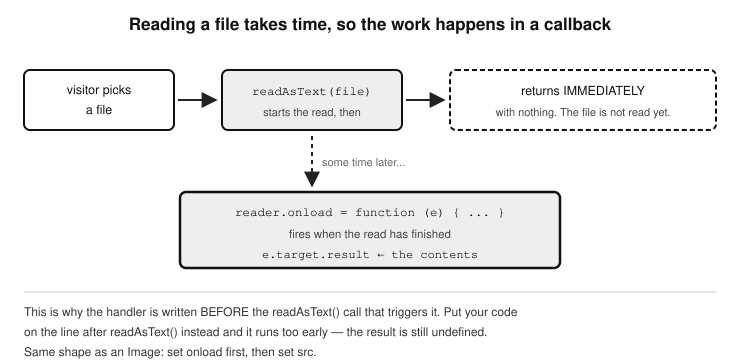
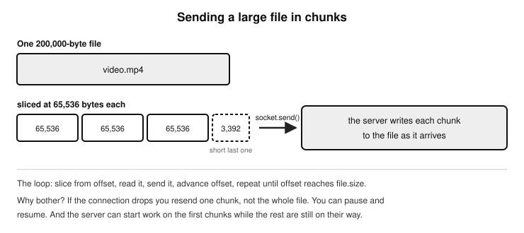

# Chapter 18 — FILE MANAGEMENT

  - The File Reader API
  - Use-cases for the File Reader API
  - Key methods
  - Upload a text file and display its contents
  - Drag and drop a file, modify and download it
  - Generate CSV from a JavaScript Array
  - Read data from a CSV file and inject into the DOM
  - Reading a file’s raw binary data with readAsArrayBuffer()
  - Validating File Signatures (a.k.a. Magic Numbers)
  - Sending binary file content over WebSocket
    - What happens on the WebSockets server side
    - Enabling CORS in a Node.js + Express Server
    - WebSockets vs video streaming
  - Previewing a PDF file
  - Reading XML files with JavaScript
    - Using the FileReader and DOMParser
    - Using the Fetch API and DOMParser
    - Using the XMLHttpRequest object
    - JavaScript XML handling with XPath
      - A quick reminder of what XPath is
      - XPath in action
      - Read from a local or remote XML file
      - Reading data from an XML string
  - Limitations of the FileReader API

  The managing of files is a very important part of every software application. This topic will demonstrate how your programming language is able to manage files (create, view, modify, delete, and transmit them through local/remote networks).
  When we talk about file management, we're usually referring to the ability to read, write, or manipulate files—things like text documents, images, or data files—either on a local machine or in a web application.
In Chapter 20 (Images) we will talk about how JavaScript can interact with images in the browser, but in this chapter, we will talk about what JavaScript can do with text files or data files. Just keep in mind that the techniques you will learn here will be very similar to the ones you will use when handling images as you will see. JavaScript does not have full access to the file system of your computer. Its access is read-only. This is for security reasons. It can also access files (read-only) on your local machine only in two ways; either via a file upload input field: 

	<input type="file">

or by using a drag and drop feature. Nonetheless, JavaScript can still do quite a lot when it comes to file handling as we will see. Just to give you a hint; being given only read access to a file does not mean those contents cannot be read and used on a web page, or used in another generated file for download. This is the approach we will be using when handling both files and images, as you will see. Here are some of the things you can do with files in JavaScript:

  - Read local files that users upload via an <input type="file"> element or by dragging and dropping them into the browser window.
  - Preview file contents, such as displaying an image or reading the text content of a file.
  - Upload files to a server using AJAX, for example via the Fetch API.
  - Let users download modified files, such as resized images or edited text, by generating downloadable links.

Drag and drop is a popular, user-friendly way to allow users to upload or interact with files in the browser.
While it’s not file management in the strictest sense, it pairs beautifully with file handling features, and we’ll explore it in this chapter as well.
  In this chapter we’ll walk through:

  - Reading and displaying text files.
  - Using drag and drop to accept files.
  - Saving or exporting edited content (like creating a downloadable text file).
  - Understanding how browser limitations affect what we can do with files.
Later, if you ever move on to backend JavaScript with Node.js, you’ll unlock full file system access. But for now, we’ll explore everything the browser side has to offer. Let’s dive in.

## The File Reader API

  The tool which JavaScript uses to manage files is the File Reader API. This API which comes built into JavaScript, allows web applications to read the contents of files selected by users via a file type input field, or drag-and-drop. However, it does not provide full filesystem access due to security restrictions. It is fully supported by all modern browsers. Let’s start by talking about the shortcomings of the API. The File Reader API has a few limitations. Here is a list of them:

  - The API cannot arbitrarily read or write files on the user’s filesystem, at least not without user interaction (again, eg via clicking to upload a file, or drag-and-drop). This means it only works with files that the user has explicitly selected to upload via a file input field, or using drag-and-drop. Outside of these two ways, it has no access to files on a local machine.
  - The API only has read-only access to these files. This means it is not able to modify or delete the files from disk.
  - It doesn't support file streaming or heavy-duty file I/O the way server-side languages like Node.js, Python, or PHP can do.
  - It is not meant for very large files. Reading very large files may cause performance issues.

For more capabilities with files, there is also a newer File System Access API which allows more advanced file operations (read/write). However, it needs the computer owner’s permission each time, which makes the process very manual, and its support is still uneven. It works in the Chromium browsers — Chrome, Edge and Opera — while Firefox does not support it at all and Safari supports only part of it. That is enough of a gap to keep it out of anything you want working everywhere.

## Use-cases for the File Reader API
Despite its limitations, the API is still very powerful. It is supported by all browsers, and is thus very reliable. Here is a list of the awesome things you can do with the API.
  - It works well when used to upload and preview files before saving them for later use, or uploading them to a server.
  - Convert images and media files into base64 format.
  - Read binary data or raw bytes using ArrayBuffers.
  - You can use it to process CSV, text, JSON, XML files etc in the browser.

  The steps to edit a file are as follows. After uploading a file and capturing the uploaded file using the File Reader API, to edit it, you create a textarea input field dynamically, next, you place the content (eg text) of the file inside of this textarea, then append the textarea to the DOM. In all of this, you are not able to save any changes you have made to the original file-as that will mean overriding the original file in its location in your computer’s filesystem-which, as we know, JavaScript is unable to do. To workaround this restriction on file modification so that you can save the changes resulting from you processing of a file in the browser, you should make your changes downloadable, as a file. This way the user can download it to their local machine. To do this in JavaScript, after reading the file with the File Reader API’s readAsText() method for example, you would use the URL object’s createObjectURL() method (URL.createObjectURL()) to create a link to the processed file, and make that link a download trigger for the file to be saved to the downloads directory of the user’s machine. Note that if you were working with the canvas API, after reading the image file with the API’s readAsDataURL(), you would convert it into a download link using the toDataURL() method of the canvas object (canvas.toDataURL()). I will show all of this in action using some demo examples. By creating this downloadable version of the edited file, the original file stays unmodified. The only way JavaScript would have been able to modify the original file by saving changes to it is if you used the new File System Access API, which allows updating a file in its original file location. Using the File System Access API is not recommended since it requires user permission and is currently only supported in Chromium browsers.  

## Key methods
The following are the methods the File Reader API provides to read files with. The method names, reflect the formats in which a file will be read.

  - readAsText(). This will read the contents of a file as plain text.
  - readAsDataURL() will read the contents of a file as a Base64-encoded string. This is very useful for images. We will see this in action when dealing with images.
  - readAsArrayBuffer() will read the contents of a file as binary data
  - readAsBinaryString() is a legacy method. Browsers still support it, but it is deprecated and you should not reach for it in new code — use readAsArrayBuffer() instead.

I think it’s time to jump into some examples. Don’t you just love examples? 
The following examples are carefully chosen to give you enough information on various file handling operations, that you will gain the confidence to do much more with files with JavaScript. We will implement them all in one HTML page, so first, let’s style the page and define the HTML elements:

#### The HTML (eg index.html)

	<!DOCTYPE html>
	<html>
    	<head>
        	<title>The JavaScript Blueprint</title>
        	<link rel="stylesheet" href="index.css">
    	</head>
    	<body>
        	<h1>File Management Lab</h1>

        	<!-- Example 1: Upload and display text -->
        	<section>
            		<h2>Upload a Text File and Display Its Content</h2>
            		<input type="file" id="fileInput" />
            		<pre id="output">Your file content will appear here...</pre>
        	</section>

        	<!-- Example 2: Drag & Drop file, modify, download -->
        	<section>
            		<h2>Drag & Drop a Text File, Modify and Download</h2>
            		
Drop a .txt file here

            		<button id="downloadBtn" style="display:none;">
				Download Modified File</button>
            		<pre id="modifiedContent">
				Modified file content will show here...
			</pre>
        	</section>

        	<!-- Example 3: Generate CSV from array -->
        	<section>
            		<h2>Generate and Download a CSV File from Array</h2>
            		<button id="generateCSV">Download CSV</button>
            		
This button downloads a CSV file with sample data like 
				names and ages.

        	</section>
            
        	
    	</body>
	</html>

#### The CSS (eg index.css)

  body {
    font-family: Arial, sans-serif;
    padding: 20px;
    background: #f7f7f7;
  }

  h2 {
    border-bottom: 2px solid #ccc;
    padding-bottom: 4px;
  }

  section {
    background: #fff;
    border-radius: 10px;
    padding: 20px;
    margin-bottom: 30px;
    box-shadow: 0 0 10px rgba(0, 0, 0, 0.05);
  }

  pre {
    background: #f0f0f0;
    padding: 10px;
    border-radius: 5px;
    white-space: pre-wrap;
    max-height: 200px;
    overflow-y: auto;
  }

  #dropZone {
	    border: 2px dashed #888;
	    padding: 20px;
	    text-align: center;
	    color: #444;
	    margin-top: 10px;
	  }

  button {
    margin-top: 10px;
    padding: 8px 15px;
    background: #007bff;
    color: #fff;
    border: none;
    border-radius: 5px;
    cursor: pointer;
  }

  button:hover {
    background: #0056b3;
  }

## Upload a text file and display its contents
  In this example, we will use the first `<section>`… element in the HTML code above. I will show this section element again here just for context and clarity.

	<section>
            	<h2>Upload a Text File and Display Its Content</h2>
            	<input type="file" id="fileInput" />
            	<pre id="output">Your file content will appear here...</pre>
        </section>

First we allow the user to upload a file using the file input field with the id attribute of “fileInput”. As soon as the file is uploaded, we will extract its contents and insert them as the value of the `<pre>` tag with the id attribute of “output”. 

  Create a text file to test with. Give it any name eg test.txt. Type into this text file the following text, just so we can test the ability to read its text content using JavaScript. 

#### test.txt
  This is a test, this is a test, first line
  This is a test, this is a test, this is a test
  This is a test, this is a test, this is a test
  This is a test, this is a test, last line

Next, place the following code in your JavaScript file eg index.js which should be in the same directory as the index.html file of your project.

	// --------- 1) Upload a text file and display its contents  ---------
	const fileInput = document.getElementById('fileInput');
	const output = document.getElementById('output');

	fileInput.addEventListener('change', function () {
  		const file = this.files[0];
  		if (file && file.type === 'text/plain') {
    			const reader = new FileReader();
    			reader.onload = function (e) {
      				output.textContent = e.target.result;
    			};
    
			reader.readAsText(file);
  		} else {
    			output.textContent = 'Please upload a plain text (.txt) file.';
  		}
	});

  Here is the full explanation of the code:

-We use an <input type="file"> to let the user select a file from their
  device. Here is how we detect a file upload event on a file input
  field:

		fileInput.addEventListener('change', function () {
			// any code in this block will run when a file is uploaded
		});

  - Once that upload event fires (occurs), we capture the uploaded file
    from the .files property of the input field element object.
    Remember that this is the standard way to retrieve uploaded
    files. Refer back to Chapter 19 (Forms and Email), explained there in
    depth.

  - Optionally, we apply some validation to ensure that the file uploaded
    is of the type we are expecting (text). If not, we display a
    message telling the user that only a text file is accepted.

			if (file && file.type === 'text/plain') {
				// ...
			}

  - The FileReader object is used to read the file as plain text with
    readAsText(file). This is an asynchronous call, and it is the thing
    that triggers the action to read the uploaded file, which when
    complete will trigger this .onload event here:

			reader.onload = function (e) {
      				output.textContent = e.target.result;
    			};

Note that the code within this block is only run when the file read
has been completed. It is therefore very necessary to wrap that
code within that event (onload()) block, so that being an
asynchronous call, it only runs when the file is successfully read.
Once it is read, the code within that block processes the
contents of the file. In this case, we extract the file’s contents—
which is stored in e.target.result, and assign it to the value of the
<pre> tag in the DOM.
	
-When reading is complete, the file content is displayed inside a
  <pre> block using textContent.

  - This is a good demonstration of how to load and show file
    content without uploading to a server—all done in the browser.

- Figure 18.1 — Reading a file takes time, so the work happens in a callback*

## Drag and drop a file, modify and download it
  This demo lets a user drag a text file, then the contents of the file will be read, modified by appending a line of text to it, and bundled into a downloadable separate file which can then be downloaded by the user. To download the modified (new) file, the user has to click on the ‘Download Modified File’ button and the file will be downloaded to their machine. The uploaded file has to be a text file, otherwise it will not work, as we have a check (validation) in place making sure it only does what it is meant to do if the dragged-and-dropped file is of type ‘text/plain’ (a text file). The validation looks like this:

	if (file && file.type === 'text/plain') {
		// ...
	}

As seen in the example HTML code above, here is the section element that holds the HTML code for this exercise:

	<section>
            	<h2>Drag & Drop a Text File, Modify and Download</h2>
            	
Drop a .txt file here

            	<button id="downloadBtn" style="display:none;">
			Download Modified File</button>
            	<pre id="modifiedContent">
			Modified file content will show here...
		</pre>
        </section>

Here is the full JavaScript code:

	// --------- 2) Drag and drop a file, modify and download it ---------
	const dropZone = document.getElementById('dropZone');
	const modifiedContent = document.getElementById('modifiedContent');
	const downloadBtn = document.getElementById('downloadBtn');
	let modifiedText = '';

	dropZone.addEventListener('dragover', (e) => {
  		e.preventDefault();
  		dropZone.style.borderColor = 'green';
	});

	dropZone.addEventListener('dragleave', () => {
  		dropZone.style.borderColor = '#888';
	});

	dropZone.addEventListener('drop', (e) => {
  		e.preventDefault();
  		dropZone.style.borderColor = '#888';
  		const file = e.dataTransfer.files[0];

  		if (file && file.type === 'text/plain') {
    			const reader = new FileReader();
    				reader.onload = function (e) {
      					modifiedText = e.target.result + '\n\n--- File Modified! ---';
      					modifiedContent.textContent = modifiedText;
      					downloadBtn.style.display = 'inline-block';
    				};
    			
				reader.readAsText(file);
  		}
		else 
  		{
    			alert("Please choose a text file!");
    			return false;
  		}

	});

	downloadBtn.addEventListener('click', () => {
  		const blob = new Blob([modifiedText], { type: 'text/plain' });
  		const url = URL.createObjectURL(blob);
  		const a = document.createElement('a');
  		a.href = url;
  		a.download = 'modified-file.txt';
  		a.click();

  		// give the browser a moment to start the download before we
  		// throw the URL away - revoking on the next line can cancel it
  		setTimeout(() => URL.revokeObjectURL(url), 1000);
	});

  Here is an explanation of the code: 
  - The div with the id attribute of ‘dropZone’ is where the user is
    expected to drop the dragged files. So to handle that, we start
    by selecting this div and storing it in a variable dropZone.
  - We also select the <pre> element of the id attribute
    ‘modifiedContent’ and the button of the id ‘downloadBtn’ and
    store them in variables of the same names. The
    ‘modifiedContent’ div is the spot where we intend to insert the
    content read from the file, while the ‘downloadBtn’ is the button
    the user clicks to download the contents of the file.
  - Next, we go ahead and set a couple of event listeners on the
    ‘dropZone’ div to handle the drag and drop, and this will teach
    you how dragging and dropping works in JavaScript. For it to
    work, we need exactly three event listeners, and they are:

      - ‘dragover’
      - ‘dragleave’
      - ‘drop’

  This is how we add the event listeners:

		dropZone.addEventListener('dragover', (e) => {
  			// ...
		});

		dropZone.addEventListener('dragleave', () => {
  			// ...
		});

		dropZone.addEventListener('drop', (e) => {
			// ...
		});

I will now explain what we do in the event blocks, which each
contain the code that will run when the corresponding events
fire. You will find that it is so easy to understand, especially
because the names of the events actually mean what they are
meant to do. So, let’s start with when the 'dragover' event fires.
This will happen when the user has dragged an item over the
border of the ‘dropZone’ div. This should happen before the item
is released (dropped). What we do in the code block to react to
this event is simple, we set the color of the border to green. This
is just to mark the zone to give the user a
visual guide of the boundaries in which they are expected to
drop the item.

In the code block of the 'dragleave' event listener, it is simple as
well. This event happens when the user moves with their mouse
out of the dropZone area whilst still dragging the item. By this,
they are essentially leaving the zone, hence the name of the
event is ‘dragleave’. At this point, they have not let go of the item
yet. What the code does here is revert the border colour of the
dropZone to what it was before it was turned to green. Again,
this is to give the user a visual guide of the drop zone which they
have now left.

The 'drop' event happens when the user lets go of (drops) the
item. It is in this code block that most of the work happens. Here
we proceed to get the file, and this time we are getting the
dragged-and-dropped file instead of a file input.
		
    When a file is dragged into the #dropZone area, we use
    JavaScript to prevent the default browser behaviour and read the
    file. Next, we revert the border colour of the dropZone from
    green to what it was before.
  - Next, we get the file, but notice carefully an important difference
    with
    where we are getting the file from. In other examples when we
    retrieved an uploaded file, we got it from the files property of the
    file input element, but with drag and drop, it is different. This
    time we access the dropped file from the files property of the
    ‘dataTransfer’ property of the current event (drop event). We do
    it like so:

			e.dataTransfer.files[0];
 
  - The rest of the code works as most using the File Reader API will
    work. The file’s content is read using FileReader, just like before.
    Basically, we read the contents of the file by calling the
    readAsText() method on the reader and passing it the file
    reference.

			reader.readAsText(file);

This method call will asynchronously read the file and trigger the
onload event on the reader when it is done

			reader.onload = function (e) {
				// ...
			}

    Once this onload event fires, we know the file has been read, so
    in its block is a function that responds to that. In this function,
    we grab the content of the file, which is in e.target.result and
    store it in a variable ‘modifiedText’.
  - As a basic modification, we append some custom text: '\n\n--- File
    Modified! ---' to it using the concatenation operator (+) and
    assign that modified text content (in modifiedText) to the <pre>
    element identified by the id attribute: modifiedContent.
  - The user can then download the modified text by clicking on the
    “Download Modified File” button. This is because we have a click
    event listener on that button to trigger the download.

			downloadBtn.addEventListener('click', () => {
				// ...
			}

Once the download button is clicked, the code in the function
block passed as the second argument of the click event listener
looks like this:

			downloadBtn.addEventListener('click', () => {
  				const blob = new Blob(
					[modifiedText], { type: 'text/plain' }
				);
  				const url = URL.createObjectURL(blob);
  				const a = document.createElement('a');
  				a.href = url;
  				a.download = 'modified-file.txt';
  				a.click();

  				// give the browser a moment to start the download before we
  				// throw the URL away - revoking on the next line can cancel it
  				setTimeout(() => URL.revokeObjectURL(url), 1000);
			});

First, to prepare the contents to be converted into a downloadable
  file in the browser, we create a bob object from the contents.

			const blob = new Blob([modifiedText], { type: 'text/plain' });

  The constructor of the Blob object takes two arguments, the content
  for the download file, and information about what type of file it is.
  We pass the file type information as an object literal like so:

			{ type: 'text/plain' } 

  This second argument is very important, because it needs to know
  what type of file it is creating. In this case, we want a text file. We
  then use the createObjectURL() method of the URL API to create a
    link to the file Blob has created in memory.
  - Normally, you can use an existing button in your browser, or create
    one in code (dynamically) and insert it into the browser for users
    to use to download the created file via a click event. In this
    example however, we do it differently. Because it is a drag-and-drop file which we wish to immediately download, we have no
    link or button in the browser for the user to click. There is no
    need for that. What we do is dynamically create an anchor (link)
    element, and trigger a click event which will activate the
    download action by visiting the link defined in the href attribute
    of the anchor element. Here is the code:

			const a = document.createElement('a');
  			a.href = url;
  			a.download = 'modified-file.txt';
  			a.click();

The first line creates the anchor tag. Next, we assign the URL
reference of the generated file in memory to the href attribute of
the anchor element. We specify our desired name for the file to
be downloaded as 'modified-file.txt’. Lastly, we trigger a click
event by calling the click() method on the anchor element.

			a.click();

    This is amazing, to see that in JavaScript, you can dynamically
    simulate, so-to-speak, a click on a link or button, or any element
    for that matter; all in memory without that element ever existing
    in the browser.
  - At the end of the code in the click event listener, after the file is
    supposed to have been downloaded, we close with a call to the
    revokeObjectURL() method of the URL API. This will discard the
    temporal URL reference to the file downloaded file that was
    created by URL.createObjectURL(). This is important to prevent
    memory leaks.
  - Alternatively, instead of modifying the content of the read file in
    code, we could also easily allow the user to do that themselves
    in the browser by using a textarera input element instead of a
    <pre> element which is read-only. This means, the original
    content of the file, once read, could be inserted as the value of a
    textarea field on the web page. Textarea fields as we know, allow
    user input unless specifically made read-only by adding a
    disabled attribute to them. The user can then add or modify the
    content, and in JavaScript we would retrieve that content from
    the textarea field from its value property, to be used as the
    content of the generated download file.

The example has shown you how JavaScript can read, manipulate, and regenerate a file in the browser using a Blob.
  We have seen how a Blob is the key to generating a downloadable file from random or loose content in the browser. We talked about the concept of Blobs in Chapter 15 (DOM/ Frontend UI), under the sub-heading “Manipulating the URL with the URL API”, but now we got to see it in action. Once more, a BLOB (Binary Large Object) is like a container in which you wrap up stuff that might not have a defined size which you want to transmit eg by uploading to a remote server, allowing it to be downloaded etc. You put it in this container to make it easier for JavaScript to manage them together as one object. This BLOB or container could contain text, images, or even video data. That is essentially what a BLOB is. It lets you store and treat raw data (text, images, anything!) like a file. You create it in JavaScript using the built-in Blob class like so:

		const blob = new Blob([data], { type: "text/plain" })

Notice how you pass as the first argument, the data you want to put in the BLOB in an array, then pass in a second argument which is information about the type of the file you wish to create. In the code snippet above, we want to create a text file. Next, you can generate a download link for the file to be created using URL.createObjectURL(blob). For example:

		const url = URL.createObjectURL(blob);

## Generate CSV from a JavaScript Array
  This demo takes a JavaScript array of arrays and turns it into a CSV format.

	const data = [
  		['Name', 'Age', 'Country'],
  		['Alice', '25', 'USA'],
  		['Bob', '30', 'UK'],
  		['Charlie', '28', 'Canada']
	];

	document.getElementById('generateCSV')
	.addEventListener('click', () => 	
	{
  		const csvContent = data.map(row => row.join(',')).join('\n');
  		const blob = new Blob([csvContent], { type: 'text/csv' });
  		const url = URL.createObjectURL(blob);
  		const a = document.createElement('a');
  		a.href = url;
  		a.download = 'data.csv';
  		a.click();

  		// give the browser a moment to start the download before we
  		// throw the URL away - revoking on the next line can cancel it
  		setTimeout(() => URL.revokeObjectURL(url), 1000);
	});

Here is how this code works. We wrap it all in an event listener, which listens for a click on the ‘Download CSV’ button. This makes sense because nothing needs to be done otherwise. Once that click event fires (occurs) we proceed by
going through all the elements in the data array, and joining each row with commas (,), ending each line (row) with newline character (\n) to form proper CSV text. 

  This ends up with each element (row) in the data array being written as a line of text in the CSV file to be created.

  A Blob is created to hold the text as a downloadable file.
Using URL.createObjectURL(), a temporary download link is created, and a file is downloaded when the button is clicked.
  
  This example is meant to teach you how to generate files in the browser from scratch—useful for exporting user data or reports.

 

## Read data from a CSV file and inject into the DOM
  This code lets a user select the CSV file, reads its content using FileReader, and displays it as an HTML table. The example is as follows:

- a) Create a CSV file in the root of your local project folder. Name the file
  anything you want, like ‘employees’. Add this dummy people data in it:

  Name,Age,Email,Country
  Alice,25,alice@example.com,USA
  Bob,30,bob@example.com,UK
  Charlie,28,charlie@example.com,Canada

- b) Have a stylesheet e.g index.css with this code

	table, th, td {
    		border: 1px solid black;
    		border-collapse: collapse;
    		padding: 8px;
  	}

- c) Have an HTML file (e.g. index.html) with this code:

	<!DOCTYPE html>
	<html>
    	<head>
        	<title>The JavaScript Blueprint</title>
        	<link rel="stylesheet" href="index.css" type="text/css">
    	</head>
    	<body>
        
        	<h1>Read CSV File and Display as Table</h1>
        	<input type="file" id="csvFile" accept=".csv">
        	  
        	

		
    	</body>
	</html>

- d) Have a JavaScript file (e.g. index.js) with this code in it:

	document.getElementById('csvFile').addEventListener('change', function(event) {
    		const file = event.target.files[0];
   		 if (!file) return;

   	 	const reader = new FileReader();
    		reader.onload = function(e) {
      			const text = e.target.result;
      			displayCSVAsTable(text);
    		};
    		reader.readAsText(file);
  	});

  	function displayCSVAsTable(csvText) {
    		const rows = csvText.trim().split('\n');
    		const table = document.createElement('table');

    		rows.forEach((row, rowIndex) => {
      			const tr = document.createElement('tr');
      			const cells = row.split(',');

      			cells.forEach(cell => {
        		const td = rowIndex === 0 ? document.createElement('th') : 				document.createElement('td');
        			td.textContent = cell;
        			tr.appendChild(td);
      			});

      			table.appendChild(tr);
    		});

    		// Clear old tables
    		document.getElementById('tableContainer').innerHTML = '';  
    		document.getElementById('tableContainer').appendChild(table);
  	}

  You should be very familiar with this FileReader code flow by now. Here is the brief run-down of it:
	
  - A user clicks to upload a file.
  - FileReader.readAsText() reads the file content as plain text.
  - The CSV data is split by every new line (\n) to get data for the rows, and put in an array, then the text in each row (line) is split by commas (,) to extract the data for the individual columns.
  - A dynamic HTML table is created based on the file contents.

## Reading a file’s raw binary data with readAsArrayBuffer()
  We have already used two methods for turning file data into something downloadable, and it is worth being clear about where each one lives, because neither belongs to the File Reader API. createObjectURL() is a method of the URL object and is suitable for handling blobs, while toDataURL() is a method of a canvas element and is suitable for canvas images. The File Reader API’s own methods are the readAs... family we listed earlier, and there is one of those we have not talked about yet: readAsArrayBuffer(). The readAsArrayBuffer() method of the FileReader API is used to read a file's raw binary data. It reads the contents of a file (or blob) and returns it as an ArrayBuffer, which is a low-level representation of binary data. 
  It can be used in different scenarios. Here are scenarios when you may need to use the readAsArrayBuffer() method:

- a) When you’re working with binary files, such as:

  - Images
  - Videos
  - PDFs
  - Custom binary formats
  - Audio files (e.g., .mp3, .wav)

- b) When you want to pass binary data to another API, like:

  - WebSockets (to send binary data in real time)
  - fetch()/XMLHttpRequest for uploading
  - Blob() constructor for creating new binary blobs
  - Encryption/Decryption libraries

- c) When you want to manipulate or inspect the binary contents using DataView, Uint8Array, etc.

All this information is about being able to read into a file down to the binary level. But if you are like me, it does not mean much. You prefer to see it in practice, and that’s the best way to learn. Let’s look at an example of readAsArrayBuffer() being used. 

## Validating File Signatures (a.k.a. Magic Numbers)
  Imagine you want to ensure that an uploaded file is really a JPEG or PNG, and not just renamed with a .jpg or .png extension.
This is important because people can rename malicious files to trick file uploaders. Reading the first few bytes of the file (its magic number) can help detect fakes. This example therefore, is a validation solution. 
  The following example code will detect if a file is truly a PNG or JPEG:

	<input type="file" id="fileInput" />

	

Practically, this is useful in the following ways:

  - Security: It helps prevent file spoofing (e.g. .exe renamed as .jpg).
  - Reliability: It confirms file type without relying on file extensions or MIME types.

Hopefully, this example teaches you how to programmatically inspect the raw binary data of a file. This is a great skill to have as a developer learning to handle media or binary formats.

## Sending binary file content over WebSocket
  We will talk some more about WebSockets in Chapter 22 (Extensions), but here is what it is. A WebSocket is a two-way communication channel between the browser and the server. Unlike regular HTTP requests (which are one-way), WebSockets stay open, allowing both sides to send and receive data continuously. This makes WebSockets great for things like chat apps, multiplayer games, live dashboards, and — yes — even real-time file sharing.
  If you are building a collaborative file-sharing app or a peer-to-peer (computer-to-computer) media uploader, and you want to send a file chunk by chunk over a WebSocket—maybe to avoid HTTP overhead or allow real-time transmission. You can do that using the readAsArrayBuffer() method of the File Reader API.
  Why is it better to send a large file in chunks rather than uploading a whole file at once? Normally, when uploading a file to a remote server, you would use a regular 

	<input type="file"> 

input element, and AJAX, via the fetch API or XMLHttpRequest, to send it to the remote server. Then you would do the following:

  - Select the entire file
  - Send it all at once to the server
  - Wait until it’s 100% uploaded to do anything with it

This works just fine for small files. But for large files (like videos, audio, or big documents), sending the entire file at once can cause problems.
  Here’s why chunking can be useful—especially over a WebSocket:

  - Real-time Streaming or Processing
    This will be great for video platforms or live audio transcription
    This means that instead of waiting for the whole file, the server
    can start decoding and showing the video as soon as the first
    chunks arrive. That’s how media platforms like Netflix and
    YouTube let you start watching before the entire video is
    downloaded.
  - Avoiding HTTP Overhead
    HTTP overhead refers to the many bits of information that
    need to be handled during each HTTP request, such as a file
    upload request. A file upload, as all HTTP requests, involves
    sending request headers back and forth
    between your computer and the server, with repeated
    connections being opened and closed for each request-response, and extra steps taken per file being uploaded. Using a
    WebSocket on the other hand has the following advantages:

      - Opens one persistent connection
      - Has less overhead
      - Sends data as-is with minimal packaging

This results in faster communication, especially for apps that
do a lot of back-and-forth (like collaborative tools).

  - Using a WebSocket to send chunks provides more fine-grained control over the file upload process, such as giving you the ability to pause, resume the upload, or retry if something goes wrong. These can be useful if you are building a file upload manager app, or if you are working with slow or unstable networks which can stall mid way in the upload process. By sending chunks one at a time:

    - If one chunk fails, you can retry just that chunk
    - You can pause and resume the upload without starting over.
    Without using a WebSocket, you will be trying to upload the
    full file at once, which means if anything breaks, the user has
    to re-upload the entire file again

  - Using a WebSocket to send chunks is ideal when building real-time peer-to-peer (P2P) file transfer apps. Examples of such apps can be Bluetooth/WiFi direct transfers, file-sharing without a central server. With such applications, sending chunks lets two users exchange data bit by bit, showing progress or reacting in real time—like a chat app for files.

  When working with large files like videos, images, or even documents, JavaScript gives you a powerful tool called readAsArrayBuffer() from the FileReader API. This method reads a file and gives you its raw binary data, which is perfect for sending through a WebSocket connection.
But what does that really mean? And how is it different from something like YouTube, where videos just seem to play instantly without being fully downloaded first? Let’s break this down step-by-step.
The following is an example of sending a Video File in Binary Chunks over WebSocket. We want to send a big file (like a video) from the browser to a server using a WebSocket bit by bit (called chunks), instead of sending it all at once. This allows better control and smoother progress, especially with large files.

#### HTML code

	<input type="file" id="videoUploader">

#### JavaScript code

	const socket = new WebSocket("ws://localhost:3000");

	socket.addEventListener("open", () => {
  		
		document.getElementById("videoUploader")
		.addEventListener("change", (e) => {
    			const file = e.target.files[0];
    			const chunkSize = 64 * 1024; // 64KB per chunk
    			let offset = 0;

    			const reader = new FileReader();

    			reader.onload = function(event) {
      				if (socket.readyState === WebSocket.OPEN) {
					// Send binary data
        				socket.send(event.target.result); 
        				offset += chunkSize;
        			
					if (offset < file.size) {
          					readNextChunk();
        				} else {
          					console.log("File upload complete.");
        				}
      				}
    			};

   			 function readNextChunk() {
      				const slice = file.slice(offset, offset + chunkSize);
      				reader.readAsArrayBuffer(slice);
    			}

    			readNextChunk();
  		});
	});

This code reads the file chunk by chunk and sends each piece over the WebSocket connection as binary data.

- Figure 18.2 — Sending a large file in chunks*
 Here is an in-depth explanation of how it works:

We start by creating a WebSocket connection to the server running at localhost (your computer) on port 3000. This sets up a 2-way chat pipe between your browser and the server.

	const socket = new WebSocket("ws://localhost:3000");

Next, we wait until the WebSocket connection is fully open—like waiting for a phone call to connect before talking.

	socket.addEventListener("open", () => {
		// ...
	});

We listen for when the user selects a file (like a video) using a file input (`<input type="file" id="videoUploader">`). When they do, the code inside this function runs.

	document.getElementById("videoUploader")
	.addEventListener("change", (e) => {
		// ...
	});

We get the first file they selected, and store it in a variable called file.

	const file = e.target.files[0];

We decide to slice the file into pieces (chunks) that are 64 kilobytes (KB) each. That’s a reasonable size—not too big, not too small.

	const chunkSize = 64 * 1024; // 64KB per chunk

We start from the beginning of the file. As we send chunks, this number keeps track of where we are.

	let offset = 0;

We grab the FileReader—the specialised tool for reading files in our browser. 

	const reader = new FileReader();

Next, we set up what happens every time the FileReader finishes reading a chunk. When it’s done, the code inside here runs.

	reader.onload = function(event) {
		// ...
	}

We make sure the WebSocket connection is still open before trying to send data.

	if (socket.readyState === WebSocket.OPEN) {
		// ...
	}

We send the chunk of binary data (from the file) over the WebSocket to the server.

	socket.send(event.target.result);

We move our pointer forward by the size of the chunk. So we’re ready to send the next piece.

	offset += chunkSize;

If we haven’t reached the end of the file yet, we call readNextChunk() to read and send the next piece. This is what creates the loop effect, so that the chunks of the file are being read until the very last one. If we have reached the end of the file, we say the upload is done by writing the text “File upload complete” to the console.

	if (offset < file.size) {
  		readNextChunk();
	} else {
  		console.log("File upload complete.");
	}

	Here is the custom function readNextChunk() which will keep reading the file until all the chunks are read. It does so by slicing the next piece of the file—from where we left off (offset) to the next chunk, each time it is called. While doing so, we tell the FileReader to read each of the slices as an ArrayBuffer (a binary format we can send).

We start the whole process by reading the first chunk. This kicks off the reading and sending loop.

	readNextChunk();

### What happens on the WebSockets server side

  In the above example, we start with this code to create a WebSocket connection to the server running at localhost (your computer) on port 3000. This sets up a 2-way chat pipe between your browser and the server.

	const socket = new WebSocket("ws://localhost:3000"); 

But what does this actually mean, and what is the meaning of "ws://localhost:3000"?

To actually upload a file using WebSocket (or even handle any server logic), you need to run a real backend server, such as:

  - Node.js with ws, express, or socket.io
  - PHP (though PHP typically uses HTTP, not WebSocket)
  - Python, Go, or any backend tech that supports WebSockets

This means first of all that you must have a WebSocket server up and running, whether locally or remotely on the internet. This is needed for this or any WebSocket connection application to work. A WebSocket server is a server that supports WebSockets, as in the examples given above, which are servers running on Node.js, Python, Go etc. The string "ws://localhost:3000" passed to WebSocket() above means your WebSocket server is running on localhost (your local machine) and listening for WebSocket connections on port 3000.

  localhost - means your own computer (not the internet).

3000 - refers to the port number where the WebSocket server should
  be listening for this to work. Change that port number to the
  port number your WebSocket server is listening.

If you are using localhost (your machine), as is in this example, it is very common to use a Node.js backend—because Node has full support for WebSockets, file handling, and custom server logic. The above example assumes you are doing that—running a Node.js server locally. 

Do not confuse that with the Live Server in VS Code which I guided you to set up so you can test your JavaScript code. The Live Server in VS Code is a static file server, which means it only serves HTML, CSS, and JavaScript. It does not support WebSocket connections out of the box. It also does not handle server-side logic like receiving file uploads or processing binary data. So you cannot upload a file to Live Server the way the WebSocket example shows.

To test this feature locally; let us write code to set up an example Node.js server. Though Node.js is beyond the scope of this book, I will give the example code on the server-side just because it is important for you to see the full communication process that makes this feature work. Since we are on the topic of file management, it only makes sense for you to learn what happens on the backend, when you send a file over via an upload. I choose a Node.js server because it is the easiest to set up on your local machine, and is a very common and popular solution for JavaScript development. 
  In your already existing web project, create a JavaScript file server.js – for the Node.js backend code

#### HTML code
We will use the same HTML code as in the above example that just has the file input field.

#### JavaScript code
We will maintain the same example JavaScript code above that captures the uploaded file and makes a WebSocket request to the Node.js server

#### Install Node.js, and the WebSocket library

- Install Node.js if you don’t have it installed on your computer already.
  Node.js is a tool that lets you run JavaScript outside the
  browser-on your computer like a regular program. It also comes with
  a super useful tool called npm (Node Package Manager), which helps
  you install extra features and tools. Follow these steps to download
  Node.js:

    - Go to the official Node.js website: https://nodejs.org
    - Choose the LTS version and click to download it.
    - Next, open the downloaded file and go through the installer steps: Just keep clicking Next until you see Finish. Keep all default settings unless you know what you're doing.
    - Check If It Worked. After installation, you can check if Node.js was installed correctly:
      - On Windows: Press Windows + R, type cmd, and press Enter
      - On Mac: Open the Terminal app
      - On Linux: Use your terminal or shell
      - Type the following and press Enter:
		
node -v

  You should see something like:

v20.12.2

  That means Node.js is installed. Then check for npm:

npm -v

  You should see a version number for that too. Now that Node.js is
  installed, you can run JavaScript files in your terminal using node,
  create backend servers, and use npm to install tools like express,
  ws, nodemon and more.

- Install the WebSocket library like so: Open a terminal, then navigate to
  your web project folder and run:

  npm init -y
  npm install ws

#### server.js
This is the file that will contain the Node.js server-side code, that will open a WebSocket port, listen for in-coming requests, then receive and save the uploaded file. Here is the code for it: 

	const fs = require('fs');
	const path = require('path');
	const WebSocket = require('ws');

	const wss = new WebSocket.Server({ port: 3000 });

	console.log(
		"WebSocket server is running on ws://localhost:3000"
	);

	wss.on('connection', (ws) => {
  		console.log("New client connected");

  		const uploadPath = path.join(
			__dirname, 'uploaded_video.mp4');
  		const writeStream = fs.createWriteStream(uploadPath);

  		ws.on('message', (data) => {
    			// Write each chunk of binary data to the file
    			writeStream.write(data);
  		});

  		ws.on('close', () => {
    			writeStream.end();
    			console.log("Upload complete, connection closed");
  		});

  		ws.on('error', (err) => {
    			console.error("WebSocket error:", err);
    			writeStream.end();
  		});
	});

To start the server, in your terminal and while in your web project directory where the ‘server.js’ file is, run the following code:

  node server.js

Next, test the upload now by uploading a video or any large file.

After the upload, you should see a new file “uploaded_video.mp4” created in your folder, which contains the file/video you uploaded.
  Let us discuss a little about how the Node.js code (server-side) in server.js works. 

  - The "message" keyword on the line: ws.on('message', (data) => { ... });
  is not a custom word. It must be exactly as it is given. This is
  because "message" is a standard, built-in WebSocket event. The
  fact is, in Node.js (and in the browser too), WebSockets have a few
  standard event names you must use exactly — they are not
  customisable. Here is a breakdown of those event names:

	
| Event name | Meaning |
|---|---|
| "message" | A new message (data) was received |
| "open" | The connection has been successfully opened |
| "close" | The connection has closed |
| "error" | Something went wrong |

  So when you write:

		ws.on('message', (data) => {
  			// handle incoming data
		});

  You're telling the WebSocket server to run this code whenever a
  message comes in from the client.
  If you changed "message" to something else like "fileUpload", it
  won’t work — the server won’t recognise it.

  - The “close” event in the line ws.on('close', ...) can happen on the
  server when the client disconnects, and can also happen on the
  client when the server disconnects. It's a two-way event—either
  side can trigger it, and the other side will also get notified. For
  example:

    - If the user closes their browser tab, the client disconnects, and the server receives a "close" event.
    - If the server shuts down or manually calls ws.close(), then the client will receive the "close" event too.

	-Think of WebSocket as a phone call.
        * message = when someone speaks.
        * close = when someone hangs up.
        * error = when the line has a problem.
	  These events let you respond to those moments.

#### WebSockets with Socket.IO
  What if you wish to make a WebSocket request to Socket.IO instead of your local machine, what would this line look like? 

	const socket = new WebSocket("ws://localhost:3000");

If you're switching from a vanilla WebSocket server (like the one you wrote using Node.js and the ws package) to Socket.IO, the connection process changes slightly — because Socket.IO isn't just a plain WebSocket. It uses its own protocol on top of WebSockets (with fallbacks like long polling), and it requires a dedicated Socket.IO client library on the frontend. Instead of:

	const socket = new WebSocket("ws://localhost:3000");

There are two (2) ways you could do it. Here they are:

  - 1) You can reference the remote Socket.io client via their Content
    Delivery Network (CDN) to create a client without having the
    code on your local machine. Do it like so:

#### HTML code (to load the Socket.IO client via CDN)
		

#### JavaScript code
  
		// Or io("http://localhost:3000")
		const socket = io("https://your-server.com"); 

The value (string) you pass to io() will be location of your
WebSocket server, which can be on your local
machine (eg server.js), in which case you would pass in
"http://localhost:3000". Note that this is different from
"ws://localhost:3000".

  - 2) Alternatively, you can use the Node Package Manager (NPM) tool
    which you should have installed on your machine together with
    Node.js—the same one you should have used to install the
    WebSocket (ws) library. Use NPM to install the socket.io client
    onto your local machine like so, via your terminal:

npm install socket.io-client

#### Then in your JavaScript code

		import { io } from "socket.io-client";

		// or io("http://localhost:3000")
		const socket = io("https://your-server.com"); 

Again, the value (string) you pass to io() will be the
location of your WebSocket server, which can be on your local
machine (eg server.js), in which case you would pass in
"http://localhost:3000". Note that this is different from
"ws://localhost:3000".

#### Conclusion
In conclusion, when you are talking to a standard WebSocket server, you create the client end of the connection like so:

	  new WebSocket("ws://...")

Whereas, for communicating with a Socket.IO server, you create that client like so:

	  io("http://...")

Note that both of those lines run in the BROWSER and create a client. The server is the separate program you started with node server.js.

If your server is on another machine or hosted online, create a WebSocket client like so:

	// or any deployed server with socket.io
	const socket = io("https://your-cool-app.vercel.app"); 

Make sure CORS is enabled on your server. CORS stands for Cross-Origin Resource Sharing. It's a security rule built into web browsers that controls which websites are allowed to talk to each other. For example: If your webpage is running on http://mywebsite.com, and it tries to get data from http://anotherwebsite.com, the browser will block it unless the other website says, "Hey, it's okay for mywebsite.com to access me." So, if you're using WebSockets or APIs across different sites or ports, you'll need to enable CORS on the server so the browser allows the connection. This is done just on the server side.

### Enabling CORS in a Node.js + Express Server
  I know I said Node.js is beyond the scope of this book. But I will like to provide you with a sample server-side CORS setup just for Node.js. My aim is to provide you with handy solutions to most challenges you are likely to face, especially something like CORS which is a vital skill to have. Luckily, setting up CORS is super easy, especially if you're using Node.js with Express. You can do it by following these steps:

  - Install the cors package via npm

npm install cors

  - Use it in your server file (server.js in our example). Here’s an example server (server.js) with CORS enabled:

	const express = require('express');
	const http = require('http');
	const WebSocket = require('ws');
	const cors = require('cors');

	const app = express();
	app.use(cors()); // Allow all origins by default

	const server = http.createServer(app);
	const wss = new WebSocket.Server({ server });

	wss.on('connection', (ws) => {
  		console.log('A client connected via WebSocket.');

  		ws.on('message', (message) => {
    			console.log('Received:', message);
    			// You can save chunks here
  		});

  		ws.on('close', () => {
    			console.log('Client disconnected.');
 	 	});
	});

	server.listen(3000, () => {
  		console.log('Server running on http://localhost:3000');
	});

Notice how we import the cors package and then use it like so:

	const app = express();
	app.use(cors()); 

If you want to allow only a specific origin, just pass that origin (domain) as an object literal with a key that says ‘origin’ to cors() like so:

	app.use(cors({
  		origin: 'http://your-frontend-domain.com'
	}));

Here is a bonus tip: If the browser ever blocks a request and says something like “CORS policy error”, it’s usually because the server hasn’t allowed your frontend to access it. Just use the cors package and you're good to go.
  You may have noticed that when we set up the WebSocket server earlier, we never had a line like this: 

	server.listen(3000, () => { 
		console.log('Server running on http://localhost:3000'); 
	});

This is because, earlier, we set up only a WebSocket server and not an HTTP server. So we just did:

	const wss = new WebSocket.Server({ port: 3000 });

We didn’t use http.createServer() or Express. That style runs WebSocket-only, without a regular HTTP server. That’s why there was no need for a server.listen() in that case—the WebSocket server handled its own listening.

This time around, when adding CORS, we needed an HTTP server for that, and therefore we absolutely needed this line:

	server.listen(3000, () => {
  		console.log('Server running on http://localhost:3000');
	});

That line starts the HTTP server, which is required because we attached the WebSocket server to it like this:

	const server = http.createServer(app);
	const wss = new WebSocket.Server({ server });

Without the server.listen(…) line, no server will be started.

### WebSockets vs video streaming
  When sending large files, for example video files via a WebSocket, that is not the same thing as real video streaming like Netflix or YouTube. Once uploaded to the (remote) server, the job of WebSocket is done. Though you can start processing or displaying the file on the remote server as it arrives, how you manage this playback process is a separate thing. You would need to build your own video player logic to play the data in chunks. Real streaming services offered by platforms like Netflix or YouTube use smart streaming protocols like HLS (HTTP Live Streaming) and MPEG-DASH (Dynamic Adaptive Streaming over HTTP). 
  These streaming protocols offer the following:

    * Chop the video into small, downloadable segments to pass down to the video player via the <video> HTML element of a web page. 
    * Allow the video player on a web page to request for only the needed segments
    * Enable adaptive quality (e.g., switch from 1080p to 720p if internet is slow)

This makes video smooth, fast, and user-friendly — which WebSocket by itself doesn’t provide.
  So, in conclusion, WebSockets can be used to stream media, but not in the traditional sense. It is not optimised for that. While you can stream binary chunks of a video or audio file over WebSocket, you’ll need to build your own playback logic. Real video streaming uses smarter protocols like HLS or MPEG-DASH, which streaming services like YouTube and Netflix use. Here is when you can use WebSockets for media:

  - When you are building your own media uploader or experimental video player
  - When building a peer-to-peer (P2P) file sharing app
  - When building real-time collaborative apps (like drawing tools)
  - When sending snapshots from a camera feed in real-time

Here is when not to use WebSockets with media:

  - Not suitable for full video streaming to public users
  - Not for building a Netflix/YouTube clone (use HLS or MPEG-DASH instead).

Sending files using WebSockets gives you more power and control — you decide how the file is read, uploaded, and processed. This is great for learning how data flows in real time. But remember, if you want your users to press play and instantly enjoy videos, it's better to stick with streaming protocols built for that job.
  Tip: You can still use what you’ve learned here to build cool tools — like live editors, custom dashboards, or unique file-transfer systems!

## Previewing a PDF file
  This example allows the user to select a .pdf file to upload, after which it reads it using readAsArrayBuffer(), then creates a temporary URL so the PDF file can be viewed directly in the browser.

#### HTML code
	<input type="file" id="pdfUploader" accept="application/pdf" />
	  
	<iframe id="pdfPreview" width="100%" height="500px"></iframe>

#### JavaScript code
	document.getElementById("pdfUploader")
	.addEventListener("change", function (e) {
  		const file = e.target.files[0];

  		if (file && file.type === "application/pdf") {
    			const reader = new FileReader();

    			reader.onload = function (event) {
      				const arrayBuffer = event.target.result;

      				// Create a Blob from the ArrayBuffer
      				const blob = new Blob(
					[arrayBuffer], { type: "application/pdf" }
				);

      				// Create a temporary URL for the blob
      				const url = URL.createObjectURL(blob);

      				// Set the URL in an <iframe> to preview it
      				document.getElementById("pdfPreview").src = url;
    			};

    			reader.readAsArrayBuffer(file);
  		} else {
    			alert("Please upload a valid PDF file.");
  		}
	});

This code should be familiar to you by now. But here is a run down of what it does:
  - The user selects a file to upload
    We detect the file and ensure it’s a PDF.
  - FileReader reads it
    readAsArrayBuffer() loads the raw binary contents.
  - A blob is created
    We turn the buffer into a Blob with MIME type application/pdf
  - An object URL is created
    A temporary blob URL is made with URL.createObjectURL()
  - The PDF file is previewed
    We insert that URL into an <iframe> so it shows up in-browser.

## Reading XML files with JavaScript
  JavaScript provides several powerful ways to read and work with XML files, both from local sources (such as user-uploaded files) and remote servers (such as web APIs or hosted XML documents). XML, which stands for eXtensible Markup Language, is a structured format used for storing and exchanging data. It's commonly used in many older APIs and in configurations, making it important for JavaScript developers to know how to handle it effectively.
There are four common approaches in JavaScript to read and work with XML files, each suited for a different use case. In this section, we’ll explore these methods one by one with hands-on examples. But first, let’s understand what each approach does and when you’d use it:

a) Using the FileReader and DOMParser
This method is ideal when you want to read local XML files, such as when a user selects a file from their computer using an `<input type="file">` element. JavaScript's FileReader object is used to read the contents of the file, and the DOMParser object then converts the raw XML string into a document that can be navigated like a regular HTML page. Once parsed, you can use standard DOM methods (like getElementsByTagName() or querySelector()) to extract and display data from the XML file.

  Workflow hint: local file → FileReader → DOMParser → DOM methods

b) Using the Fetch API and DOMParser
This modern and clean method is perfect for reading remote XML files available over the internet. You start by using the fetch() function to request the XML file from a URL. Once the response is received as plain text, you pass it into DOMParser to convert it into an XML document. Just like before, you can then explore the data using DOM methods.

  Workflow hint: fetch() remote file → DOMParser → DOM methods

c) Using XMLHttpRequest
This is the older way to read XML from a remote source, but it still works and is widely used in legacy systems. The XMLHttpRequest object can directly receive an XML document response. In many cases, you can work with this responseXML directly. If you're dealing with a plain text response instead, you can still use DOMParser to turn it into a DOM document and proceed with normal XML handling using DOM methods.

Workflow hint: XMLHttpRequest → (optional) DOMParser → DOM
  methods

d) JavaScript XML Handling with XPath
When you need precise control over what part of the XML to extract—especially from deeply nested structures—XPath becomes extremely useful. XPath lets you write expressions to “query” specific data from an XML document. You can use it with any of the above methods, once you have an XML document in hand. JavaScript provides the document.evaluate() function to apply XPath queries, allowing you to pull out just the data you need, even from complex XML files.

	Workflow hint: (any method to get XML) → DOMParser if needed → 
					document.evaluate()

  Here are some example scenarios when you may need to deal with an XML file:

  - Reading config files in XML format.
  - Parsing RSS feeds (which are XML-based).
  - Processing API responses in XML (though JSON is more common
  today).

  Once XML data has been extracted and parsed (converted) into a document; among the DOM methods used to read the data, the following are common:

  - Get elements by tag using .getElementsByTagName() for example:

        	xmlDoc.getElementsByTagName("book");

    	-Query with CSS selectors using .querySelector() for example select 
	   an <author> tag like this:

        	xmlDoc.querySelector("author");

  - Extract text content using .textContent for example:

        	element.textContent;
    	
  - Get attributes using getAttribute() for example select an element
  with an id attribute value of "id":

        	element.getAttribute("id");

  Each of the approaches listed above for reading XML files has its own strengths and use cases. As you go through the upcoming examples, you’ll see how flexible JavaScript is when it comes to handling XML—whether it’s reading a local file from your computer or pulling data from a web service. Let’s dive deeper into the above-mentioned four approaches JavaScript takes to read and process XML files.

### Using the FileReader and DOMParser
  The DOMParser API converts an XML string into a traversable DOM object, similar to the HTML DOM whereby it then becomes very easy to read the XML document using the various methods provided by the HTML document object—which you are already familiar with. I introduced the DOMParser in Chapter 15 (DOM and URL Manipulation). Let’s dive right into the steps of reading an XML file. 
  This approach involves using a combination of FileReader and the DOMParser. FileReader will do the reading of the file, and pass its contents to DOMParser as a string. This combination is best suited for reading local files. The workflow is as follows:

  - You select an XML file via a file input field (<input type="file">) on a web page.
  - Next, you read the file using the FileReader, and typically store its text (string) in a variable.
  - Next, you parse (convert) the text into an XML DOM object using the DOMParser
  - Finally, extract the data you need from the file using DOM methods (`getElementsByTagName`, `querySelector`, etc.).

Let us look at an example. Using your IDE (e.g VS Code), create a local XML file to use for testing the following examples with. Name the file for example ‘books.xml’ and paste the following XML code in it:

	<library>
    		<book>
        		<title>JavaScript: The Good Parts</title>
        		<author>Douglas Crockford</author>
    		</book>
    		<book>
        		<title>Eloquent JavaScript</title>
        		<author>Marijn Haverbeke</author>
    		</book>
	</library>

Next, place this code in your HTML document. 

	<input type="file" id="xmlFileInput" accept=".xml" />
         <pre id="output"></pre> 

It contains the file input field to allow you select the XML file to upload into the program to process it. Notice the accept=“” attribute which has a value of ‘.xml’ so it accepts XML files. The `<pre>` tag will be the target element where the parsed XML data will be displayed for you to see.

Here is the code to place in your JavaScript file:

	document.getElementById('xmlFileInput')
	.addEventListener('change', (e) => {
    		const file = e.target.files[0];
    		const reader = new FileReader();

    		reader.onload = (event) => {
      			const xmlString = event.target.result;
      			const parser = new DOMParser();
      			const xmlDoc = parser.parseFromString(
				xmlString, "text/xml"
			);

      			// Extract data (example: get all <book> tags)
      			const books = xmlDoc.getElementsByTagName("book");
      			let output = "";
      
      			for (let book of books) {
        			const title = book.querySelector("title").textContent;
        			const author = book.querySelector("author")
					.textContent;
        
				output += `Title: ${title}, Author: ${author}\n`;
      			}

      			document.getElementById("output").textContent = output;
    		};

    		reader.readAsText(file);
  	});

As you can see, it uses the FileReader in combination with the DOMParser. The working of the code should already be familiar to you right now. But let me drop you some hints on what it does, just in case. This code reads an XML file selected by the user, extracts information from it (in this case, book titles and authors), and displays that information on the screen. 

  - First it waits for the User to Select a File

		document.getElementById('xmlFileInput')
  		.addEventListener('change', (e) => {
			// ...

This line listens for when the user chooses a file from an <input
type="file" id="xmlFileInput">. When that happens, the code inside
the function runs. The event of ‘change’ is what fires in JavaScript
whenever a file upload HTML field is used to select a file.

  - Next, it gets the File That Was Chosen

		const file = e.target.files[0];

  This grabs the first file the user selected. Even if they were allowed to
  choose many files—in our example, they are not, we're only grabbing
  the first one here. This is because we only fetch the file at the first
  index in the files array (files[0]).

  - Next, we set up a FileReader

		const reader = new FileReader();

  This creates a FileReader—the special browser object that can read
  files from your computer, which we have seen in action already, from
  previous examples.

  - Next, we wait for the FileReader to be done reading the file

		reader.onload = (event) => {
  			const xmlString = event.target.result;

  and then capture and store the result in a variable xmlString

  - Next, we parse the XML string into useful data:

		const parser = new DOMParser();
		const xmlDoc = parser.parseFromString(
						xmlString, "text/xml"
				);

  - The DOMParser turns the raw text from the file into a real XML
    Document, which we can now work with just like any other
    HTML DOM element.

-Next we get all the <book> elements

		const books = xmlDoc.getElementsByTagName("book");

This grabs all the <book> elements inside the XML. It returns
something like an array, so we can loop through it.
-Loop Through the Books and Extract Info

		let output = "";
		for (let book of books) {
  			const title = book.querySelector("title")
				.textContent;

  			const author = book.querySelector("author")
				.textContent;
  			output += `Title: ${title}, Author: ${author}\n`;
		}

  - Each book is like an object with children.
  - .querySelector("title") finds the <title> inside the <book>,
    and .textContent grabs just the text inside it.
  - We build a string of all the titles and authors.
  - Then display the output

		document.getElementById("output").textContent = output;

-Thus, finally, showing all that data inside the DOM <pre> element
  with the ID output.

Using the DOMParser is the most modern and recommended way to parse XML files.

### Using the Fetch API and DOMParser
  The Fetch API of JavaScript as we have come to see so far, is suitable for fetching remote files through a network, through making AJAX requests. So, if the XML file you want to read from, is hosted on a server and not on your local machine, fetch has got your back. It lets you fetch and parse it directly. 
  This approach involves a combination of fetch() and the DOMParser. The data is fetched by fetch(), and then passed to DOMParser as a string, which reads (extracts) the XML data you need. 
  The following is an example code to make the AJAX request using fetch, process the XML data, and use it as you please. In this case, I will write the data to the console just for demonstration.
  Again, this combination is best suited for reading files from a remote server, although it will still work if the file is in your local file system. Just pass the file path or remote path as an argument to fetch(). The workflow is as follows:

  - You make a fetch() request to get the data from the remote server and get that data back as a text string.
  - Next, you parse (convert) the text into an XML DOM object using the DOMParser
  - Finally, extract the data you need from the file using DOM methods (`getElementsByTagName`, `querySelector`, etc.)

Let’s see an example. Place the following code in your JavaScript file:

	fetch('books.xml')
  	.then(response => response.text())
  	.then(xmlString => {
    		const parser = new DOMParser();
    		const xmlDoc = parser.parseFromString(
					xmlString, "text/xml"
				);
    
    		// Process XML data here
    		console.log(xmlDoc.querySelector("title")
		.textContent);
  	})
  	.catch(error => console.error("Error loading XML:", error));

In a real-life scenario, instead of the string 'books.xml' that I have passed to fetch() above, you would pass in the real URL path of the API endpoint (target web address or URL) where you are expecting to get a response in XML format from.
Using fetch is the best way to deal with remote XML files.

### Using the XMLHttpRequest object
  The XMLHttpRequest object is a built-in JavaScript object that helps your web page ask for data from a server without refreshing the page. That is the definition of an AJAX (Asynchronous JavaScript and XML) request. When I come to talk about Extensions and APIs in Chapter 22, you will learn all about AJAX and how it works. You will see how this same XMLHttpRequest object is very effective in that. However, it is not only good at making requests (local and remote) and receiving the response back in text format. As its name suggests, it is designed to handle XML files out of the box. In fact, it was the old standard way of reading and processing XML files. It was very effective and powerful then, and it still works in all browsers today. Though it may seem outdated because it’s no longer commonly used, it is still relevant and being used in legacy systems. 
  Unlike when reading XML files using FileReader and fetch() where you have to use pass the data over to DOMParser to be read, when using the XMLHttpRequest, you do not need the DOMParser. This is because, the XMLHttpRequest object has its own tools to parse the XML data. If the remote server responds to the AJAX request with valid XML (with the Content-Type header correctly set e.g. text/xml or application/xml), the responseXML property of XMLHttpRequest automatically parses the XML data into a readable DOM object (DOM)-which is what the DOMParser would normally do, so you do not need it. This means you can directly query the data stored in responseXML using DOM methods like getElementsByTagName(), querySelector(), etc. The DOMParser would only be needed if you are working with raw XML text-like a string or a non-XML HTTP response like responseText. In this case, you would get the response data as text from the responseText property, and can use the DOMParser to parse it into a DOM object.  
  Again, this combination is best suited for reading files from a remote server, although it will still work if the file is in your local file system. Just pass the file path or remote path as the second argument to the open() method of the XMLHttpRequest object. The workflow is as follows:

  - You make a XMLHttpRequest request to get the data from the remote server and get that data back optionally as a text string (using the responseText property) or an already parsed XML DOM object (using the responseXML property).
  - Next, you parse (convert) the text into an XML DOM object using the DOMParser if it is string format (gotten using the responseText property). If however the data is an already parsed XML DOM object, you do not need to use the DOMParser.
  - Finally, extract the data you need from the file using DOM methods (`getElementsByTagName`, `querySelector`, etc.)

  Let’s see an example of reading a local XML file ‘books.xml’, which is in our project folder, parsing it and displaying its data in the console.

	const xhr = new XMLHttpRequest();
	xhr.open("GET", "books.xml", true);
	xhr.onreadystatechange = function() {
  		if (xhr.readyState === 4 && xhr.status === 200) {
			 // Already parsed as XML
    			const xmlDoc = xhr.responseXML;
    			const books = xmlDoc.getElementsByTagName("book");
    
    			// Convert HTMLCollection (books) to array & map through 
			// the data
    			const bookArray = Array.from(books)
				.map(book => {
        				const title = book.querySelector("title")
						.textContent;
        
					const author = book.querySelector("author")
						.textContent;
        			return { title, author };
    			});
    
    			console.table(bookArray);
  		}
	};
	xhr.send();

  Let’s understand the above code. 

	const xhr = new XMLHttpRequest();

This creates a new request object called xhr (short for "XML HTTP Request"). It will help you send a request to get data from a file (in this case, an XML file). Remember to test this by placing the XML file books.xml from our previous fetch() example in the root folder of your project—the same location as this JavaScript code’s file. 

Next, we call the open() method of the XMLHttpRequest like so:

	xhr.open("GET", "books.xml", true);

This is the line that makes the request for the file. It prepares the request by saying:

  - "GET": You want to get some data (like reading a file)
  - "books.xml": This is the path and file you're asking for.
  - true: This means the request is asynchronous, so your page doesn’t
    freeze while waiting for the server to respond. This is essentially
    what makes this request an asynchronous (AJAX) one. If you
    used false, the browser would pause everything until the request
    finishes—which is not desirable at all.

In the following line, this is how we check if anything has changed in the state of the request, and run a function:

	xhr.onreadystatechange = function() { ... }

Requests go through 5 ready states (0-4), and these are stored in the readyState property of the XMLHttpRequest object. I will explain all the readyState property values and what they mean in Chapter 22 under the topic of AJAX using XMLHttpRequest. As you can see in this example, the one we need to care about is the state that says it's done, and that is when the value of the readyState property is 4.

	if (xhr.readyState === 4 && xhr.status === 200)

Actually, we check for two things:
  a) if the value of the readyState property is 4, and
  b) if the value of the status property is 200

	xhr.readyState === 4 means the request is done and we got a response.
	xhr.status === 200 means the server said ‘OK’, and everything went well.

Only when both are true do we process the response.
Next, we receive the XML data returned and store it in a variable xmlDoc.

	const xmlDoc = xhr.responseXML;

The responseXML property of the XMLHttpRequest object
gives you the parsed XML data as a DOM object, so you can use methods of the HTMLElement object like .getElementsByTagName() and .querySelector() etc, just as you would do with any other HTML element. This, you would agree with me, is amazing.

Other than the responseXML property, there are other useful properties of the XMLHttpRequest object designed for you to work with other data formats and handle the whole request process efficiently. I will provide you with all the properties when I go in depth into AJAX requests in Chapter 22.

Let’s take a look at what we do with the result in our example. Remember as pointed out above that at this point, we already have an HTMLElement-like object made possible by responseXML and stored in xmlDoc. The next thing we do therefore is to grab all the book (in `<book>`) tags from the XML data like so:

	const books = xmlDoc.getElementsByTagName("book");

getElementsByTagName() returns an HTMLCollection object, and so that is now what books is. 

Subsequently, I am displaying the XML data on books in the console, and notice that this time I use console.table() instead of the usual console.log() we have been using. I will provide you with the other methods of the console object later in Chapter 21 (Error, Debugging and Testing). For now, just know that console.table() takes an array, and displays the data in a clean table format in the console. 
  
This means we need to convert the HTMLCollection books into an array to pass to console.table(). That is exactly what we do in this line:

	const bookArray = Array.from(books)...

If you remember in Chapter 15 when we learned about the collection of elements HTMLCollection and NodeList, we looked at how they can be converted to an array under the section "Using all array methods on HTMLCollections & NodeLists". If you wish to refresh your mind on how and why we need to convert an HTMLCollection into an array, revisit that section and then come back. Just to remind you once more, there are two ways to do the conversion of both HTMLCollections and NodeLists. These are by either using the Array.from() method or the spread operator.
So, there you have it, a good lesson on how to convert an HTMLCollection into an array. Being able to convert data in programming from one data type to another is a valuable skill. 
  Because bookArray is now an array, we can call any array method on it—and in this case, we use the map() method. Using map(), we map through bookArray to extract the data of each individual book, which in this case is two pieces of the data; title and author. To understand how the map() function works, refer back to Arrays in Chapter 3 where I listed and explained the methods of the array object in JavaScript. The code doing the conversion from an HTMLCollection to an array, and looping through it using map() looks like this:

	const bookArray = Array.from(books).map(book => {
  		const title = book.querySelector("title").textContent;
  		const author = book.querySelector("author").textContent;

  		return { title, author };
	});

Basically, .map(...) – loops through each `<book>` and creates a new object. Within that loop, we use .querySelector() to find the `<title>` and `<author>` tags inside each of those books. We use .textContent to grab the actual text inside the tag. Each object is therefore returned with title and author keys in it. 

Because this all happens inside map()—which works in a loop fashion, the data of ‘title’ and ‘author’ which we extract from each book is being repeatedly sent back to be pushed into the bookArray variable. The sending back of the extracted data happens because of the return statement inside the map() function:

	return { title, author };

The bookArray then ends up as an array containing multiple book objects like this:

	[
  		{ title: "JavaScript: The Good Parts", author: "Douglas Crockford" },
  		{ title: "Eloquent JavaScript", author: "Marijn Haverbeke" }
	]

	That is it, we finally display the array in the console using console.table();

	console.table(bookArray); 

### JavaScript XML handling with XPath

#### A quick reminder of what XPath is
  XPath (XML Path Language) is a query language for selecting nodes out of
an XML document. Consider it to be to XML data what SQL is to a relational
database: you describe the thing you want, and it goes and finds it for you.
  We covered XPath properly in Chapter 15, under the heading “XPath and
selecting DOM Elements”. That is where you will find what document.evaluate()
does, the full list of valid query expressions, the XPathResult types and how
each one changes the way you read your results back, and when XPath is worth
reaching for instead of querySelectorAll(). If any of that is hazy, go back
and read it now, because the rest of this section assumes it.
  What this chapter adds is the part that belongs to file management: how you
get the XML into the browser in the first place. Take particular note that how
you acquire the XML document does not matter to XPath. Whether you get it
using FileReader, the Fetch API or XMLHttpRequest is not the point of focus
here, because that is not what XPath is. XPath is what you run on the data
once you have it, when you hand it over to document.evaluate().

#### XPath in action

Let’s look at some examples of handling XML files using XPath. 

#### Read from a local or remote XML file
  Create a file in your local file system, in the same directory as this JavaScript file. Name the file books.xml and paste the following code in it:

	<library>
    		<book>
        		<title>JavaScript: The Good Parts</title>
        		<author>Douglas Crockford</author>
    		</book>
    		<book>
        		<title>Eloquent JavaScript</title>
        		<author>Marijn Haverbeke</author>
    		</book>
	</library>

As you can see, this is XML structured data about books. The data contains two books, and you can tell because it contains two `<book>` tags. Within each book data is the title (`<title>`) and the author (`<author>`) of the book. We are going to use XPath to read the data about the books from this XML file, and log the title of each to the console. Here is the code, and I will explain how it works in the code comments as well as below:

	const xhr = new XMLHttpRequest();
	xhr.open('GET', 'books.xml');
	xhr.responseType = 'document'; 
	xhr.onload = () => {
		// This is an XML Document
  		const xmlDoc = xhr.responseXML; 
  		// Use XPath on xmlDoc here (document.evaluate())

    const result = document.evaluate(
    "//book/title",       // XPath expression
      xmlDoc,               // Context node (the parsed XML)
    null,                 // No custom namespace resolver
    XPathResult.ANY_TYPE, // Type of result
    null                  // No previous result to reuse
    );

    		let node = result.iterateNext();
    		while (node) {
        		// This gives you the <title> text
        		console.log("Title:", node.textContent); 
        		node = result.iterateNext();
    		}
	};
	xhr.send();

Output:

  Title: JavaScript: The Good Parts
  Title: Eloquent JavaScript

Explanation:
  We use an XMLHttpRequest object to make a request to grab the file books.xml. The request is a GET request, as seen in the first argument of xhr.open(). We pass the name of the file we need (books.xml) as the second argument to it. If the request was to a remote server, the second argument to open() would have been a long URL string of the server path.

	open('GET', 'books.xml');

We indicate that we expect a document back:

	xhr.responseType = 'document'; 

This means that when the data comes back, it would already be parsed into an XML document. That is why we access the response via the responseXML property of XMLHttpRequest like so:

	const xmlDoc = xhr.responseXML;

Also, because the data has been converted into a document, it is ready for DOM methods to be used on it. This is why we are able to pass it to the document.evaluate() method without needing to first of all convert it using DOMParser. For this example, we fetched the file using XMLHttpRequest, but the file could have just as well have been read using FileReader, or the Fetch API, and it would work in the same way. Here is the same file books.xml being read using the Fetch API:

#### Example 2: Using XPath on XML data from fetch() request

	fetch('books.xml')
  	   .then(r => r.text())
  	   .then(xmlStr => {
    		const xmlDoc = new DOMParser().parseFromString(
			xmlStr, 'text/xml');
    		// Use XPath here

    const result = document.evaluate(
      "//book/title",       // XPath expression
      xmlDoc,               // Context node (the parsed XML)
      null,                 // No custom namespace resolver
      XPathResult.ANY_TYPE, // Type of result
      null                  // No previous result to reuse
    );
  
    		let node = result.iterateNext();
    		while (node) {
      			// This gives you the <title> text
      			console.log("Title:", node.textContent); 
      			node = result.iterateNext();
    		}
  	});

#### Reading data from an XML string
  The two examples above both read their data out of an actual file named
books.xml sitting in your project folder. The first pulled it in with an
XMLHttpRequest object, the second with a fetch() request. But what if you did
not have to read the data from a file at all? What if you already had it in
your script, stored in a variable as a string?
  Then there is no request to make, and neither XMLHttpRequest nor fetch()
comes into it. You hand the string to DOMParser to turn it into a real XML
document, and run document.evaluate() on that.
  That is exactly the example worked through in Chapter 15, under “Use
document.evaluate() to read an XML document”, using this same library of
books. Rather than repeat it here, go and read it there — and note while you
are looking at it that DOMParser is doing the job XMLHttpRequest did for us
above. XMLHttpRequest parses the XML for you internally when you set
responseType to 'document'; fetch() and a plain string do not, which is why
those two need DOMParser and the XMLHttpRequest version does not.

## Limitations of the FileReader API

  In this chapter, you’ve seen how JavaScript’s FileReader API allows us to work with local files — reading text files, images, and even CSV data — all within the browser. It’s a powerful tool for building interactive applications like text editors, previewers, or data visualizers, all without needing a backend.
However, it’s important to understand the limitations of the FileReader API:

  - It has read-only access. It can read files, but cannot write or
    modify them on disk. This is a built-in security feature to
    protect users' local files from unauthorized changes.
  - It is user-Driven. t only works after the user manually selects a
    file- there’s no way for JavaScript to access files silently or
    automatically.
  - It has no file system control. It cannot create, delete, or list files or
    directories.

  For more advanced file handling, such as saving files, editing them, or accessing directories directly, you’ll need to move beyond the browser environment. To build more powerful desktop-like applications with full file system access, you can explore tools like:

  - Node.js – A backend JavaScript runtime that gives you full control
    over files using modules like fs.
  - Electron – A framework that lets you build cross-platform desktop
    apps using HTML, CSS, and JavaScript, with access to the entire
    operating system.
  - Progressive Web Apps (PWAs) – For limited file writing capabilities
    using newer browser APIs like the File System Access API (still
    evolving and not supported everywhere as of the time of this
    writing).

By understanding both the strengths and the constraints of the browser environment, you’ll be better equipped to choose the right tools and platforms when building real-world applications that work with files.
