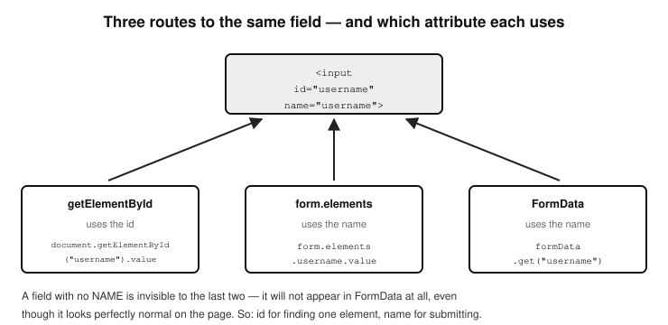

# Chapter 19 — FORMS AND EMAIL

- The three ways to handle form data in JavaScript
  - i) Extracting the value from form fields
  - ii) Using the elements property of
    HTMLFormElement
  - iii) Using the FormData object
    - The FormData object and files
    - Mastering FormData and form fields
    - Multiple checkboxes with the same name
    - Multiple file uploads
    - Disabled form fields
  - Conclusion on form handling
- Sending emails
  - Sending Emails with EmailJS
  - Sending Emails with Node.js and Nodemailer
  - App Passwords
  - Why use an App Password

  This demonstrates how your programming language allows you to manage web forms and user-submitted input. Forms are a very important part of web development. With forms, you can convert an otherwise boring static website/application into an interactive application which responds to user input and can respond with some data depending on the value or values of the input. With forms you can create an application that conducts a user survey, collect data from users to register them for an event whereby their preferences are taken into consideration, you can order for a product, service or book a reservation etc. With forms, your web application can also collect data from a user and submit them to a server or another remote external application and listen for, and return the response. JavaScript really shines in this domain. 
  There are three ways to handle form data in JavaScript. Let’s start by writing an HTML form to use in demonstration:

`<form id="myForm">`
    <input type="text" 
	id="username" 
	name="username" 	
	value="JohnDoe">

    <input type="email" 
	id="email"
	name="email" 
	value="john@example.com">

    <input type="file" name="myFile" />

    <button type="submit">Submit</button>
`</form>`

### -i) Extracting the value from form fields
  With this approach, you simply use any of the available element selector properties of the HTMLElement object to select a form field and then grab its value. Here is an example, here is how you extract the values of the username and the email fields of the above form by selecting them based on their id attributes:

	let username = 	
		document.getElementById("username").value;

	let email = 	
		document.getElementById("email").value;

  This works, but it is not flexible because it requires you to manually select each field and get its value. It could be tedious and hard to maintain for large forms with many fields, especially if some of those form fields may be dynamically added.
  If you have a file field to process, for example:

	<input type="file" id="myFile" name="myFile" />

You would select the field as normal, like so:

	let fileInput = document.getElementById("myFile");
	let file = fileInput.files[0]; 

Note very carefully that even though you select the field and it is stored in the variable fileInput, you still need to access the .files property of that element to get the uploaded file. The .files property will give you a File object of the uploaded file.
  Do not make the common mistake of using the .value property, which is meant for retrieving the values of other input fields. On a file field it just gives you a path string—and browsers deliberately fake that path, for privacy reasons.
  Here is a bonus tip for you; the .files.length property eg:

  fileInput.files.length

will tell you how many files were selected.

If your file field supports multiple uploads—meaning it has the ‘multiple’ attribute eg:

	<input type="file" id="myFiles" name="myFiles" multiple />

You will retrieve the values via the .files property of the field all the same:

	let files = document.getElementById("myFiles").files; 

It is worth being precise about what comes back, because this catches people out: .files ALWAYS gives you a FileList, whether the field allows one file or many. A FileList is a list even when it holds a single item. What changes with the multiple attribute is only how many items can be in it. The File object itself is what you get when you reach into that list — files[0].
	

#### -ii) Using the elements property of HTMLFormElement
  JavaScript also provides an elements property to be used for event handling when working with forms. It's a property of the HTMLFormElement interface that allows you to easily access every single form control (input, select, textarea fields, etc.) inside a `<form>` element. Therefore note that the e.target.elements property is only available to be referenced on `<form>` elements. That is because the ‘elements’ property belongs to the HTMLFormElement object and not the HTMLElement object. HTMLFormElement is the interface a `<form>` element is an instance of, which is why the property lives there and not on HTMLElement. Uniquely, access to fields is obtained by using the name attributes of form elements (like so: form.elements.name), and not the id, class attributes or tag names like the selector properties of the HTMLElement object. 

When an event (like submit) is triggered on a form, e.target refers to the `<form>` element. The .elements property on that form gives you a collection of all input fields inside it.

Let’s look at a demonstration of how to use the elements property to process our myForm example above. We will add an event listener to our myForm form, and write a closure (anonymous function) to immediately handle the form submission upon the event occurring.

	   document.getElementById("myForm")
		.addEventListener("submit", function(e) {

	// Prevent page refresh
    	e.preventDefault(); 
    
	// The <form> element
    	let form = e.target; 

	// Collection of form fields
   	 let formElements = form.elements; 

	// Logs all form elements
    	console.log(formElements); 

		let username = formElements.username.value;
		let email = formElements.email.value;
	   });

This is how .elements works:
  - elements returns an
  HTMLFormControlsCollection (which is
  like an array but not exactly).

  - You can access inputs using their name
  attributes (form.elements.name).

  - You can also access inputs using numeric
  indices (form.elements[0]).

  - Button elements are also included in
  elements.

  Unlike selecting elements individually using selectors like getElementById() or querySelector() to retrieve their values, using .elements property is more efficient. Also, when dynamically working with forms where the number of inputs might change, using .elements is the way to go.
  If the form field is a file type eg:

	<input type="file" name="profilePic" />

It is the same as above (retrieving from value directly). You would select the field, then use the .files property on it to retrieve the uploaded file. Here’s an example:

	let form = document.getElementById("myForm");
	let fileInput = form.elements["profilePic"];
	let file = fileInput.files[0]; // Just like before

Here are some points to bear in mind:
  - form.elements["fieldName"] works like accessing a property from an
    object-with elements being the property of the form object.
  - You still need to use .files to get the uploaded file(s)
  - Again, do not make the common mistake of going for the .value property,
    as that will only give you the path string, which is not the actual file.

#### Using the FormData object
  The FormData object provided by JavaScript makes working with forms very easy, and it provides various methods and properties to use to deal with the handling of submitted forms. Here is the syntax, where you will instantiate the object using the new keyword and passing to its constructor your form element:

	myForm = new FormData(form);

Here is an example of how you would use it to retrieve the values of our myForm example above. We will first of all set an event listener on the form, to detect a submit event. This way, once the form is submitted, our custom function will be called to process the form submission. Pay careful attention to see how we get the values of the form fields submitted, first, we create a FormData object instance by passing to its (FormData object) constructor the object that triggered the ‘submit’ event-which is our form. Here is where the object instance is created:

	let formData = new FormData(e.target);

The e.target is our form, because it is the element on which the submit event was triggered. To then retrieve values from any of the form fields, it’s easy-we call the get() method of the form object, passing it the name attribute of our form field as a string. Here is the syntax:

	let myField1 = formData.get("myField1Name");
	let myField2 = formData.get("myField2Name");

You do this for as many fields on your form as you wish to retrieve values for. 
	

	document.getElementById("myForm")
		.addEventListener("submit", myFunction);

	// function to handle/process the submission 
	function myFunction(e) {
		// Prevent page refresh
		e.preventDefault(); 

		let formData = new FormData(e.target);

		let username = 
			formData.get("username");

		let email = 	
			formData.get("email");

		let file = formData.get("myFile");
		if (file && file.name) {
			console.log("File name:", file.name);
      			console.log("File type:", file.type);
      			console.log("File size:", file.size, "bytes");

      			const reader = new FileReader();
      			reader.onload = function (event) {
        			console.log("File content:", event.target.result);
      			};
     
			// or use readAsDataURL(file) for images
			reader.readAsText(file); 
		} else {
      			console.log("No file selected.");
    		}
	}

Notice how we have used the get() method of the FormData object to retrieve the values submitted by the user of our form. The event listened for was a ‘submit’ event, which is the first argument passed to the addEventListener() method of the HTMLElement object, which is the method used in listening for events. The second argument to addEventListener() is your desired action (the thing you want done) in response to that event occurring. This is usually a named function in your code which will automatically be run, or a closure (anonymous function) which is run in the same way. See Chapter 24 (Events Handling) to learn more about how events work in JavaScript. 
  Notice also that inside myFunction, we invoke the FormData() object, passing it a reference (selection) of our form-which was selected by its id like so: document.getElementById("myForm") before adding the submit event listener to it.

	document.getElementById("myForm")
			.addEventListener("submit", myFunction); 

The reference passed to FormData() is written as e.target which always refers to the element that triggered the event (the element the event occurred on). FormData() will then know how to wrap itself around that form element and apply all its methods on it.

#### -iv)The FormData object and files
  The FormData object handles file inputs too. It is built for working with all kinds of form fields—including file fields, and it treats them intelligently. Notice in our example above, we have a file field with the name attribute of “myFile”. We retrieve its value after the form submission like so:

	let file = formData.get("myFile");

 The formData.get("myFile") will return a File object (or null if no file was selected). This is why it is a good idea when handling a form submission to check if the file field has a value before doing anything with it. This way, you do nothing if no file was uploaded. That is why we have this check right after the retrieving of the file value above:

	if (file && file.name) {
		// a file was uploaded, you can retrieve its properties and, or, process 
		//	it here…
	} else {
      		console.log("No file selected.");
    	}

This File object is not just a string or file name—it is a real JavaScript object that includes the following properties:

- file.name - the file name
- file.size - file size in bytes
- file.type - MIME type (like "image/png" or "text/plain")
- And you can even pass it directly to a FileReader to read its contents.

Let me explain how to pass a retrieved uploaded file to the File Reader API. The trick lies in these lines of code, as above:

	let file = formData.get("myFile");
	// ...
	// ...

      	const reader = new FileReader();
	reader.onload = function (event) {
        	console.log("File content:", event.target.result);
      	};
     
	// or use readAsDataURL(file) for images
	reader.readAsText(file);  

The code on this line:

  reader.onload …

Is run asynchronously. This means that it will not be run immediately, and in fact, it will be triggered by this line after it:

	reader.readAsText(file); 

I know it may at first seem confusing to see that the line after (below) the reader.onload … is run before it. But it’s true, and the key lies in understanding that the line is not run, until it is triggered by this code: 
	
	reader.readAsText(file);

Basically; we call the readAsText() method on the File Reader API passing it the reference to the uploaded file—which was retrieved and stored in the file variable. The readAsText() method is what triggers the reading of the uploaded file. Because the reading of the file may take a while, we have to wrap the code to process that file in an onload event block like so:

	reader.onload = function (event) {
        	console.log("File content:", event.target.result);
      	};

The event.target.result contains the contents of the file that has been read.
Bear in mind that readAsText() does what it says, it is meant for reading and returning data from a file in text format. If we were trying to read an image, we should have used another method of the File Reader API dedicated for that; readAsDataURL(file).

In summary, 
  - the formData.get("fieldName") syntax works for text inputs,
    checkboxes, selects, and file inputs.
  - For file fields, the returned value is a File object—not a string.
    You can read from the file using FileReader, or send it via fetch() or
    AJAX without any extra steps.

#### Mastering FormData and form fields
  Now that you have a full understanding of the working of the FormData object, I should go a bit deeper and show you some potential pitfalls. For the most part, the FormData.get("fieldName") syntax works for retrieving values submitted through nearly all types of form fields.
But there are a few subtle points and exceptions worth understanding. First of all, you would have noticed that unlike the usual targeting of the id attribute, FormData uses the name attribute instead. Take note of that, because as simple as it is, it can lead to confusion sometimes. This also means that if a form element has no name, it will be ignored by FormData. Be on the lookout for that.

- Figure 19.1 — Three routes to the same field, and which attribute each uses*

#### Multiple checkboxes with the same name
If you have several checkboxes like this:

	<input type="checkbox" name="fruits" value="apple" />
	<input type="checkbox" name="fruits" value="banana" />

formData.get("fruits") will return only the first checked value. To get all selected values, use its getAll() method — note the capital A, because JavaScript is case-sensitive and getall() does not exist:

	formData.getAll("fruits"); // will return ['apple', 'banana']

#### Multiple File Uploads
If your form’s file field allows multiple files—meaning its file field has the multiple attribute; formData.get("photos") will get just the first selected file. Here is an example of a file field that accepts multiple file uploads. Notice it has the ‘multiple’ attribute.

	<input type="file" name="photos" multiple />

To get all the files, use its getAll() method like so:

	formData.getAll("photos"); // will return [File, File, File…]

Using getAll() gives you an ordinary ARRAY of File objects, rather than the single File object that get() returns. That is worth remembering, because an array means you can go straight to .map(), .filter() and the rest without converting anything first.

#### Disabled form fields
Disabled fields are ignored. Any input with the disabled attribute is not included in FormData at all. For example:

	<input type="text" name="age" value="30" disabled />

This field will not appear in formData.

### Conclusion on form handling
Each one of the three approaches of form handling can handle files just as well as the other.
The .files property is where the actual File objects live—regardless of how you get the field (ID, elements, or FormData).
For file uploads, FormData is the go-to if you're sending the file to a server.
But if you're working with files inside the browser only (like previews or editing), .files[0] is often more direct.

## Sending Emails
  JavaScript doesn’t have built-in capabilities to send emails directly from the browser. This is mainly for security reasons — allowing anyone to send emails from the browser would be a major spam and privacy risk.
However, there are two popular and safe ways to send emails using JavaScript:

#### Sending Emails with EmailJS (no backend needed)
  EmailJS is a service that lets you send emails directly from JavaScript — without needing a server. It connects your frontend to email services like Gmail, Outlook, etc. All you need to get started with it is the following:

  - A free account on EmailJS
  - A public API key
  - An email template set up in your EmailJS dashboard
  - Your service ID and template ID

Let’s see the steps to set it up.

a) Sign up at emailjs.com and log in.
b) From the EmailJS dashboard, Add an email service (like Gmail).
c) Create a new email template, and add dynamic fields like
  {{name}}, {{message}}, etc. This is done within the EmailJS app
d) Get your service ID, template ID, and public API key from the
  EmailJS dashboard.
e) Include the EmailJS SDK in your HTML for example as a CDN:

		
		

f) If you are triggering the email sending after a form is submitted
  (most popular approach), create the HTML form:

		<form id="contact-form">
  			<input type="text" name="user_name" 
				placeholder="Your name" required>
  
			<input type="email" name="user_email" 
				placeholder="Your email" required>
  
			<textarea name="message" 
				placeholder="Your message" required></textarea>
  
			<button type="submit">Send</button>
		</form>

g) Create an event listener to listen for a submit event on the form,
  and send the email. This JavaScript code is in your JavaScript
  file eg index.js:

		document.getElementById('contact-form')
		.addEventListener('submit', function(e) {
   			 e.preventDefault();
    			emailjs.sendForm(
				'YOUR_SERVICE_ID', 'YOUR_TEMPLATE_ID', this
			)
      			.then(function(response) {
         			alert('Email sent successfully!');
      			}, function(error) {
         			alert('Failed to send email. Error: ' + error.text);
      			});
  		});

  That’s it. This is great for contact forms, feedback tools, or sending small user-generated messages — all without setting up a backend server.

#### Sending Emails with Node.js and Nodemailer (backend needed)
  If you’re working with a Node.js server, you can send emails using the popular nodemailer library. This is more flexible and powerful, especially for real-world apps that require authentication, attachments, or automated messages. Here are the steps to follow:

  a) Assuming you already have Node.js installed, go ahead and
  initialise Node.js in your application if you have not already. Do it
  by navigating in your Terminal application into your project folder,
  and running the following command:

npm init -y

  b) Install Nodemailer into your project by running this command:

npm install nodemailer

  c) Create a send-email.js file which will contain the Node.js
  Nodemailer code:

	// send-email.js
	const nodemailer = require('nodemailer');

	// Step 1: Create a transporter (using Gmail in this example)
	const transporter = nodemailer.createTransport({
  		service: 'gmail',
  		auth: {
   			user: 'yourgmail@gmail.com',
    			pass: 'yourgmailpassword' // Use App Password if 2FA is on
  		}
	});

	// Step 2: Set up email options
	const mailOptions = {
  		from: 'yourgmail@gmail.com',
  		to: 'recipient@example.com',
  		subject: 'Hello from Node.js!',
  		text: 'This email was sent using Nodemailer and Node.js.'
	};

	// Step 3: Send the email
	transporter.sendMail(mailOptions, function(error, info) {
  		if (error) {
    			console.log('Error:', error);
  		} else {
    			console.log('Email sent:', info.response);
  		}
	});

  d) Run the file containing the Nodemailer code so it sends the email.
  Run it by running this command in the Terminal:

node send-email.js

  Nodemailer lets you attach files, send HTML emails, and use templates. It is very powerful. In conclusion, JavaScript in the browser can’t send emails directly — but thanks to tools like EmailJS (for frontend apps) and Nodemailer (for backend apps), you can still build powerful email features in your applications.
If you're just learning vanilla JavaScript, EmailJS is a great beginner-friendly option. When you later learn Node.js, Nodemailer becomes a valuable tool for server-side email handling.

### App Passwords
  You will have noticed the comment in the Nodemailer code above saying to use an App Password if 2FA is on. Let us break down what that means, because it is no longer optional for most people. 
  An App Password is a special password you generate from your Google Account that allows a specific app (like your Node.js script using Nodemailer) to access your Gmail account without using your main Google password.
This is especially useful — and often required — when:

  - Your Google account has 2-Step Verification (2FA) turned on (which is highly recommended).
  - You want to connect a less secure app or script (like a Node.js app) to Gmail safely.

You may still find older tutorials telling you to switch on a setting called "Less Secure Apps". Do not go looking for it — Google withdrew it for most accounts, and App Passwords are the replacement. 
Here is a step-by-step guide on how to generate an App Password for Gmail. First of all, you must have 2-Step Verification enabled on your Google account before generating App Passwords.

  a) Go to your Google Account settings—here:

Visit: https://myaccount.google.com

  b) Turn on 2-Step Verification (if you haven't already)

    - Click Security in the left sidebar.
    - Under “Signing in to Google”, click 2-Step Verification.
    - Follow the steps to enable it.

  c) Generate an App Password

  - Once 2-Step Verification is enabled, go back to the Security section.
  - Under “Signing in to Google”, you’ll now see a link: App passwords.
  - Click it (you may need to log in again).

  d) Create a New App Password

- Under “Select app”, choose Mail.
- Under “Select device”, choose Other and type something like NodeMailer App.
- Click Generate. You’ll now see a 16-character password that looks something like this:

abcd efgh ijkl mnop

  e) Next, use this password in Nodemailer. Replace your regular Gmail
  password in your Nodemailer code with the new App Password:

		// ‘pass’ is the App Password you just generated
		auth: {
  			user: 'yourgmail@gmail.com',
  			pass: 'abcd efgh ijkl mnop' 
		}

You can now send emails securely from your Node.js app without giving out your real Google password.

### Why use an App Password
  A huge reason is security. Your real password stays private. It’s safe to use—you can revoke or delete the App Password at any time. Compatibility is also a good factor. App Password works with apps that can’t handle Google’s full sign-in flow (like scripts, terminal apps, etc.).
