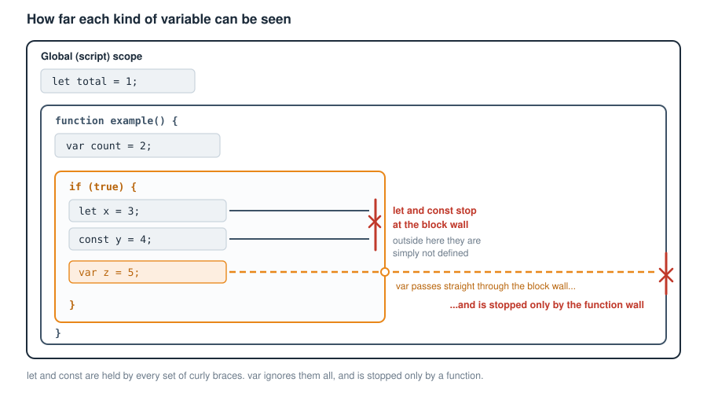
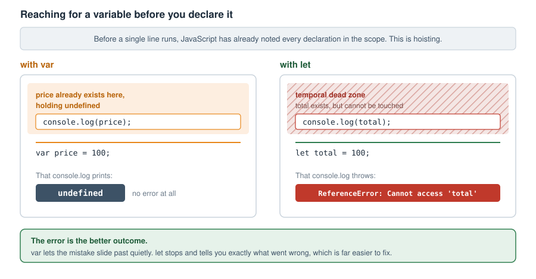

# Chapter 2 — VARIABLES

- Variable creation and naming rules
- Initialising a variable
  - Assigning values to variables
    - Variable scope and blocks
      - What is a block
      - Types of blocks
      - Blocks are not objects
      - Blocks are not data structures
      - The practical use of blocks
      - Global scope
      - Two differences between var vs let
      and const in the global scope
      - Hoisting and the temporal dead zone
      - Best practices for variables
  - JavaScript modules and variable scope

  A variable is like a virtual container in computer memory in which you can store things for later use while your program is running. It is far more efficient to work something out once and keep it in a variable than to work it out all over again every time you need it.
You can only store one item in a variable at a time. This means an attempt to store an item in a variable that already contains something will result in the value of that variable being reset to the new value and the old value being discarded. Some programming languages will try to help you by erroring about the variable already having been set, but others will not and let you override the variable. You just have to be careful and make sure that is your intention, because JavaScript will let you reassign the value of any variable you created with var or let. (There is a third kind, created with const, which cannot be reassigned once it has been given a value. We will come to it shortly.) 
  A variable can contain any of the data types, for example, a number, a string 
of text, a boolean, an array, a function, or the value held by another variable. (Do not worry if some of those words mean nothing to you yet. We will meet arrays in Chapter 3 and the full list of data types in Chapter 10. Functions get a chapter of their own, Chapter 7, though we will need a quick working idea of them a little later on in this one.) 

## Variable creation and naming rules
  Variable names should adhere to these rules:

- i) Variables may include a-z, A-Z, 0-9, the $ symbol and the underscore.
- ii) No other characters are allowed. That means no spaces, and no punctuation.
- iii) The first character of the variable name must be a letter (a-z or A-Z),
  the $ symbol, or the underscore. It may NOT be a digit, so a name like
  1stName is not allowed. Digits are fine anywhere after the first
  character, as in name1. However, the $
  character should be avoided so that it is not mixed up with the $
  character used in other scripting languages like PHP for variables, or any
  third party library you might be using now or in the future like jQuery
  which uses it too.
- iv) Names are case sensitive. It has to be, as variables are meant to identify
  resources and so must be unique.

  This means that these two variables are not the same:

		let myCaseDetails;
		let Mycasedetails;

- v) There is no limit on variable name length.

  By convention, programmers usually name variables using camel casing. This means that the variable name should start with a lowercase letter, 
and any other word that makes up the name will be started in uppercase,
with no spaces in-between. For example, the following are potential variable 
names:

  myRoundBall
  nationalId
  myCaseDetails etc

A variable can be declared in three ways in JavaScript:
  -The var keyword
  One way is to use the var keyword, for example:

			var firstName = "John";

-The let keyword
  There is the let keyword. Here is an example.

			let mySurname = "Doe";

-The const keyword
  There is the const keyword. Here is an example:

			const title = "The Day of The Jackal";

  As for the const keyword, it was introduced in ES6; it is a way to create a block-scoped constant variable. A constant is a variable whose value cannot be reassigned once it has been set. We will talk more about it in Chapter 4 (Constants).

## Initialising a variable
  Declaring a variable means creating it. Initialising it means giving it its first
  value. You can do both in one go, or you can declare a variable now and give it a 
  value later on.
  Here is a variable being declared and initialised at the same time:

	let greeting = "hello";

  And here is a variable (a) being declared with no value given to it yet:

	let a;

	console.log(a); // will return undefined

  A variable that has been declared but not yet initialised holds the special value 
  undefined. It can also be referred to as an empty variable, since it contains no 
  value. Take note that undefined is not the same thing as null. They are two 
  different values, and we will look at the difference between them in Chapter 10 
  (Data Types).
  You can assign a value to it later using an assignment operator like so:

	a = 'dog';

	console.log(a); // will return the string value 'dog'

  As a quick reminder from Chapter 1, console.log() is the built-in command that 
  prints a value out so you can look at it, and what it prints goes into the browser 
  console rather than onto the page itself. Open it with your browser’s developer 
  tools (in most browsers, press F12, or right-click the page and choose Inspect, 
  then click the Console tab). It is the tool you will reach for most often when you 
  want to check what a variable is actually holding, so it is worth keeping that 
  console open as you work through this chapter.

### Assigning values to variables
  We do so using the assignment operator—more on operators in Chapter 5
  (Control Flow). Here is an example of assigning a value to a variable:

	let firstName = "John";

  As we can see above, the assignment operator is "=", and we 
  used it to assign the value of "John" to the firstName variable.

 You can however declare a variable without assigning it a value yet. The variable 
  will then exist but its value will be undefined. You can then assign a value to it 
 later. Here is how to declare a variable with no value:

	let userName;
	let age;

Once you have declared the variable, when assigning a value to it later, you will 
 no longer need to use the var or let keyword. For example, to assign values to 
the declared variables userName and age above, do this:

	userName = "John Doe";
	age = 30;

  Notice that "John Doe" is wrapped in quotes but 30 is not. The quotes are what 
  make something a string, that is to say a piece of text. A number is written 
  without quotes. If you wrote age = "30"; you would be storing the text "30" 
  rather than the number 30, and the two behave very differently once you start 
  doing sums with them.

#### Variable scope and blocks
  A quick word about functions first, because they are about to matter a great deal.
  A function is a parcel of code that you give a name to, so that you can run it whenever
you like, rather than only at the moment you wrote it. You create one with the word
function, a name, a pair of round brackets, and then the code itself inside curly braces:

	function sayHello() {
		console.log("Hello");
	}

  Writing that out does not run anything. It only puts the parcel aside under the name
sayHello. To actually run it, you call it, by writing its name followed by round brackets:

	sayHello();   // now it runs, and prints Hello

  Those round brackets can also carry values into the function. A value you hand over in
this way is called an argument, and the name the function uses for it on the inside is
called a parameter:

	function greet(name) {      // name is the parameter
		console.log("Hello " + name);
	}

	greet("John");            // "John" is the argument

  JavaScript also comes with a good many functions already built in, ready for you to call.
You have met console.log() already. Two more you will see shortly are alert(), which pops up
a message box, and prompt(), which pops up a box asking the user to type something in and
hands back whatever they typed.
  That is as much as you need for this chapter. Functions have a great deal more to them,
and Chapter 7 is devoted entirely to them.

  Now, before we understand the scope of variables, we have to first of all understand the concept of blocks in JavaScript. 

##### What is a block
A block in JavaScript is any section of code enclosed within curly braces {}. Blocks are used to group multiple statements together, and they define the scope for let or const variables. So, the two types of variables which can have their scope limited by blocks are variables created with the keywords ‘let’ or ‘const’. These two types of variables are therefore said to be block-scoped variables. There is a third type of variable whose scope is slightly different from let and const variables; and this is a var variable. Variables created using the ‘var’ keyword can only be scoped by a function. Though a function as we will see below is also a block, also referred to as a function block; it is the only block that can limit the scope of a var variable. To summarise the behaviour of these three types of variables within blocks, we can say that while let and const variables are block-scoped, var variables are function-scoped. Here are the characteristics of a block:
    - A block is created by enclosing a
      body of code within a pair of
      opening and closing {} (curly
      braces). The code within these
      curly braces then become the
      block. This is where you can group
      multiple statements together.
    - A block creates a new scope, which
      in other words means that besides
      allowing you a space to group
      multiple statements together, a
      block also creates an area of
      visibility or reach for your
      variables. However, the types of
      variables that respect blocks, in
      terms of being limited in scope by
      blocks are only variables created
      using the keywords ‘let’ and
      ‘const’. This means that when
      these variables are defined, they
      cannot be accessed from outside
      the block they are defined in. Any
      attempt will lead to a
      ReferenceError, which is the
      browser telling you it cannot
      find that name at all. Variables
      created using the ‘var’ keyword
      on the other hand are
      not block scoped, or in other
      words, do not respect blocks. This
      means that variables created with
      the ‘var’ keyword inside a block
      can be accessed from outside that
      block they are defined in, unless
      the block is a function block. In
      other words, their values leak
      through the block.

  Here is an example of how var being used inside a block leaks out:

    if (true) {
        // Declared inside the block
        var x = 10;
    }

    // x is still accessible outside the if block
    console.log(x);

Even though x is declared inside the if block, it is still accessible outside because var does not respect block scope. Using let or const resolves the issue:

    if (true) {
        let y = 20; // Block-scoped
        const z = 30; // Block-scoped
    }

    // Error: ReferenceError: y is not defined
    console.log(y);

    // Error: ReferenceError: z is not defined
    console.log(z);

Here, both y and z are restricted to the block because let and const follow block scope rules.

  This tells us that there is no point creating a variable using ‘var’ within a block. Its value will leak out anyway. The only time var is useful is when you actually want function-scoped variables, like inside a function:

    function example() {
        // Function-scoped
        var a = 100;
    }

    // Error: ReferenceError: a is not defined
    console.log(a);

Here, a is restricted to the function, so it behaves as expected.

- Figure 2.1 — How far each kind of variable can be seen*

##### Types of blocks
  Remember we have established that a block in JavaScript is a group of code enclosed within a pair of curly braces. The main types of block you will meet in JavaScript are: a standalone block, an if statement, a loop (for or while loop), and a function. There are others besides these, such as try/catch and switch blocks, which we will meet in later chapters. Here they are with examples:

#### -a) Standalone block
          {
              let x = 10;
              console.log(x); // 10
          }

          // ReferenceError: x is not defined
          console.log(x);

The variable x only exists inside {} and is
not accessible outside.

#### -b) If statement block
        if (true) {
            let y = 20;
            console.log(y); // 20
        }

     // ReferenceError: y is not defined
     console.log(y);

#### -c) Loop (for or while loop) block
  Both the for loop and the while loop of JavaScript are blocks. Let’s see an example of a for loop:

     for (let i = 0; i < 3; i++) {
          // 0, 1, 2
          console.log(i);
      }

      // ReferenceError: i is not defined
       console.log(i);

In this example; i is only available inside
the for loop block.

#### -d) Function block
       function example() {
           let z = 50;
           console.log(z); // 50
       }

       example();

       // ReferenceError: z is not defined
       console.log(z); 

	  Functions are also considered blocks, and variables declared inside them are scoped to the function (function-scoped).

##### Blocks are not objects
  An object literal { key: value } is NOT a block—it’s just an object. Don’t worry, we will talk more on objects in Chapter 17 (Object Oriented Programming). Blocks are structural elements of JavaScript’s syntax, while objects are data structures. For example:

      let obj = {
           name: "Alice",
           age: 25
      };

      console.log(obj.name); // Alice

Even though an object uses {}, it does not create a new scope. The variables inside the object are properties, not block-scoped variables.

##### Blocks are not data structures
  A block {} is not a data structure in JavaScript. A block is just a syntactic structure used to group code together and define scope, particularly for let and const. It does not store data like arrays or objects do. Let’s demonstrate that a little bit:

    {
        let x = 10;
        const y = 20;
    }

    // ReferenceError: x is not defined
     console.log(x);

This {} simply defines a scope. It doesn’t store values like an object or an array. Basically, an object { key: value } is a data structure because it stores and organises data. In programming in general, there are different types of data structures, with each one having its unique way of storing and organising data. In the case of objects, its data is stored as key-value pairs. See Chapter 11 (Data Structures) to learn more about data structures in JavaScript. Here is an example of an object:

     let person = {
         name: "Alice",
         age: 25
     };

	// This will write to the console: Alice
	console.log(person.name);

This {} is an object literal, which is used to store data. Let’s look at some key differences to help us distinguish between a block and an object: 
- A block does not have keys—it just
  defines a scope for let and const
  variables.
- An object has keys (properties), but
  these are not variables. They are stored
  inside the object and accessed using dot
  notation (obj.key) or bracket notation
  (obj["key"]).

##### The practical use of blocks
  One might be tempted to question the usefulness of standalone blocks! At first glance, it might seem like they don’t serve much purpose, but they do have practical applications in real-world programming. 
While they aren’t the most common feature, they can be useful in certain scenarios—especially for keeping your code clean and avoiding variable pollution (overriding of one another). Here are some instances when you need a block in your application code:
- When you need temporary variables
  that shouldn’t affect the rest of the code.
- When you want to isolate (separate)
  execution logic without defining a
  function. This means, the code will be
  parsed and run at the line where it is,
  without you having to call it explicitly.
- When you want to logically group code
  within a function for better readability.

Let us see some code examples:
- 1) Using a Block to Process Temporary
  Data Without Polluting Scope

Here is an example of fetching and processing API data in an isolated block.
  Before you read it, a word of reassurance. This example, and the one after it, 
  deliberately reach ahead of where we are. They use tools we have not covered 
  yet, such as fetch, async and await for talking to a server (Chapters 21 and 22), 
  and commands for reaching into the web page itself (Chapter 15). Do not try to 
  understand every line. Look only at the curly braces, and at which variables 
  survive outside them. That is the single point being made here.

   async function fetchUserData() 
   {
        console.log("Fetching user data...");

         // start of block
        {
            let response = await fetch("https://api.example.com/user");
            let data = await response.json();

            let username = data.name;
            let age = data.age;

            console.log(`User: ${username}, 
                Age: ${age}`);
         } // end of block

        // Now, outside the above block, the 
        // variables ‘response’, ‘data’, 
        // ‘username’ and ‘age’ are all out of 
        // scope, and that is the idea.

        console.log("Finished processing.");
    }

	fetchUserData();

The fetchUserData() function has a block inside of it. Outside that block, the blocked-scoped variables ‘response’, ‘data’, ‘username’, and ‘age’ no longer exist. This is because they are out of scope, and that is the idea. The benefit is a tidier program, where a name only exists for as long as it is actually needed.

- 2) Isolating Temporary DOM Elements
    Without Affecting Global Scope. This
  is about temporary DOM Manipulation
  Without Polluting Scope.

      document.querySelector("#btn")
            .addEventListener("click", () => {
               
           // block start
            {
                 let messageBox =   
                     document.createElement("div");
                 messageBox.textContent =
                     "Action completed!";
                 messageBox.style.color = 
                     "green";
              
                  // place the div on the DOM
                 document.body.appendChild(
                       messageBox);

                setTimeout(() => {
                  // Remove it after 3 seconds
                  messageBox.remove();
                }, 3000);
            } // end of block 
        });

This example demonstrates JavaScript’s prowess in manipulating the DOM. Here we create an HTML div element and store it in a variable named messageBox, and insert it into the DOM so it can be seen in the browser. It then sets a timer so that the div is removed from the DOM again after 3 seconds. Working with the Document is something that may be new to you now, but we will dive deeper into it and demystify everything when we come to talk about DOM Manipulation in Chapter 15.
  In this code, the messageBox element is only used inside the block. Once it’s appended and scheduled for removal, there’s no need to keep the variable around.

Therefore you can see how when using a block, you can place code in them that performs actual logic like fetching data, modifying the DOM, handling calculations, etc. The key idea is:
  - a) Do the necessary work inside the
      block.
  - b) Let the variables automatically
      disappear when they are no longer
      needed.

##### Global scope
As a reminder of all what we have learned so far about variables and scopes, here are the take-away points:
  -Var variables are always global unless
  they are used inside a function (they
  are function-scoped). This means that
  they only adhere to the rules of
  function blocks (blocks that are
  functions). Using them in blocks (non-
  function) will not stop them from being
  global, unless the block is within a
  function, in which case they will be
  scoped to the function and not the
  block anyway. There is therefore no
  point putting them in a block inside a
  function. The bottom line is that using
  them in a function is the only thing that
  will stop them from being global and
  they will be local to that function.
-Let and const variables will be global
  unless they are used within a block
  (they are block-scoped). Note that
  functions themselves are blocks (see
  types of blocks above), therefore let
  and const declared inside a function
  behave as function-scoped. So, using
  them within a function will stop them
  from being global, and they will be local
  to that function. Also, unlike variables
  declared with var; if you placed let and
  const variables inside a block within
  the function, they will only be defined
  and local to that block within the
  function, and reaching for them outside
  that block gives a ReferenceError.

  Regardless of the limitations the three types of variables can have when they are scoped, they can all still be used as global variables. Do this simply by not scoping them. So, if a variable is declared with var, let or const outside of any block or function, they are global and can be used throughout your entire script. Let’s demonstrate in code.

	  const fee = 20;  // Global constant
	  const price = 100; // Global constant
	  let count = 0;  // Global variable
	  var shopName = "OvalFoods"; // Global variable

    function getAmount(quantity = 1)  
    {
        // Using global price and fee
       var total = (price * quantity) + fee;

       console.log("Total paid at " + 
                      shopName + " is: " + total);

       return total;
    }

    getAmount(5);

The fee and price variables are declared with const at the top level, making them global constants.

The count and shopName variables are declared with let and var respectively at the top level, making them global variables as well. Notice that getAmount() names its own parameter quantity rather than count. Had we named it count too, it would have hidden the global count from view inside the function, which is a trap we look at in a moment under shadowing.

	The function getAmount() is able to access these global variables, and so will any other code on this page whether they are in a function, a block or neither.

  We have not talked about a variable declared with neither of the keywords var, let or const. This is also possible when you are running JavaScript in non-strict mode. Strict mode is a stricter set of rules that you can switch on by putting the line "use strict"; at the top of your file, and which JavaScript modules turn on automatically. Normally strict mode will force you to add those keywords (declarations), but non-strict mode will not. So in non-strict mode, a variable declared without any of those keywords is automatically a global variable. 

    var appStatus = true;

    function updateStatus() {
         testLocalVar = "wild"; 
    }

    console.log(appStatus);

    updateStatus();

    console.log(testLocalVar);

In this example, appStatus is declared outside of any function, making it a global variable. This means it can be accessed both inside and outside functions. That’s why logging appStatus in different places results in the same output: true.

However, the variable testLocalVar inside updateStatus() is not explicitly declared using var, let, or const. In this case, JavaScript implicitly assigns it as a global variable when updateStatus() is called. This happens because, in non-strict mode, any variable assigned a value without a declaration (var, let, or const) is automatically added to the global scope. That’s why console.log(testLocalVar) works without throwing an error.

Another thing we need to remember about global variables is that it is possible to declare a local variable with the same name as a global variable. When this happens, the local variable shadows the global one within its function. That means it overrides the global one locally. Consider this example:

    var item = 'shoe';

    function displayItem() {
        var item = 'dress';
        console.log(item);
    }

    displayItem();
    console.log(item);

The output will be :
  dress
  shoe

Inside displayItem(), the local item variable with the value 'dress' shadows the global item within that function’s scope. However, the global item remains 'shoe' when accessed outside the function.

#### Two differences between var vs let and const in the global scope
  There are two important differences between the behaviour of var and let or const in the global scope. Even though let and const can be used globally, they do not behave exactly like var in the global scope. Here are the differences:

- a) var attaches to the window object (in
  browsers), let and const do not. The
  window object is the browser’s own
  global object, where it keeps everything
  that is available everywhere on the
  page. We look at it properly in
  Chapter 15.

      var x = 10;
      let y = 20;
      const z = 30;

      // OK: 10 (var attached to the global obj)
      console.log(window.x);
      // undefined (let is not attached)
      console.log(window.y);
      // undefined (const is not attached)
      console.log(window.z);

	var becomes a property of window, while let and const do not. They still work everywhere on the page, but they are not stored on the window object.

-b) Re-declaring var globally is allowed,
  but let and const are not. For example:

     var a = 100;
     var a = 200; // OK: works fine

     let b = 300;

     // Error: SyntaxError: Identifier 'b' has
     // already been declared
     let b = 400;

Note that re-declaring is not re-assigning. 
Re-declaring is the same as in the above example where we use the var, or let or const keyword (declaration) as if declaring the variable for the first time like so:

	   let b = 300;
	   let b = 400;

Re-assigning is when you simply update the value of an already existing variable, for example: 

	   let count = 0;
	   count = 1;

The assigning code references the variable name (count) without needing to re-declare it (using let) and updates its value. 

##### Hoisting and the temporal dead zone
  There is one more difference between var and let or const, and it explains a 
lot of otherwise baffling behaviour. It is called hoisting.
  Before your code runs, JavaScript takes a quick first pass over it and makes a 
note of every variable you have declared. In effect, the declarations are lifted 
to the top of their scope. This is what is meant by hoisting: the declaration is 
hoisted up, even though the line you wrote it on stays where it is.
  The catch is that var and let behave very differently when this happens.
  A var variable is hoisted and given the value undefined straight away. So you 
can refer to it before the line that declares it, and instead of an error you 
simply get undefined:

    console.log(price); // undefined, not an error
    var price = 100;

  That is rarely what anybody wants. It hides mistakes, because a typo or a line 
in the wrong order fails quietly instead of telling you about it.
  A let or const variable is also hoisted, but it is NOT given a starting value. 
It sits in what is called the temporal dead zone: it exists, but it refuses to be 
touched until the line that declares it has actually run. Reaching for it before 
then gives you a clear error:

    // Error: ReferenceError: Cannot access
    // 'total' before initialization
    console.log(total);
    let total = 100;

  "Temporal" simply means "to do with time", and the dead zone is the stretch of 
time between the top of the block and the line where the variable is declared.
  This is a good example of let being stricter than var, and of that strictness 
being a kindness. The var version lets a mistake slide by silently. The let 
version stops and tells you exactly what went wrong, which is far easier to fix.
  The practical lesson is a simple one: declare your variables before you use 
them, and prefer let and const so that JavaScript tells you when you have not.

- Figure 2.2 — Reaching for a variable before you declare it*

##### Best practices for variables
  It is recommended to always declare variables using let or const instead of relying on var, as they provide better scoping rules and avoid accidental global variable leaks.
  Use const for a value that should never be reassigned, and let when you do need to update the value later on. One word of warning about const, because it catches almost everybody out: const stops you from reassigning the variable, but it does not freeze what is inside it. If a const holds an array or an object, you can still change the contents; what you cannot do is point that name at something else entirely. We look at this properly in Chapter 4 (Constants). let allows reassignments without polluting the window object (useful for things like counters, flags which are only needed temporarily). Let variables as we have seen also prevent accidental redeclaration, which var allows.
  Avoid implicit global variables (i.e., variables declared without var, let, or const), as they can lead to unintended side effects.
  Keep variable scope as limited as possible to avoid conflicts and unexpected behaviour.

By following these practices, you can write cleaner, more maintainable JavaScript code.

### JavaScript modules and variable scope
  As your code grows larger, it's common to split it into multiple files to keep things organised. These files can be treated as modules — reusable, self-contained pieces of JavaScript code. (Take care not to confuse this use of the word with the code blocks we met earlier in this chapter. They are unrelated.) But JavaScript handles modules a little differently than regular scripts.
To declare a JavaScript file as a module, you use the type="module" attribute in your HTML in the `

This tells the browser, “This file uses modular JavaScript — isolate its variables and functions from the global scope.”
That last part is important:

  When a file is loaded as a module, its variables and functions are private by default. They won’t be accessible globally from your HTML or from other script files unless you explicitly export or attach them to the global window object.
Let us look at an example that will cause an error of a missing function:

Let’s say you define a function like this in your index.js file:

   // index.js
   async function fetchPhotos() {
  	const response = await axios.get('https://jsonplaceholder.typicode.com/photos', {
    			params: { albumId: 1 }
  	});

  	document.getElementById('output').textContent = 	
		JSON.stringify(response.data, null, 2);
   }

Do not worry about understanding what the code does for now. It uses an external library called Axios to make an AJAX request to fetch photos from the URL 'https://jsonplaceholder.typicode.com/photos'.
We will come back to this same example in Chapter 22 (Extensions - APIs & Libraries), where I will explain how it all works. So, let’s say in your HTML code you do:

	
	
	<button onclick="fetchPhotos()">Fetch Photos</button>
	<pre id="output"></pre>

If you run this code in your browser, you’ll get an error like:

  Uncaught ReferenceError: fetchPhotos is not defined

That’s because fetchPhotos() exists inside the module, not in the global scope where HTML's onclick can see it. 
  So how do you resolve this issue? You have two options:

Option 1: Attach the function to the global window object.
  Inside your index.js, just add:

		window.fetchPhotos = fetchPhotos;

This explicitly exposes the fetchPhotos() function to the global
scope, so HTML can use it.

Option 2: Remove the type="module" attribute from your
  

Now everything defined in index.js becomes globally available by default. So, here are the take-away points of learning:

    - If you want to use import/export and keep code modular, use type="module" and export what you need. (import and export are the commands modules use to share code between files. We cover them in Chapter 17.)

    - If you need HTML or other scripts to access your functions, attach them to window, or don't use type="module".

Using modules is recommended for modern apps, but if you're just starting out or building simple pages, you can safely skip type="module" for now. As you advance, understanding how scope works in modules will help you write cleaner, more secure code.
