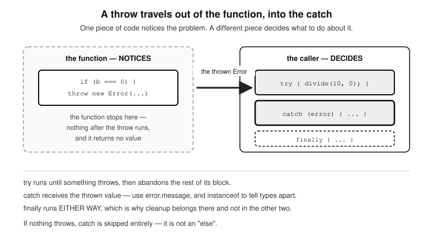

# Chapter 21 — Error Debugging and Testing

- Displaying values on screen
  - document.write()
  - innerHTML
  - alert()
  - confirm()
  - prompt()
  - console.log()
- The browser developer tools
- Stopping code execution for debugging
- Throwing and handling exceptions
  - The throw statement
    - Custom exceptions
    - Asynchronous exception handling
      - Using .catch()
      - Using async/await
  - Multiple catch blocks
  - Conclusion and exception handling examples
- Testing

  This discusses the tools made available by your programming language to find bugs in your code. It also talks about conventions and best practices for writing 
reliable, performant and fault-tolerant applications. This is also a section where performance pitfalls are identified and work-arounds given. 

## Displaying values on screen
  All programming languages offer you built-in tools which could be properties or functions to use in displaying stuff on the screen. These are very handy as you can use them in:

  - i) the working of your application to dynamically write text or display
    data on screen, for example in certain parts of your web page,
  - ii) or you can also use them to inform/warn the user of something or
    even prompt the user to enter some information
  - iii) or you can use them during development to print out data held in
    maybe a variable in order to view its contents so you know what
    type of data you are dealing with, or to help you debug a part of
    your web page that is not working properly.

  JavaScript has its share of these properties/functions and here are the common ones:

	-document.write()
	-.innerHTML
	-alert()
	-confirm()
	-prompt()
	-console.log()

We will be using them a lot in the code examples in this book to show the results we are getting. You will find that I particularly make use of console.log() and alert() the most.
	

-i) document.write().
  To write text on screen, use the write() method on the document
  object:

		document.write("String to write here");

  However, using document.write() to write text to a web
  document is considered bad practice in modern JavaScript. This is
  because there is a good risk that document.write() can overwrite
  (erase) the entire page if it's called after the page has finished
  loading.
  What is recommended is the innerHTML property of HTML elements.
  For example, instead of doing:

		document.write("My data here");

  It is better to append the content like this:

 		document.body.innerHTML += "My data here";

Take note of the += that is used instead of just =. This ensures that if
you are looping for example, and wish to display several values on
screen, each subsequent value being written will be displayed
without completely wiping what was previously there. Basically, the
+= makes sure that each new line is added to what's already there,
instead of replacing it.

- ii) innerHTML
  To display text (also known as a string) inside an element on your
  web page, you can use the very popular innerHTML property of
  document elements:

	selectedElement.innerHTML = "String to display in that element";

As explained above, it is recommended over using document.write().
Using document.body.innerHTML lets you safely update the page
content without disrupting the rest of your page. Why does
document.write() do this:

        * When the browser finishes loading the HTML, it closes the document stream.
        * If document.write() is used after that, it reopens the stream, which deletes everything on the page and writes fresh content.
        * So it disrupts the existing structure, styles, and scripts.

  The better alternative is to use

		document.body.innerHTML += 'something'

  Because of the following points:
    - It appends content safely to the page.
    - It keeps the rest of your HTML intact.
    - It doesn’t cause errors or wipe the screen.

- iii) alert()
  To display a popup on screen to inform or warn the user of something
  and have them click OK to dismiss the popup, use the alert()
  function:

		alert("String to display here");

- iv) confirm()
  To display a popup that will require a user to confirm an action by
  clicking on 'Confirm' in order to proceed, or abort the action by
  clicking on 'Cancel', use the confirm() function. Ideally, you will
  capture (store) the user's response by assigning confirm() to a
  variable.
  The value of that variable will then contain true if they clicked on
  'Confirm', or false if they clicked on 'Cancel'. Your program will then
  check for the value (of this variable) in order to know how to proceed.
  Create a confirm popup and store the user’s response to this in a
  variable called response like so:

		let response = confirm("Are you sure?");

  Check for the value of response and act accordingly:
	
		if (response) {
			// the user clicked on Ok
    			alert('You have confirmed!');
		} else {
			// the user clicked on Cancel
    			alert('You said no!');
		}

- v) prompt()
  To retrieve some information from the user through a popup text box,
  use the good old prompt() function. Just like with the confirm popup,
  you can capture what the user enters by assigning the prompt to a
  variable like so:

		let idNumber = prompt(
			"Write some text for the user like: What is your ID number"
		);

  You can optionally pass a second parameter as a string, which fills
  the text field in with a starting value, e.g.

		prompt('Enter surname', 'Enter surname here');

  The text 'Enter surname' will be shown to the user above the data
  input field, in the same way a label is displayed beside the input
  field of an HTML form. The second string, 'Enter surname here', is
  the DEFAULT VALUE of the field. Be careful not to think of it as a
  placeholder. A placeholder is grey hint text that vanishes the
  moment you type; a default is real text already sitting in the box,
  and if the user presses OK without touching it, that is exactly what
  you get back.

-vi) The console object.
  Another means to display information and much more, to yourself as
  the developer is to write to the console using the console object and
  its family of functions. Here is a list of them:
  -console.log()
  -console.error()
  -console.warn()
  -console.info()
  -console.debug()
  -console.table()
  -console.dir()
  -console.assert()
  -console.group() and console.groupEnd()
  -console.time() and console.timeEnd()

### console.log()
This is the most-commonly used method of the console object used
to print something to the browser's console.

	let username = "Alice";
	console.log("Current user:", username);

It’s purpose: general purpose
Arguments: You can pass strings, numbers, variables, objects,
  arrays, and even multiple values separated by commas:

		console.log("x:", x, "y:", y);

Use Case: Checking values during development, tracing flow, or
  understanding what’s going on in your program.

#### Other console Methods and Their Uses

#### console.error()
	Purpose: Displays an error message, usually in red text in the 
		console.
	Example:
		console.error("Something went wrong!");

Use Case: Reporting serious issues like failed API calls, missing files,
  or exceptions.
Benefit: Makes it easy to visually identify problems in logs.

#### console.warn()
Purpose: Highlights a warning in yellow, without treating it like a full-
  blown error.

  Example:
    console.warn("This is just a warning.");
  Use Case: When something is suspicious but not necessarily fatal
    (like deprecated features).

#### console.info()
	Purpose: Prints information messages.
	Example:
		console.info("This is some useful info.");

Use Case: Not as commonly used, but can be useful for providing
  insights during debugging. Appears similar to log() in most
  browsers

#### console.debug()
	Purpose: Specifically for debugging messages.
	Example: 
		console.debug("This is a debug message.");
	
Use Case: Used when you want something that can be hidden in
  some browsers unless "Verbose" logging is turned on.
Note: May not always be visible unless you expand the console log
  level settings.

	
#### console.table()
	Purpose: Displays tabular data as a formatted table.
	Example:
		const users = [
  			{ name: "Alice", age: 25 },
  			{ name: "Bob", age: 30 },
		];
		
		console.table(users);

Use Case: When printing arrays of objects or data collections. Super
  useful!

#### console.dir()
  Purpose: Displays an interactive list of the properties of a specified
    JavaScript object.
  Example:
    console.dir(document.body);
  Use Case: Useful for exploring DOM objects and nested structures.

#### console.assert()
  Purpose: Only logs the message if the assertion fails.
  Example:
    console.assert(2 + 2 === 5, "Math is broken!");
  Use Case: Helpful for adding sanity checks during development.

#### console.group() and console.groupEnd()
	Purpose: Groups console messages together.
	Example:
		console.group("User Details");
		console.log("Name: Alice");
		console.log("Age: 25");
		console.groupEnd();
	Use Case: Organize output when logging a bunch of related data.

#### console.time() and console.timeEnd()
	Purpose: Measures how long an operation takes.
	Example:
		console.time("loop");
		for (let i = 0; i < 100000; i++) {}
		console.timeEnd("loop");

  Use Case: Performance testing.

## The browser developer tools
  It is very handy to use a debugging tool, and almost all browsers have one built into them that you can use. Here is how to visit the error console for different browsers:

* In Firefox, go to Tools > Error console
* In Opera, go to Tools > Advanced > Error console
* In Microsoft Internet Explorer, go to Tools > Internet Options > Advanced > then uncheck the Disable Script Debugging box, then check the box ‘Display a Notification about Every Script Error.’
* In Google Chrome, if you click on the three dots (…) on the top-right corner of the window > then choose More Tools > Developer Tools, that will take you to the debugger console.
* Safari has no Error console enabled, but you can turn it on by: Safari > Preferences > Advanced > Show develop menu in Menu bar

Alternatively, you can use the Firebug Lite JavaScript module which is easier to use. To use it, place the following code in your HTML, right before the body tag:

	

  The way the browser debuggers work is to display the line of the code and hint you on the cause whenever you run code that has some kind of error in the syntax. Firefox is the best for debugging JS as it reports a clearer message.
  There is also a plug-in in Firefox for JavaScript known as FireBug which is quite popular and very recommended to use. Learn about it and acquire it here:

  (http://getfirebug.com)

#### Stopping code execution for debug
  It is possible when running some code, to set points (aka breakpoints) in the code where you want the execution to stop. This is when you wish to stop the execution in separate sections to investigate at what point in the code something-usually an error, is occurring. This is usually made possible as a tool in IDEs (Integrated Development Environments). In IDE is basically an advanced text editor for writing code which has evolved over the years to add more features that go beyond just writing code (text). VS Code is one of such IDEs, and you can see how within VS Code you can do more than just type out code. You can create and run a simple server to test your code as we did with the ‘Live Server’ extension in VS Code. Within most IDEs including VS Code, you also have an integrated Terminal application which means you can navigate or connect eg via SSH to your server (local or remote) and run commands, all without leaving your code/text editor. This is how such modern code editors came to earn the name of Integrated Development Environment (IDE).
  Let’s look at two ways in which you can place break points in your code.

  - a) Stopping Code Execution for Debugging in JavaScript
    You can pause JavaScript code in the browser which will be
    picked up by the break point tools in the browser DevTools.
    Just type ‘debugger’; at the line you want execution to stop at.
        
Wherever you place that line, the browser will pause execution
when it gets there. The DevTools in your browser have to be open
for that to happen. For example:

           	function checkUser() {
                	let name = "Alice";
                	debugger; // Pause here when DevTools are open
                	console.log("Name is", name);
            	}

    - Code stops at 'debugger' line when DevTools is open
    - You have to be on the Sources tab in DevTools
    - From the DevTools in your browser, you will then be able to step
    in and out of, or skip over functions.
    - With each click on the to ‘Step into function’ will keep skipping
    to the next line.

This is great for temporarily inspecting variables without needing
to manually set breakpoints in DevTools.

  - b) Using Breakpoints in Browser DevTools
    Without writing code to stop execution, you can achieve the
    same thing directly in DevTools of your browser. To do so, follow
    these steps:

  - Open your browser’s Developer Tools (usually with F12 or
    right-click > "Inspect").
  - Go to the "Sources" tab.
  - Open the JavaScript file you're working with (on the left side).
  - As the file opens on the right, click on the actual line number
    on the left column of the open file, where you want to pause.
      You will see a blue arrow appear on that line number
      indicating that a breakpoint has been set at that point.
  - Reload or run your code, and when the browser hits that line, it
      will pause execution, so you can:
    - Inspect variables
    - Step through the code
    - Watch how values change

    - To turn off the breakpoints from the browser tools, hit the the
      'Deactivate breakpoints' icon which is a crossed-out blue
      arrow. Script execution will then resume as normal.

Bonus tip:
  From DevTools, you can also step through code line-by-line
  using the “Step over”, “Step into”, and “Step out” buttons in the
  while your code execution is paused-just like a professional
  debugger

## Throwing and handling exceptions
  In the real world, things go wrong all the time—and programming is no different. Files might not load, users might type unexpected things, and network requests may fail. Vanilla JavaScript (i.e. JavaScript without any external libraries) gives us a way to catch and handle errors using what is known as a try…catch statement. This involves the throwing and handling of exceptions using try, catch, finally. This mechanism allows you to manage runtime errors gracefully. This means that-and this is the whole essence of exceptions, when errors occur in your code, instead of your software stalling and breaking up, which will annoy or frustrate your users, you can ‘catch’ these errors, so that you can deal with the error in a better way. Dealing with the error in a better or graceful way could mean, informing other parts of your code that use that functionality (function or service), so that they can offer the user an alternative result, or it could mean informing the developer (you or your team) of the issue in the code, so it can be fixed as soon as possible. Instead of your whole program crashing when something goes wrong, try...catch lets you:
write some code to do something. If something goes wrong, catch the error, and handle it without breaking everything. Here is the syntax of try…catch:

		try {
  			// Code that might throw an error
		} catch (error) 
		{
  			// Code to run if an error happens
		} 
		finally 
		{
  			// (Optional) Code that always runs, no matter what
		}

Here is how it works:
- try block: Place any code here that might cause an error. If an error occurs, JavaScript stops running this block and jumps to the catch block.
- catch(error) block: This block runs if an error happens. It receives an error object that contains information about what went wrong.
- finally block (optional): This block always runs—whether there was an error or not. It’s good for clean-up tasks like closing connections, resetting UI elements, or clearing temporary data.

  This is a very useful mechanism in programming because, as a developer, you try your best to anticipate things going wrong with every piece of code you write, but you can never predict it all. Typically, without using exceptions, you would have an idea of which areas in your program issues can potentially come from, and therefore try to handle those edge cases (error-prone sections or scenarios) by wrapping conditional (if…else) statements around them. Let’s say, for example in your shopping application, when you wish to get an item from a products array, it makes sense to first of all make sure there is something in the array, before your try to grab it, otherwise you will get a standard programming error of trying to get something from an array that does not exist. You do the check by wrapping that array access in a conditional statement like so:

		if (products) {
			let item = products[0];
		} else {
			alert("Sorry, that item is out of stock!");
		}

This works well for simple checks to prevent standard errors in your code. Exceptions are more powerful because they go deeper than that. There are errors that you either just may not be able to anticipate, or sections in your program that are mission-critical, meaning, your program will just not be able to work when such errors occur. Such an error, can be someone trying to access your banking software, and submitting a bank account number that does not match the password or date of birth they are using. For such errors, you want to definitely capture them when they occur and halt the script execution, then show the user a meaningful message, rather than letting them through. Another type of mission-critical error may be your bank’s server is down, and rather than let the application just crash and blackout-which will confuse or even upset your customers/users, you will want to always check if the server is up and running before trying to access it. If it is then found to be down, you can inform the users in a friendly way to try again later, and then inform your technical department immediately to fix the issue. These are situations where exceptions in programming come in. They really get into the engineering of a software application, and you can see how different they are to simple conditional statements. Your take-home key point here should be that conditional statements are for anticipating standard programming errors, while exceptions are for anticipating mission-critical errors in your application.
  All programming languages have exception handling built right into them, and they let you create your own custom exceptions as per the needs of your software application. Speaking of objects, if you are new to objects and classes, do not worry, you will come to understand all this when we get to Object-oriented programming (OOP) in Chapter 17.   
  The way it works is, when creating a service or function, in parts where potential errors may occur (eg a mission-critical error), you will check for this situation so that if your code encounters such an error,  it should use a throw statement to create an exception. Then, in other parts of your code that make use of that service or function that will potentially throw an exception, you will call such services or functions within a try…catch block. Basically, within the try block, you place code to access the service/function, then in the catch block, which is where any exception that would be thrown by that service/function will be captured (caught) and made available to you, you will deal with (handle) the exception. This means that your application will run smoothly without unexpectedly stalling and confusing your users. Any potential issues will be captured in the catch block, so that you can deal with them in a manner befitting of a well-thought-through, and user-friendly application. JavaScript uses two types of block constructs to capture and deal with (handle) the thrown exceptions-more on this shortly. Here is an example:

		// create the service/function
		function viewAccount(account, user_id) 
		{
			// user cannot view account that is not theirs
			if (account.user_id != user_id)
			{
				// throw an Error object (JavaScript in-built or custom)
				throw new Error(
					"User " + user_id + " trying to access account not theirs"
				);

				/*
				OR 
					// throw an object literal
					throw { code: 401, message: "Account not theirs" };

				OR 
					// throw a simple string error (less common)
					throw "User " + user_id + " trying to access account not theirs";
				*/
			} 
			else
			{
				// this is the correct user, show them account details
			}
		}

		// handling exceptions (using try/catch/finally)
		try {
			const result = viewAccount(account, user_id);
		}
		catch (error) 
		{
			// handle the error - respond accordingly
			console.error("An error occurred: ", error.message);
		} 
		finally 
		{
			// Optional: runs regardless of success or failure
			console.log("The viewAccount() was called");
		}

If the viewAccount() function determines the user to be the right owner of the account, the user gets their account details shown to them, if not an Error exception is thrown. The API code 401 refers to an unauthorised access attempt, which is usually due to invalid user credentials to access a resource. We will learn more about API response codes when we come to learn about APIs in Chapter 22 (Extensions). The Error exception is a JavaScript (in-built) exception. You pass to its constructor a string, which will be available to any code that catches this exception on its message property like so:

  error.message

 If no exception is thrown, then all is well, and the viewAccount() did not throw any exception. The code in the try {} block where this viewAccount() function is called will therefore work, while the code in the catch {} block will not be run. 
  The finally {} block is optional, and you will rarely see it being used. But when it is used in code, the code in that block will always be run, regardless of whether an exception was thrown by the service or function. Use it therefore only when there is an action you want to take no matter the outcome of calling that function or service. 
  Every programming language has built-in exceptions but you can write your own. Let’s start by looking at some of the exceptions provided to you by JavaScript. JavaScript has the following built-in error constructors:

  - Error (for generic errors — the one used in the example above)
  - SyntaxError (for parsing errors)
  - TypeError (for wrong type errors eg "undefined is not a function" which is an exception you’ll get if you try to use a function that does not exist)
  - ReferenceError (thrown each time you try to use an undefined variable)
  - RangeError (invalid range, e.g. toFixed(-1))

These built-in error types help categorise issues that can go wrong in an application.
Here is how you can use one of these in-built exceptions. Let’s take the TypeError exception for example:

		try {
			// this will throw a TypeError exception
			null.someMethod();
			
		}
		catch (error) 
		{
			// handle the error - respond accordingly
			if (error instanceof TypeError)
			{
				console.error("TypeError caught");
			}
			else
			{
				console.error("Other error");
			}
		} 

Exceptions work in both synchronous and asynchronous (Promises, async/await) code.

*Figure 21.1 — A throw travels out of the function, into the catch*

### The throw statement
  A throw statement lives inside the function that detects the problem — not in the try block. The try block is where you CALL that function, and the catch block is where the thrown value arrives. Look back at the example above and you will see the throw sitting inside viewAccount(), while the try/catch sits around the call to it.
  What is thrown can be one of the following three data types: 

    * an Error object which can be a JavaScript in-built error object, or your custom error object).
    * an object literal. For example:     throw { code: 401, message: "Account not theirs" };
    *  a simple string error (less common) For example:                       throw “User ” +user_id+ “ trying to access account not theirs”;

#### Custom exceptions

  You can define custom errors by extending the Error exception of JavaScript. Here is how you would do it:

	class CustomError extends Error {
		constructor(message) {
			super(message);
			this.name = "CustomError";
		}
	}

	try {
		throw new CustomError("Oops, something went wrong");
	}
	catch(error) {
		console.error(error.name, error.message);
	}

This code will print: CustomError Oops, something went wrong

#### Asynchronous exception handling
  When dealing with promises that you know can potentially throw exceptions, use .catch() or try...catch with async/await. Here is an example:

##### Using .catch()

	someAsyncFunction()
		.then((result) => 
			console.log(result))
		.catch((error) => )
			console.error("Failed:", error));

Let’s explain what is happening here. Here, we are calling an asynchronous function that we know will throw an exception, which is why we have the .catch() block. If not, we wouldn’t have needed the catch() block. We handle the potential error exception thrown within this catch block.

##### Using async/await

	async function fetchData() {
		try {
			const data = await someAsyncFunction();
		}
		catch(error) {
			console.error("Fetch failed:", error);
		}
	}

### Multiple catch blocks
  Unlike some other languages like Java or C#, JavaScript does not support multiple catch blocks. However, you can use if...else logic inside a single catch to handle different error types. Here is an example:

	try {
  		// code that may fail
	} catch (error) 
	{
  		if (error instanceof TypeError) {
    			console.log("Type error!");
  		} else if (error instanceof ReferenceError) {
    			console.log("Reference error!");
  		} else {
    			console.log("Some other error:", error.message);
  		}
	}

### Conclusion and exception handling examples
To really sum up the essence of exception handling in programming, here are the key points:

-You can call code that can potentially throw an exception in the
  try block. This is the most common use case. If a function or API
  may throw an error, you wrap it in try to catch it safely.

  - You can throw your own exceptions in the try block. This is
  perfectly valid and actually a common practice. You can manually
  throw errors when you detect invalid input or unexpected
  conditions. In input validation, for example, throw new Error(...)
  allows you to interrupt normal flow and handle it consistently in the
  catch block. It’s not just for external libraries—it’s a way of
  managing bad situations in your own logic too. This gives you a
  uniform way to handle errors—whether they come from your code
  or built-in functions.

  - In the catch block, you can catch the exception and handle it. This is
  its main job, and the whole point of the catch. You can still throw
  errors from within the catch block if you want to re-throw or
  escalate. Here are scenarios when you may thrown an exception
  within a catch block:
    - When you want to re-throw the original error
    - When you wish to throw a different error
    - When you wish to escalate that error to a higher-level handler

Handling exceptions in programming offers the following benefits:
  - It prevents app crashes
  - It gives meaningful error messages
  - It helps users understand what went wrong
  - It offers clean-up opportunities via finally

  I would like to leave you with some more examples so that you really master this rare skill.

#### Examples
Example 1: try…catch where no error is caught:

	try {
  		let user = JSON.parse('{"name": "Jane"}');
  		console.log(user.name);
	} catch (e) {
  		console.log("Something went wrong:", e.message);
	}

  Output: Jane

  Comments: No error occurred, so the catch block is skipped.

Example 2: A syntax error is caught:

	try {
  		let user = JSON.parse('INVALID JSON STRING');
	} catch (e) {
  		console.log("Oops! Error:", e.message);
	}

  Output: Oops! Error: Unexpected token I in JSON at position 0

  Comments: JavaScript throws an error when trying to parse bad
  JSON, but we handle it and avoid a crash.

Example 3: The use of finally:

	try {
 		throw new Error("Unexpected problem");
	} catch (err) {
  		console.log("Caught error:", err.message);
	} finally {
  		console.log("Cleanup happens here!");
	}

Output: Caught error: Unexpected problem
  Cleanup happens here!

  Comments: The finally block runs even though an error occurred.

Example 4: User input validation:

	function processAge(age) {
  		try {
    			if (isNaN(age)) {
      				throw new Error("Age must be a number");
    			}

    			if (age < 0) {
      				throw new Error("Age can't be negative");
    			}

    			console.log("Valid age:", age);
  		} catch (error) {
    			console.log("Input Error:", error.message);
  		} finally {
    			console.log("Processing done.");
  		}
	}

	// Let’s call our processAge() function to test it
	processAge("twelve");  
	processAge(-5);        
	processAge(30);        

Output:
  Input Error: Age must be a number
  Input Error: Age can't be negative
  Valid age: 30

Comments: Because we know we want to be throwing exceptions if validation errors are found, we wrap our whole set of validation checks within a try {} block so we can handle them in the catch block.

Example 5: Re-throwing and Handling at a Higher Level
  Let’s look at an example where we:

  - Catch an error in one place
  - Re-throw it from the catch block
  - Have it caught and handled by a higher-level handler.

	// A function that may throw an error
	function validateUsername(username) {
  		try {
    			if (!username) {
      				throw new Error("Username is required");
   			}
    
			if (username.length < 4) {
      				throw new Error(
					"Username must be at least 4 characters"
				);
    			}
    			console.log("Username is valid!");
  		} catch (error) {
    			console.warn("Validation failed, re-throwing...");

			// Re-throw to be handled elsewhere
    			throw error; 
  		}
	}

	// A higher-level handler that wraps the call
	function handleUserInput() {
  		try {
    			// Simulate user input

			// Too short on purpose
    			const input = "Tom"; 
    			validateUsername(input);
  		} catch (err) {
    			console.error("Error handled at a higher level:");
    			console.error("Message:", err.message);
  		}
	}

	// Run the code
	handleUserInput();

  Comments:
    - The structure of this pattern is like this:

handleUserInput()
└── validateUsername("Tom")
└── throw new Error(...)   // thrown
└── catch & re-throw error

				  	// final handler
  				└── catch (err)                

		-validateUsername() is a lower-level function responsible for 
			checking user input.
		-If the input is bad, it throws an error and catches it locally 
			first, then re-throws it.
		-handleUserInput() is a higher-level function. It’s in charge of 
			user interaction logic, so it wraps the call in try...catch and 
			catches the re-thrown error.
		-This allows separation of responsibilities:
            * One function checks for correctness.
            * The other decides how to inform the user or log it.

This pattern is useful when a lower-level function detects an error but wants a higher-level function to decide how to deal with it.

## TESTING
  Testing is possible in vanilla JavaScript—without using external libraries. But in practice, it's usually manual or involves building minimal custom test setups. At its most basic, you can write simple if statements and console.assert() calls to check expected values:

	function add(a, b) {
  		return a + b;
	}

	// Manual test
	if (add(2, 3) === 5) {
 		 console.log('Test passed');
	} else {
  		console.log('Test failed');
	}

// This LOGS an error if the condition is false. Note that it does not
// throw - the lines after it still run
console.assert(add(1, 2) === 3, 'Test failed: add(1, 2) should equal 3');

Using console.assert() will log an error to the console and display the message string that you pass as its second argument (in this case above: 'Test failed: add(1, 2) should equal 3'), if the expression in its first argument evaluates to false.
  While manual testing like this is fine for beginners or toy projects, and for learning logic and debugging, it is not scalable for large or real-world apps. In professional JavaScript development, we use libraries like:

  - Jest (very popular for both frontend and backend)
  - Mocha + Chai
  - Vitest (modern Jest alternative for Vite projects)

  These tools give us:

  - Test runners
  - Better reporting (what passed/failed and why)
  - Assertion libraries
  - Mocking/stubbing abilities

  As you begin building bigger apps, you’ll want to ensure everything works as expected through automated tests. In professional projects, developers use tools like Jest or Mocha to write structured test cases. But even with just vanilla JavaScript, you can start by writing simple checks using console.assert() or if statements to test your code.