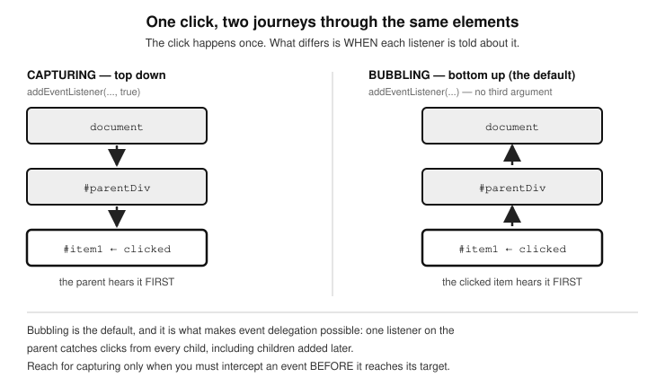

# Chapter 24 — EVENTS HANDLING

  - Event listeners
    - Inline event listener attribute
    - The addEventListener() method
  - Common JavaScript Events
  - Keyboard key detection
    - Listening for a key press
  - Triggering events dynamically
    - Dynamically triggering a click
    - Dynamically triggering a form’s submit event
    - Dynamically triggering a focus on an input field
    - Events with no trigger methods
  - A deep dive into event mechanics
    - Event bubbling
    - Event capturing (aka capture phase)
      - How to switch from bubbling to capturing
      - Bubbling vs Capturing, which is better?
      - Why ever use Event Capturing
    - Event delegation
    - Custom events
  - Conclusion
    

  One of the biggest reasons for JavaScript’s popularity is how well it handles events-those moments when users interact with your page.
Think about it:

  - A click on a button.
  - A hover over an image.
  - A keydown when typing into an input.
  - A submit of a form.
  - A drag and drop of a file.
	
All of these are events.
JavaScript listens for these user actions and gives you the power to respond immediately-updating the page, showing messages, processing data, and so much more. In this chapter, we’ll look at:

  - How to listen for events.
  - Different types of events you can respond to.
  - How to trigger events yourself from your JavaScript code.
  - How events travel through the DOM (bubbling and capturing).
  - How to delegate events smartly.
  - How to create your own custom events!

## EVENT LISTENERS

  JavaScript gives you a few simple ways to listen for events and respond to them. There are two major ways to do so.

#### i) Inline event listener attribute
This works in two steps; you add the event listener attribute on the target element’s tag, then get that event listener to call an inbuilt or your custom function in response to that event by passing the custom function as the value of the attribute. Here is an example:

	<button 
		id="myButton"
		class="btn btn-primary"
		onclick="myFunction(event)"
	>
	Click me</button> 

	function myFunction(e) {
		// stop event propagation
		e.preventDefault();

		let buttonId = e.target.id;
  		console.log("ID is: " + buttonId);
	}

Notice that the code that listens for the click
event is onclick="". Its value "myFunction()" is
a function which should exist in your code.
This function will automatically be called. Also
notice how as the function is called within the
attribute value, an ‘event’ string is passed to it
(onclick="myFunction(event)"). This ‘event’ is
the global event that is generated every time
an event occurs, and so by passing it to the
function you are calling, you are thereby
making that event object available to the
function. This is very important because that
is how that function will know which specific
element triggered the event among all the
many elements you have on your webpage. It
will then be able to attend to that specific field
and accurately respond to the event. Basically,
the special event object holds details about
what triggered the event (which button, what key,
which field, etc). From inside your function, you
can inspect the event object. For example,
e.target.id gives you the ID of the button that was
clicked in our above example:

		function myFunction(e) {
			// optionally stop event propagation
			e.preventDefault();
		
			// handle the click on myButton
			let buttonId = e.target.id;
			
			// this will write “ID is: myButton”
			console.log("ID is: " + buttonId);
		}

#### iI) The addEventListener() method
  Instead of adding event listeners inside your HTML,
  JavaScript also provides a cleaner, more powerful
  way: programmatically adding an event listener
  on any element of your choice, and assign it an
  event handler function which will take the action in
  response to that event.
  You call the addEventListener() method on any element.
  It takes two main arguments:

  - The event type (like "click", "submit", "mouseover", etc.).
  - A function (event handler) to run when the event happens.

	This function being passed as the second argument 
	can be implemented in two ways; 

a) Anonymous Function (Closure)
  This is a piece off code in the function’s block to be executed right
  there as a closure (anonymous function).
  Let’s see addEventListener() in action:

#### In a closure

		<button 
			id="myButton"
			class="btn btn-primary">
			Click me</button> 

		document.getElementById("myButton")
		    .addEventListener("click", function(e) {

		    // Prevent page refresh
   		    e.preventDefault(); 
    
		   // get the id of the clicked button
    	           let buttonId = e.target.id; 

    		   console.log("THE BUTTON ID IS: "+ 
			buttonId); 
   
		});

Notice how the function ran here in
response to the click event is an anonymous function. It is known
as an anonymous function or closure because it has no name, and
it’s passed directly into the addEventListener() function, instead of
being defined separately and then called (by its name) from the
addEventListener() function.

 

#### In an external named function

	// define the function
	function myFunction(e) {
		// optionally stop event propagation
		e.preventDefault();

		let buttonId = e.target.id;
  		console.log("THE BUTTON ID IS: " + buttonId);
	}

	let myButton = 
	   document.querySelector("#myButton"); 

	// invoke the function
	myButton.addEventListener("click", myFunction); 

  OR

	document.getElementById("myButton")
  	.addEventListener("click", myFunction);

Again, addEventListener() takes two
arguments, the element the event is expected
to be triggered on, and the function to run
(which is basically the action to take when
that happens). But I will like to draw your
attention to two things about how this external
function is called, and how the event object is
passed through to your function.
  First, when you specify the function, you need
to give only the function name, just like you
would pass in a variable. It should not be
wrapped in quotes for it is a function, and not
a string. Though it is a function you are
referencing here, do not place the parenthesis
after the function name. If you do that, then
JavaScript will attempt to call that function
immediately, instead of waiting for the event,
and so will fail.

		// no parenthesis after function name
		myButton.addEventListener("click", 
	   	     myFunction); 

  The second thing to note is how the event
object is passed through to your function.
When we passed the function name to
addEventListener(), unlike the case of the
event listener attribute where we pass in
‘event’ to our event-handler function as we
reference it, with addEventListener(), you do
not do that. You just need to reference the
name of the function, just like you would write
a variable. The addEventListener() method will
capture that triggered event object and
automatically pass it to the target event-
handler function you are referencing. That is
why the handler function should accept an
event object (e) within its parenthesis, eg:

		function myFunction(e) {
			…
		}

  Beside the JavaScript events for HTML
  elements mentioned above like click, or
  submit, mouseover, hover, keydown, etc, there
  are many more. Just read the online
  JavaScript documentation to learn more.

## Common JavaScript Events
  Here’s a list of the most commonly used events in everyday web development:

| Event name | When it happens |
|---|---|
| `blur` | Element loses focus. An element looses focus when the cursor is no longer active on it |
| `change` | When the value of the field changes |
| `click` | User clicks an element |
| `dblclick` | User double-clicks an element |
| `drag` | Item is being dragged |
| `dragend` | Dragging ends |
| `dragenter` | Item is dragged into a droppable area |
| `dragleave` | Item is dragged out of a droppable area |
| `dragstart` | Dragging of an item starts |
| `dragover` | Item is being dragged over a droppable area |
| `drop` | Item is dropped into a droppable area |
| `focus` | Element gains focus. The cursor is active on it. |
| `input` | User types into a field |
| `keydown` | Key is pressed down |
| `keyup` | Key is released |
| `load` | Page or resource finishes loading |
| `mousedown` | Mouse button is pressed down |
| `mouseenter` | Mouse first enters an element (does not bubble) |
| `mouseout` | Mouse moves out of an element |
| `mouseleave` | Mouse leaves an element (does not bubble) |
| `mouseover` | Mouse moves over an element |
| `mouseup` | Mouse button is released |
| `resize` | Window size changes |
| `scroll` | User scrolls the page or an element |
| `submit` | Form is submitted |

Tip: Some mouse events (mouseenter, mouseleave) do not bubble, meaning they don't pass upward through the DOM like mouseover and mouseout do. (We’ll talk about bubbling shortly!)

## Keyboard key detection
  The keydown event will fire when any key on your keyboard is pressed. It will therefore be useful to know how to detect which specific key was pressed. JavaScript provides you a way to do this. Having this skill can be invaluable when building applications that involve users controlling objects on the screen with thee keyboard. This is a vital skill when creating games, which is something JavaScript shines in. Another great use for keyboard detection is if you wish to provide the users of your application with shortcuts for certain tasks or functionalities.  
  When your program needs to react to keyboard input (like moving a ball with arrow keys), JavaScript gives you special keyboard events such as:

  - keydown – when a key is pressed down
  - keyup – when a key is released
  - keypress – similar to keydown (but now discouraged for most uses)

### Listening for a key press
  You can use document.addEventListener() to listen for key events on the entire page. Here's an example:

	document.addEventListener("keydown", (e) => {
  		console.log("You pressed:", e.key);
	});

Let’s create an example involving detecting a press on the arrow keys. We used this same example logic in Chapter 15 to move a ball on the HTML5 canvas based on the direction of the arrow key that was pressed.

	document.addEventListener("keydown", (e) => {
  		let dx = 0;
  		let dy = 0;

  		if (e.key === "ArrowUp") dy = -ball.speed;
  		if (e.key === "ArrowDown") dy = ball.speed;
  		if (e.key === "ArrowLeft") dx = -ball.speed;
  		if (e.key === "ArrowRight") dx = ball.speed;

  		// Move the ball if the direction is valid
	});

The way this code logic works is as follows
  - e is the event object passed to your function. It has properties in
  which important things about the event that just occurred are
  recorded. The property that will contain information varies
  depending on the event that occurred. The event in this example is
  keydown (or keypress), and therefore, the properties you should be
  checking to get the details of the event would be properties
  like .key, .code, or .keyCode (not recommended as it is deprecated).
  - e.key will always contain the name of whatever key on your
  keyboard was pressed (like "ArrowUp" or "a" or "k" etc).
  - e.code always contains a code string associated with, and
  represent any key which you can use instead of the key name
  stored in e.key. It is similar to the .key value, but meant to be a code
  string.
  - e.keyCode. Older JavaScript applications (or game engines)
  sometimes use these. They are number codes associated with all
  keys, that you can use instead of the string values. It is deprecated
  but still works as of the date of this writing.

The following table shows you the values recorded for the key names on the .key property, and the corresponding codes stored in the .code property of the event object when the arrow keys are pressed. To give you variety on alternative keys, I have also thrown in there, the names and codes recorded when the space bar and letter a keys are pressed.

| e.key | e.code | e.keyCode (old) |
|---|---|---|
| "ArrowLeft" | "ArrowLeft" | 37 |
| "ArrowUp" | "ArrowUp" | 38 |
| "ArrowRight" | "ArrowRight" | 39 |
| "ArrowDown" | "ArrowDown" | 40 |
| " " | "Space" | 32 |
| "a" | "KeyA" | 65 |
 
If for example I wanted to detect if the arrawUp key was pressed when keyDown event occurred by using the number code (.keyCode) instead of the .key value, I would do it like so:

	document.addEventListener("keydown", (e) => {
  		if (e.keyCode === 38) {
    			console.log("Up arrow!");
  		}
	});

Visit the online documents for the codes of any other keys you are interested in detecting.

## Triggering events dynamically
  Dynamically doing something in programming terms means you are making something happen entirely in code, without any manual user effort. Sometimes you don’t want to wait for a user’s action before you execute an action.
You can programmatically trigger certain events by calling specific methods on DOM elements. All HTML elements have certain events associated with them, and so they each have methods provided by JavaScript to deal with these events. For example, the form element has a submit() method which can be used to trigger the submit event (for submission) on the form or to check if it has been submitted. An actor tag, which is used to create links has a click() method for handling a click event on it etc. As you get familiar with different events, you will come to be familiar with which events belong to which elements. Let’s learn how to dynamically trigger some events in code:

### Dynamically triggering a click

	<a id="myLink" href="https://example.com" target="_blank">Visit 	
		Example</a>

	

Here we select the anchor tag by its id attribute ‘myLink’, and store it in the variable a. Then we trigger a click event on it by calling the click() method that belongs to all HTML anchor elements.

### Dynamically triggering a form’s submit event

	<form id="myForm" action="https://example.com/submit" 
		method="POST">
  
		<input type="text" name="username" value="john_doe">

	</form>

	

Here we select the form element by its id ‘myForm’. Next, we submit the form dynamically by calling the submit() method that we know belongs to all HTML form elements.

### Dynamically triggering a focus on an input field

	<input id="myInput" type="text" placeholder="Type here...">

	

Here we select the input field by its id attribute ‘myInput’. Next, we call the focus() method on it to place an active cursor in it.

### Events with no trigger methods
  As we have seen, some events have special methods you can directly call to trigger events like:
  - click()
  - submit()
  - focus()
  - blur()
  - play(), pause() (for media elements)

However, for most other events, there are not specialised methods you can just call to handle them. For such events, the way to trigger them is to manually create and dispatch an event. For example, the following is how to trigger a mouseover event manually:

	<button id="myButton">My Button</button>

	

In this example, notice how you have to create the mouseover event by instantiating the MouseEvent class by passing to its constructor, the mouse event name as a string-which in this case is ‘mouseover’. 

Let’s understand an important distinction here. If you take out these last two lines:

	const myMouseoverEvent = new MouseEvent("mouseover");
	element.dispatchEvent(myMouseoverEvent);

You would notice that the event still fires. But there is a difference. 
The code will still work, and the "mouseover" event will still be triggered, however, it will be triggered only when the user hovers over the button with the id attribute of "myButton”. In this case, there will be no need to create or dispatch anything yourself. The browser itself creates and dispatches the event for you when the user interacts.
That's default browser behaviour-you don't manually fire anything.
Basically, here, you are waiting for the user to naturally trigger the event (move mouse) before the event will fire. Here, the browser automatically creates and dispatches event when user moves mouse

But if you put back the two lines, you will also notice that even if the user does nothing (no mouse movement over the myButton element), the event handler will still run. It's like you simulating or faking the user action by force. At page refresh, it fires, no need to hover over the button.
Basically, here you are manually firing the event immediately, even if no user action happens. Here, you create the event yourself and dispatch it programmatically.

Following this same example, you can create and dispatch events like dragstart, drag, mouseenter, mouseleave, and even custom events this way. You may be asking yourself what the use case for triggering events dynamically will be. It is a good questions. You would want to trigger an event yourself in code (maybe for automation, testing, user assistance, simulations, etc.). Imagine that you are testing your website and you want to simulate a user hovering without actually moving the mouse. Instead of saying "Hey, test person, move your mouse here!", you just use:

	element.dispatchEvent(new MouseEvent("mouseover"));

And, boom! The event fires.

#### Deep dive into event mechanics

### Event bubbling
  When an event happens, it first occurs on the target element (where the user acted). Then, it "bubbles up" through the parent elements all the way to the root (highest parent element) (`<html>`). Example:

  - You click a button inside a div.
  - The click event first fires on the button.
  - Then it bubbles up to the div.
  - Then bubbles up to the body, and so on.

Why it matters: you can listen for an event higher up in the DOM, instead of on every tiny element individually. Event bubbling is the default propagation pattern.

### Event capturing (aka capture phase)
  This is the event propagation pattern that is directly opposite to bubbling. In event capturing mode, instead of bubbling up, events will first travel downward from the root (top-most parent) downward to the target (the element on which the event was triggered). This is called capturing. By default, most event listeners listen during the bubbling phase. But you can make a listener listen during capture phase by setting { capture: true }. This is an advanced concept to grasp for less advanced programmers, so let me take the time to break it down. If I seem to be repeating some words, just follow along, it’s to drive this important topic home in your mind. 
  In the context of event capturing, "the root" simply means the very top parent element. In a web page, the biggest root is usually the document or `<html>` tag. But inside a smaller section, like a `
`, the root could be that `
` when you're only considering its children. Let me demonstrate:

	

  		<ul>
    			<li id="item1">Item 1</li>
    			<li id="item2">Item 2</li>
  		</ul>
	

In this example; #parentDiv is the root inside this small piece of DOM.
The `<li>` elements are children (targets you might click on). Again, the target is the specific element that the user actually interacts with. If you click on Item 2, then the target is the `<li>` with id="item2". If you click on Item 1, the target is `<li>` with id="item1".
  Here is how capturing actually works. With event bubbling, the event starts at the target and bubbles up toward the root. But with capturing,
the event first starts at the root and travels down the DOM tree — down through each parent, until it reaches the target. Let me demonstrate with a practical working example:

#### HTML code
	

            Parent Div
            <ul style="margin-top:10px;">
              	<li id="item1" style="padding:10px; border:1px solid red;">
			Item 1</li>
              	<li id="item2" style="padding:10px; border:1px solid blue;">
			Item 2</li>
            </ul>
          

#### JavaScript code

	const parentDiv = document.getElementById("parentDiv");
	const item1 = document.getElementById("item1");
	const item2 = document.getElementById("item2");

	// Add event listener to the parent div (capturing phase)
	parentDiv.addEventListener("click", function(e) {
  		alert(
			"Parent DIV handled the click FIRST during CAPTURING phase!"
		);
	}, true);  // <- This 'true' enables capturing

	// Add event listener to item1 (normal bubbling)
	item1.addEventListener("click", function(e) {
  		alert("Item 1 was clicked (handled during BUBBLING phase)");
	});

	// Add event listener to item2 (normal bubbling)
	item2.addEventListener("click", function(e) {
  		alert("Item 2 was clicked (handled during BUBBLING phase)");
	});

Here is what happens when you run this code; If you click on Item 1:

  - First, the Parent DIV's capturing handler fires (because we set
    {capture: true}).
  - Then, the Item 1 click handler fires during bubbling.
  - The same happens when you click on Item 2.

As a final analogy; imagine the Root (Parent Div) to be the CEO, and the Target (Item clicked) to be a Worker. When a user clicks, 
	
  - In bubbling, the Worker notices first, then tells the Supervisor, then the Manager, up to the CEO.
  - In capturing, the CEO checks first ("is it mine?"), then passes it down Manager to Supervisor to Worker, until finally the exact clicked item is found.

- Figure 25.1 — One click, two journeys through the same elements*

#### How to switch from bubbling to capturing
  You have just seen how to do that already, but I am making this sub-heading to separately emphasise on how it’s done again because it is very essential knowledge. Thus far, I have told you about two arguments you need to pass to the addEventListener() method whenever you use it to listen for an event on an HTML element. Well, there is a third argument, and that is a boolean (true or false) which determines if the event propagation is going to be in the capturing phase or not. 
  This third argument is false by default, so even when you do not pass anything into it, event capturing will be set to false. That is why the argument is optional, and that is why event bubbling is on by default. If you want to handle an event in the capturing phase therefore, you have to explicitly pass in a value of true for that third parameter. This is how to do that:

	element.addEventListener("click", function, true);

The true tells JavaScript: "I want this function to run during the capturing phase (traveling from top/root down to the target), not during the default bubbling phase (from target upward)."

#### Bubbling vs Capturing, which is better?
  The answer is quite simple. Bubbling is generally better and more widely used, and here is why:

  - 1) Bubbling is the default behaviour

        * Bubbling happens automatically in JavaScript.
        * You don't have to set anything special (like { capture: true }).
        * It’s the natural way the browser handles events.
  

  - 2) Bubbling is more Predictable

    - Developers are more familiar with bubbling.
    - When you write event handlers on child elements, you expect the event to "bubble up" to parent elements.

  - 3) Bubbling is what makes event delegation possible

    - Event delegation (which we talked about) depends on bubbling.
    - It lets you attach one event listener to a parent instead of many listeners on children.
    - This could be a huge performance boost when you have many child elements.

  - 4) Using bubbling makes for less overhead

    - The browser is heavily optimised to handle bubbling efficiently.
    - Capturing is a bit less commonly used, so it's slightly less optimised in some browsers (but in practice, this difference is very tiny).
	
  - 5) Using bubbling makes for cleaner and simpler code
	
    - This is because without capturing, you avoid complicating the event flow unnecessarily.

#### Why ever use Event Capturing
  As bad as it seems to be from the ton of points above, capturing does have its own uses. It would be useful in the following scenarios:

  - When you need to intercept an event before it reaches its target.
  - When you want a parent to prevent something before the child can
    react.
  - You are dealing with security-sensitive or priority-sensitive
    actions.

Take for example, you may have a parent form that needs to stop certain clicks from even reaching inner elements (e.g., security features in apps). However, we can all agree that these occasions are rare. The rule to go by is this; always go with bubbling unless you have a very special reason to use capturing.

### Event delegation
  Event Delegation is a smart technique:

* Instead of attaching event listeners to hundreds of child elements,
* You attach one listener to a common parent,
* Then use the event.target inside your function to know exactly which child triggered the event.

Let’s see an example:

	<ul id="myList">
  		<li>Item 1</li>
  		<li>Item 2</li>
  		<li>Item 3</li>
	</ul>

	

This works well, and with just one event listener on the `<ul>`, you handle clicks for any `<li>`

### Custom events
  JavaScript even allows you to create your own custom events.
Example: creating and dispatching a "userLoggedIn" event:

	// Create a new event
	const loginEvent = new CustomEvent("userLoggedIn", {
    		detail: { username: "john_doe" }
  	});
  
  	// Listen for the custom event
  	document.addEventListener("userLoggedIn", function(e) {
    		alert("Logged in user is: " + e.detail.username);
  	});

  	// Dispatch the custom event
	document.dispatchEvent(loginEvent);

When you comment out this last line that dispatches the event:

	document.dispatchEvent(loginEvent);

Nothing happens. But as soon as you comment out the line, the event is dispatched, and your listener code picks it up. 

Custom events are powerful for building your own systems inside an app.
  Let’s look at a  scenario that demonstrates how to create and dispatch a custom event in a real-world-like situation. Imagine you’re building a web app. When a user successfully logs in, several parts of your app should update:

  - A welcome message should show.
  - A logout button should appear.
  - The user profile section should refresh.

Here is the kicker; instead of calling all these updates manually in the login function, you can dispatch a custom userLoggedIn event, and let each part of the app listen for that event and respond. Here is some code to do just that:

	<!DOCTYPE html>
	<html>
	<head>
	  <title>Custom Event Demo</title>
	</head>
	<body>

	  <button id="loginBtn">Login</button>

	  
Welcome, user!

	  <button id="logoutBtn" style="display: none;">Logout</button>

	  
	</body>
	</html>

Once more, here are the key points of what it does:

  - CustomEvent is used to create an event with a name you choose.
  - You can dispatch it using element.dispatchEvent(...).
  - Any part of the app that cares about that event can simply listen for it and take its own action.
  - This promotes decoupled design – components don't need to know about each other.

#### Passing data with your custom event
  You can pass data via your events so that subscribers to the event (event listeners) can retrieve and use it. This will of course be information relevant to the event that occurred, or information specific to the target element (the element that triggered the event). If for example, you wanted to pass in some user data, you could use detail:

	const loginEvent = new CustomEvent("userLoggedIn", {
  		detail: { username: "coder123" }
	});

	document.dispatchEvent(loginEvent);

		// In the listener:
		document.addEventListener("userLoggedIn", function(e) {
  			console.log("Logged in user is:", e.detail.username);
		});

Notice how the listener retrieves and uses that data from the event object stored in e. Note very carefully here that in a custom event, this key that holds the data object you are passing through has to be named 'detail’. It has to be exactly that as required by the JavaScript specification.
You cannot change it to anything else like data, info, or payload. JavaScript looks specifically for event.detail when you're dealing with custom events.
  This is because when you create a CustomEvent, you're using the built-in CustomEvent constructor. This constructor accepts an optional second argument-an object-and it has a predefined structure. One of the allowed keys is detail, and it’s the only place where you can safely pass your own custom data.

## Conclusion
  In this chapter, you learned:

  - What events are and why they matter.
  - Two ways to listen to events: Inline and addEventListener().
  - A huge list of useful everyday events.
  - How to trigger events dynamically.
  - How events travel through the DOM (bubbling, capturing).
  - How to smartly delegate event handling.
  - How to create and fire your own custom events!

By mastering events, you can make your web pages truly interactive and 
responsive to users. Events are truly the heartbeat of the modern web.
