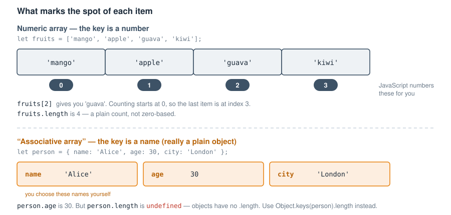
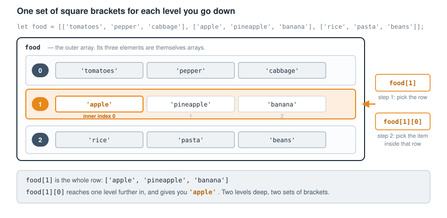
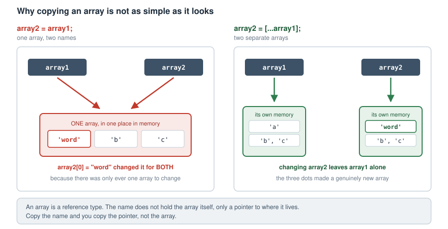

# Chapter 3 — ARRAYS
    - Definition
  - The two types of arrays
    1) Numeric (index)
      - the Array() constructor
      - square brackets
      - Assigning values to a numeric array
      - Retrieve values from a numeric array
      - Modify an array using indexes
  2) Associative arrays (also known
      as hash maps)
      - Retrieve values from an
  associative array
      - Assign and update values in an associative array
      - Using Dot notation
      - Using Bracket notation
      - Initialising the array with data
      - Updating values
      - The difference between an
      associative array and a JSON
      object

  - Multi-dimensional arrays
    - Muti-dimensional numeric arrays
    - Multi-dimensional associative arrays
    - How to assign values to a
      multi-dimensional array
    - How to retrieve values from
      a multi-dimensional array
  - Looping through arrays
    - Looping through a numeric
      array
    - Looping through an
      associative array
    - Looping through a
      multi-dimensional array
      - a) Loop through a
      multi-dimensional
      index array
      - b) Loop through an
      associative
      multi-dimensional array
  - Rest parameters and the spread
    operator
  - Array properties
    - length
    - prototype
    - constructor
    - prototype.length
  - Array methods
  - True array methods and associative arrays


### Definition
  An array is similar to a variable in that it is like a virtual container in computer memory to store things, with the only difference that you can store multiple things at once.
  The elements you store in an array can be any data type e.g.
   Numbers, Strings, Booleans, Functions, Arrays, Objects. These elements as well as their keys (indexes) can also be stored in variables and passed into the array dynamically. Multiple elements should be separated by commas, with the trailing (last) comma (after the last element) being optional.
  When an array contains another array, we have an array structure known as a multi-dimensional array. In such a structure, we refer to the inner array as a child, nested or sub array, while the outer array can be referred to as the parent array.
  There are two types of arrays and their differences lie in how the indexes (also known as keys) of the items they contain (known as elements) are allocated.

  1) Numeric arrays aka indexed arrays
  2) Associative arrays

Each element in the array is referenced by a key which marks its spot in the array. For a numeric array, the key is a number (also referred to as an index) and for an associative array, that key is a small string of text, also referred to as a name.
  Let’s talk about the syntax, structure and application of the two array types.



- Figure 3.1 — What marks the spot of each item*

     
## THE TWO TYPES OF ARRAYS

#### 1) Numeric arrays aka indexed arrays

  Numerically-indexed arrays, also referred to as numeric arrays are arrays whose indexes, or keys are number based. JavaScript uses the so-called zero-based numbering of array indexes, which means that the numbering of the keys of arrays starts from zero. When creating an array, you do not need to specify the keys as JavaScript will do that for you automatically.
  This numeric array is the true array of JavaScript, and its parent is Array.prototype i.e. the prototype of the Array constructor. Do not worry if you do not know what a constructor means right now. I will explain that in Chapter 17 where you will learn all about objects and classes. Just bear with me, follow the code examples I provide as we go along now, and though they may include some objects, I will break it all down so that by the time you get to Chapter 17, you will be a master of it. If you prefer to just go to Chapter 17 to read the introduction before coming back here, that will also be a wise idea, but you do not have to do so to follow along here. I need you however, to remember this important point; that the parent of a numeric array in JavaScript is the prototype (blueprint from which other objects are formed) property of JavaScript’s built-in Array object. This makes numeric arrays the true array in JavaScript, and I will explain more shortly how that makes numeric arrays behave differently from the other type of array—associative arrays—which are not true arrays in JavaScript because their parent is the prototype property of JavaScript’s (built-in) Object.prototype. Do not mistake this to mean that they are not related, because they are very related. Let me show you how.   
  When we speak of objects in programming, also referred to as object-oriented programming (OOP), if an object extends another, it is said to be the child of the object it is extending, and it inherits properties from that parent. The parent of associative arrays is Object.prototype which is the parent of objects in JavaScript, while the parent of numeric arrays is Array.prototype. However, Array.prototype in turn inherits from Object.prototype. See associative arrays in JavaScript as the uncle of numeric arrays. There is no such official relationship in JavaScript or any programming language as uncle or nephew, but I am giving you this as a symbolic way to understand the relationship between these two array types better. If Array.prototype and associative arrays both inherit from (have the same parent) Object.prototype, then the two of them are like siblings. Also, since Array.prototype has a child that is a numeric array, a good way to remember their relationship is to see a numeric array as the nephew of an associative array, and a grand child of Object.prototype. Hold this thought as we proceed, and all will become crystal clear, I promise. Let’s proceed with learning how to create a numeric array.
  There are two ways to create a numeric array, and these are either by using the constructor of the built-in Array class, or the easy shorthand way which is by using square brackets. 


#### With the Array() constructor

         	let fruits = new Array('mango', 'apple', 'guava');

		console.log(fruits);

Outputs:
  ['mango', 'apple', 'guava']


#### With square brackets
       		let fruits = ['mango', 'apple', 'guava'];

		console.log(fruits);

Outputs:
  ['mango', 'apple', 'guava']


#### Assigning values to a numeric array
  In the above examples, we initialised the variable with
elements already added to it. But you can create an empty
array and then dynamically add elements to it later when you
need to. You will find that this is a very common way of working.
This is because you will not always have the data immediately
when you create the array, but rather, you will create the array
in anticipation of data being available, and add them as they
become available.
  Once you have created the empty array, there is a very handy
method called push() which you will use to insert items into your
array. (A method is simply a function that belongs to something, in
this case to the array itself, which is why you write it after a dot:
fruits.push().) The push() method can take a single item or several
of them, separated by commas, and they can be of any type: strings,
numbers, booleans, even other arrays. Let’s see how to do that:

		// create an empty array as normal using the Array() constructor
		// or the square brackets as we have seen above
		let fruits = new Array();
		// OR
		let fruits = [];
    
		// add single or multiple items to the array
		fruits.push('mango');
		fruits.push('apple', 'guava', 'kiwi');

		console.log(fruits);

Outputs:
  ['mango', 'apple', 'guava', 'kiwi']

  You can also target a specific index/key to add a element to in an
  existing array. If there is no element at that key, the element will be
  added to the key, but if there is already an element at that key, the
  new element will replace the previous element. For example:

		let fruits = ['mango'];
		fruits[0] = 'apple';

		console.log('One item: '+fruits);

		fruits[1] = 'guava';

		console.log('Two items: '+fruits);

  The output of the above code is:

One item: apple
Two items: apple,guava

  We start by creating an array of fruits with one item 'mango' in it.
  Next, we add an item 'apple' specifying that we need it at the first
  index. However, that first index already has the 'mango' since we
  know that being the only item in fruits, it will automatically be
  occupying index 0 (the first index). So, 'apple' replaces 'mango' at
  that index. When we check what’s inside fruits array, we see it has
  only one item, 'apple'.
  Next, we add a new item 'guava' and specify that we want it at the
  index 1, since there is nothing in fruits at that index (apple is at index
  0), guava is added at index 1. Now when we view the contents of fruits,
  we see it has both apple and guava in it.
  Adding items to specific indices is okay when you know the positions
  of existing elements in the array, but there are times when it is hard to
  tell. You run the risk of unintentionally overriding an item in the array
  if you are not sure. In these cases, it’s better to use push() to have
  that item appended as the last element in the array.


#### Retrieve values from a numeric array
  To retrieve values from a numeric array, it depends on how you wish to retrieve the data. You may want to retrieve only a single element or you may wish to loop through the array and retrieve or display every element in it. If you just want to grab only a single element from an index in the array, it’s quicker to use the bracket notation and the index number. The bracket notation will also work with strings too—more on this in Chapter 9 (Strings). Here is how to use the bracket notation to retrieve array values:

	let fruits = [];
    
	fruits.push('mango');
	fruits.push('apple', 'guava', 'kiwi');

	console.log(fruits);

Outputs:
  ['mango', 'apple', 'guava', 'kiwi']

To grab the item at index 3, do it like so:
		
	 // this will give you 'kiwi'.
	fruits[3];

If you wish to grab everything in the array, whose content and length you may not always know, you have to use a loop statement to do so. You can 
look under the looping section for a full explanation and demonstration of 
how looping works and the types of loops. For now here is how to use the 
for loop to extract all the items from the fruits array.

	let fruits = [];
    
	fruits.push('mango');
	fruits.push('apple', 'guava', 'kiwi');

	// prepare new array to store your retrieved fruit items in
	let fruitBasket = [];
	
	//console.log(fruits.length);
	for (let i = 0; i < fruits.length; i++)
	{
   		console.log("adding " + fruits[i] + " to my basket");
    		fruitBasket.push(fruits[i]);
	}

	// view the contents of your fruit basket
	console.log(fruitBasket);

Outputs:

	['mango', 'apple', 'guava', 'kiwi'];


#### Modify an array using indexes
  This will not work with strings, but it will work with arrays. Here is how you can do that:

	let myArray = [1, 5, 25];
	myArray[1] = 45;

This means you have targeted the myArray array’s value at the index of
1, which is 5, and changed its value to 45. The array myArray will now 
contain: [1, 45, 25];

         
#### 2) Associative arrays
  Unlike a numeric array which is basically an ordered (numbered) list; an associative array is an array whose keys are named properties (strings), meaning, instead of numbers, the keys are strings. Unlike most other programming languages which have real associative arrays—arrays whose keys are strings, JavaScript does not have associative arrays. At least it does not have it in the real sense of the word. JavaScript arrays are designed for ordered lists using numbers as keys (called indexes). If you want to store values by name instead of number, you should use an object, not an array. This is a very common misconception that confuses programmers new to JavaScript. So what has come to be known as an associative array in JavaScript is actually an object. That, and the fact that the parent of the associative array is JavaScript’s built-in Object.prototype and not Array.prototype, is the reason why associative arrays are not true arrays in JavaScript. The true arrays are numeric-indexed arrays, whose parent is Array.prototype.
  Once again, associative arrays are simple plain objects and the keys are not numbers. Respect this distinction between the two, and you will be fine. For example, do not create an array in the numeric style using strings instead of numbers. Remember I mentioned earlier that because of their different parents, both array types behave differently. Let me explain why not understanding the difference between the two can cause problems for you. 
  While JavaScript would still let you assign named properties to an array, they don't behave like real array elements. For example, they won’t show up when you loop through the array, and no matter how many elements there are in the array, that number will not be reflected in the .length property. This is better demonstrated than explained. Here is an example of an associative array being created in the same way you would create a numeric (indexed) array, instead of using an object:

	let student = [];

	// Adding "associative" (named) keys
	student["name"] = "Amina";
	student["age"] = 12;
	student["grade"] = "6";

	// Adding one real array element
	student[0] = "Math";

	// Let's examine the array
	// Output is: [ 'Math', name: 'Amina', age: 12, grade: '6' ]
	console.log(student);   

	// Output is: 1 — only the numeric item is counted    
	console.log(student.length); 

	// Loop through the array
	for (let i = 0; i < student.length; i++) {
		// Output: only "Math" gets printed
  		console.log(student[i]);  
	}

What happens is:
  - Only the numeric index 0 (the subject "Math") is stored as a real
  array element.
  - The "name", "age", and "grade" properties are stored as custom
  properties, not actual array properties.
  - Checking the length of the array with student.length returns 1,
  where .length is a property of arrays that shows you the number of
  elements in an array. The value here is 1 because only index 0 is
  counted.
  - Even worse, for loops, .map(), .forEach(), etc., which are meant to
  work on real arrays, will ignore those named keys.

The correct way to create an array with named keys in JavaScript is to use objects. We will learn all about objects in Chapter 17 when we learn about Object-Oriented Programming (OOP). For now just understand that to create a plain object in JavaScript, you assign a variable to a pair of curly braces ({}) inside which you list key-value pairs, where the keys are on the left and their values are on the right. Each key is separated from its value by a colon (e.g. myKey: myValue), and multiple key-value pairs are separated by commas. Take care not to confuse this with a block, which also uses curly braces but groups code rather than storing data. We drew that distinction in Chapter 2, under "Blocks are not objects". 

Let’s convert the above faulty student example into an object:

	let student = {
  		name: "Amina",
  		age: 12,
  		grade: "6",
  		subjects: ["Math", "English"]
	};

The name of the array (object) is student. An example of a key is name, and its value is the string “Amina”. Notice how the values are separated by commas, and the last element may or may not have a trailing comma.

	// Output is: Amina
	console.log(student.name); 

	// Output is: 2
	console.log(student.subjects.length); 

	// Output is Math and English, each printed on its own line.
	// (The => arrow is a short way of writing a function.
	//  We come to those in Chapter 7.)
	student.subjects.forEach(sub => console.log(sub)); 

The length property will not work on this object, because it is a property of real (numeric) arrays, not objects. Notice that though we cannot use the .length property on the whole student object itself, we use it on the subjects property, which is a numeric array.
  If you ever find yourself giving an array "named properties" (like array["name"] = "value"), stop and ask: “Should this really be an object instead?” Arrays are for ordered lists (a list with numbers), and objects are for key-value pairs. Mixing them leads to bugs where your data won’t behave the way you expect.
  In some JavaScript references, you will see associative arrays being defined as an array whose properties are strings, and in others, as an array with named properties, or arrays that have properties by name. These are all essentially describing JavaScript objects, not true arrays, and they're all saying the same thing in different words.
  Having said all that, let us agree that when people say “associative array” in JavaScript, they are essentially speaking of a plain object with key-value pairs, even though it's not really an array. The keys of this object are strings (or symbols), and the values can be of any type. 
Enough of this repetition, for I know you have got it now. Congratulations, you have hit a milestone and are well on your way towards JavaScript mastery. Let’s forge onwards and look at the syntactical aspects of an associative array.
  The property name of the object must be a valid identifier. Here are the syntax rules of an identifier:

  - It cannot contain spaces
  - The named properties may or may not have quotes
  - It cannot start with a number (but can have a number in the body)
  - Cannot contain spaces or symbols (special characters) like -, ., !, # etc, unless quoted
  - The only special characters allowed are _ and $
  - If your property name has spaces or special characters like - (hyphen), it's not a valid identifier, and must be quoted:

Here is a valid example:

  const person = {
    "name": "Alice",
    "age": 30,
    occupation: "Developer",
    _id: 12345,             // valid
    $status: "active",      // valid
    "other-name": "Gray",   // valid (quoted)
    "home town": "London",  // valid (quoted)
  };

The property name "other-name" would otherwise be invalid if it was not quoted, because it contains a hyphen. Similarly, the "home town" has a space in it, so it is quoted. These two properties break the identifier rules, and are fixed by quotes. However, because they are fixed by quotes, it changes the way their values can be retrieved. I will address that shortly when I talk about retrieving and updating the values of associative array properties.

With JavaScript objects, whether you quote the properties or not, it makes no difference — they're all stored as strings. That is why, to retrieve their values, doing it like so:

  person.name
  or
  person['name']
  or
  person["name"]

will all work just fine.

If you are wondering why person.name and person["name"] both work, it’s because in JavaScript you can use both bracket or dot notations to access object values. Notice that in this person object, some keys are quoted, like "name", and some are not, like occupation. However, retrieving their values will work in the same way-which is by using the bracket or the dot notation. The only exception is with the keys that break the identifier rules and are quoted, whose values I will talk about how to retrieve shortly. 

Let’s look at how to retrieve values from objects (associative arrays) next.


#### Retrieve values from an associative array

  In JavaScript, associative arrays are just objects with named properties — so we can use the same rules for accessing object values to access associative array values. We can therefore do so by either using the dot (.) notation, or the bracket notation ([]). Both of these lines will work:

	person['name'];
	person.name;


Let’s talk about these notations, and when to use which. Remember, above we saw how if your property name has spaces or special characters like - (hyphen), it's not a valid identifier, and must be quoted. Even if you use quotes to create the property (like "other-name"), it still isn't a valid identifier—so in that case, you cannot use dot notation to access it. Rather, you should use bracket notation, like this: 

  obj["other-name"]

Let’s look at the differences between the two types of notations.

  Dot Notation 
  - Uses a period (.) followed by the property name, like
    obj.propertyName.
  - It is simpler and more readable.
  - The property name as we know, must be a valid identifier (i.e., it
  cannot contain spaces, start with a number, or have special
  characters other than _ and $).

  Bracket Notation (obj['property'])
  - More flexible because the property name can be a string or a
  dynamic expression.

  - It is required:
- When the property name contains special characters or spaces. For example:

		const obj = { 
    				"first-name": "Tom",
    				"aunt": "Polly"
			}; 


		console.log(obj["first-name"]); // will return: Tom

- When the property name is stored in a variable. For example:

		let key = "aunt"; 
		console.log(obj[key]); // will return Polly

-When you need to access properties dynamically inside a loop or   
  function. For example:

		// Iterates over all values displaying the value at each key
		for (let key in obj) 
		{ 
			console.log(obj[key]);
		}


  When to Use Which  
  - Prefer dot notation when possible, as it is more readable and
  concise.
 
  Use bracket notation when:
  - The property name is not a valid identifier.
  - You need dynamic property access.

A dynamic key access is if you need to reference a key of the object by referencing it not directly, like using a variable. 

	const person = {
    		"name": "Alice",  
    		"age": 30,   
	}; 


	let key = "age";
	console.log("Dynamic age value is: "+person[key]);
	console.log(person.name);

The output will be:

  Dynamic age value is: 30
  Alice

We referenced the key dynamically from a variable: person[key]. For this, we had to use the bracket notation as the dot notation like so:

  person.key

would not have worked.

Here is another example demonstrating how and when to use the two notations:

  const person = {
    "name": "Alice",
    "age": 30,
    occupation: "Developer",
    _id: 12345,             // valid
    $status: "active",      // valid
    "other-name": "Gray",   // valid (quoted)
    "home town": "London",  // valid (quoted)
  };

	console.log(person.age);
	console.log(person.occupation);
	console.log(person._id);
	console.log(person.$status);
	console.log(person["other-name"]);
	console.log(person["home town"]);

  Will work fine and produce the output:

  30
  Developer
  12345
  active
  Gray
  London

	But console.log(person.other-name);

Will not throw an error, but will hand you back NaN, which in JavaScript is a special value meaning “Not a Number”. You can use dot notation (object.key) only if the property name is a valid JavaScript identifier (no spaces, no hyphens, no starting numbers). If the name contains symbols or spaces, you must use bracket notation. JavaScript interprets obj.other-name as a math expression: 

  person.other - name

and since you're trying to subtract a variable name (which likely isn't a number) from person.other, the result is not a number — hence NaN.
Instead, you must use a bracket notation, like this:

	console.log(person["other-name"]);

If you're ever unsure which to use, try bracket notation. It always works, even when dot notation does not.


#### Assign and update values in an associative array
   Same as with retrieving values, you can assign and update values in an associative array using either the Dot or Bracket operators. Which operator you use will depend on the nature of the key. Remember in the introduction to associative arrays above we saw how keys made of invalid identifiers should be wrapped in quotes, and how these have to therefore be retrieved or referenced using square brackets. Well, ‘referencing’ applies to both when assigning and when updating the values of these keys.

##### Using Dot notation
	let associativeArray = {};

	associativeArray.key = "VALUE";
	console.log("The value of key is: "+associativeArray.key);

The output will be:
  The value of key is: VALUE

##### Using Bracket Notation
	let associativeArray = {};

	associativeArray["key"] = "VALUE";

	// example with a dynamic key
	let dynamicKey = "age";
	associativeArray[dynamicKey] = 25;

	console.log(associativeArray.key);
	console.log(associativeArray.age);

The output will be:
  VALUE
  25

  The 'age' key is dynamic because we are assigning the key
  from a variable (dynamicKey).

##### Initialising the array with data
  The above examples start an array from a blank slate, but you can also create an array that already has elements in it from the outset.

	const person = {
    		"name": "Alice",  
    		"age": 30,  
    		"favourite colour": "blue",  
	};

	person.country = "Holland";
	console.log(person);

The output will be:
  {
    name: 'Alice',
    age: 30,
    'favourite colour': 'blue',
    country: 'Holland'
  }


In this example, we create an array with some data already in it, then add a new key-value pair, country, that did not exist before. Updating the value of a key that already exists is what we look at next.

##### Updating values
  Let’s look at examples of how to update associative arrays: 
 
	//modify "favourite colour" using Bracket notation
	person["favourite colour"] = "black";
	console.log(person);

	// modify age and country using Dot notation
	person.age = 40;
	person.country = "England";
	console.log(person);

The output will be:

	{
    		name: 'Alice', 
    		age: 30, 
    		'favourite colour': 'black', 
   	 	country: 'Holland'
	}


	{
    		name: 'Alice', 
    		age: 40, 
    		'favourite colour': 'black', 
    		country: 'England'
	}

Let me point out a few things which you probably already noticed. When updating the value of the "favourite colour" key, we use a bracket notation

	person["favourite colour"] = "black";

This is because using a Dot operator will not work, since the "favourite colour" key contains an invalid identifier; a blank space.
The other identifiers like ‘country’ and ‘age’ are valid identifiers and are therefore updated using the Dot operator e.g:

	person.age = 40;
	person.country = "England";


  The difference between an associative   
#### array and a JSON object
  There is a difference between a JSON
  object and an associative array in 
  JavaScript, though they can look similar. 
  As we learned above, an associative array 
  in JavaScript is just a regular JavaScript 
  object.
  JSON (JavaScript Object Notation) is a
  data format used for representing 
  structured data as text. JSON is often used 
  for data exchange between a server and a 
  client. Here is an example of a JSON object 
  as a string:

       {
           "name": "Alice",
           "age": 30,
           "occupation": "Developer"
       }

  While a JSON object must use double 
  quotes for keys and strings, for example: 

        {"key": "value"}

  JavaScript objects can use single or double quotes for strings, and their keys can be
  unquoted as long as they are valid identifiers.


## Multi-dimensional arrays
  The structure of the arrays we have seen so far—whether numeric or associative—is single-dimensional, which means they are flat arrays, or arrays containing no other arrays themselves, just items. In JavaScript, a multi-dimensional array is simply an array that contains one or more arrays as its elements. You can think of it as a “nested” array—an array within an array. Just like single-level arrays, multi-dimensional arrays can be made up of:

- Numeric (indexed) arrays—arrays where items are accessed by number.
- Associative arrays—objects where values are accessed using named keys.
- A mix of both numeric and associative arrays

So you can have a mix of both types of arrays in the same multi-dimensional structure. But it’s helpful to understand the difference before combining them in your code so you don’t get confused on how to handle them, since they all behave differently. 
  Let me introduce to you certain terms often used when it comes to arrays and their levels, so you will understand them whenever you hear or read about them. Multi-dimensional arrays are also sometimes referred to as multi-level arrays. The regular array we dealt with above is a single-dimensional array, which is a flat array containing elements, none of which are arrays themselves. This has only one level, so-to-speak. But when we talk of multi-dimensional (multi-level) arrays, the levels can go deep, and we can have two-dimensional (2D), three-dimensional (3D) arrays and so on. 
  A two-dimensional array as you can probably guess from the name, is an array that contains elements, one of which is an array itself. Now we are talking about an array that goes two levels deep—one out, one in—hence the name two-dimensional. Any array (nested) inside another can also be referred to as a sub-array or a child array of the one it is inside of. There is also the three-dimensional array which is a structure where the sub array of the first array contains an element, and this element is also an array. It then becomes three levels deep. We can keep going deeper and deeper and the idea stays the same. It’s simple; with each level within the first outer array you need to go to find another (nested) array, the deeper the dimensions go.
  I will now break down what a multi-dimensional array looks like for both numeric and associative arrays.



- Figure 3.2 — One set of square brackets for each level you go down*


#### Multi-dimensional numeric
  With a numeric multi-dimensional array, each element inside it is itself an array of elements, and each of those rows (arrays) of elements is automatically assigned an index number beginning from zero (0). The key phrase to remember here is this: “each row (element) within this array is itself an array”. Here is an example:

	const numeric_2d = [
    		[1, 2, 3],
    		[4, 5, 6],
    		[7, 8, 9],
	];


	console.log(numeric_2d[1]);

This console statement writes the value of the second element in the numeric_2d array (numeric_2d[1]), counting the index from 0, to the console. The output will be 
	
  [4, 5, 6]

Let’s dig deeper. The following code:

	console.log(numeric_2d[1][2]); 

Will output: 6 

This is because numeric_2d[1][2] gets the value of the row at index 1 (numeric_2d[1] counting from 0), which we know is the second element 
[4, 5, 6], and then gets the element at index 2 from that. This element at index 2 in [4, 5, 6] is 6 if we count the index from 0. This is why numeric_2d[1][2] results in 6. 
  In the example above, numeric_2d is a 2D numeric array. It is said to be 2D (two-dimensional) because it is two levels deep—the array outside, and the ones inside. A 3D array will mean 3 levels deep. The following is a 3D array:

	const matrix_3d = [
    		[1, 2, 3],
    		[4, 5, 6],
    		[
      			[1, 2, 3, 4],
      			[1, 8, 3, 9],
    		]
	];

	console.log(matrix_3d[2][1][2]);

This will output: 3


#### Multi-dimensional associative
  A multi-dimensional associative array in JavaScript is simply an object with named keys. The outer/parent object has a child or children (nested) objects that are referenced by named keys inside of it. Here is an example:

	let assoc_2d = {
    		john: {
        		name: "John",
        		country: "England"
    		},
    		david: {
        		name: "David",
        		country: "USA"
    		}
	};

A very common confusion among developers is to mistake a structure like the following for a multi-dimensional array:

	let clients = [
  		{ name: "John", country: "England" },
 		 { name: "David", country: "USA" }
	];

But that is wrong. This is a real JavaScript array, where each element is an object. You can loop over it directly using loops like for, for...of, .forEach(), .map(), etc. This is because each item in the array is indexed with a number: clients[0], clients[1], etc. It is not an "associative array" in the technical sense, but rather just an array of objects.
  Whereas the first structure above

	let assoc_2d = {
    		john: {
        		name: "John",
        		country: "England"
    		},
    		david: {
        		name: "David",
        		country: "USA"
    		}
	};

is a plain object, and not an array. It is a plain object ({}) with named keys (john, david). Its keys are strings, not numbers. You cannot directly loop over it with .forEach() or for...of etc. To do so, you have to convert it into an array first of all, before you can loop through it. See Looping through arrays below for how this conversion of associative arrays and looping is done. 
  Where the confusion comes from is the fact that programmers sometimes refer to plain objects as associative arrays—especially programmers from other languages, but in JavaScript they’re just plain objects with named keys. If you always keep that in mind, you will know how to manipulate the data, because the type of structure it has will determine how you interact with it.
  Knowing that the last structure above is an “associative array”, we can therefore consider it to be a two-dimensional array. This is because it has two levels; the first level being the assoc_2d parent object itself, and the second level consisting of the two objects inside of it denoted (marked) by the john and david keys. 

To create a 3D associative array—that is, a group of nested objects, where the value of one of the keys of any of the nested (children) objects is itself another object—here is how to do it: 

	let assoc_3d = {
   		 john: {
        		name: "John",
        		country: "England",
        		parents: {
            			dad: "Peter",
            			mum: "Jacqueline"
        		}
    		},
    		david: {
       	 		name: "David",
        		country: "USA",
        		parents: {
            			dad: "Mark",
            			mum: "Joyce"
        		}
    		}
	};

	console.log("His dad is: " + assoc_3d["david"].parents.dad);

When using an object literal ({ ... })—which is what an associative array is—you must have key-value pairs inside the curly brackets to denote new elements (objects). Here, the second element is marked by the david key, and this second object David has a property (key) parents, whose value is also an object. This makes the parents sub-array the third level that makes the assoc_3d array a 3D array. Running the above code results in the following being printed to the console:

  His dad is: Mark


#### Mixed multi-dimensional arrays
  In practice, you will not always get your data structured as plain objects, or as all numeric arrays. Quite often, you will come across data with complex structures, like an outer array, with objects inside of it, or nested plain objects that have arrays as the values of some of their keys. JavaScript is so flexible that it will let you combine numeric arrays and associative arrays as much as you like, as long as you follow the written syntax correctly. Here are some examples:

	const mixed_2d = [
    		{ name: "Alice", age: 30 },
    		{ name: "Bob", age: 25 },
    		{ name: "Charlie", age: 35 },
		];

Here, mixed_2d is an array of objects—each object holds name and age as key-value pairs. We use a numeric index from the outer array just like a numeric array to select an object, and then we use a named key to get the info we need from that specific object. For example:

	console.log(mixed_2d[1].name);

The output of this will be Bob


Here is another mixed example that involves a numeric array that contains a mix of both numeric arrays and objects:

	const data = [
  		["Math", 95],
  		{ subject: "Science", score: 88 },
  		["English", 76],
		{
  			john: { name: "John", country: "England" },
  			david: { name: "David", country: "USA" }
		}
	];

	console.log(data[0][0]); 
  	console.log(data[1].score); 


This structure mixes both styles—the first and third items are numeric arrays, and the second is an object. The first console.log() displays the value of the first key of the first element in the data array (data[0][0]), which will be Math. The second console.log() statement displays the value of the ‘score’ key of the second element (data[1].score). Running the above code results in the following being printed to the console:

  Math
  88


Let’s look at a bigger structure of mixed data 

	let clients = [
    		{
        		name: "John",
        		country: "England",
        		parents: {
            			dad: "Peter",
            			mum: "Jacqueline"
        		},
        		children: [
            			"Jim",
            			"Olly"
        		]
    		},
    		{
        		name: "David",
        		country: "USA",
        		parents: {
            			dad: "Mark",
            			mum: "Joyce"
        		},
        		children: [
            			"Linda",
            			"Nina"
        		]
    		}
	];

The structure of this clients array is complex because it is mixed on several levels. However, it is nothing complicated once you take a closer look at the structure. It is simply a mix of plain objects and arrays, having the same syntax structure we have learned in this chapter. The key in mastering arrays lies in identifying the structure so you know how to manipulate it to get out the data you need. That is all it is about. 
  The only confusion as I mentioned above, is when programmers fail to make that distinction in data types and go ahead and put objects and arrays in the same pot, so-to-speak. Basically, as long as you understand that you can loop through a (true) array but you cannot directly loop through an object (‘associative’ array), then you will be fine.
  I can hear you asking me how you would then loop through an array that has mixed structures, like an outer array, and a nested group of objects which in turn have properties (keys) whose values are arrays etc. The answer is the purpose of this section, and it is simple. The key is in knowing the structure of the data, and in programming, you will never have to worry about that because you will always be told what structure to expect your data to be in. Once you know the structure—say the outer-most part is an array, then you would start by looping through it like you would any array. Then as you iterate through each deeper level, if you know the data at that level is an object, you would reference the data as you would do with an object, or if you need to loop over it, you know you need to convert it to an array before running a loop on it. You have the tools at your disposal for looping through, and converting the data. Again, to see how to convert objects to arrays, visit the "Looping through arrays" section further below.


How to assign values to a
#### multi-dimensional array
  Working with multi-dimensional arrays is as simple as viewing them as a parent-child structure—with the children being the nested arrays, and the outer array being the parent. Use the bracket notation to reference the keys and sub keys. Basically, you have to use one square bracket for each nested array, beginning with the outer (parent) array. 
  Once you can access an element within an array, assigning a value to it is done in the same way as you would do for a normal (single-dimension) array. This is easier demonstrated than explained. What I will explain here will cover how to assign values as well as how to update values in multi-dimensional arrays. Take the following 2D array example:

		let myArray = [
			[1, 2, 3],
			[4, 5, 6],
			[7, 8, 9]
		];

		myArray[1].push(1, 2, 3);

		let myData = myArray[1];

		// will return [4, 5, 6, 1, 2, 3]
		console.log(myData); 

		// OR

		// will return [4, 5, 6, 1, 2, 3]
		console.log(myArray[1]); 

In this case, we added three elements (numbers) to the second element (index 1) of the myArray array, which is a sub array. By placing 1 in the bracket, we indicate that we want the element at index 1 (counting from 0) of our myArray array, which is the array [4, 5, 6]. Having selected that child array, we then use the push() method to add some elements to it. When we then view the contents of that child array, we find that it has an updated value of [4, 5, 6, 1, 2, 3].

To change the value of a child array entirely, we can do it like so:

	myArray[2][2] = 10;

console.log(myArray[2]); 
This will update the value of the 3rd element (index 2 counting from 0) of the 3rd child array of myArray. 
	let myArray = [
		// ...
		// ...
		[7, 8, 9]
	];

The value of that element which was previously 9 will now be updated to 10. Hence 

	console.log(myArray[2]); 

will return [7, 8, 10]


  How to retrieve values from
#### a multi-dimensional array
  You may have noticed that I have already touched on how to access/retrieve data from multi-dimensional arrays when I introduced them above. Even when we looked at "Mixed multi-dimensional arrays", I showed you how to access the data in the mixed structure. It was only normal for me to show how to access the nested arrays in order to show you what the parent-child hierarchy structure looked like. Let us refresh our minds again. I will start with a numeric nested array.

  	let myArray = [
		[1, 2, 3],
		[4, 5, 6],
		[7, 8, 9]
	];

	let myData = myArray[1][0];

	console.log(myData); 
The output of this code will be 4

Notice how we use two square brackets. The first one references the index of 1, and this means we want the second element of our myArray array (counting index from 0), which is the array [4, 5, 6]. We then use a second square bracket which references the key 0. This tells the JavaScript engine that you wish to retrieve the value in this array that is at the key 0. The first element (at key 0) of the [4, 5, 6] array is 4. 

Let me now repeat the mixed example from above, an array whose elements are objects. Note that I am naming it arrayOf2dObjects rather than assoc_2d, because as we established earlier this is a real numeric array, not an associative array. Only the elements inside it are objects.

	const arrayOf2dObjects = [
  		{ name: "Alice", age: 30 },
  		{ name: "Bob", age: 25 },
  		{ name: "Charlie", age: 35 },
	];

	console.log(arrayOf2dObjects[1].name);

The output here will be Bob. Here we get the second element of the arrayOf2dObjects array (arrayOf2dObjects[1]), counting index from 0, which is the object 
{ name: "Bob", age: 25 }. Next, we get the value of its name property 
arrayOf2dObjects[1].name using the Dot operator.
  It’s time to look at a structure that goes one level deeper, an array of objects where one of those objects holds an array of its own.

	const arrayOf3dObjects = [
    		{ name: "Alice", age: 30 },
    		{ name: "Bob", age: 25 },
    		{
        		children: [
            			{ name: "John", age: 40 },
            			{ name: "Peter", age: 35 }
        		]
    		},
	];

	console.log(arrayOf3dObjects[2].children[0].name); 

The output: John.

This should be very clear to you now how to retrieve the values. In this example, we get the third element in the arrayOf3dObjects array, which is the following object containing an array. This is the first level with two more levels to go:

	{
        	children: [
            		{ name: "John", age: 40 },
            		{ name: "Peter", age: 35 }
        	]
    	},

Basically, this object contains a key ‘children’ whose value is an array. Next, we grab that children array, and say that we want to get the name property of its first element (children[0].name). That first element (counting from 0) is this object: 

	{ name: "John", age: 40 }, 

We can see that the value of its name property is ‘John’, which is why we got John written to the console.


## Looping through arrays

Looping through a numeric
#### array
  There are multiple ways to loop through an indexed (numeric) array in JavaScript. You can use:

  - for loop (different from for...in)
  - forEach()
  - for...of
  - map() (Not common, but possible)

  The three Object methods below also work on a numeric array, though they were
  really designed for objects, and that is where you will normally reach for them.
  They are shown here so you can see the whole picture in one place:

  - Object.values() and forEach()
  - Object.entries() and forEach()
  - Object.keys() and forEach()

Take for example the following numeric array:

	let arr = [
		'Tom Sawyer', 
		10, 
		'Sid', 
		'Polly'
	];


#### i) Using a for loop
  This is the traditional for loop, and it should not be confused with the for...in loop that is meant for looping through objects. Let’s see how to use it. Here is the syntax:

	for (initialization; condition; increment/decrement) {
   		// Code to execute
	}

For example:

	for (let i = 0; i < arr.length; i++) 
	{ 
		console.log(arr[i]); 
	}

The output is:
  Tom Sawyer
  10
  Sid
  Polly


#### ii) Using a forEach() loop
  This works well and it’s more readable than the for loop. The syntax is: 

	arr.forEach(value => { console.log(value); });

The output is the same as that of the for loop above.

				
#### iii) Using a for...of loop
  This works well and is more readable than the forEach() loop.

	for (let value of arr) 
	{ 
		console.log(value); 
	}

The output is the same as the examples above.


#### iv) Using Object.values() and forEach()
This works well and returns only the values.

     Object.values(arr).forEach(
	 value => { 
		console.log(value); 
	});

The values without the keys actually result in the same output as the other loops above:

  Tom Sawyer
  10
  Sid
  Polly


#### v) Using Object.entries() and forEach()
This works well and also provides the indexes of the values. 
  The example below uses something you have not met before, so let us name it. The
backticks in `${index}: ${value}` mark what is called a template literal. It is simply
another way of writing a string, but with one very handy extra: anywhere you put ${...}
inside it, JavaScript works out what is in the braces and drops the result into the text
for you. It saves a good deal of joining strings together with + signs. We will look at
template literals properly in Chapter 9 (Strings).

	Object.entries(arr).forEach(
		([index, value]) => { 
			console.log(`${index}: ${value}`); 
		}
	);

The result is:

  0: Tom Sawyer
  1: 10
  2: Sid
  3: Polly


#### These last two are not very common, though they work

#### vi) Using Object.keys() and forEach()
   Works, but this returns the index numbers 
   (as strings), so it behaves similarly to 
   for...in. Here is an example:

	 Object.keys(arr).forEach(
		key => { 
		     console.log(arr[key]); 
	  });


#### vii) Using the map() method
  It is used more to transform data than to loop. It returns a new array.

	arr.map(value => console.log(value));


  Looping through an
#### associative array
  In JavaScript, real arrays use numbered indexes and support array methods like .forEach() and .map() and many other methods which make looping through numeric arrays to get data from them easy and effective. 
On the other hand, if you are working with associative arrays, these are actually plain objects and not true arrays, so you cannot use these methods designed for (true) arrays on the objects. But there is a way to work around that limitation.
  To loop through associative arrays, you have to convert the object to an array, then loop through it as you would do on an array. JavaScript provides you with three special methods to achieve this. These methods are: 
  - Object.keys(),
  - Object.values(), and
  - Object.entries().

Remember them—they will make your life easier. Learn more about how to use them in the section "True array methods and associative arrays" later in this chapter.
  I am going to discuss below how you can use any of the following ways to loop through associative arrays. So whenever you come across the use of the three methods listed above, just know that they are being used to first of all convert the object into an array, then another kind of array method for example forEach() or map() etc is used to loop over the resulting array. We are going to talk about the following approaches to perform the loops. 

    - for...in loop
    - Object.keys() and forEach()
    - Object.values() and forEach()
    - Object.entries() and forEach()
    - for...of with Object.entries()
    - map() with Object.entries() (Not common, but possible)


#### i) Using a for...in loop
  Note that this should not be confused with the traditional for loop
  which is meant to be used with numeric (indexed) arrays.

		let arr = { 
			name: 'Tom Sawyer', 
			age: 10, 
			brother: 'Sid', 
			aunt: 'Polly' 
		};

  Loop through all the elements and display the value at each key:
				
		for (let key in arr) 
		{ 
			console.log(arr[key]); 
		}

  The result of this will be:

Tom Sawyer
10
Sid
Polly


#### ii) Using Object.keys() and forEach()
  The Object.keys() method returns an array of an object's keys, which
  you can then iterate over using forEach(). Here is an example:

		let arr = { 
			name: 'Tom Sawyer', 
			age: 10, 
			brother: 'Sid', 
			aunt: 'Polly' 
		}; 

		Object.keys(arr).forEach(key => { 
			console.log(arr[key]); 
		});

The result will be:
  Tom Sawyer
  10
  Sid
  Polly


#### iii) Using Object.values() and forEach()
  If you only need the values and don’t care about the keys, you can
  use Object.values(). It also returns an array, which you can then loop
  over using any of the (true) array methods e.g. forEach() in this
  case. Here’s an example:

		Object.values(arr).forEach(
			value => { console.log(value); });

The result will be:
  Tom Sawyer
  10
  Sid
  Polly


#### iv) Using Object.entries() and forEach()
  If you want both keys and values, Object.entries() returns an array
  of [key, value] pairs. Here is an example:

		Object.entries(arr).forEach(
			([key, value]) => { 
				console.log(`${key}: ${value}`); 
			}
		);

  The result will be:

name: Tom Sawyer
age: 10
brother: Sid
aunt: Polly


#### v) Using for...of with Object.entries()
  The for...of loop works well with Object.entries(). Here’s an example:

		for (let [key, value] of Object.entries(arr)) 
		{ 
			console.log(`${key}: ${value}`); 
		}

  The result will have the keys and their values like so:

name: Tom Sawyer
age: 10
brother: Sid
aunt: Polly


#### vi) Using map() (Not common, but possible)
  Although map() is typically used for arrays, you can use it with
  Object.entries() to create a transformed array. Here is an example:

		Object.entries(arr).map(
			([key, value]) => console.log(value)
		);

The result will be:
  Tom Sawyer
  10
  Sid
  Polly


  Which of all these types of loops should you use?
    - Use for...in if you just want a simple loop.
    - Use Object.keys() if you only need keys.
    - Use Object.values() if you only need values.
    - Use Object.entries() if you need both keys and values.
    - Use for...of with Object.entries() for a cleaner approach.


  Looping through a
#### multi-dimensional array

  - a) Loop through a multi-dimensional
#### index array
  There are three ways to loop through a multi-dimensional indexed array. 
You can do it in any of the following ways:

  - a nested for loop,
  - a forEach() method, or
  - the flat() method.


  - i) Nested for loop

		let myArray = [ 
			[1, 2, 3], 
			[4, 5, 6], 
			[7, 8, 9] 
		]; 

		for (let i = 0; i < myArray.length; i++) 
		{ 
			for (let j = 0; j < myArray[i].length; j++) 
			{ 
				console.log(myArray[i][j]); 
			} 
		}

The result is each number printed on its own line:

1
2
3
4
5
6
7
8
9


  - ii) Using the forEach() method
				
		myArray.forEach(
			row => { 
				row.forEach(element => { 
					console.log(element); 
				}); 
			}
		);

The result is the same, each number on its own line.


  - iii) Using the flat() method
    This method is for when you just need a single loop, that is,
    if you don't need to maintain the structure and just want to
    iterate over all the elements. This method flattens the array into
    a single-dimensional array before iterating through it.

		myArray.flat().forEach(element => console.log(element));

The result is again the same, each number on its own line.


  - b) Loop through an associative
#### multi-dimensional array
JavaScript does not have true multi-dimensional associative arrays like other programming languages like PHP. However, you can use an array of objects or a nested object to achieve a similar structure. That is basically what we did under the "Multi-dimensional associative" array section above. If you use an array of objects, you need to iterate differently than an indexed multi-dimensional array. Let’s see some examples:

#### An array of objects
The outer array is a true array (with number indexes) while the inner elements are objects (associative arrays). The way to loop through this as we saw before in the Mixed multi-dimensional arrays section is to interact with the data as its structure guides you. Take for example the following array:
		let myArray = [ 
			{ a: 1, b: 2, c: 3 }, 
			{ a: 4, b: 5, c: 6 }, 
			{ a: 7, b: 8, c: 9 } 
		]; 

In this case, you should do your regular loop on the first (outer) array using any of the ways you know how to loop through an array on it. Within the iteration, because you know the inner elements will be objects, act accordingly and loop through the objects using any of the ways to loop through an object. In this case we use a forEach() loop for the true outer array, and a for...in loop to loop through the inner objects.

		// Loop through the array and access object properties 
		myArray.forEach(obj => { 
			for (let key in obj) { 
				// Display each value
				console.log(obj[key]);  
			} 
		});

The result is each number printed on its own line, 1 through 9.


#### A nested object
If you structure it as a nested
  object, you'd need a different
  approach. You should use the for...in loop designed for looping
through objects. We are going to nest the loop for each nested
level. Here is an example:

		let myObject = { 
			row1: { a: 1, b: 2, c: 3 }, 
			row2: { a: 4, b: 5, c: 6 }, 
			row3: { a: 7, b: 8, c: 9 } 
		}; 

		// Loop through the outer object 
		for (let row in myObject) 
		{ 
			// Loop through the inner object 
                  	// properties & display each value
		     	for (let key in myObject[row]) 
		     	{ 
			 	console.log(myObject[row][key]); 
			} 
            	}


#### -Rest parameters and the Spread operator
  When working with arrays in JavaScript, understanding rest parameters (...rest) and the spread operator (...spread) is crucial. These two concepts provide a flexible way to handle array elements, whether you're collecting values into an array or expanding an array into individual elements.

- a) Rest Parameters (...rest) – Collecting
  Values into an Array

  Rest parameters are used in function
  parameters to collect multiple arguments
  into a single array. They are useful when
  you don’t know how many values will be
  passed to a function.
  Example: Using Rest Parameters to
  Collect Arguments into an Array

  ```
  function combineStrings(...words) {
          // Joins collected words into a 
      // sentence
      return words.join(" "); 
  }

  // Output: "Hello world from 
  // JavaScript"
  console.log(combineStrings("Hello", 
      "world", "from", "JavaScript")); 
  ```

  Rest parameters collect multiple values
  and turn them into an array, making it
  easier to work with them using array
  methods like .map(), .filter(),
  and .reduce() etc.
  - When to Use Rest Parameters?
    - When a function needs to accept a
    variable number of arguments.
    - When you want to work with
    arguments as an array instead of
    the older arguments object.


- b) The Spread Operator (...spread) –
  Expanding an Array into Individual
  Elements

  The spread operator allows you to take
  an array and spread its elements as
  separate values. This is useful when
  passing arrays into functions, copying
  arrays, or merging arrays.


  Example: Using Spread to Pass an
#### Array as Function Arguments
	const numbers = [10, 20, 30];

	// Output: 30
	console.log(Math.max(...numbers)); 

  Without the spread operator in the
  above example, Math.max(numbers)
  would return NaN because it expects
  individual arguments, not an array.


#### Example: Using Spread to Merge Arrays
	const arr1 = [1, 2, 3];
	const arr2 = [4, 5, 6];

	const mergedArray = [...arr1, ...arr2];

	// Output: [1, 2, 3, 4, 5, 6]
	console.log(mergedArray); 

  As you can see, spread allows easy
  array merging without modifying the
  original arrays.


  Example: Using Spread to copy one array
  to another.

  This example will put it into perspective, pay attention.
  If you try to copy an array array1 by assigning it
  to another array array2, thinking you have a new array in array2
  which you can modify independently of array1, you will be mistaken.
  You will find that though you end up with two arrays alright, it will not
  work the way you think it will. Let’s try it:

	let array1 = ['a', 'b', 'c', 'd', 'e', 'f'];

    	let array2 = [1, 2, 3, 4, 5, 6];

    	(function() {
        	array2 = array1;
    
        	// modify array2
        	array2[0] = "word";
    	})();
    	console.log(array2);
    	console.log(array1);


You would think that array2 will now be:
  ['word', 'b', 'c', 'd', 'e', 'f']
while array1 will remain:
  ['a', 'b', 'c', 'd', 'e', 'f']

  But surprisingly, both arrays array1 and
  array2 are now: ['word', 'b', 'c', 'd', 'e', 'f']
  This is simply because of the way arrays
  work. Arrays are what is called a
  reference type, which means that when you
  assigned array1 to array2, array1 was not
  copied to array2. Rather, both arrays were
  simply made to point to the same memory
  location where the array1 data is stored.
  That is why changing one of them will change
  both of them at the same time. (There is more on
  reference types in Chapter 10, Data Types.)

	To fix that and create an independent 
	copy of array1 into array2, change the 
	above line: array2 = array1;
	to: array2 = [...array1];

  Now changing array2 will not change
  array1 because array2 is a new array with
  its own new memory location, albeit with
  the copied over elements of array1.



- Figure 3.3 — Why copying an array is not as simple as it looks*

  You can also use the Spread operator to extract the contents of an
  object literal in the same way you would with true arrays. This is just
  as well, since objects are used as associative arrays. Here is an
  example of copying the contents of one object literal to another:

  ```
  const obj1 = { a: 1, b: 2 };
  const obj2 = { ...obj1, c: 3 };

  console.log(obj2);
  ```

This will log to the console the following:
  { a: 1, b: 2, c: 3 }

  - When to Use the Spread Operator?
    - When converting a string into an array
    of its characters, e.g. [..."abc"].
    - In function calls. When passing array elements as
    individual arguments to a function.
    - When merging or copying arrays
    without modifying the original.
    - When merging or copying object literals


Are Rest Parameters and the Spread Operator Opposites?
  Yes! They can be thought of as performing opposite functions. They
  use the same triple dots (...) syntax, but they serve opposite purposes
  depending on where they are used. Here are their key characteristics:
	
  Rest Parameters (...rest)
    - collect or capture values into an array. They only work in function parameter lists. Think of the word ‘Rest’ in ‘Rest parameters’ to mean that they work best in variadic functions (functions that accept an unspecified number of arguments), Whatever arguments are passed in, the three dots (...) sweep up all the rest of them into an array.
    - The rest parameter must be the last one in the function’s parameter list.
  Spread Operator (...spread)
    - Expands an array into individual values. Think of the word
    ‘Spread’ to mean ‘Spread out’, for spreading out the contents of
    an array into individual items. That’s how I visualised it to help
    myself understand it.
    - Actually, it can be used in various contexts to expand iterables (array literals, object literals).


  Example showing both concepts together

		function sum(...numbers) {
    			return numbers.reduce(
			    (acc, num) => acc + num, 0);
		}

This sum() function uses the rest operator (in its parameters)
so whatever is passed into it will be converted into an array.
Internally, what is passed to it will become the numbers array,
which it uses to do its job.

		const nums = [5, 10, 15];

		// Output: 30 (Spread converts array 
		// into function arguments)
		console.log(sum(...nums)); 

At the point where we need to call the sum() function, we have
an array of numbers nums. However, we know that the sum()
function needs numbers, not an array. We therefore use the
spread operator on the nums array as we pass it as the
arguments to sum() when we call it.

  As you can see, Spread (...nums)
  expands an array, while rest
  (...numbers) collects function
  arguments into an array.


  -Array properties
 //———————————
  JavaScript arrays come with several built-in properties that help in working with them efficiently. Here, we will cover the most commonly used ones that every programmer should know. Let’s look at four of them: length, prototype, constructor and prototype.length.
		   
### -length
  The length property returns the number of
  elements in an array. It tells us how
  many elements are in an array. It is
  modifiable, meaning we can use it to
  truncate an array. It can be useful with
  looping through and managing array
  size. Let’s get the length of an array:

	const numbers = [10, 20, 30, 40];

	// Output: 4
	console.log(numbers.length); 

  The number returned by the .length property is not based on a zero-based count. So if it is 4, then the array literally contains 4 items and
  not 5 items. This is worth remembering, so you do not confuse that
  with the index/key numbering of arrays which are numbered from
  zero (0).
	
  Let’s use it to truncate an array, or in other words, modify the length
  of the array:

	 // Truncate the array
	numbers.length = 2;

	// Output: [10, 20]
	console.log(numbers); 

  Notice how this chops off the rest of the
  array elements, retaining only the first
  two.


### -prototype
  prototype allows you to add properties and
  methods to arrays. It lets us add new
  methods that apply to all arrays, thereby
  extending the functionality of arrays.
  Example: Adding a Custom Method to
  Arrays:

	Array.prototype.last = function () {
    		return this[this.length - 1];
	};

	const nums = [1, 2, 3];

	// Output: 3
	console.log(nums.last()); 

  A word of caution though. Adding your own
  methods to Array.prototype affects every
  array in your whole program, including ones
  created by any library you are using. It is
  generally frowned upon for that reason. It is
  worth knowing that it is possible, but reach
  for an ordinary function instead.


### -constructor
  The constructor property identifies the
  constructor function that created the
  array. It can help verify if an object is an
  array.
  Example: Checking the Constructor of
  an Array:

	const arr = [1, 2, 3];

	// Output: true
	console.log(arr.constructor === Array); 


### -prototype.length
  The prototype.length property refers to
  the length of the default array’s prototype.
  It returns the length of the JavaScript
  (default) array prototype. It is rarely
  modified but it’s part of the JavaScript
  array behaviour.
  Example: Let’s check the prototype
  length:

	// Output: 0 (default)
	console.log(Array.prototype.length); 

	
## Array methods
  These are built-in functions provided in JavaScript for use in manipulating arrays. A method is a function that is defined on an object. If the concept of methods or functions is new to you, do not worry. Chapter 7 is devoted entirely to them. Right now, we will look at the most important array methods and how they work. I will describe them, and demonstrate their use with examples.
  To fully grasp array methods, there are a few things to know about them. They are all similar in the way they work. For example, most of them take a function to be run on every item in the array they are called on. This is logical because there is not much else to do with an array if not to do something with each of its elements. They are all therefore some sort of loop, and as array functions, they have to be called on an array. Here is the syntax of their use:
 
		arrayName.arrayMethod();


  - concat()
  Joins multiple arrays into a new array (does not modify original
  arrays). Used to join two arrays together into a bigger array. The
  array passed to it as its argument will be joined to the right side of
  the array it is called on. The result is one array containing elements
  from the two arrays. The following is an example:

		const arr1 = [1, 2, 3];
		const arr2 = [4, 5];
		const result = arr1.concat(arr2);

		// Output: [1, 2, 3, 4, 5]
		console.log(result); 
				

#### -copyWithin()
Modifies the array by copying values
within itself.

		const arr = [1, 2, 3, 4, 5];
		arr.copyWithin(2, 0, 2); 

		// Output: [1, 2, 1, 2, 5]
		console.log(arr); 

In this example, it copies elements
from index 0 to 2 and places them
starting at index 2. Elements from
index 0-2 will grab 1, and 2 (two
elements), then placing them from
index 2 means the two copied
elements (1, 2) will replace two
elements from the original array ([1,
2, 1, 2, 5]) and thus end up with this
output array: [1, 2, 1, 2, 5]

				
#### -every()
It is similar to the some() method further down, except that rather
than just one element, it checks whether every element in an array
passes the test or condition in the function you pass to it. The syntax is the same as
with the some() method. Pass it a function and it will run that
function on all the elements in the array you call it on. If any of the
elements fails the test, it will return false, otherwise it will return true.
  For example:

			let ages = [32, 33, 16, 40];

			function checkAdult(age) {
				return age >= 18;
			}

			console.log(ages.every(checkAdult));

This example will return false because not every age inside ages is
18 or over.

				
#### -fill()
Fills an array with a value. The new
value overwrites whatever was in
those positions before.

		const arr = [1, 2, 3, 4];
		arr.fill(0, 1, 3); 

		// Output: [1, 0, 0, 4]
		console.log(arr); 

Replaces values from index 1 to 3
with 0. Note that ‘index 1 to 3’ means
up to, but not including the element
at index 3, which is why 4 from the
original array is not overridden.
	
				
#### -filter()
filter() returns a new array of
elements that pass a condition. This
means that it ‘filters out’ values that
don't meet the condition.

		const numbers = [1, 2, 3, 4, 5];
		const even = numbers.filter(
			num => num % 2 === 0);

		// Output: [2, 4]
		console.log(even); 

				
#### -find()
Returns the First Element That Meets
a Condition. It stops at the first
match.
	
		const numbers = [10, 15, 20, 25];
		const found = numbers.find(
			num => num > 12);

		// Output: 15
		console.log(found); 

				
#### -findIndex()
Returns the Index of the first
matching Element. It works just like
find() except that, it returns the index
instead of the value.

		const numbers = [10, 15, 20, 25];
		const index = numbers.findIndex(
			num => num > 12);

		 // Output: 1
		console.log(index);


#### -flat()
This method flattens the
multi-dimensional array into a single-dimensional array.

		const nested = [
			1, 
			[
				2, 
				[
					3, 
					4
				]
			], 
			5
		];

		// Output: [1, 2, 3, 4, 5]
		console.log(nested.flat(2)); 

The argument 2 specifies how deep
to flatten.


#### -forEach()
It loops through an array, and
executes a function for each array
element.

		const arr = [1, 2, 3];

		// Prints 2, then 4, then 6,
		// each on its own line
		arr.forEach(
			num => console.log(num * 2)
		);


#### -includes()
It checks If an array contains a value
and returns true if so, or false if not.

		const colors = [
			"red", 
			"blue", 
			"green"
		];

		// Output: true
		console.log(colors.includes("blue")); 

				
#### -indexOf()
Finds the first occurrence of a value.
It returns the index if found, or -1 if
not.

		const arr = [10, 20, 30, 40];

		// Output: 1
		console.log(arr.indexOf(20)); 

		 // Output: -1
		console.log(arr.indexOf(50));

		// A common way to test for presence.
		// This prints false, because 100 is
		// not in the array
		console.log(arr.indexOf(100) !== -1);
		
		
#### -isArray()
  The Array.isArray() method checks
  whether a given value is an array.	 For
  example:

		// Output: true
		console.log(Array.isArray([1, 2, 3])); 

		// Output: false
		console.log(Array.isArray("Hello"));   

				
#### -join()
It converts an array into a string. It
joins the array elements with a
specified separator. This means that
you have to tell it what to separate
the elements in the array by, and you
do so by passing the separator as an
argument to join(), e.g. " " for a
space, "," for a comma, or "" for no
separator at all.

		const words = ["Hello", "World"];

		// Output: "Hello World"
		console.log(words.join(" ")); 
	

#### -lastIndexOf()
It finds the last occurrence of a value
and returns its index or -1 if not
found. It works just like indexOf()
except that it searches from the end.

		const arr = [10, 20, 30, 20, 40];

		// Output: 3
		console.log(arr.lastIndexOf(20)); 


#### -map()
map() runs a function on every element of an array and hands
back a brand new array of the results. The original array is left
untouched, and the new array always has the same number of
elements as the old one. It is the method you reach for when you
want to turn a list of one thing into a list of another thing.

Here it is turning a list of book objects into a block of HTML:

     		const books = [
       			{ id: 1, name: 'Macbeth' },
       			{ id: 2, name: 'Oliver Twist' }
      		];

      		<div id="books"></div>

		<script>
  			const bookList =  
  				document.querySelector('#books');

  			const bookHtml = books.map((book) => 
				`<p>${book.name}</p>`).join('');

  			bookList.innerHTML = bookHtml;
		</script>


#### -push()
  This function is used to put things in an array. It’s very useful,
  because people create arrays to hold values or data, so when you
  are working with arrays, you will sooner or later want to place items
  inside them, and push is one of the fastest ways to do so.
  It is a member of the array object, so you call it on the array that
  you wish to place items into (the target array). It accepts the element
  or item you wish to put in the array in question. The good thing about
  it is, it does not override anything previously in the target array, but
  rather adds the new data to the END of it. Here is an example:

		let myArray = [
			[1, 2, 3]
		]; 

		myArray.push(["John", "Peter"]);

		console.log(myArray);

  This will have added an array containing the two strings 'John' and
  'Peter' and so the output of the contents of the target array myArray
  will now be:
			
[[1, 2, 3], ['John', 'Peter']]

	
-pop()
  This pop() function is a built-in function in JavaScript used to remove the last
  element in an array. Here is an example:

			let myArray = [
				[1, 2, 3],
				['John', 'Peter']
			]; 

			myArray.pop();

			console.log(myArray);

This will have removed the last element from myArray, which is the sub array
containing names (['John', 'Peter']), and so the output of the contents of the
myArray will end up being:
			
[[1, 2, 3]]

You may decide to pop the last item out and capture it in a separate variable
of its own if you need to use it. For example:

			let myArray = [
				[1, 2, 3],
				['John', 'Peter']
			]; 

			let names = myArray.pop();

The new array names will now contain ['John', 'Peter'].
	

#### -reduce()
  Reduce the values of an array to a single value (from left-to-right).
  The reduce() method accepts a function or closure that takes not
  just the item to iterate over like most of the other array methods do,
  but it takes a property of what you want to reduce everything into
  (the final result—let's call it the snowball), and then the item (each
  element in the iteration). With each iteration over the array, the value
  of the snowball (first argument) of the closure is updated, and it is
  this value that is returned at the end of the method. Let us see it in
  action:

		const items = [
			{name: 'Bike', price: 100},
			{name: 'TV', price: 200},
			{name: 'Book', price: 5},
			{name: 'Computer', price: 1000}
		]; 		

		const total = items.reduce((currentTotal, item) => { 
			return item.price + currentTotal;
		}, 0);

		// Output: 1305
		console.log(total);

  The second argument of reduce() is your starting point, in this case,
  it is the initial starting price of 0. To explain again one more time how
  it works, the function or closure you pass to reduce() as its first
  argument is run on all the array elements-in this case the array of
  items. The closure takes two arguments; the first argument will be
  updated with what the previous iteration returned, we can call this
  argument the snowball since it accumulates as it goes along. The
  second argument of the closure is each item in the array during the
  iteration. This is the same item that is used in closures in other array
  methods like map() or forEach() etc.
  The second argument of the reduce() method (which comes
  after the closure) is the initial value of the snowball to start the
  iteration with, and this is the value that will be incremented and
  stored in the snowball argument (in this case currentTotal) at every
  iteration.
  For this method to work however, you need to remember to
  always explicitly update the value of the snowball within the closure
  body. In the end, it is the final value of the snowball that will be
  returned by reduce().
				

#### -reverse()
  The reverse() method in JavaScript is used to reverse the elements
  of an array in place, meaning it modifies the original array instead of
  creating a new one. No arguments are needed. It returns the same
  array, but with the order of elements reversed.

		const numbers = [1, 2, 3, 4, 5];

		// Modifies the original array
		numbers.reverse();

		// Output: [5, 4, 3, 2, 1]
		console.log(numbers); 

	
#### -shift()
The shift() function is a direct opposite of the pop() function because
unlike pop() which is used to remove the last item in an array, shift()
is used to remove the first element in an array. Here is an example:

		let myArray = [
			[1, 2, 3],
			['John', 'Peter']
		]; 

		myArray.shift();

		console.log(myArray);

  This will have removed the first element from myArray, which is the
  sub array containing numbers ([1,2,3]), and so the output of the
  contents of the myArray will now end up being:
			
[['John', 'Peter']]

  You may decide to remove that first item and capture it in a separate
  variable of its own if you need to use it. For example:

		let myArray = [
			[1, 2, 3],
			['John', 'Peter']
		]; 

		let numbers = myArray.shift();

  The new array numbers will now contain [1, 2, 3].

	
#### -unshift()
  The unshift() function is a direct opposite of the push() function
  because unlike push() which adds an item to the end of an array,
  unshift() adds an element at the beginning of an array. Here
  is an example:

		let names = [
			['John', 'Peter']
		]; 

		names.unshift(["Jimmy", "Jack"]);

		console.log(names);

  This will have added a sub array containing more names (["Jimmy",
  "Jack"]) as the first element of the names array. The output of the
  contents of the names array will now be:
			
[["Jimmy", "Jack"], ['John', 'Peter']]

Note that similarly to the push() function, the unshift() function
accepts an argument, which should be the element or item you wish
to add to the target array it was called on.

	
#### -slice()
It extracts a portion of an array, then
returns the extracted portion as a
new array without modifying the
original.

		const arr = [1, 2, 3, 4, 5];

		// Output: [2, 3, 4]
		console.log(arr.slice(1, 4)); 

This slices the array from index 1 up
to but not including index 4.
		
	
#### -some()
It checks if at least one element in the
given array passes a condition and
returns true if any element passes
the test or false if none passes.

		const numbers = [1, 3, 5, 7, 8];

		// Output: true
		console.log(
			numbers.some(
				num => num % 2 === 0
				)
			); 

		
#### -sort()
Sorts an array alphabetically or numerically. By default, JavaScript’s
sort() method converts all elements to strings and sorts them
alphabetically in ascending order.
But when it comes to numbers, it has no way of detecting which
number is bigger than the other. The solution with numbers is to pass
to sort() a compare function. It will run this function on elements in
pairs from left to right, subtracting one number from the other and
thereby determining which is greater than the other. Basically, when
sorting numbers without a compare function, the results can be
unexpected. It's easier when you see an example:

			[1, 100, 2, 20].sort(); 

The above expression is first converted to ["1", "100", "2", "20"] and
then to [1, 100, 2, 20] instead of [1, 2, 20, 100]

JavaScript doesn’t know that "100" should come after "2", because
it compares them as strings, character-by-character. The fix is to
pass a compare function to sort(). This allows you to control how
items are compared—typically by subtracting one from the other for
numeric sorting:

			[1, 100, 2, 20].sort((a, b) => a - b); 

This will result in the correct sorting: [1, 2, 20, 100]

This works because:
  If a - b results in a negative number, a comes before b
  If a - b results in a positive number, b comes before a
  If a - b results in 0, then their order doesn’t change.

Let’s do some examples:
			
Sort in alphabetical order:

			const names = [
				"Bob", "Alice", "Charlie"
			];

			// Output: ["Alice", "Bob", "Charlie"]
			console.log(names.sort()); 

Sort numbers in an array in ascending order

			const numbers = [10, 5, 20];

			// Output: [5, 10, 20]
			console.log(

				// numbers.sort(function(a, b){return a-b});
				// OR
				numbers.sort((a, b) => a - b)
			); 

Sort numbers in an array in descending order

Pass a function to sort() that assumes that the later number is
greater than the one before it—take note of the b-a it returns.
				
			let points = [20, 80, 1, 8, 25, 10];
			points.sort(function(a, b) { return b - a; });
			
This will produce [80, 25, 20, 10, 8, 1]


Get the highest or lowest value in an array

To get the highest number in an array of numbers, the simple trick is
to sort them in descending order and grab the number at the first
index. You would do the opposite to get the lowest number. For
example:

			let points = [20, 80, 1, 8, 25, 10];
			points.sort(function(a, b) { return b - a; });

The highest number will be found at points[0]
The lowest number can be found using any of the following
techniques:

			points[points.length - 1]
			// or
			points.slice(-1)[0]
			// or
			points.slice(-1).pop()


#### -splice()
It adds to, or removes elements from an array and returns the
removed items. In doing so, it modifies the original array.
  It takes one required argument and any number of optional ones
after it:
  - i) The index at which to remove an element (required)
  - ii) The number of elements to remove (optional). If it's 0,
  nothing will be removed from the array
  - iii) Items to be put into that index (optional).

		const arr = [1, 2, 3, 4];
		arr.splice(1, 2, "a", "b");

		 // Output: [1, "a", "b", 4]
		console.log(arr);

In this example, it removes 2
elements beginning from index 1 and
inserts "a" and "b", hence we end
with the original array having the new
value of: [1, "a", "b", 4].
  Any number of arguments after the first two will be added to the
array starting from the index specified in the first argument.

			const arr = [1, 2, 3, 4];
			arr.splice(1, 2, "a", "b", "c", "d", "z");

			// will result in arr having the value:
			[1, "a", "b", "c", "d", "z", 4]
			
	
#### -toString()
It converts an array to a string. It is
similar to join(), but always uses
commas as the separator.

		const arr = [1, 2, 3];

		// Output: "1,2,3"
		console.log(arr.toString()); 


## True array methods and associative arrays
  By now, we’ve seen that JavaScript has many useful methods designed for true arrays, like:

  - forEach()
  - filter()
  - map()
  - reduce()
  - And others…

But here’s something very important to remember. Array methods only work on real arrays. JavaScript objects (which we often use as associative arrays) do not have these methods. That’s because they’re plain objects, not arrays under the hood.
So what do we do when we want to loop through or work with objects the way we do with arrays? The trick is to use three very special methods that JavaScript provides for this purpose. These three methods are:

  - Object.keys()
  - Object.values()
  - Object.entries()

I came up with the abbreviation KVE (for Keys, Values, Entries), to help me remember them better. These special methods convert objects into arrays, so we can then use regular array methods on them. You probably remember them from looping through arrays above. Here’s a quick look at how you can use each to convert an object (associative array) into a true array:

	const person = {
  		name: "Alice",
  		age: 30,
  		city: "London"
	};


Object.keys()
  console.log(Object.keys(person));
The output of this is the array:
  ["name", "age", "city"]


Object.values()
  console.log(Object.values(person));
The output is the array:
  ["Alice", 30, "London"]


Object.entries()
  console.log(Object.entries(person));
The output is the array:
  [["name", "Alice"], ["age", 30], ["city", "London"]]


Having converted an object into an array, you can now use .filter(), .map(), or any array method on these results. For example, associative arrays or objects do not have the .length property, so if you tried to use it on an object like so:

	console.log(person.length);

The output will be undefined. But not to worry—now that you have learned about the ‘big’ KVE (Object.keys(), Object.values() and Object.entries()), you are covered, and you can use them effectively and easily to work around that. If you guessed that you can use the .length property and any true array method after converting the object into an array using any of the KVE methods, you are absolutely right. 
  To count how many properties are in an object, you can use Object.keys() like this:

	console.log(Object.keys(person).length);
  The output will be 3.
This counts how many keys (i.e. properties) are inside the object. Hence the output is 3 for the 3 properties ‘name’, ‘age’, and ‘city’ of the person object.
