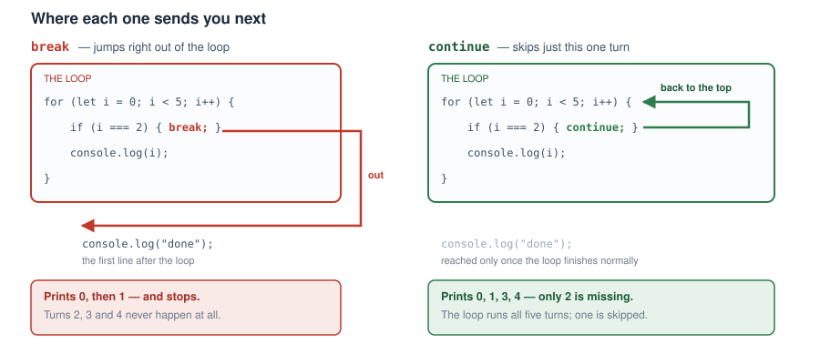

# Chapter 5 — CONTROL FLOW

- OCLS (Operators, Conditionals, Loops, Switch)

  - Operators
    - 1) Mathematical operators
      - Addition operator
      - minus operator
      - division operator
      - multiplication operator
      - modulus operator
      - assignment operator
      - incremental operator
      - decremental operator
    - 2) Assignment operators
    - 3) Comparison operators
      - Equality operator
      - Strict equality operator
      - greater than operator
      - less than operator
      - greater than or equal to operator
      - less than or equal to operator
    - 4) Logical operators
      - Not operator
      - OR operator
      - And operator
      - Ternary operator
      - Nesting multiple ternary operators
    - Combining math operators with the assignment operator
  - Conditionals
    - if statements
    - Checking Multiple Conditions
      - Independent Conditions
      - Mutually Exclusive Conditions
      (Two Choices)
      - Mutually Exclusive Conditions
      (More Than Two Choices)
    - Additional notes on conditionals
  - Loops (6)
      - The For loop
      - The While loop
      - The Do...while loop
      - The For...in loop (objects and arrays)
      - The For...of loop (for Arrays, Strings, Maps, Sets, etc)
      - The forEach() loop (for arrays)

  - Loop control statements
      - the break statement
      - the continue statement
  - Switch statement


  Control flow in programming refers to the logic that guides how your program runs. Think of your program like a river. A river doesn’t just move in a straight line—it flows around bends, curves through valleys, navigates around trees and rocks, and might even change its course if it hits a huge obstacle, like a mountain. In the same way, your program might face different situations as it runs. Instead of you always having to tell it what to do every time, the program should be smart enough to decide for itself based on what’s happening. That’s what control flow is all about-making your program intelligent enough to respond to different events.
Let’s say a robot is programmed to walk forward. What happens if it walks up to a wall? A well-written program will allow it to detect the wall and decide to turn left or right to find a new path. If the robot trips and falls, it should realise it’s lying down and maybe try to stand back up. If it reaches a rock, it should figure out whether to climb over or walk around it.
All of these situations are examples of events. Your program’s job is to detect when events happen and respond with the right logic. In simple terms, logic means looking at a situation, recognising what’s going on, and choosing what to do next.
Here’s a real-world example: When you’re typing in a Word document and try to close it without saving, you get a message asking if you want to save your changes first. That’s control flow at work—smart logic built into the app to help the user avoid mistakes.
For your program to handle events well, it needs two main abilities:
- To detect that an event has happened
- To decide what to do about it (and maybe consider other things too)
This is what control flow is all about: giving your program the power to respond to things in smart, useful ways.
In JavaScript, there are four main tools that help you build this kind of logic. I remember them by the abbreviation OCLS:

  - 1) Operators
  - 2) Conditionals
  - 3) Loops
  - 4) Switch

  Strictly speaking, a switch is itself a kind of conditional, and you will see it described that way elsewhere. I have given it a section of its own because its syntax is different enough from if...else to be worth studying separately. Operators are in this list for a similar practical reason: they are not really control flow either, but you cannot write a condition without them.


### OPERATORS
  Operators are very useful for performing things like mathematical
 operations, assigning values to variables, performing logical operations 
like comparing two values, adding up values etc.

		

#### 1) Mathematical operators

Operators give you the ability to perform calculations so you can make accurate logical decisions. The following is a list of mathematical operators with practical examples to show how they work. Here is a list of operator characters and their meanings:

	=	assignment
	==	equal
	===	identical
	+	addition
	-	subtraction
	*	multiplication
	/ 	division
	% 	modulo (used to find remainders)
	++	increment by 1
	--	decrement by 1
	+=	short form of addition
	-=	short form of subtraction
	*= 	short form of multiplication
	/=	short form of division
	%=	short form of modulo
	>	greater than
	<	less than
	>=	greater than or equal to
	<=	less than or equal to
	!=	not equal
	!==	strictly not equal
	!	not
	&&	and
	||	or

  There is also the ternary operator, which needs a little more explaining
  than a single line, so it has a section of its own further down.


  Addition operator
The addition operator + is like the addition sign in mathematics (represented by the plus sign) and it is used to add two numbers together. It should not be mistaken for the concatenation operator that binds variables to a string. For example:

		let sum = 2 + 2;
			
The value of sum will be 4.	
	

  Minus operator
The minus operator - is the same as the minus operator we are familiar with in math. It is used to subtract one number from the other. For example:
				
		let num = 3 - 2;
			
The value of num will be 1.

						
  Division operator
The division operator / is used to divide one number by the other. It divides the value on the left by the value on the right. The result is called the quotient. For example:
				
		let num = 4 / 2;
			
The value of num will be 2.

						
  Multiplication operator
The multiplication operator * is used to multiply a number by a number. It multiplies the value on the left by the value on the right. The result is called the product. For example:
				
	let num = 2 * 2;
			
The value of num will be 4.

						
  Modulo operator
The modulus operator % is used to get the remainder after dividing one number by another. Basically, it divides the number on the left by the number on the right, and returns whatever is left over. For example:
				
		let num = 10 % 5;
			
The value of num will be 0.	

		let num = 10 % 2;
			
The value of num will be 0.	

		let num = 11 % 2;
			
The value of num will be 1.

  A practical application of this is to check whether a number is even or odd. Here is an example:

		let number = 7;

		if (number % 2 == 0) {
  			console.log("Even number");
		} else {
  			console.log("Odd number");
		}
	


  Incremental operator
An incremental operator ++ is used to quickly add 1 to a number. Normally, there are two ways to increase a number’s value:

  a) By using the addition operator

		let count = 1;
		let value = count + 1; // value is 2

  b) By using the incremental operator

		let count = 1;
		let value = count++; // value is 1, but count becomes 2

Note: In count++ where the operator is on the right side of the variable being incremented (count), the value is assigned to the new variable (in this case value) before the incrementing happens. The value of the value variable will now still be 1, while that of count is 2. However, if you want to increment the value of count first before assigning it to value so that value will also have the incremented (updated) value of count, use ++count with the ++ operator on the left side of the count variable.		


  Decremental operator
This is the direct opposite of the incremental operator. It is used to subtract 1 from a number. There are two ways to decrease a number’s value:

  a) By using the subtraction operator

		let count = 2;
		let value = count - 1; // value is 1

  b) By using the decremental operator

		let count = 2;
		let value = count--; // value is 2, but count becomes 1
			
Note: In count-- where the operator is on the right side of the variable being decremented (count), the value is assigned to the new variable (in this case value) before the decrementing happens. The value of the value variable will now still be 2, while that of count is 1. However, if you want to decrement the value of count first before assigning it to value so that value will also have the decremented (updated) value of count, use --count with the -- operator on the left side of the count variable.


#### 2) Assignment operators
  The assignment operator is used to assign a value to something. We saw this when learning about variables. It is how we assign values to variables. It is used to assign the value on the right of the operator to the operand on the left of it.
				
		let number = 10;
			
This assigns the value of 10 to the number variable. It looks like the equal sign (=) in mathematics, but in programming, it's used to assign a value.

		let name;
		name = "John Doe";


#### 3) Comparison operators

##### Equality operator
The equal operator == is used to check if a value is equal to another value. It checks if the values of both operands match (but not their types). A common mistake is to mistake this for the assignment operator. This equal operator is usually used in conditional statements to verify if the value of a 	variable for example is equal to a specific value. We will learn all about 	conditional statements shortly, when we come to look at conditionals. For now, just remember that you need two mathematical equal signs, not just one, to check if two values are the same. It looks like this:

		let colour = "green";

		if (colour == "green") {
    			console.log("The colour is green");
		}
			
In this example, we have assigned the value of “green” to a variable colour, then used the equal operator (==) to check if its value is actually equal to “green”.

	
##### Strict equality operator
  Also sometimes referred to as the identical operator, it goes beyond the equal operator which only checks if their values are the same, and checks if both values are of the same type as well. It is therefore more strict, and is handy for situations when you need to know that both operands are not only of the same type, but have the same value as well. Here is an example of how their differences can be deceiving:
			
		let fiveString = '5';
		let fiveNumber = 5;
				
		if (fiveString == fiveNumber)
		{
   			alert('fiveString and fiveNumber are the same');
		}
		else
		{
   			alert('fiveString and fiveNumber are NOT the same');
		}

  The above example will display an alert popup saying 'fiveString and 	fiveNumber are the same'. JavaScript has a good ability to convert a string of digits into a number when it sees you are trying to use it as a number. This is handy, but it is not what you want in situations where you need to be precise. In such 	circumstances, just change the expression in the if statement to use an identical operator instead of an equal operator. For example:

		let fiveString = '5';
		let fiveNumber = 5;
				
		if (fiveString === fiveNumber)
		{
   			alert('fiveString and fiveNumber are the same');
		}
		else
		{
   			alert('fiveString and fiveNumber are NOT the same');
		}

The above example will display an alert popup saying 'fiveString and    fiveNumber are NOT the same'. This is because now, '5' is being taken for   what it is; a string, and 5 for what it is; a number, and both are not the same.
So always remember that when the == (equal) operator does not seem to 	work, just use the === (identical) operator and it will save the day as === checks both the value and the type.			

		
Greater than operator
The greater than operator > is the same as the greater than sign in math. For 	example:
 				
		let greaterThan = 2 > 1;
			
The value of greaterThan is true.


Less than operator
The less than operator < is the same as the less than sign in math. For 	example:
			
		let lessThan = 2 < 1;
			
The value of lessThan is false because 2 is not less than 1.

Greater than or equal to operator
The greater than or equal to operator >= specifies that the value on the left is either greater than, or equal to the number on the right. It is the same as the greater than or equal to sign in math. For example:
				
	let greaterThanOrEqualTo = 2 >= 1;
			
The value of greaterThanOrEqualTo is true because 2 is greater than 1.

Less than or equal to operator
The less than or equal to operator <= specifies that the value on the left is either less than, or equal to the number on the right. It is the same as 		the less than or equal to sign in math. For example:

			let lessThanOrEqualTo = 2 <= 2;
			
The value of lessThanOrEqualTo is true because 2 is equal to 2.
			
	


  - 4) Logical operators
  Logical operators are used to determine if the value of an expression is true or false.

    - Not operator
    - OR operator
    - And operator
    - Ternary operator

##### Not operator
  The ! operator, also known as the Not or Logical Not operator, is used to determine whether an expression is not equal to a value. It comes in three forms:
	!	Logical NOT
	!=	Not Equal
	!==	Strict Not Equal (value and type)

For example:
			
		let two = 2;
		let isTwo = two != 1;
			
The value of the variable isTwo will be true. This is because the value of the  variable two is 2 and not 1, so isTwo which states that two is not equal to 1 is    correct, hence the result is true. != is known as the “Not Equal” operator. In the same way, you can flip a true or false result round using the Logical Not (!), or check that two things differ in value or in type using the Strict Not Equal (!==).


  OR operator
The OR operator or || works with two conditional expressions, one on either side of the double pipe characters. It states that if the conditional on either side of its double pipe characters (||) is true, then the result is true. It will only return false if both conditionals are false. Basically, as long as one conditional on either side of its pipe characters is true, then the whole expression is true. For example:
				
		if (trafficLightColor == 'green' || trafficLightColor == 'amber')
		{
			console.log("You can go!");
		}			

	
  And operator
The And or && operator is very similar to the OR operator. The only 		difference is that unlike with the OR operator where if just one conditional is 	true, it passes, with the And operator, both conditionals on either side of it must be true for it to return true. For example:
				
		if (trafficLightColor == 'red' && carStops == false)
		{
			console.log("That car has committed a traffic offence!");
		}


  Ternary operator
The ternary operator is a quick way to assign a value to a variable based on a conditional statement. It is a shorthand version of the if...else statement that allows quick assignments. A ternary operator is very powerful and handy. You would typically use it in situations where there is not much code you need to write if an expression is true. The conditional could be as short as one line of code. If you had to write a lot of code, then the block ({}) that an if statement provides would be preferable. With a ternary operator, you probably just need to set a variable’s value depending on some condition, so it is quick and short. Here is the syntax:

	condition ? runIfTrue : runIfFalse;

Ternary operators are great when you need to quickly choose between two options. Here is an example:
				
		let action = trafficLightColor == "red" ? "Stop" : "Go";

The code after the colon acts as the else clause in an if statement. You can see how a ternary operator is simple yet powerful. Using it will make your code very concise and readable.


###### Nesting multiple ternary operators
  You can also chain multiple ternary conditions, just like nesting if...else blocks. Here is the syntax:

		condition1 ? value1 : 
		condition2 ? value2 : 
		defaultValue;

		let light = 'red';

		light == 'green' ? console.log('You may go') :
		light == 'amber' ? console.log('Hurry') :
		console.log('Stop');

Here, the value of light is 'red', so the last message, 'Stop', will be printed.
							
			

		

#### Combining math operators with the assignment operator

Sometimes, you will come across two operators being combined like this: += for example 

	let price = 10;
	let tax = 3; 
	let totalPrice = price += tax;

It is completely valid, and += means that the value on the right (after the = character) is added to the value on the left (before the + character), rather than used to replace it. Note and remember that the += operator also works for strings and adds to (extends) a string.

| =  e.g.  j = 3 | which means j = 3 |
|---|---|
| += e.g.  j += 2 | which means j = j + 2 |
| += e.g.  j += 'text' | which means j = j + 'text' |
| -= e.g.  j -= 2 | which means j = j - 2 |
| *= e.g.  j *= 4 | which means j = j * 4 |
| /= e.g.  j /= 4 | which means j = j / 4 |
| %= e.g.  j %= 6 | which means j = j % 6 |

  It is basically a shorthand way of using mathematical operators to assign values to variables, and it is worth knowing, as you are sure to come across it in code. It is effectively a compact and quick way to run an expression and assign its result to a variable in one operation. They are also sometimes referred to as short form operators, or compound operators. It is better demonstrated than explained. For example, instead of saying 
			
		let num = 2;
		num = num * 2;		// num is now 4
		
  You can quickly do that like so:
	
		let num = 2;
		num *= 2;		// num is now 4

	Other examples:
		let a = 1;
		a += 5;		// a is now 6

		let b = 6;
		b /= 2;		// b is now 3

		let c = 6;
		c *= 2;		// c is now 12

Note that these operators always work on a variable. You cannot write
1 += 5; because there is nothing there to update - 1 is just the number
1, and it will always be the number 1.


  The operator always goes before the equal sign:
+=, -=, *=, /=, %= are compound assignment operators.

		


### CONDITIONALS
#### If statements
  In programming, the powerful concept behind writing intelligent systems is the ability of code to perform logic. It does this by evaluating parameters and conditions, then taking action based on the value of those conditions. The topic "conditionals" comes from this idea of a program taking an action based on a condition.
This condition is usually an expression that returns true, and so your if code takes an action when that expression evaluates as true. You set up the expression to return true based on whatever value you’re checking for. A conditional is therefore used to make decisions in code.
The main tool for implementing conditionals in programming is known as an if statement. All programming languages have them. No programming language would be useful without the ability to perform logic and make decisions based on conditions.
In JavaScript, an if statement is a block, and its syntax is similar to that of a function. It is written with the word if, followed by a pair of parentheses (), and then a pair of curly braces {}.

  Here is the syntax:

	if (condition) {
 		 // code to run (action) if condition is true
	}

The condition is always some kind of expression that evaluates to either true or false. It is the answer to that expression which decides whether the code inside the braces runs at all. The above syntax is the shortest version and works well if you have just one condition to check. Let’s consider a real-life example. Imagine your program controls a school bell that should ring when the time is exactly 9:00 AM. You’d use an if statement to check that time:

	if (time == '09:00') {
  		// ring the bell then stop
	}

Note: This is not real code for checking the current time in JavaScript. It’s simply a demonstration of how the logic would work. Such demonstrations are called pseudo code—a way of showing how code behaves without writing it in a specific programming language.


#### Checking Multiple Conditions
There will be times when you have more than one condition to check. These multiple conditions can play out in two main ways:


##### a) Independent Conditions
Let’s say the bell should ring not only at 9:00 AM but also at 10:00 AM. The bell ringing at 10:00 has nothing to do with whether it rang at 09:00 or 
not. The ringing just happens at both times, quite independently of each other. There are different ways to write the if statement, and they will all work. 
You can either decide to make the one conditional expression check for both times in a single if statement or you can write two separate if statements, one for each time check, with each taking the action necessary. 

Recommended – Single if statement using OR (||):

	if (time == '09:00' || time == '10:00') {
  		// ring the bell then stop
	}

Also works – Two separate if statements:

	if (time == '09:00') {
  		// ring the bell then stop
	}

	if (time == '10:00') {
  		// ring the bell then stop
	}

While both work, the first approach is preferred because:

- It avoids code duplication
- It’s more readable
- It’s easier to maintain


Note that here I show just two if statements, but if you are dealing with more than two conditions, you will write as many if statements as there 
are conditions to handle (check for).


#### b) Mutually Exclusive Conditions (Two Choices)
  In this case, you have two conditions that are mutually exclusive.
It means if one event or condition happens, the other cannot happen at the same time. Say for example, you are working with a barrier that opens when a light shows green, and closes when the light is red. In this case the light is the condition (expression) and the behaviour of the barrier (the code you run) is the action you take based on the value of that light—which is what the expression resolves to. In this green or red light scenario, you are dealing with multiple conditions. 
  For each condition, there is an action to be taken, which are to open 
or close the barrier. JavaScript provides a system for checking for conditions in such multiple, mutually exclusive scenarios. That is the ‘else’ clause of the if statement. 
Here is the syntax:

	if (condition) {
			// code to run if the condition is true
	}
	else
	{
		// code to run if the condition is false
	}

Let’s see an example of how to use an if...else statement:

	if (light == 'green') {
  		// raise the barrier
	} else {
  		// light is red, so close the barrier
	}


#### c) Mutually Exclusive Conditions (More Than Two Choices)
Now let’s say the barrier is controlled by three lights:

- Red: Close the barrier
- Amber: Start closing the barrier
- Green: Open the barrier

Use an if...else if...else chain:

	if (light == 'green') {
 		 // raise the barrier
	} 
	else if (light == 'amber') 
	{
  		// start to close the barrier
	} 
	else 
	{
  		// no need to check again - the light is red
  		// close the barrier
	}

Note: when it comes to multiple conditions, whether it is two of them or more, the last conditional check should always be an else clause. This else clause is the ‘catch-all’ clause. It takes no parentheses because it needs no condition (expression) to check for. It stands for whatever is left over once all the conditions above it have failed to match. In the example above, once you have checked the colour of the light and found it is neither 
green nor amber, then it can only be red.


#### Additional notes on conditionals
  Here is a list of important points to keep in mind in order to understand how to work with conditionals.

- You can nest as many else if blocks as needed.
- In JavaScript, else if must have a space between the else and the if keywords.
- The final else block is optional but recommended to handle any unexpected or unhandled cases.
- Curly braces {} are optional for single-line statements:


  ```
  if (true) console.log("This works without braces.");
  ```

But if you have multiple lines, you must use curly braces:

	if (true) {
  		console.log("This is line 1.");
  		console.log("This is line 2.");
	}

Best Practice: Always use curly braces—even for one-liners—for readability and to avoid bugs.


		


#### LOOPS
  In programming, a loop gives your code the power to repeat actions over and over—without you having to write them again and again. This is super useful when you’re working with multiple pieces of data, like items in an array, characters in a string, or keys in an object.
For example, imagine having a list of 100 fruits—you wouldn’t want to write the same line of code 100 times just to print them all out. A loop saves you from that by doing the repetition for you.

Why are loops important?
Loops are one of the most powerful features in any programming language because they allow your program to:

- Do something repeatedly as long as a condition is true.
- Go through a list of items one by one and take action on each.
- Look through data to find something or change things.
- Handle different layers of information, especially in nested arrays or complex data.

  Here is how loops work. When you create a loop, you usually define a counter variable—this is most often called i. If your loop is going through a simple list, you’ll use i. If it’s a loop inside another loop (like in a multi-level array), the second counter is often called j. And if you need more, you can keep going with k, l, and so on.
Here’s a quick look at how you might retrieve an item from an array using a counter:

		let myArray = ['boy', 'girl'];
		let girl = myArray[1]; // 'girl' is at index 1

Remember, arrays in JavaScript always start counting from zero (0), so the first element is at index 0, the second at index 1, and so on.
  JavaScript gives you several types of loops, and each one is useful in different situations. You’ve already seen some loops when we talked about arrays, but now let’s look at all the main loop types available in JavaScript.
There are 6 main types of loops to master:

  - 1) For loop – The most common type, great for running a block of code
    a specific number of times.
  - 2) While loop – Keeps running as long as a condition is true.
  - 3) Do...while loop – Similar to while, but runs the code at least once,
    even if the condition is false.
  - 4) For...in loop – Used to loop through the properties of an object.
  - 5) For...of loop – Used to loop through values in arrays, strings, and
    other iterable objects.
  - 6) forEach loop – A special array method that loops through array
    items and lets you run a function on each one.

Each of these loop types has its own structure and best use case, and we’ll go through all of them one by one in this chapter.


#### 1) The For loop
  Use a for loop when you know how
  many times the loop should run. It is by far the most commonly used loop, and it has a very simple and easy to read syntax. The action inside its curly braces is only run while the condition in its parentheses is true. That condition is entirely up to you: very often it counts up to the number of elements in an array, but as the example below shows, it does not have to involve an array at all. Here is the syntax:

	  for (initialisation; condition; increment or decrement) { 
		// Code to execute 
	  }

  Example:

	for (let i = 0; i < 5; i++) { 
		console.log(i); 
	 }

  The output will be each number printed on its own line:

  0
  1
  2
  3
  4


#### 2) The While loop
  Used when you don’t know how many times the loop should run, because that depends on a condition. The while loop is very similar to the for loop in that it runs only when a condition is true. The key difference is flexibility: unlike the for loop, which often checks the number of elements in an array, the while loop can check any condition at all. That means you can use it in a wide variety of situations—not just for arrays, but for any kind of condition you want to keep checking.

Here is the syntax:

		while (condition) {
  			// code to run while condition is true
		}

Here’s how it works:

- The loop checks the condition.
- If it’s true, it runs the code inside the curly braces.
- Then it checks the condition again, and runs the code again if it’s still true.
- It keeps going until the condition becomes false.


Be Careful: Infinite Loops!
One important thing to remember is that you must change something inside the loop to make the condition false eventually.
If the condition never becomes false, the loop will run forever! This is called an infinite loop, and it can crash your browser or freeze your computer.

#### Example: A loop that never ends

	let trafficLightColor = 'green';

	while (trafficLightColor != 'red') {
  		console.log('You can go');
	}

In this example, the condition is always true because trafficLightColor never changes—so the loop keeps running forever.


#### Fixed Version (Simulating the Light Changing)

	let trafficLightColor = 'green';
	let timesChecked = 0;

	while (trafficLightColor != 'red') {
  		console.log('You can go');

  		// Simulate the light changing after 3 checks
  		timesChecked++;

  		if (timesChecked === 3) {
    			trafficLightColor = 'red';
  		}
	}

This version will print "You can go" three times, and then stop once the light changes to red. Much better!

Let us look at an example of using a while loop to loop through an array. You can also use a while loop to go through an array, just like a for loop. Here’s an example:

	let i = 0;
	let fruit = ['banana', 'apple', 'kiwi'];

	while (i < fruit.length) {
  		document.write('The fruit is ' + fruit[i] + '<br>');
 	 	i++;
	}

What it prints on the screen:

  The fruit is banana
  The fruit is apple
  The fruit is kiwi

Here, the while loop runs while i is less than the number of fruits in the array. It prints each fruit one by one and then stops when there are no more fruits left.


			
#### 3) The Do...while loop

  do...while loops are less common than other types of loops, but they are useful in situations where a block of code needs to run at least once before a condition is checked.
  A good example would be a website where every user must have at least one profile picture, but can optionally upload more. You might want to display the first picture by default, and then show any extra ones only if they exist. A do...while loop is perfect for this, because it will always run once—showing the first picture—before checking whether additional pictures are available to display.
Syntax
The syntax for a do...while loop is slightly different from a regular while loop. In a while loop, the condition comes before the block of code. In a do...while loop, the block runs first, and then the condition is checked afterwards:

  Here is the syntax:

			do {
  				// code to run at least once
			} while (condition);

It might feel unusual at first, but it makes sense once you realise the purpose: run something once, then decide if it should run again.

Example:

		let i = 0;
		let fruit = ['banana', 'apple', 'kiwi'];

		do {
  			console.log('The fruit is ' + fruit[i]);
  			i++;
		} while (i < fruit.length);

The output will be:

The fruit is banana
The fruit is apple
The fruit is kiwi

This loop runs once to display the first fruit, then continues checking if more items are available in the array before each additional run.


#### 4) The For...in loop (Used for Objects and Arrays)

  Used to loop over object properties. A word of caution: it can also loop
  over arrays, but it is not recommended because it may include inherited
  properties.

  Here is the syntax:

				for (let key in object) { 
					// Code to execute 
				}

Example (Object Iteration):

				let person = { name: "Alice", age: 25, city: "New York" }; 

				for (let key in person) { 
					console.log(`${key}: ${person[key]}`); 
				}

The output will be:

name: Alice
age: 25
city: New York


#### 5) The For...of loop (Used for Arrays, Strings, Maps, Sets, etc.)

  It offers a cleaner way to iterate over iterable objects like arrays
  and strings.

  Here is the syntax:

				for (let value of iterable) { 
					// Code to execute 
				}

Example (Array Iteration):

				let fruits = ["Apple", "Banana", "Cherry"]; 

				for (let fruit of fruits) { 
					console.log(fruit); 
				}

The output will be:

Apple
Banana
Cherry


#### 6) The forEach() Loop (Used for Arrays)

  The forEach() method is an array method that executes a
function on each element.

Here is the syntax:

				array.forEach((value, index, array) => { 
					// Code to execute 
				});

Example (Array Iteration):

				let numbers = [10, 20, 30]; 

				numbers.forEach(num => { 
					console.log(num); 
				});

The output will be:

10
20
30


  Here is a conclusive summary of the various loops and when they should
  be used:

| Loop type | When to use it |
|---|---|
| `for` | When the number of iterations is known. |
| `while` | When the number of iterations is unknown and depends on a condition. |
| `do...while` | When you need to run the loop at least once. |
| `for...in` | When iterating over objects (not recommended for arrays). |
| `for...of` | When iterating over arrays, strings, maps, or sets. |
| forEach() | When iterating over an array with a function callback. |
 


### Loop control statements
  In a loop, things usually run over and over until a condition says “stop.” But what if you want to take control of the loop and tell it to either:

- Exit early, even if the condition hasn’t finished yet, or
- Skip one turn in the loop and go to the next round?

This is where loop control statements come in. These are special keywords in JavaScript that give you, the programmer, more control over how a loop behaves.
There are two main loop control statements, and these are the break, and the continue statements.


##### The break statement
  The break statement tells the loop to stop running completely and jump out of the loop when a certain condition is met. This is useful when you're looking for something, and once you've found it, there's no need to keep looping.
It exits the loop immediately when a condition is met. You as the programmer will place this statement inside the loop at the spot where you expect the loop to have achieved its objective—usually in a conditional statement in which case the condition would have matched a target case. You therefore want the program to exit the loop.

Here is an example:

			for (let i = 0; i < 10; i++) {
  				if (i === 5) {
    					break; // Exit the loop when i is 5
  				}
  
				console.log(i);
			}


The output will be:

0
1
2
3
4

As you can see, the loop stops as soon as i becomes 5. The number 5 is never printed because the loop exited right before that.


##### The continue statement
  The continue statement is a little different. It doesn’t stop the whole loop—it just skips the current iteration and goes straight to the next one.
This is helpful when you want to ignore certain values but still finish the loop.


			for (let i = 0; i < 5; i++) { 
				if (i === 2) { 
					continue; // Skip printing when i is 2
				} 
					
				console.log(i); 
			}


The output will be:

0
1
3
4



- Figure 5.1 — Where break and continue send you next*
	


 


### Switch statement
  The switch statement in JavaScript is used for conditional 
branching. It allows you to execute different blocks of code 
based on the value of an expression, making it a cleaner 
alternative to multiple if...else if...else statements.

Here is the syntax:

```
switch (expression) { 
    case value1: 
          // Code to execute if expression === 
            //value1 
        break; 
    case value2: 
        // Code to execute if expression === 
             // value2 
        break; 
    default: 
        // Code to run if no case matches 
     }
```

This is how it works:

- The expression is evaluated once.
- Its value is compared with each case.
- If a match is found, the block of code in that matching case runs.
- The break statement prevents fall-through (executing the next case unintentionally). This will cause the code execution to stop checking the other case statements when a match has already been found.
- The default case (optional) runs if no match is found. It acts as the fallback default, just as its name indicates.

  Here is an example switch statement. Let’s 
  write one that checks for days of the week.

      // Example: 3 means Wednesday
      let day = 3;

  ```
  switch (day) {
          case 1:
              console.log("Monday");
              break;
          case 2:
              console.log("Tuesday");
              break;
          case 3:
              console.log("Wednesday");
              break;
          case 4:
              console.log("Thursday");
              break;
          case 5:
              console.log("Friday");
              break;
          case 6:
              console.log("Saturday");
              break;
          case 7:
              console.log("Sunday");
              break;
          default:
              console.log("Invalid day");
  }
  ```


This will be the output:

  Wednesday

We got that output because we initialised the value of the ‘day’ variable to 3. Note that you could place this switch statement inside a function that accepts the variable to test for in the case statements as its argument. In such a case you would create or set a variable within the case blocks so that it stores some data that you need in the case that a match is made. You would then return that variable at the end of the function.
