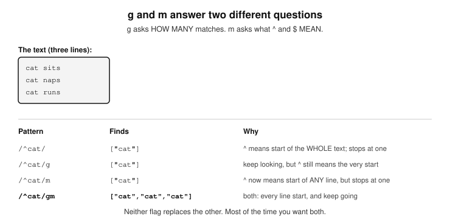

# Chapter 6 — REGULAR EXPRESSIONS

    
Intro
Features
Grouping
Classes
   Range
   Negation
Anchor characters
Shorthand meta characters
Quantifiers
Modifiers
   The difference between g and m
Regular expressions in JavaScript


A regular expression (also referred to as regex) is a 
  sequence of characters that forms a 
  search pattern. It is used for string 
  matching, searching, and manipulation by 
  defining specific patterns that help identify 
  and extract parts of a string.
 
  Here are its features:  
  i) Pattern Matching:
    Regular expressions allow you to
    define patterns that match specific
    sequences in text. For example, finding
    email addresses, phone numbers, or
    validating formats like dates.  
  ii) Search and Replace: Regex can be
    used to find occurrences of patterns in
    text and replace them with new strings.  
  iii) Flexible and Powerful: It provides a
    flexible way to define complex string
    patterns using literals, wildcards,
    quantifiers, and special characters.

  Some common use cases for regular
  expressions are:
  - Validation: To validate email addresses,
    URLs, phone numbers, etc.
  - Text Search: To find specific patterns
    within large text files.
  - String Manipulation: To extract or
    replace certain parts of a string, like
    removing extra spaces or converting
    formats.

  Regular expressions are a powerful tool
  for working with strings in various 
  programming languages, including PHP, 
  Python, JavaScript, and many others. They 
  are widely used in text processing tasks for 
  pattern matching and validation.
  One thing worth knowing early on is that
  regular expressions are not a JavaScript
  invention. The patterns themselves are much
  the same wherever you go, which is why
  learning them once pays off in every
  language you ever pick up afterwards. What
  differs from language to language is the
  wrapper around them: how each one hands
  you the tools to run a pattern against a
  string. JavaScript gives you built-in
  functions such as test() and replace(), which
  we will come to later in this chapter. Other
  languages have their own equivalents. The
  pattern in the middle stays the same; only
  the way you reach for it changes.
  Here are some of the most popular
  characters available:

              *   .   +   []   ()   {}

  With regular expressions, you can
  construct a powerful pattern-matching 
  algorithm using just a single expression.
  The syntax is simple: it starts with a
  forward slash and ends with a forward 
  slash. You have to place the pattern to be 
  matched between them. The pattern is 
  made up of special characters called meta 
  characters. 
  We will proceed by listing the patterns
  with their meanings, and separate them 
  under topics according to their behaviours.
 
/.*/       An asterisk means "zero or more of
  whatever comes just before it". This
  is important, because it never works
  on its own. Written by itself, /*/ is
  not even a valid pattern, since there
  is nothing in front of it to repeat.
  Put it after a dot, as in /.*/, and you
  get what people usually mean when
  they say "match anything, or nothing
  at all".

/./          A dot character. It matches all kinds
  of characters except a newline (\n).
  It has a limitation, however; it will
  match only a single character, so /./
  will match everything on the page or
  subject string by singling them out
  one by one. That means, if you use it
  on a string of characters, it will
  match and stop at the first
  character. That is why it is better to
  use it in a combination with for
  example + or * to expand its
  capability.

/.+/       Means "one or more of whatever
  comes just before it". Like the
  asterisk, it needs something in front
  of it to work on, so it is always used
  in a combination. Unlike the asterisk,
  it will not match nothing—as in, if no
  character appears in the subject
  string at all, it will not match.

/<.>/    It will match anything that comes
  between ‘<‘ and ‘>’ characters. This
  will match the beginning names of an
  HTML tag. It won't match blank tags
  (<>). Another limitation which we
  already know is; it will match only
  tags with single letters. For example,
  it will match <p> and <b> but will not
  match <em>.

/<.*>/   Extends the above pattern, fixing 
      its limitations. It will match blank
      tags, and also tags with multiple
      letters. This is because the
      - (asterisk) character can also
      match nothing as well as anything.
      Combining meta characters like this
      therefore is useful because they are
      all combined and executed. Your aim
      is to have as intelligent an app as
      possible that will not leave potential
      matches unmatched. The effort to
      match as much as possible is known
      as ‘fuzzy character matching’.

/<.+>/  It can be used instead of /<.*>/ if you
  do not want to match blank tags
  (<>). This + character has a
  limitation however. In this case, it will
  keep matching till the last ‘>’ on the
  line of text. This means that you may
  end up with a match like this:

                 <p><b>Hello</b></p>

This is not ideal, and not what you
may want. There is a better way to
use the + character. Here it is:

                  /<[^>]+>/

  Read it as: match an opening angle
  bracket (<), then one or more
  characters that are NOT a closing
  angle bracket, then a closing one.
  Because [^>] refuses to match a >, the
  match is forced to stop at the very
  first > it meets, rather than running on
  to the last one on the line. That is
  exactly what we wanted.
  Note that the [...] and the +
characters are a combination.

/?/      Matches an element zero or only 1
  time. It is used to make matches on a
  specific element optional in the
  subject string.

  If you ever need to literally match a
  character which happens to be regex meta 
  character, you can do that by simply 
  placing a backslash in front of the 
  character. This is known as escaping the 
  character so that your code parser does 
  not treat the character as a regex pattern 
  to use for matching, but to match the 
  character in the subject string literally as it 
  is given. For example, to match the digits 
  5.0, you need to escape the dot (.) in it like 
  so: 

/5\.0/

  You may not be sure of how many 
  characters or digits will come after the dot 
  character. For example it could be 5.0, or 
  5.00 or 5.000 etc. The solution to this is to 
  simply add an asterisk after the last zero 
  like so

/5\.0*/

  The backslash can escape anything 
  including a backslash itself, which is useful 
  in case there is a backslash in the string 
  you are matching. 
  Note that there are some so-called
  shorthand matching characters that start 
  with a backslash. I will provide a list of 
  these later below.

  In regular expressions, there are the 
  following concepts:
- grouping
- classes
- ranges
- negation

## GROUPING
  Grouping is done with a combination of a 
  pair of parentheses followed by a meta 
  character like + or *
  The parentheses enclose the thing in the 
  subject string to be matched, while the 
  meta characters after the parentheses tell 
  the system how many times to group the 
  matched string. The matched string could 
  be a string of numbers. Here is an 
  example:

    /1(,000)+/  will match any of these:
      - 1,000
      - 1,000,000
      - 1,000,000,000 etc

  The parentheses hold the group, and the +
  after them says "one or more of that group".
  So the pattern matches a 1 followed by any
  number of ,000 groups.
  Take care not to leave a space before the
  closing slash. A space inside the pattern is
  not decoration; it is a character that has to
  be matched like any other. Writing
  /1(,000)+ / would mean "...and then a
  space", so it would no longer match 1,000
  at all unless a space happened to follow it.
  If you do want to allow an optional space
  after each comma, say for numbers written
  as 1,000, 000, then ask for it explicitly:

  /1(,\s?000)+/

  where \s means a space character and the ?
  after it makes that space optional.


## CLASSES
  A class is simply a pair of square brackets
  with the string to be matched between 
  them. There will be a successful match if 
  any of the characters in the bracket is 
  found in the subject string. For example:

/gr[ae]y/    This will match ‘gray’ ‘grey’. Any
  meta characters after the square
  brackets will tell the system to
  repeat that match any number of
  times. If you modify the pattern
  like /gr[ae]+y/ then it will match
  ‘greey’ and ‘graay’ and ‘greay’
  and ‘graey’. Just understand that
  without the + character after the
  square brackets, each character
  between the brackets will be
  matched only once.

An alternative way to achieve the same
outcome is to use a pipe character like so:
/a|e/     You simply place a pipe character
  between the characters you want
  to match either of. This approach is
  not a class, but I am showing you
  here just for informative purposes.


#### RANGE

  A range will match any character
  within a range.
/[0-9]/   will match any number between 0
  and 9. Just place a hyphen between
  the two numbers. [5-8] will match
  any number between 5 and 8.

/\d/        Is a shorthand to match any single
  digit number. It is exactly the
  equivalent of the pattern above,
  /[0-9]/.


## NEGATION
  You use this to create a pattern that the
  match must not be. Basically, you are 
  saying that a match should be everything 
  but not this negation pattern. You create a 
  negation pattern by placing a caret 
  character as the first thing inside a pair of 
  square brackets. Every other character 
  that follows the caret character inside the 
  brackets is a negation pattern.
  If the square bracket is followed by a
  meta character, for example + or *, then the 
  square bracket and the meta character are
  a combination.
  Here is one you have already seen:

/[^0-9]/   matches any single character
  that is NOT a digit

  And the tag pattern from earlier:

       /<[^>]+>/  matches a < , then one or
                  more characters that are not
                  a > , then a >


#### ANCHOR CHARACTERS (^ and $)

  Outside of the use of square brackets,
  there are two other characters:

  - the ‘anchor’ (to establish start position
    of) the search string, for a match to
    occur. The anchor is made up of both
    the caret (^) and the dollar ($) characters.

  The caret does two quite different jobs
  depending on where you put it. Inside a pair
  of square brackets, as we saw a moment ago,
  it means negation. Outside them, at the very
  start of a pattern, it means "the match must
  begin at the start of the subject text".
  So if the caret character appears at the
  start of your regex pattern, then the text to
  be matched must be at the start of the
  subject text for a match to occur.
  On the other hand, if the $ character is
  placed at the end of your regex, then the 
  string being matched must be at the end of 
  the line of text for a match to be made. For 
  example, to match a subject string that 
  has the text:
  “Le Guin” and nothing else, just anchor
  the two ends to make sure our text starts 
  and finishes the line like so:

/^Le *Guin$/

  The ^ pins the match to the start of the text
  and the $ pins it to the end, so the subject
  must be exactly "Le Guin" and nothing more.
  The * after the space allows for any extra
  spaces between the two words, so "Le  Guin"
  matches too. Leave the ^ off and the pattern
  would happily find "Le Guin" at the end of a
  longer sentence, which is not what we asked
  for.


#### Shorthand meta characters
  These are shorthand characters for 
  frequently used characters, built into 
  regexes. 

/\b/     matches a word boundary

/\B/     matches anywhere that is NOT a
  word boundary

/\d/     single digit

/\D/     single non-digit

/\n/     newline character

/\s/     white space character

/\S/     non-white space character

/\t/     tab character

/\w/     word characters (a-zA-Z0-9_)

/\W/     non-word character, so anything but
  any of these: a-z, A-Z, 0-9 and _

  Note that every one of these begins with a
  backslash, and that there is no space after
  the opening slash. A space inside a pattern
  is a character like any other, so / \d/ would
  mean "a space followed by a digit", which is
  not the same thing at all.


#### Quantifiers
  In regular expression (regex) terminology,
  the curly braces {} are referred to as 
  quantifiers. They are used to specify the 
  exact number of occurrences, or a range 
  of occurrences, of a preceding element.
  You can use a quantifier in 3 ways:

i) /[\w]{3}/  with ONE digit. This means you
  wish to match a word character
  if it appears exactly three times.  

ii) {3,}     with ONE digit and a comma.
      This means you wish to match
      the preceding character if it
      appears 3 or more times.  
iii) {2,3}   with TWO digits separated by a
      comma. This means you wish to
      match the preceding character if
      it appears anything from two to
      three times.

  Take care not to put a space after that
  comma. {2,3} is a quantifier, but {2, 3} is
  not one at all — JavaScript gives up on
  reading it as a quantifier and looks for
  those exact characters in the text instead.


#### Modifiers
  These are special characters that you
  place outside, but at the end of a regex 
  pattern to influence how the complete 
  match will be made. There are three (3) 
  modifiers, global (g), case-insensitive (i), 
  and multiline (m). Let’s dive straight into 
  some examples, assuming that 
  /.../ contains your regex pattern:

/.../g    This will match in a global manner,
  rather than at the first match that
  is encountered. You could end up
  with multiple matches rather than
  just one. Say you are matching any
  occurrences of the word ‘cat’ in a
  subject string, if the string had 4
  occurrences of the word ‘cat’, it will
  return all 4 occurrences rather
  than just 1 for the first one.

/.../i      This makes the match case-insensitive. Matches are normally
  case-sensitive, so having this will
  make the following regex patterns
  work in the same way:
          
/[a-zA-Z]/   and   /[a-z]/i

or

/[A-Z]/i    and   /[a-z]/i


/.../m    This enables multiline mode. It is
  easy to misread this one, so it is
  worth being careful. It does NOT
  mean the match can run across
  several lines of text. What it
  changes is the meaning of the two
  anchors: with m in place, ^ matches
  at the start of every line rather
  than only the start of the whole
  text, and $ matches at the end of
  every line rather than only the end.
  So it is about where each line
  begins and ends, not about matching
  through them.


#### The difference between g and m
  These two get confused constantly, because
  both of them sound as though they mean
  "match more". They do quite different jobs,
  and it is worth pinning down which is which.

  g is about HOW MANY matches you get back.
  m is about WHERE the ^ and $ anchors apply.

  That is the whole of it. Here is a subject
  string of three lines to try them on:

     const text = "cat sat here\ndog barked\ncat slept";

  First, g. Without it you get the first match
  and nothing more. With it you get all of them:

  text.match(/cat/)    // ["cat"]
  text.match(/cat/g)   // ["cat", "cat"]

  Now m. Our text has the word "here" at the
  end of the FIRST line, but the string as a
  whole ends with "slept". So $ on its own
  finds nothing, because $ means the end of the
  whole string. Add m and $ starts meaning the
  end of any line, so it finds it:

  text.match(/here$/)   // null
  text.match(/here$/m)  // ["here"]

  And because they do separate jobs, they
  combine. Our text has "cat" at the start of
  two different lines:

  text.match(/^cat/g)    // ["cat"]
  text.match(/^cat/gm)   // ["cat", "cat"]

  With g alone you get one, because ^ still
  means the start of the whole string, and
  there is only one of those. Add m as well and
  ^ applies to every line, so both are found.
  A useful way to remember it: g asks "how many
  times?", m asks "what counts as a line?".




- Figure 6.1 — g and m answer two different questions*


#### Regular expressions in JavaScript
  Regular expressions are used in
  JavaScript only with two methods. These 
  methods are:  

  i) test() ———-returns boolean  
  ii) replace()

#### i) test()
  You call this test() function on your regex
  pattern string.  You pass to it as an 
  argument, the subject string (the string you 
  want to run the test on) and it will tell you if 
  there is a match with your regex pattern or 
  not. Basically, it returns  boolean (true or 
  false). For example:

    console.log(
        /cats/i.test("Cats are fun. I like cats.")
    );

This will return true to the console.

  If you want to see what was actually
  found rather than just true or false, use
  match() on the string instead:

    console.log(
        "Cats are fun. I like cats.".match(/cats/i)
    );

  That one prints an array whose first item
  is the text it matched, in this case "Cats".
  Note the capital C: the i modifier made the
  match case-insensitive, but what comes
  back is the text exactly as it appeared in
  the subject string.


#### ii) replace()
  This function is used to match and replace 
  a string from within another text (subject 
  string). Unlike the test() function which you 
  have to call on your regex pattern 
  string, you call the replace() on the subject 
  string (the string to make the match on). It 
  accepts two arguments; first, the regex 
  pattern string to match with, and what to 
  replace the matched string with. 
  For example, to do a case-insensitive
  global match on all occurrences of the 
  string ‘cats’ and replace them with ‘dogs’, 
  do it like so:

```
console.log(
    "Cats are fun. I like cats".replace(/cats/gi, "dogs")
);
```

  The limitation of replace() is that it
  replaces the subject with exactly the text 
  you give, even though you may have 
  wished to use uppercases in some 
  instances and lowercases in others.
